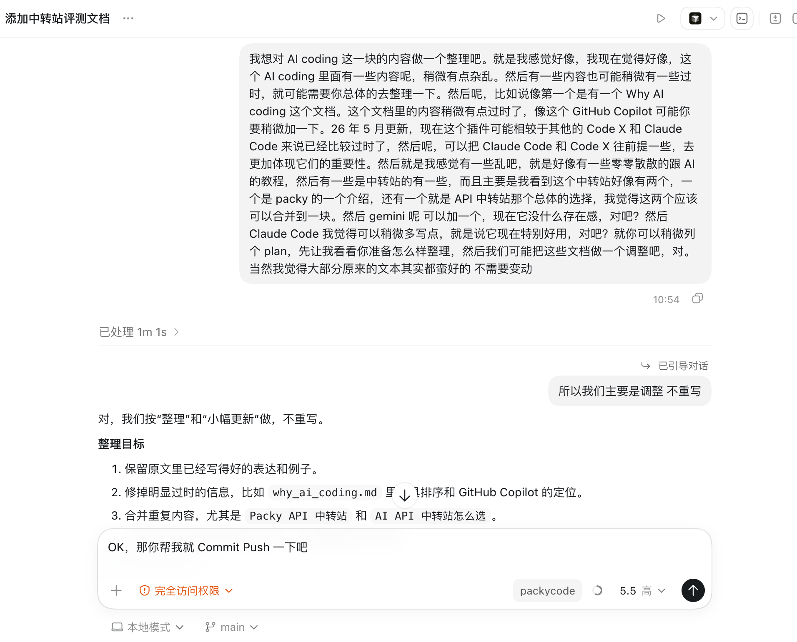

# AI 使用实践与边界



现在再讨论“AI 到底好不好用”，意义已经没有以前那么大了。对很多学习、写作、编程、资料整理和个人管理任务来说，AI 已经足够好用，真正拉开差距的，往往不是谁知道更多模型名字，而是谁更会把 AI 接进自己的工作流里。

换句话说，更重要的问题变成了：

- 可以用 AI 来做什么？
- 什么事情适合交给 AI，什么事情必须自己判断？
- 怎么把一次临时对话，沉淀成下次还能复用的流程？
- 模型、Agent、工具、权限、记忆、语音输入这些东西，应该怎样组合？

这篇文档先开一个头，用我自己的几篇博客做实践索引。它不是“标准答案”，更像是一些真实探索：有些成功，有些粗糙，有些只是阶段性的想法，但都能帮助新人理解 AI 的能力边界。

## 核心观点

使用 AI 的能力，大概可以拆成四层：

1. **高质量输入**：把脑子里的想法快速、完整、低损耗地变成文字。
2. **任务拆解**：把模糊需求拆成 AI 能执行、能验证、能迭代的步骤。
3. **工具组合**：让 AI 不只聊天，而是能读文件、查网页、操作浏览器、调用脚本、管理提醒和沉淀记忆。
4. **边界判断**：知道什么时候可以放权，什么时候必须人工 review，什么时候应该换更强模型。

现在很多人卡住，不是因为模型能力不够，而是输入太慢、需求太糊、任务边界太大、验证方式太弱。AI 很强，但它不是魔法。你越能把问题描述清楚、把流程拆细、把检查点设计好，它就越像一个可靠的合作者。

## 实践索引

| 时间 | 博客 | 主要内容 | 体现的 AI practice |
|---|---|---|---|
| 2026-04-05 | [语音输入：typeless vs 豆包输入法](https://baokker-blog.top/2026/04/05/%E8%AF%AD%E9%9F%B3%E8%BE%93%E5%85%A5%EF%BC%9Atypeless-vs-%E8%B1%86%E5%8C%85%E8%BE%93%E5%85%A5%E6%B3%95/) | 比较 Typeless 和豆包输入法，讨论语音输入如何提升和 AI 沟通的效率 | 高带宽输入，把“想法”更快变成 AI 可处理的文本 |
| 2026-04-06 | [用 Claude Code 搓了一个 MacOS 语音输入 tool](https://baokker-blog.top/2026/04/06/%E7%94%A8Claude-Code%E6%90%93%E4%BA%86%E4%B8%80%E4%B8%AAMacOS%E8%AF%AD%E9%9F%B3%E8%BE%93%E5%85%A5tool/) | 用 Claude Code 从需求、调研、实现、换架构到打包，做出一个 macOS 语音输入工具 | 让 Agent 承担实现，人负责需求、体验、验收和方向调整 |
| 2026-04-26 | [我放心地打开了 Claude Code 的 skip dangerous permission](https://baokker-blog.top/2026/04/26/%E6%88%91%E6%94%BE%E5%BF%83%E5%9C%B0%E6%89%93%E5%BC%80%E4%BA%86-Claude-code-%E7%9A%84skip-dangerous-permission/) | 记录深度使用后对权限放开的权衡：减少频繁批准对心流的打断 | 权限管理不是绝对保守，而是按风险、环境和任务类型分级 |
| 2026-05-02 | [我的 Hermes 养记](https://baokker-blog.top/2026/05/02/%E6%88%91%E7%9A%84Hermes%E5%85%BB%F0%9F%90%8E%E8%AE%B0/) | 配置 Hermes Agent、DeepSeek API、消息平台、提醒事项、个人资料和记忆 | 把 AI 从“聊天窗口”升级成长期在线的个人工作流入口 |
| 2026-05-05 | [用 Hermes Agent 写了一个小红书博主分析 skill](https://baokker-blog.top/2026/05/05/%E7%94%A8-Hermes-Agent-%E5%86%99%E4%BA%86%E4%B8%80%E4%B8%AA%E5%B0%8F%E7%BA%A2%E4%B9%A6%E5%8D%9A%E4%B8%BB%E5%88%86%E6%9E%90-skill/) | 用 Hermes + OpenCLI 抓取和整理小红书博主内容，并沉淀成可复用 skill | 把一次复杂任务变成可复用流程，并按模型成本分层处理 |

## 语音输入：先解决输入带宽

AI 对话质量很大程度上取决于输入质量。如果每次只能慢慢打字，很多想法还没说清楚就已经散掉了。语音输入的价值，就是把“脑子里的连续想法”快速转成文字。

在 [语音输入：typeless vs 豆包输入法](https://baokker-blog.top/2026/04/05/%E8%AF%AD%E9%9F%B3%E8%BE%93%E5%85%A5%EF%BC%9Atypeless-vs-%E8%B1%86%E5%8C%85%E8%BE%93%E5%85%A5%E6%B3%95/) 里，核心对比不是哪个工具绝对更强，而是两类输入风格：

- 豆包输入法更适合日常表达，保留人的语气和原始表达。
- Typeless 更适合给 AI 下任务，会自动整理成更有结构的文本。

这个实践提醒我们：使用 AI 不只是选模型，还包括给自己搭一个更顺畅的输入通道。很多时候，输入效率提升 3 到 5 倍，比换一个模型更立竿见影。

## 用 Agent 做完整小工具

[用 Claude Code 搓了一个 MacOS 语音输入 tool](https://baokker-blog.top/2026/04/06/%E7%94%A8Claude-Code%E6%90%93%E4%BA%86%E4%B8%80%E4%B8%AAMacOS%E8%AF%AD%E9%9F%B3%E8%BE%93%E5%85%A5tool/) 是一个很典型的 vibe coding 案例。

这件事里，AI 做的不只是写几段代码，而是参与了完整流程：

1. 先把需求整理成 PRD。
2. 调研语音输入 API、技术栈和实现方案。
3. 做出 Python 原型。
4. 根据体验问题调整快捷键和菜单栏反馈。
5. 遇到打包和权限问题后，改成 Swift / Xcode 方案。
6. 最后帮助完成构建、排错和 git 提交。

这里最重要的变化是：人的角色从“逐行写代码的人”，变成了“定义目标、判断体验、调整方向、验收结果的人”。这不意味着代码能力不重要，而是说明在 AI coding 里，需求捕捉、产品判断、验证意识会变得更重要。

边界也很明显：这类黑盒开发适合个人工具、低风险原型、可手动验证的小项目；如果是生产系统、涉及数据安全或多人协作，就不能完全不看代码。

## 权限放开：按风险分级

[我放心地打开了 Claude Code 的 skip dangerous permission](https://baokker-blog.top/2026/04/26/%E6%88%91%E6%94%BE%E5%BF%83%E5%9C%B0%E6%89%93%E5%BC%80%E4%BA%86-Claude-code-%E7%9A%84skip-dangerous-permission/) 这篇很短，但它触到了 Agent 使用里一个很真实的问题：每次都点批准，会打断自动化；完全放权，又会让人担心风险。

更合理的做法不是永远开或永远关，而是分场景：

| 场景 | 建议 |
|---|---|
| 玩具项目、个人脚本、干净仓库 | 可以更大胆地放权，让 Agent 连续执行 |
| 有 git 管理、改动范围清楚的项目 | 可以放开读文件、跑测试、常规命令，但保留对删除、部署、密钥相关操作的审查 |
| 生产环境、敏感数据、公司仓库 | 不建议盲目跳过权限，至少要限制目录、命令和网络行为 |
| 不确定 Agent 会做什么 | 先让它输出计划，再授权执行 |

权限的本质是成本权衡：频繁批准会浪费时间，但错误操作也可能带来损失。成熟的 AI 使用者，需要知道自己在哪个环境里可以放权，在哪个环境里必须保守。

## Hermes：把 AI 变成长期入口

[我的 Hermes 养记](https://baokker-blog.top/2026/05/02/%E6%88%91%E7%9A%84Hermes%E5%85%BB%F0%9F%90%8E%E8%AE%B0/) 展示的是另一种方向：AI 不只是你临时打开的网页聊天框，而是可以接进消息平台、提醒事项、个人资料和记忆系统的长期入口。

这篇文章里做了几件事：

- 用 DeepSeek API 控制成本。
- 配置 Hermes Agent 和模型。
- 接入 Telegram、微信或 QQ 等消息平台。
- 让 Agent 读取 Notion、Apple Notes、提醒事项等资料。
- 用 Reminders 和 Cron 做一次性提醒和主动 push。
- 让 Agent 逐渐理解个人偏好，并沉淀 memory 和 skill。

这个方向的重点不是“让 AI 更像人”，而是让它更贴近自己的真实上下文。一个了解你资料、习惯、待办和表达偏好的 AI，比一个空白聊天窗口更有用。

但边界也更重要：个人资料、备忘录、提醒事项都很敏感。可以让 AI 总结、提醒、生成新内容，但删除、批量修改、外发、授权登录态这些操作要谨慎。

## 从一次任务沉淀成 skill

[用 Hermes Agent 写了一个小红书博主分析 skill](https://baokker-blog.top/2026/05/05/%E7%94%A8-Hermes-Agent-%E5%86%99%E4%BA%86%E4%B8%80%E4%B8%AA%E5%B0%8F%E7%BA%A2%E4%B9%A6%E5%8D%9A%E4%B8%BB%E5%88%86%E6%9E%90-skill/) 展示的是更高级的一步：不是让 AI 做完一次任务就结束，而是把流程固化成 skill。

这篇文章里的任务是研究一个小红书博主。大致流程是：

1. 用 OpenCLI 复用浏览器登录态，抓取博主帖子列表。
2. 提取正文、标题、标签等结构化信息。
3. 下载图片和视频素材到本地。
4. 整理成一个 study 文件夹。
5. 输出 Markdown 学习文档，提炼博主的方法论。
6. 再生成一个后续 prompt，交给更强的视觉模型继续分析图片和视频。
7. 确认流程可行后，把它沉淀为 skill，下次直接复用。

这体现了两个很关键的 practice。

第一是**流程复用**：一次复杂任务，如果未来可能重复，就值得沉淀成 skill、脚本或模板。

第二是**模型分层**：爬取、下载、粗整理这类体力活可以交给便宜模型；图片理解、视频分析、方法论提炼这类高价值环节再交给 Claude 或 GPT。不是所有步骤都需要最贵模型。

这里的边界也要说清楚：平台内容抓取涉及登录态、版权、隐私和平台规则。适合个人学习和研究，不适合未经许可的大规模搬运、公开再分发或商业化使用。

## 可以交给 AI 的事

以下任务通常很适合交给 AI：

- 把口述内容整理成结构化文本。
- 根据目标生成计划、PRD、任务拆解和检查清单。
- 阅读代码、解释调用链、定位 bug。
- 写个人工具、脚本、原型和一次性自动化。
- 把重复流程沉淀成 skill、模板、脚本或文档。
- 总结个人资料、会议记录、博客、笔记和待办。
- 根据已有材料生成初稿，再由人审阅和改写。

这些任务的共同点是：AI 可以快速处理大量信息，人可以比较容易地验证结果。

## 不应该完全交给 AI 的事

以下任务不建议完全放手：

- 删除、覆盖、迁移大量重要文件。
- 处理密钥、账号、支付、合同、隐私和公司敏感数据。
- 在生产环境直接部署或执行不可逆操作。
- 未经确认地抓取、搬运、公开他人平台内容。
- 做医疗、法律、财务等高风险决策。
- 在没有测试和 review 的情况下合并复杂代码。

这些场景不是不能用 AI，而是不能只靠 AI。更稳妥的方式是让 AI 做准备工作、生成方案、列风险、写脚本草稿，再由人确认和执行。

## 一个可复用的使用模式

面对一个新任务，可以按这个顺序想：

1. **输入**：我能不能用语音、截图、文件、网页链接，把上下文一次性给够？
2. **拆解**：这个任务能不能拆成调查、计划、执行、验证几个阶段？
3. **放权**：哪些步骤可以让 Agent 自动做，哪些必须先问我？
4. **验证**：完成后用什么证据确认它真的做对了？
5. **复用**：如果以后还会做，是否应该写成 skill、脚本或文档？

AI 的价值不只是“帮我做一次”，而是逐渐改变你的工作方式。真正值得沉淀的不是某一次回答，而是你如何把需求、上下文、工具和验证连接起来。

## 后续更新

这篇文档会继续收集个人 AI practice。新的博客、工具、skill、失败经验和边界案例，都可以继续补进来。

如果以后要更新，建议保持这个格式：

```md
## 文章标题

- 链接：
- 做了什么：
- 体现的 AI practice：
- 适合借鉴的地方：
- 需要注意的边界：
```

这样新人读的时候，不只是知道“有个工具很好用”，而是能学到：这个工具解决了什么问题，它适合放在哪个流程里，以及什么地方不能盲目照抄。
