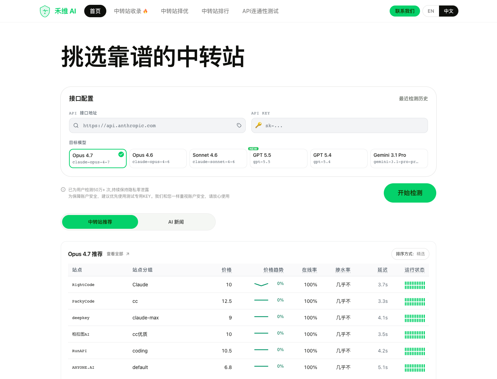
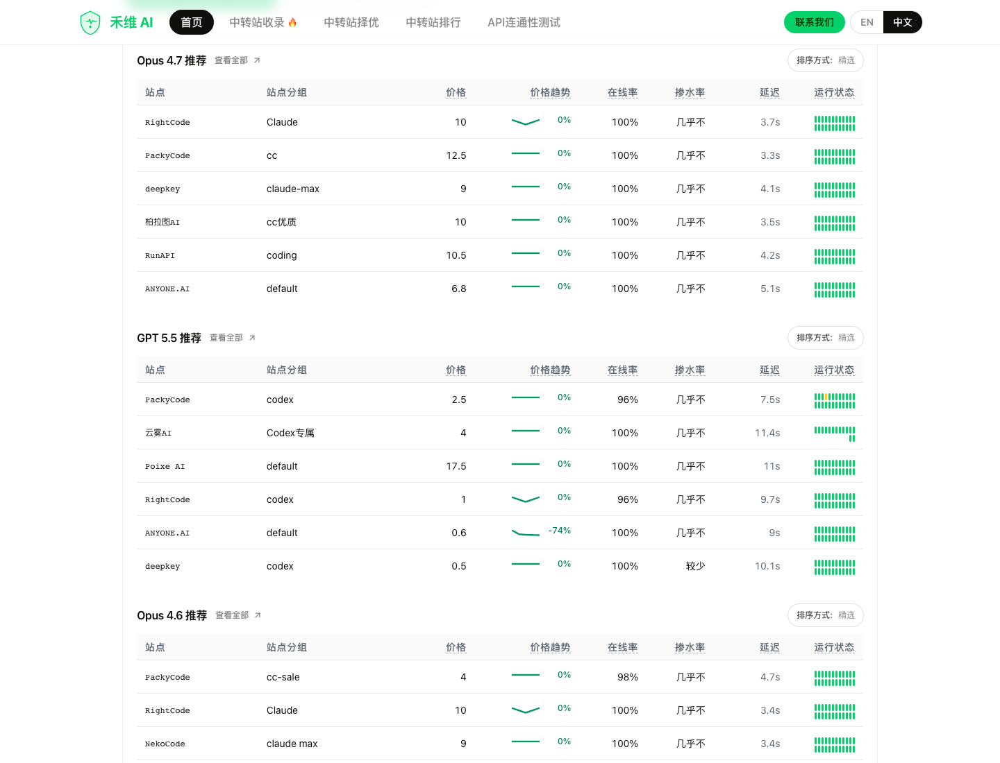
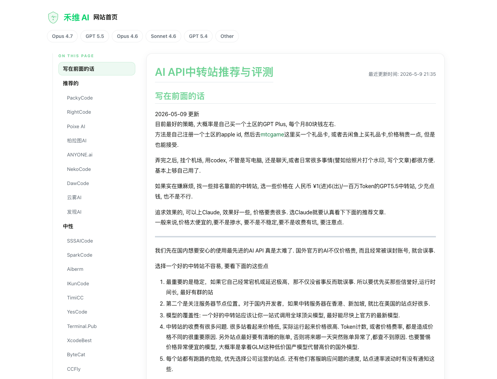
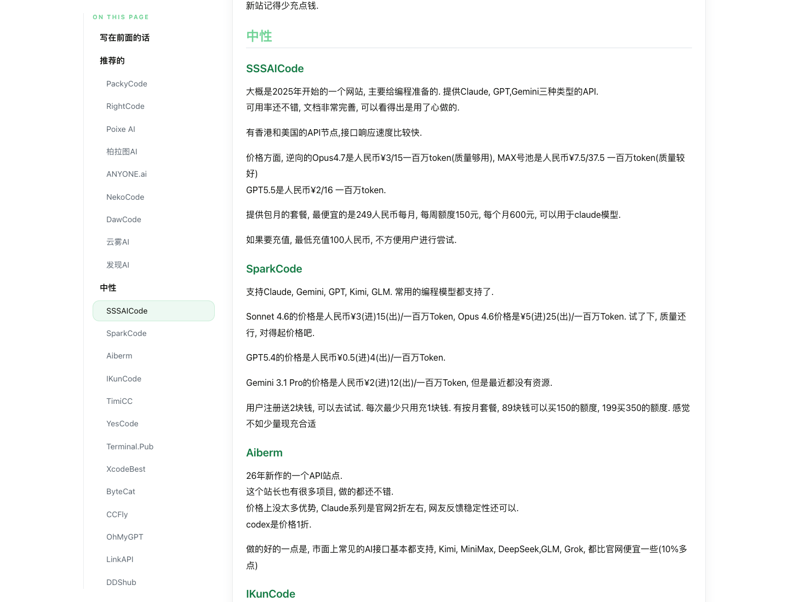

# AI API 中转站怎么选

---

有经验的人应该可以一眼看出这是由AI生成的。但我觉得效果还是蛮满意的，挺好，一口气直接生成。

---

这篇文档记录的是 2026 年 5 月前后的使用经验，主要面向想在国内网络环境里稳定使用 Claude、GPT、Gemini、DeepSeek、GLM 等模型的同学。

先说结论：不要只看“哪家最便宜”。中转站真正要看的，是模型是否真实、价格是否透明、接口是否稳定、账单是否清楚、客服和发票是否靠谱。模型选择也不要一刀切，编码、文书、低预算任务可以用不同模型组合起来做。

## 先用 Hvoy 做真假检测和价格参考

[Hvoy AI](https://hvoy.ai/) 是一个用来检测 API 中转站、查看价格排行和阅读中转站评测的网站。它的首页可以填入 API 地址和 Key，对 Claude / GPT / Gemini 等模型做探测；也提供中转站推荐、榜单和评测文章。

> 截图时间：2026-05-10。Hvoy 页面和中转站价格变化很快，下面截图只代表当时页面状态。

我会把 Hvoy 当成三个用途：

1. **真假检测**：先检查接口返回的模型行为是否像宣传的模型。
2. **价格参考**：看同一模型在不同站点的大致价格区间。
3. **站点初筛**：先从榜单和评测里筛掉明显不稳定、掺水严重、价格异常或口碑差的站。

Hvoy 本身也提醒过：技术检测不等于绝对安全。中转站会受上游账号、政策、风控和站长经营状况影响，所以即使榜单靠前，也不要一次性大额充值。

## 目前比较值得看的站点

截至 2026 年 5 月，我自己会优先看这几个：

| 中转站 | 适合场景 | 我的判断 |
|---|---|---|
| RightCode | 编码、Codex / GPT 类任务、Claude Code | 价格比较有竞争力，接口响应和文档体验还可以，适合经常写代码的人 |
| PackyCode | Claude Code、CodeX / Codex、Gemini、国内模型 | 使用体验稳定，生态和文档比较成熟，也比较适合新人从这里开始 |
| SSSAICode | 编码模型、Claude / GPT / Gemini 基础需求 | 价格和可靠性还可以，文档相对完善，可以作为备选或补充 |

这些站点不代表永远推荐，只是当前时间点比较好用。选之前建议先做三件事：

1. 先小额充值，不要直接充很多。
2. 用自己的真实任务跑一轮，不要只看空对话效果。
3. 看账单里输入、输出、缓存、倍率是否清楚。

如果你需要报销或团队使用，还要额外确认是否能开发票、是否支持对公、是否能按项目或 Key 分账。个人随便试用可以粗一点，团队长期用就不能只看便宜。

## PackyCode 作为一个可选入口

之前仓库里单独有一篇很短的 Packy API 中转站介绍。现在更建议把 PackyCode 放回“怎么选中转站”的整体框架里看：它可以中转使用 Claude Code、CodeX / Codex、Gemini 等模型，在国内网络环境下会方便一些，也适合作为新人第一次尝试中转站的候选。

如果只是想快速试水，可以小额充值体验一下；如果要长期使用，仍然要按上面的检查清单看价格、账单、稳定性、发票和模型质量。具体把中转站接入 CodeX 的操作，可以看 [如何使用 CodeX 进行 vibe coding](/ai_coding/using_codex.md)。

## Claude 和 Codex 的价格差异

从 2026 年 5 月的使用经验来看，Claude 相关通道普遍更贵。国内中转站上的 Claude 价格，大概可能是官方海外价格的 6 折到 7 折左右；CodeX / Codex 相关的 GPT 通道会便宜不少，可能大概是 2 折到 3 折左右。

这个比例不是长期定价，也不是所有站点都一样，只能作为选型时的感性参考。实际使用时还要看：

- 输入价和输出价分别是多少。
- 缓存价格怎么算。
- 是否有“看似便宜但容易掺水”的低价渠道。
- 是否支持你正在用的工具，例如 Claude Code、Codex CLI、Cursor、VS Code 插件等。
- 长任务是否容易断、限速、排队或超时。

Hvoy 的评测页也会收录不同站点的价格、站点说明和更新记录，可以作为横向比较入口。

## 按任务选择模型

我的建议不是“永远用最贵的模型”，而是按任务拆开：

| 预算和需求 | 推荐组合 |
|---|---|
| 不缺钱，追求稳定和表达质量 | Claude Code / Claude Opus 作为主力，编码和文书都用高质量模型 |
| 预算适中，日常高频编码 | 编码任务交给 CodeX + GPT 5.5，关键文书任务交给 Claude Opus |
| 预算有限，任务比较简单 | DeepSeek、GLM、Qwen 等国产模型可以承担说明、整理、简单脚本和低风险任务 |

我现在更推荐个人把 CodeX / Codex 作为编码主力，因为 GPT 5.5 的能力已经不差，而且成本明显更低。对于设计、文书、表达润色这类任务，我还是更推荐 Claude Opus：它的语言流畅度、自然度和“不像 AI”的感觉更好。虽然贵，但确实好用。（你也知道你AI味道重啊...）

## 编码任务不要只算单次价格

编码任务里，“80 分模型”和“90 分模型”的差距，有时候会像“0 分”和“100 分”的差距。

原因很简单：一个差一点的模型可能需要反复读文件、反复调用工具、反复修错，十几轮才把任务做完；一个好模型可能两三轮就能定位问题、改完代码、跑完测试。差模型每轮便宜，但多出来的调用次数和 token 消耗会把便宜吃掉，还会消耗你的注意力。

所以算账时不要只看每百万 token 单价，还要看：

- 完成同一个任务需要几轮。
- 是否经常改错文件或跑偏。
- 是否能自己读懂报错并修复。
- 是否能主动跑测试和验证。
- 你需要花多少时间盯着它纠偏。

如果是写代码、改复杂项目、做多文件重构，我会尽量用更好的模型。简单问答、资料整理、格式转换，可以用便宜模型。

## 选择中转站时的检查清单

第一次用一个中转站，可以按这个顺序检查：

1. **注册和充值**：是否支持小额充值，是否有最低充值门槛。
2. **模型覆盖**：是否支持你要用的 Claude、GPT、Gemini、DeepSeek、GLM 等模型。
3. **工具适配**：是否给出 Claude Code、Codex、Cursor、OpenAI-compatible Base URL 的配置方式。
4. **真假检测**：用 Hvoy 或自己的测试提示检查模型行为。
5. **价格结构**：分别看输入、输出、缓存、倍率、会员折扣和套餐限制。
6. **稳定性**：用真实项目跑一两个小时，观察延迟、断连、限速和错误率。
7. **账单透明度**：看能否追踪每个 Key、每次调用、每个模型的消耗。
8. **售后与发票**：团队使用时重点看客服响应、发票、对公和群公告。
9. **资金风险**：不大额囤余额，不长期依赖单一站点。

SSSAICode 这类站点可以作为备选观察对象，尤其适合在主力站点不稳定时做备用通道。

## 推荐策略

比较稳妥的策略是：

1. 先选一个可靠中转站作为主力，例如 RightCode 或 PackyCode。
2. 再准备一个备用站点，避免主力站临时出问题时完全停工。
3. 编码主力优先用 CodeX / Codex + GPT 5.5。
4. 关键文书、重要表达、需要高自然度的内容，用 Claude Opus。
5. 简单任务、低风险任务、预算有限时，用 DeepSeek、GLM、Qwen 等国产模型。

不要把所有任务都塞给一个模型，也不要把所有钱都充进一个站。灵活组合，通常比迷信单一工具更稳。

## 需要持续更新

本文信息截止到 2026 年 5 月，AI 模型、中转站价格、渠道质量和站点稳定性都会快速变化。上面的推荐只能作为阶段性经验参考，不适合当成长期不变的购买建议。

如果你发现价格、站点状态、模型质量或使用方式已经变化，欢迎直接提 PR 更新这篇文档。尤其是中转站相关信息，过期速度非常快，越多人维护越不容易踩坑。

## 延伸阅读

- [Hvoy AI：API 中转站检测与排行](https://hvoy.ai/)
- [Hvoy AI：API 中转站收录与评测](https://hvoy.ai/APIreview.html)
- [如何使用 CodeX 进行 vibe coding](/ai_coding/using_codex.md)
- [Claude Code](/ai_coding/claude_code.md)
