# GitHub Education 指南

在前面的章节里，我们提到了 GitHub Copilot，并推荐大家使用它来提升编程效率。但 Copilot 是一个付费服务，对于尚无收入的学生来说可能是一笔不小的开销。

幸运的是，GitHub 推出了一个名为 **GitHub Education** 的福利项目，它能让你**完全免费地使用 Copilot** 以及其他数十种顶级的开发者工具。

## 什么是 GitHub Education？

GitHub Education 是 GitHub 面向全球学生、教师和教育机构推出的一个支持计划。其核心产品就是 GitHub 学生开发包 (GitHub Student Developer Pack)。

你可以把它想象成一个专为学生开发者准备的“大礼包”或“全家桶”。GitHub 联合了众多科技公司，将它们旗下原本付费的工具、服务或订阅，免费提供给通过认证的学生用户，旨在帮助学生在学习阶段就能接触和使用到行业内最专业的工具，降低学习成本，激发创造力。

## 你能获得什么？—— GitHub 学生开发包的亮点

学生开发包里的福利内容会不时更新，但通常会包括以下几个极具吸引力的类别（具体请以官网为准）：

  * **👑 编程神器：GitHub Copilot (免费使用)**

      * 这无疑是当前学生包里**价值最高**的福利。只要你的学生认证有效，就可以在订阅期内一直免费使用 Copilot，这能为你省下每月 10 美元的费用。

  * **⭐️ GitHub Pro 账户**

      * 你的免费 GitHub 账户会自动升级为 Pro 账户，享受更多的 CI/CD Action 分钟数、更多的存储空间等权益。

  * **☁️ 云服务平台额度**

      * 获得来自 **Microsoft Azure**、**DigitalOcean** 等知名云服务商的免费代金券或额度。你可以用它来免费部署自己的个人网站、机器人或后端服务，是实践全栈开发的绝佳机会。

  * **🌐 免费域名**

      * 从 **Namecheap**、**Name.com** 或 **.tech** 等域名注册商处，免费注册一个为期一年的 `.me` 或 `.tech` 等个性化域名。拥有一个自己的域名，是打造个人品牌的第一步。

  * **📚 在线学习平台**

      * 获得 **Frontend Masters** 等高质量编程教育平台的免费订阅或试用，学习前沿的开发技术。

  * **还有更多...**

      * 包括设计工具（如 Canva）、项目管理工具、安全工具等，覆盖了软件开发的方方面面。

## 如何申请？

申请过程并不复杂，关键在于证明你当前的学生身份。

### 申请注意事项

1.  使用校园网
1.  定位在学校附近
1.  不能挂vpn
1.  使用学信网学籍证明
1.  github profile/pay information应当与学籍证明相匹配

### 申请步骤

1. **官网申请**：打开 GitHub Education 官网：[https://education.github.com](https://education.github.com)。

   - 点击Join Github Education按钮

   - 

   - 点击Start an application按钮

   - 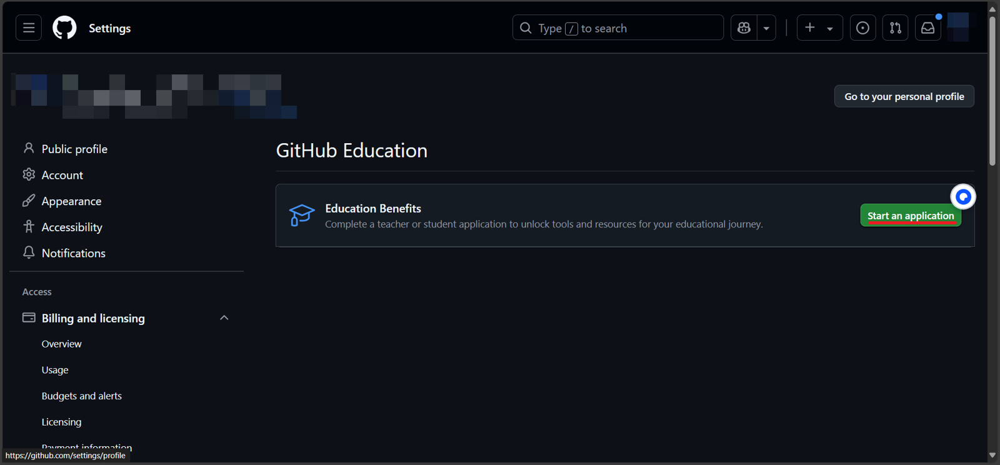

   - 点击添加学校邮箱按钮（若已添加则跳过）

   - 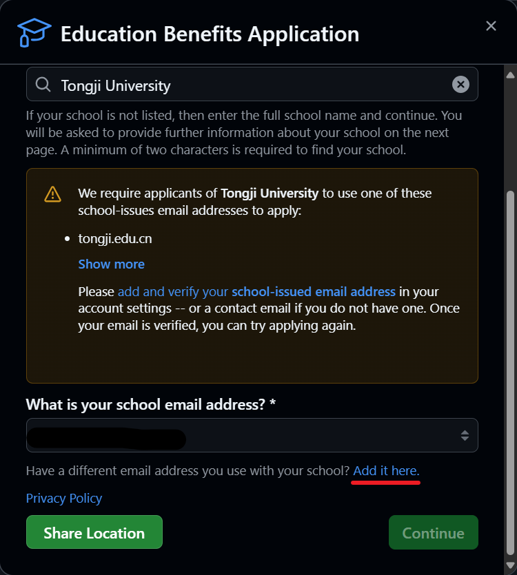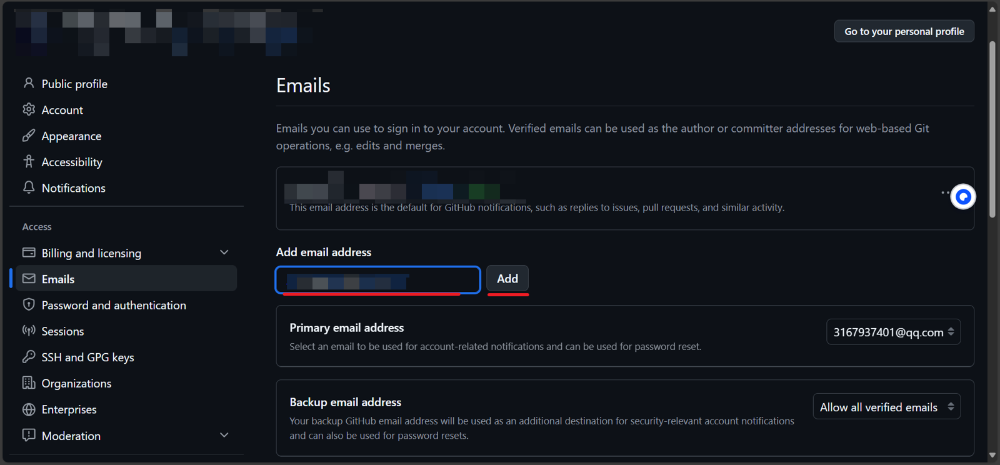

   - 去同济邮件系统点击确认

   - 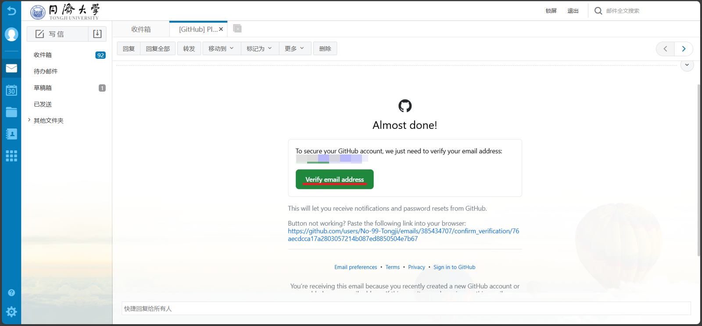

   - 选择学校-同济大学

   - 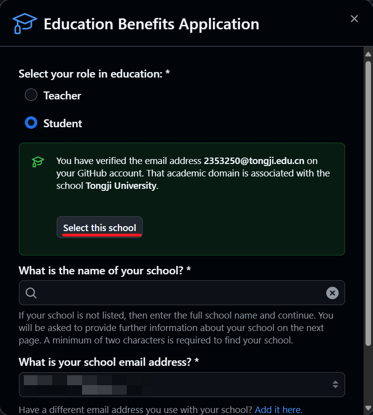

   - 点击共享位置（注意要在学校附近且使用校园网，此处问题较多，可结合网上资料解决）

   - 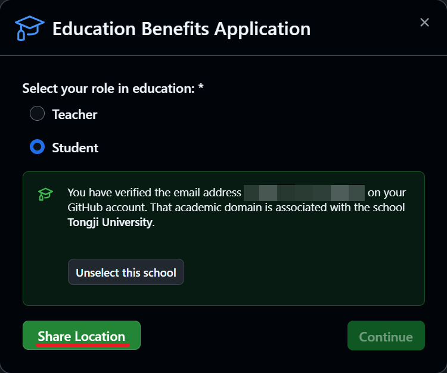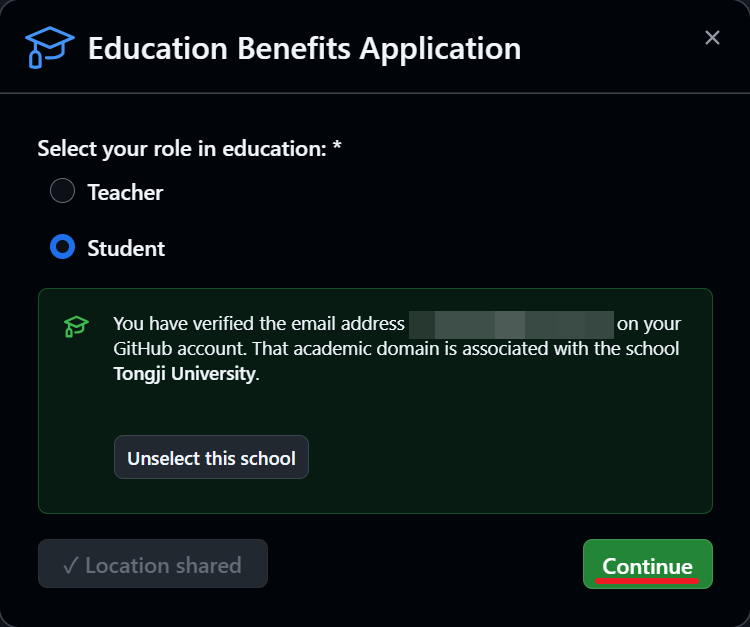

   - 选择上传资料-Dated school ID

   - 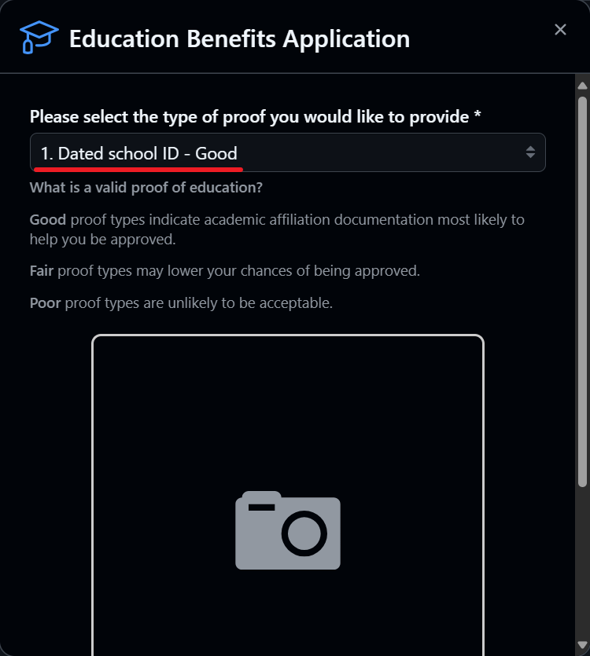

     

2. **申请学信网学籍认证**：

   - 登录学信网后选择学信档案
   - 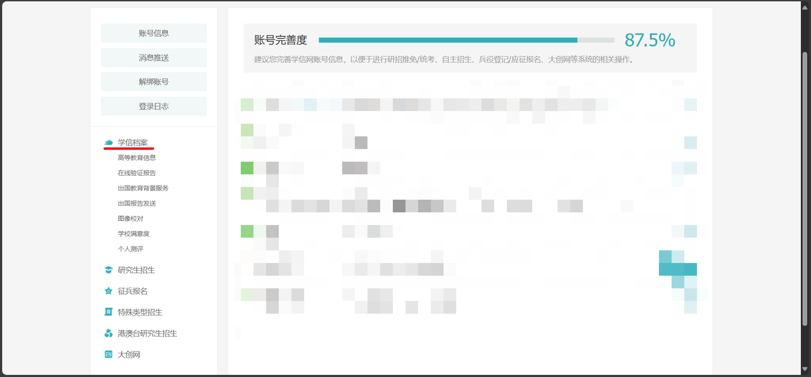
   - 选择查看或申请在线验证报告
   - 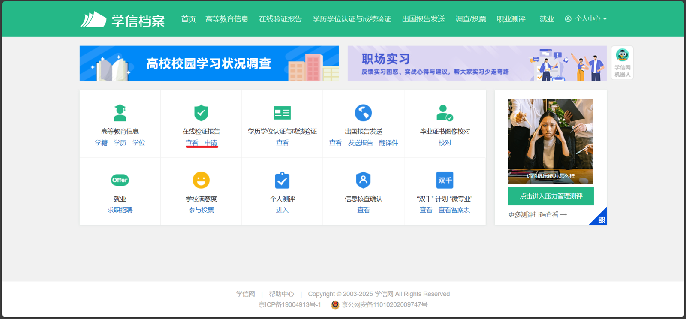
   - 之后将会看到中文的报告，使用浏览器自带翻译功能翻译成英文
   - 翻译成英文后可能会出现二维码遮挡日期的情况，若有请在下面的样式表中将width改为200px
   - 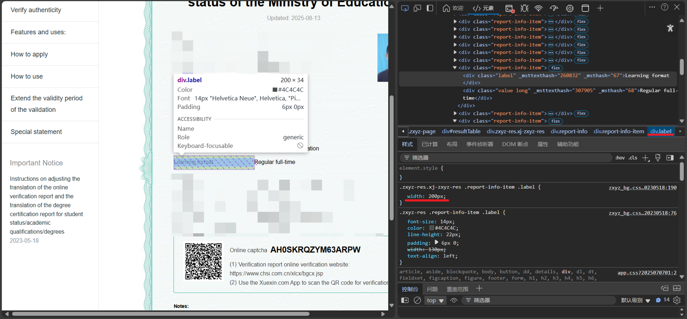
   - 之后使用浏览器自带的打印成pdf功能打印页面（不要使用网页的打印功能，并且要勾选背景图形）
   - 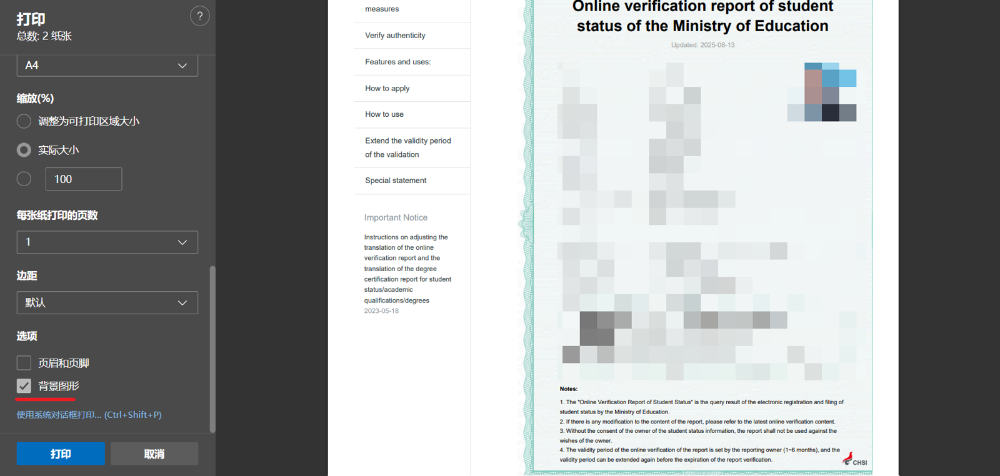

## 拿到“神装”之后

一旦认证成功，就尽情地去探索和使用这些强大的工具吧！不要让它们在你的账户里“吃灰”。免费的 Copilot、免费的服务器、免费的域名... 这将是你开发者生涯的完美起点。（Gemini味太重了哈）