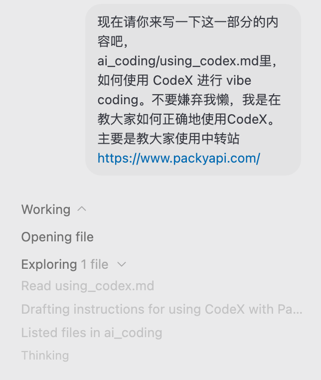
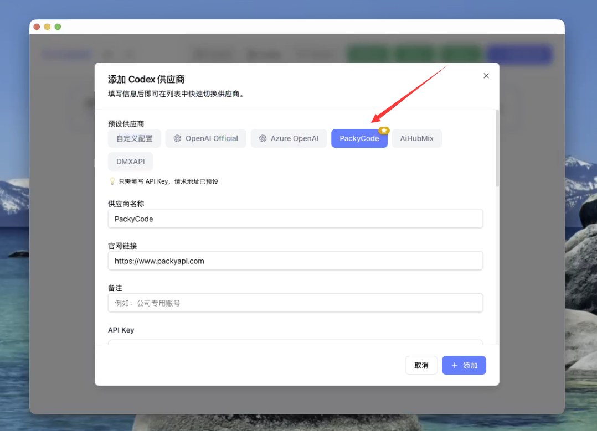
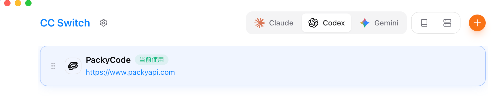
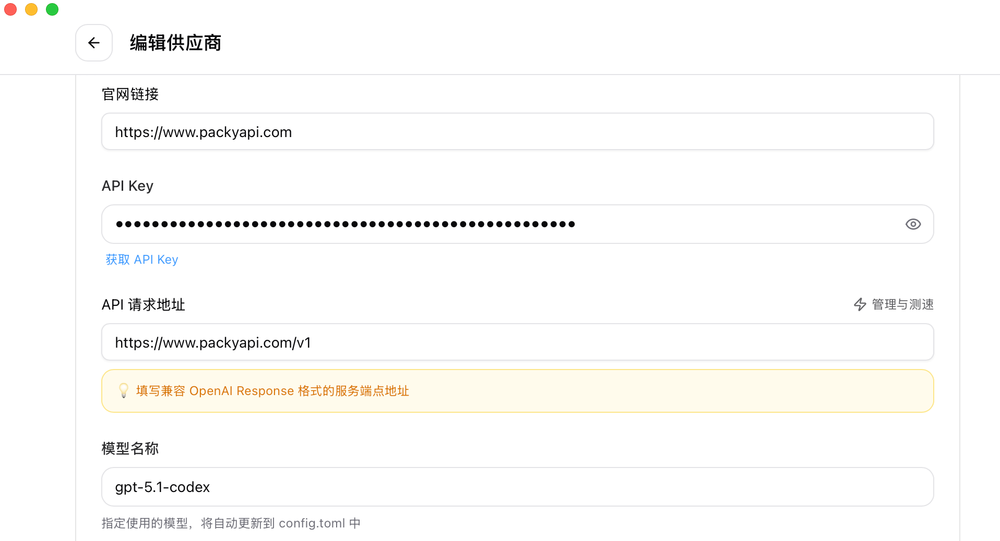
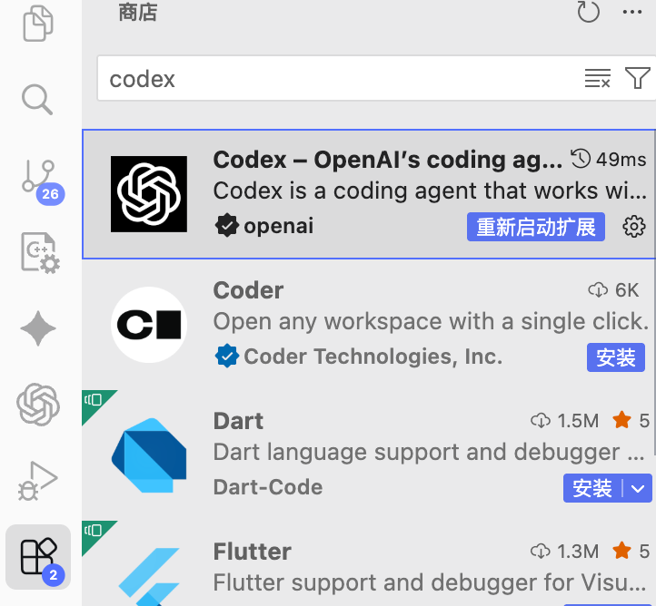

# 如何使用 CodeX 进行 vibe coding

“Vibe coding” 可以理解为把 CodeX 当成常驻的结对编程搭档：你给出宏观目标、约束与上下文，它负责读写仓库、运行命令、同步进展。要让它在国内网络环境里稳定可用，最实用的方案就是通过 **Packy API 中转站** 接入海外模型。下面是一套可复制的流程。

## 为什么选择 Packy 作为中转

- **合规又好买**：支持微信 / 支付宝充值，不需要海外信用卡即可获得 GPT-4.1、GPT-4o 等模型额度。
- **OpenAI 兼容接口**：提供标准的 `Base URL + API Key`，CodeX 只要切换成 OpenAI-Compatible Provider 即可使用。
- **可控的成本与限额**：可以设置日消费上限、并发上限，vibe coding 时不会因为误操作被扣到失联。

## 前置准备

1. 本地已经安装并可运行 CodeX CLI Harness（团队内部一般直接用 `codex` 脚本）。
2. 仓库已 `git clone`，并在当前机器上具备读写权限；必要依赖（Node、Python、包管理器等）提前准备好。
3. 注册 Packy 账号并完成实名认证。

## 在 Packy 控制台获取 Key

1. **注册与实名认证**  
   访问 [https://www.packyapi.com/](https://www.packyapi.com/)，使用手机号或邮箱注册。

2. **充值准备额度**  
   Packy 支持按量计费，建议先充值 50 元做体验，同时开启“余额提醒 / 每日消费提醒”，避免长时间 vibe coding 时忘记关。

3. **创建 OpenAI 兼容 Key**  
   - 进入「控制台 -> API Key」页面，新建密钥。  
   - 通道选择 **OpenAI 兼容**，模型分组选 `codex`（高推理）等。  
   - 创建完成后会看到：  
     - `Base URL`（通常类似 `https://api.packyapi.com/v1`，以控制台显示为准）  
     - `API Key`

4. **确认模型定价与并发**  
   Packy 会列出模型的单价、每分钟速率、最大并发数。建议默认使用 `gpt-5.1-codex` 或者更新的模型进行 vibe coding。

## 把 Packy 接入 CodeX

- 按Packy的文档配置
  - 更方便的方法是按[文档](https://docs.packyapi.com/)安装CC-Switcher，链接：https://github.com/farion1231/cc-switch/releases/
  - 直接添加codex配置，选择PackyCode，输入API Key

- VS Code/Cursor等软件都可以下载CodeX插件，可以直接在里面vibe coding

## Vibe coding 的标准流程

1. **先描述背景**：把本次会话的目标、重要文件、不能触碰的目录、代码规范等一次性告诉 CodeX。背景越清晰，来回越少。
2. **要求先出计划**：让 CodeX 使用 Plan 工具输出 3～5 步操作，你确认后再让它执行。这样中途需要改方向时也容易插话。
3. **保持节奏感**：每次只给一个明确目标（修 bug、写测试、补文档）；完成后让它总结进度，再继续下一个目标。
4. **多让它自检**：定期让 CodeX `git status`、`git diff`、运行测试或静态检查，减少人工手动查验的时间。
5. **及时中断与重启**：一旦发现跑偏，直接发送“stop/终止”让它停止命令，再给出新的指令。Packy 按 Token 计费，中断不会额外扣款。
6. **贴上下文文件**：引用文件时记得提供相对路径（`src/api/index.ts`），必要时用 `sed -n '1,80p'` 这类指令把片段贴给它，减少反复查找。

## Packy + CodeX 常见问题

- **401 / Invalid Key**：检查 API Key 是否被重置、是否复制完整、当前 IP 是否在白名单中。
- **429 / Rate Limit**：说明 Packy 通道的并发或速率限制被触发。可以在控制台调高，或生成新的 Key。
- **请求超时**：把 `request_timeout` 调大一些（150～180s），并在 Packy 控制台开启“长链接模式”。大型构建任务可以提前告知 CodeX 预计耗时。
- **消费失控**：务必在 Packy 控制台设置“余额低于 X 提醒”和“单日上限”。在 CodeX 中优先用 mini 级模型，只有特殊需求再切换更贵的模型。
- **上下文不同步**：确保在仓库根目录运行 `codex`，不要把仓库挂载为只读；必要时让它执行 `git status` 并把输出同步给你。

## 提示与习惯养成

- Packy 控制台实时显示 Token 消耗，vibe coding 时可以开着网页，看到流量暴增立刻排查。
- 团队使用时为每个项目单独生成一个 Key，方便统计费用、也方便在泄露时快速撤销。
- 让 CodeX 定期“复述当前进度 + 下一步计划”，可以帮助建立持续的节奏感。即使会话断开，再次连接也能迅速恢复上下文。

完成以上配置，就能利用“Packy 中转 + CodeX CLI”在本地仓库里顺滑地进行 vibe coding。多练习几次后，你会逐渐形成适合自己的提示模板和操作节奏。 

