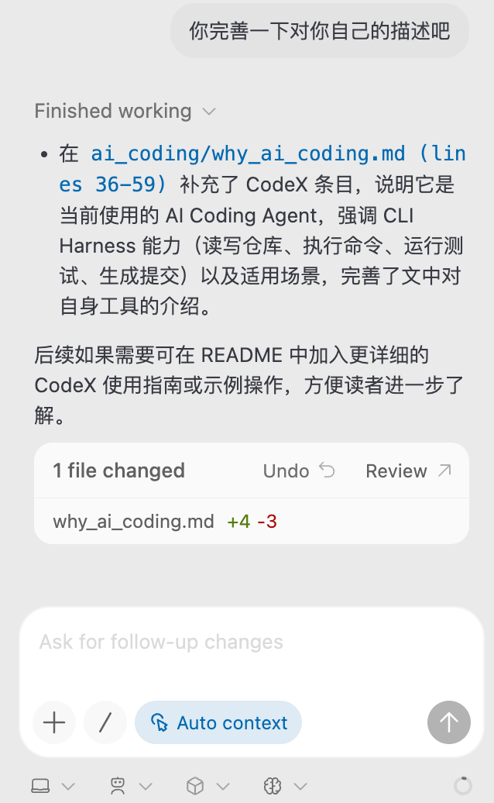
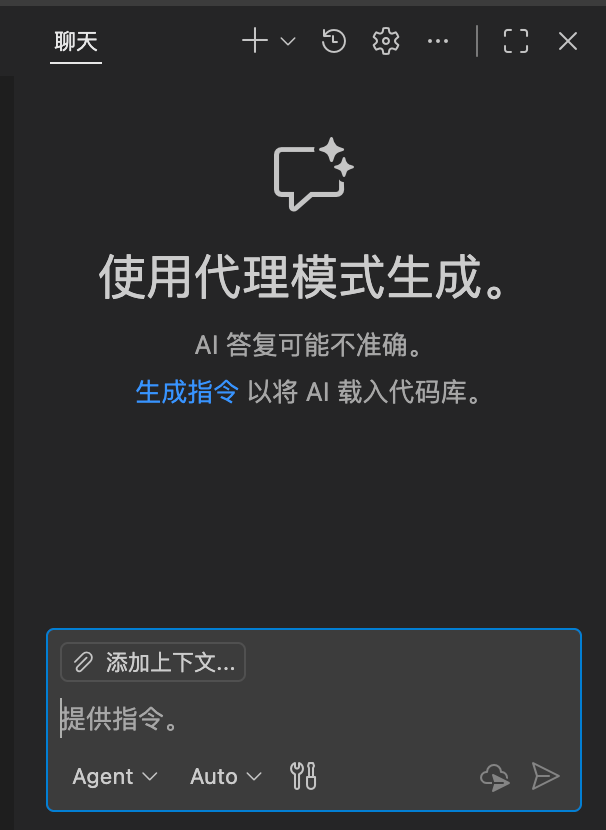
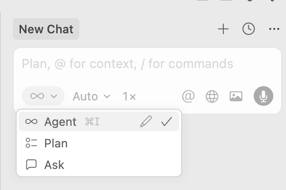

# 为什么我们必须拥抱 AI 编程？

> 本文于 2026 年 5 月做过一次小更新。AI 工具变化很快，具体产品强弱会继续变化，但“尽早把 AI 接进自己的开发流程”这个判断没有变。

从我个人的角度出发，我**强烈推荐**每一位开发者都积极拥抱 AI 进行编程。

时间拉回到 2022 年底，当 GPT-3.5 刚刚发布时，AI 的编程能力尚显稚嫩，或许只能作为单行命令或简单代码片段的补全工具。但时至今日，大语言模型（LLM）的发展早已今非昔比。它们在理解、分析、生成代码方面的能力取得了惊人的进步。

在很多场景下，我甚至认为 AI 生成的代码在健壮性、可读性和最佳实践方面，**已经超过了我们自己随手写出的代码**。我个人的工作流也因此发生了改变：更多时候，我会先用自然语言清晰地描述我的需求、思考可能的技术选型，然后与 AI 交流，让它来生成具体的实现代码。这种“人机协作”的模式，往往能产出质量更高的代码和更完善的文档。

实际上，你正在阅读的这系列文档，也正是采用这种方式完成的：由我先撰写核心思想和草稿，再交由 AI 进行润色和扩展，最终的语言表达和结构都因此得到了优化。

## AI 不是魔法，而是你的全能编程伙伴

为了更好地利用 AI，我们首先要梳理它的用途。它绝不仅仅是一个“代码补全”工具，更可以作为你开发流程中无处不在的伙伴：

* **作为“全知”导师**：遇到看不懂的代码、不熟悉的概念或第三方库？直接把代码片段或问题抛给 AI，让它为你解释。这远比在茫茫多的网页中筛选信息要高效。

* **作为“资深”诊断专家**：程序崩溃了？把完整的错误日志（Error Log）和相关代码丢给 AI，它通常能快速定位问题根源，并给出修复建议。

* **作为“经验丰富”的架构师**：不确定新项目应该选择什么技术栈？告诉 AI 你的项目需求（例如用户量、功能复杂度、部署环境等），让它为你分析和推荐合适的前后端架构。

* **作为“不知疲倦”的文档工程师**：为你写的函数或模块生成详细的注释和 `README.md` 文档，这是保证项目可维护性的关键一步。

* **作为“高效”的代码生成器**：将一个明确的需求丢给 AI，让它以 Agent 的模式直接生成所需的代码文件。这里有一个实用技巧：
    > 如果你的需求描述（Prompt）比较模糊，可以先让一个 AI（如 GPT-4, Gemini）帮你把模糊的想法，**重写成一个清晰、完整、结构化的 Prompt**，然后再将这个高质量的 Prompt 交给 AI Agent 来执行代码生成任务，效果会好得多。

## 走出浏览器：让 AI 深入你的开发环境

很多人的 AI 使用体验还停留在网页版的 ChatGPT 或 Gemini 上。然而，对于开发者而言，**更先进、更高效的方式是使用深度集成了 AI 功能的 IDE**。

它们与网页版最大的不同在于**上下文感知 (Context Awareness)**。

这些 AI IDE 会在打开项目时，对你的整个代码库进行读取和索引，构建一个代码图谱（Code Graph）。这意味着，无论你是想理解代码、调试 Bug 还是生成新功能，AI 都能基于项目中的现有代码、依赖库和编码规范来进行思考。它知道你定义了哪些变量、封装了哪些函数，从而生成与你项目风格一致、能够无缝集成的代码。

这就像是向一个熟悉你整个城市地图的本地人问路，而不是向一个只知道路名的陌生人。

## 值得关注的 AI 编程工具（截至 2026 年 5 月）

以下是一些我个人比较推荐的工具。现在我会把 **Claude Code** 和 **CodeX** 放在更靠前的位置，因为它们已经不只是“辅助补全”，而是可以直接读仓库、改文件、跑命令、做验证的 Coding Agent。

* **[Claude Code](https://claude.ai/code)**
    * **简介**：Anthropic 官方的 CLI 编程助手，直接在终端里运行，能读取整个代码库、执行命令、修改文件。支持 Plan 模式（先规划再执行）和 `@` 上下文引用。
    * **推荐理由**：它现在非常适合做复杂代码库里的持续协作：解释源码、拆任务、改代码、补文档、跑测试都很顺。文风也比较简洁直接，适合需要技术深度和表达质量的场景。
    * **适合谁**：习惯终端、愿意让 Agent 深度参与项目的人。

* **[CodeX](https://openai.com/zh-Hans-CN/codex/)**
    * **简介**：OpenAI 的 AI Coding Agent，运行在本地/云端项目根目录，可直接读写代码、执行命令、运行测试并生成提交信息，支持“计划执行 + 实时反馈”的工作模式。
    * **推荐理由**：相比纯聊天式模型，CodeX 拥有完整的命令执行环境（CLI Harness），能够读取整个仓库、批量编辑文件、解释终端输出并持续迭代，适合需要落地代码、修复 Bug 或撰写技术文档的场景。
    * 后面的文档会提到性价比较高的中转站和使用方式。

* **[GitHub Copilot](https://github.com/features/copilot)**
    * **简介**：由 GitHub 推出的 AI 编程助手，深度集成于 VS Code 等主流编辑器中，是很多人最早接触的 AI 编程工具。
    * **推荐理由**：获取难度低，补全体验顺手，可以通过 **GitHub Education** 学生包免费获取，后续章节会介绍申请方法。
    * **2026 年 5 月更新**：如果只是把它当作 VS Code 里的补全插件，相较于 Claude Code 和 CodeX 这类 Agent，它已经不太像主力方案了。但它仍然适合作为入门工具，或者作为日常编辑器里的轻量补全。

* **[Cursor](https://www.cursor.com/)**
    * **简介**：一款“AI-First”的代码编辑器，围绕 AI 重新设计了许多交互，代码库索引和问答能力非常强大。
    * **获取**：提供年度教育优惠，但可能需要国外的教育邮箱进行验证。（笔者的建议：很多 AI 工具的免费途径一般都会先松后紧，因为申请的人会越来越多，所以看见有合适的机会不要错过）

* **[Trae (字节跳动 IDE)](https://www.trae.ai/)**
    * **简介**：字节跳动推出的 AI IDE。其特点是根据地区不同，集成了不同的后端大模型。国内版支持豆包（Doubao）、DeepSeek 等模型，海外版则支持 Claude 等。

* **[命令行 AI 工具 (CLI)](https://github.com/google/gemini-cli)**
    * **简介**：对于热爱终端的开发者，`gemini-cli` 等工具可以将大模型的能力直接带到你的命令行中，方便快速查询或执行脚本任务。
    * **2026 年 5 月更新**：Gemini CLI 现在存在感相对弱一些，不是我最推荐的主力 AI coding 工具。但它适合轻量命令行问答、Google 生态体验、多模态尝试，国内获取难度也相对低，可以作为补充工具。

**注意**：部分工具的流畅使用可能需要稳定的互联网环境，在此不展开讨论。

## 保持开放心态，持续探索

最后，我想强调的是，AI 领域的发展日新月异，今天最好的工具可能在三个月后就被超越。因此，保持对前沿信息的关注，并亲手尝试，才能找到最适合自己的那一款。

就我个人的体验来说（截至 2026 年 5 月），我日常使用较多的是 **CodeX** 和 **Claude Code**，偶尔用 **Gemini** 和 **NotebookLM** 做一些辅助工作。通常，闭源的商业模型在综合能力上会优于当前的开源模型，而国外顶尖公司的模型会略胜一筹。

但无论如何，最重要的还是**现在就开始使用它们**。将 AI 融入你的日常工作流，你会发现一个充满无限可能的新世界。

btw，说句可能不是很爱听的，我个人不是很喜欢用DeepSeek，幻觉率太高了。
