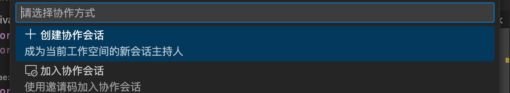

# 如何运行

## 环境准备

### Node.js 版本要求

本项目要求 Node.js 版本不低于 `20.10.0`，推荐使用 `22.14.0` 以确保兼容性。您可以通过以下命令检查当前 Node.js 版本：

```bash
node --version
```

预期输出：
```
v22.14.0
```

如果版本过低，请参考前文的nvm教程进行 Node.js 版本控制

### 安装 npm 依赖

在项目根目录执行以下命令安装所有工作区依赖：

```bash
npm install
```

该命令将根据 `package.json` 中的 `workspaces` 配置，自动为 `packages/*` 下的所有子包安装依赖。

**预期输出：**

```
added 1234 packages in 30s
```

### 构建项目

使用以下命令构建所有 TypeScript 项目：

```bash
npm run build
```

此命令将调用 `tsc -b tsconfig.build.json` 编译所有包的源码至 `lib` 目录。

**预期输出：**
```
> tsc -b tsconfig.build.json && npm run build --workspaces

[build] src/app.ts -> lib/app.js
[build] src/extension.ts -> lib/extension.js
...
```

环境配置完成后，需要同时启动服务端（server）和客户端（VS Code的client）来启动项目，具体介绍如下：

## 启动后端服务

在项目根目录执行以下命令启动协作服务器：

```bash
OCT_ACTIVATE_SIMPLE_LOGIN=true npm run start:dev # 本地开发启动
OCT_ACTIVATE_SIMPLE_LOGIN=true npm run start # 服务器上使用该命令
```

此命令将启动 `open-collaboration-server` 服务，并启用简单登录模式（无需 OAuth）。

**预期输出：**
```
> open-collaboration-server@0.3.1 start:dev
> tsx watch src/app.ts --hostname=localhost

Server is running on http://localhost:8100
WebSocket server listening on ws://localhost:8100
Simple login activated
```

## 启动 VS Code 扩展进行协作

由于实时协作需要至少两个客户端，所以为了方便调试，提供了两种启动的方法。
**首先需要检查连接后端的`serverUrl`是否正确**(位于`packages/open-collaboration-vscode/package.json`)，以确保可以与后端建立连接。

### 方法一：通过 VS Code 调试启动主机实例

1. 使用 VS Code 打开项目 `packages/open-collaboration-vscode` 目录
2. 打开 `src/extension.ts` 文件
3. 按下 `F5` 键启动调试
4. 将打开一个新的 VS Code 窗口（主机实例）

### 方法二：使用脚本启动访客实例

运行提供的 `launch-guest.sh` 脚本以启动第二个客户端：

```bash
chmod +x packages/open-collaboration-vscode/launch-guest.sh
./packages/open-collaboration-vscode/launch-guest.sh
```

**脚本功能说明：**
- 创建临时用户数据目录 `.temp-guest-data`
- 创建临时扩展目录 `.temp-guest-extensions`
- 创建符号链接将当前扩展链接到访客环境
- 启动 VS Code 并指定独立的用户数据和扩展目录

**预期行为：**
- 打开第二个 VS Code 窗口
- 两个实例可独立运行，互不影响

### 创建协作房间

1. 点击底部状态栏的 Share（共享）按钮
2. 屏幕顶部会弹出一个 quickpick，选择“创建协作会话”



3. 选择“简单认证”方式
4. 认证成功后，右下角会弹出一个包含邀请码的消息。将该邀请码分享给你希望加入会话的同伴。


5. 如果需要再次复制邀请码，可以再次点击底部工具栏的“Sharing”按钮，顶部会弹出 quickpick，允许你复制邀请码或关闭当前会话。
6. 在访客实例中，使用 `Join Room` 命令并输入房间号即可加入协作
7. 当有用户请求加入时，底部会弹出提示，询问你是否允许该用户加入。


## 常见问题排查

### 端口占用问题

**问题现象：**

```
Error: listen EADDRINUSE: address already in use :::8100
```

**解决方案：**

1. 查找占用端口的进程：
```bash
lsof -i :8100
```

2. 终止进程：
```bash
kill -9 <PID>
```

3. 或修改服务器端口（需同步修改客户端配置）

### 依赖缺失问题
**问题现象：**
```
Error: Cannot find module 'open-collaboration-protocol'
```

**解决方案：**
1. 确保在项目根目录执行 `npm install`
2. 检查 `node_modules` 是否包含所有工作区包
3. 清理并重新安装：
```bash
npm run clean
npm install
```

### 构建失败问题
**问题现象：**
```
TS2307: Cannot find module '...'.
```

**解决方案：**
1. 确保所有包已正确链接：
```bash
npm run build:clean
```
2. 检查 `tsconfig.json` 的路径映射配置
3. 验证 `package.json` 中的 `exports` 字段是否正确