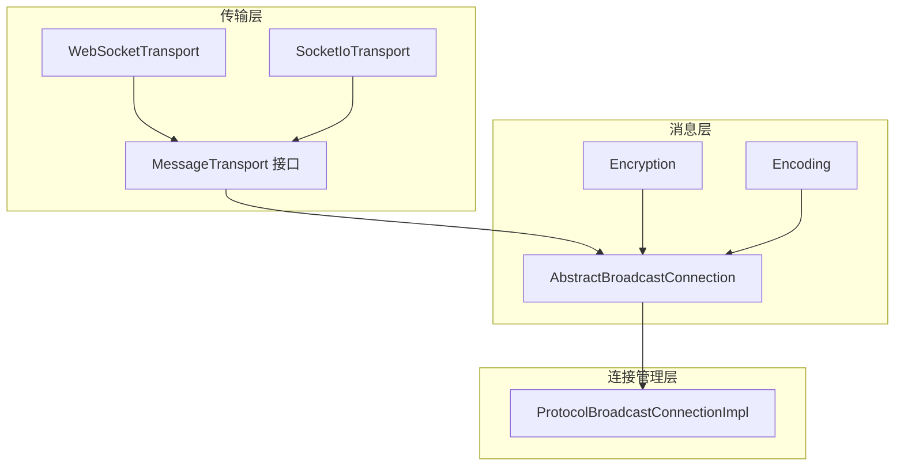
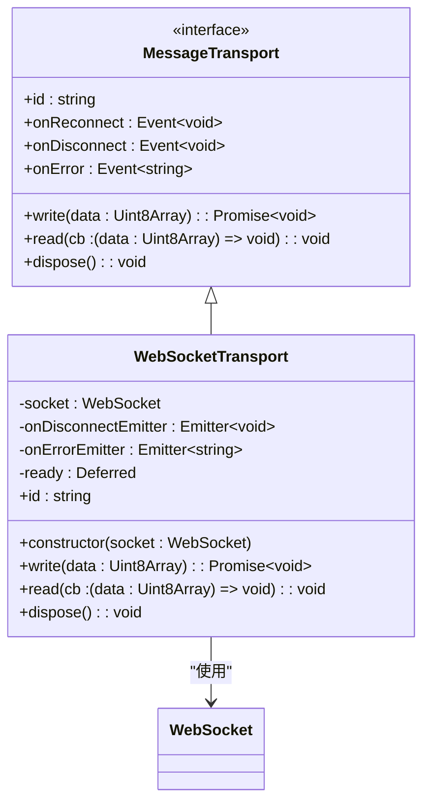
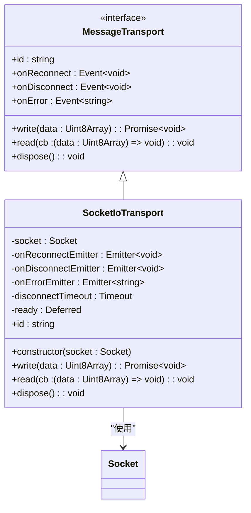
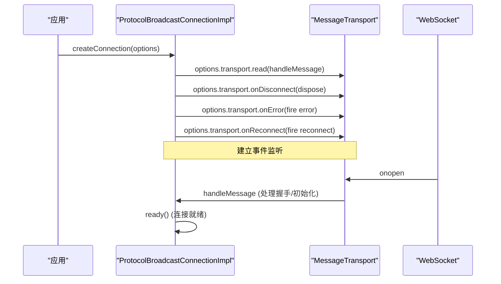
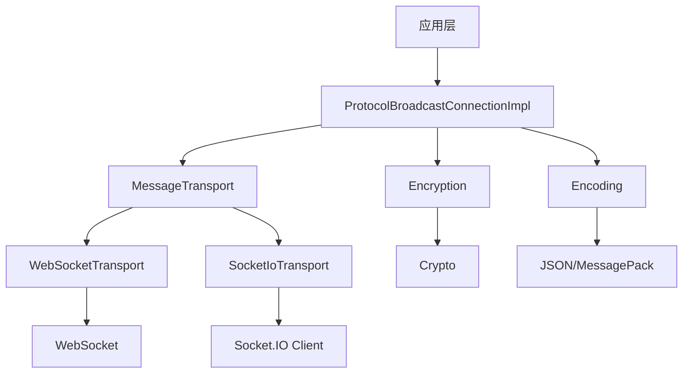

# 传输层适配

## 简介
本文档详细阐述了协作工具项目中的传输层设计与实现，重点分析了 `transport.ts` 中定义的通用 `MessageTransport` 接口，以及其在 `websocket-transport.ts` 和 `socket-io-transport.ts` 中的具体实现。通过对比原生 WebSocket 与 Socket.IO 的差异，说明了不同网络环境下传输层的选择策略。同时，文档还解析了 `connection.ts` 如何利用传输层实例管理连接生命周期，包括握手、认证、心跳等机制，并为开发者提供自定义传输适配器的指导。

## 项目结构
项目采用模块化设计，核心通信逻辑位于 `packages/open-collaboration-protocol` 包中，其 `src/transport` 目录专门负责网络传输层的抽象与实现。主要模块包括：
- `transport/`: 传输层接口与实现
- `messaging/`: 消息编码、加密与通信协议
- `utils/`: 工具函数（事件、Promise、加密等）
- `connection.ts`: 基于传输层构建的高级连接管理

## 核心组件

### 传输层接口 (MessageTransport)
`transport.ts` 定义了 `MessageTransport` 接口，为上层通信提供统一的网络抽象。该接口的核心方法包括：
- `write(data: Uint8Array)`: 异步发送二进制数据
- `read(cb: (data: Uint8Array) => void)`: 注册回调以接收数据
- `dispose()`: 释放资源，关闭连接
- 事件：`onReconnect`, `onDisconnect`, `onError`

此接口通过 `ConnectionWriter` 和 `ConnectionReader` 类型别名，将数据的读写操作与具体实现解耦，提高了代码的可测试性和可扩展性。

### WebSocket 传输实现
`websocket-transport.ts` 提供了基于原生 WebSocket API 的轻量级实现。其特点包括：
- **轻量高效**：直接使用浏览器/Node.js 原生 WebSocket，无额外依赖。
- **简单可靠**：连接建立后，通过 `onopen` 事件触发 `ready` Promise，确保数据发送前连接已就绪。
- **自动协议转换**：将 `http(s)` URL 自动转换为 `ws(s)`，并附加 `/websocket` 路径和查询参数。
- **事件代理**：将 WebSocket 的 `onclose` 和 `onerror` 事件代理为 `onDisconnect` 和 `onError`。

### Socket.IO 传输实现
`socket-io-transport.ts` 基于 Socket.IO 库，提供了更高级的网络功能。其核心优势在于：
- **自动重连**：内置重连机制，当连接断开时，Socket.IO 会自动尝试重新连接。
- **断线缓冲**：在重连期间，`ready` Promise 会被重置，`write` 操作会等待重连成功，避免了数据丢失。
- **显式重连事件**：通过 `onReconnectEmitter` 提供 `onReconnect` 事件，让上层应用可以感知到重连成功。
- **优雅断开**：设置 30 秒的断开超时，若在此期间重连成功，则取消断开事件，实现了“假断线”处理。

### 连接管理 (Connection)
`connection.ts` 文件中的 `ProtocolBroadcastConnectionImpl` 类是传输层的直接使用者。它利用 `MessageTransport` 实例来构建一个功能完整的、支持加密和广播的连接。

#### 连接生命周期管理

#### 核心流程
1.  **初始化**：构造函数接收 `ProtocolBroadcastConnectionOptions`，其中包含 `privateKey` 和 `transport` 实例。
2.  **事件绑定**：立即绑定 `transport` 的 `read`、`onDisconnect`、`onError` 和 `onReconnect` 事件。
3.  **消息处理**：`read` 回调将接收到的 `Uint8Array` 数据传递给 `handleMessage` 方法。
4.  **消息解码与分发**：`handleMessage` 方法（位于 `abstract-connection.ts`）负责解码二进制数据，根据消息类型（请求、通知、广播、响应）进行解密，并分发给注册的处理器。
5.  **消息发送**：`sendRequest`, `sendNotification`, `sendBroadcast` 等方法会先对消息进行加密和编码，然后通过 `transport.write` 发送。
6.  **连接就绪**：当收到 `Peer.Init` 消息或 `host` 信息时，调用 `ready()` 方法，标志着连接完全建立，后续的 `send` 操作可以安全执行。

## 详细组件分析

### 传输方式对比与选型指南

| 特性 | 原生 WebSocket | Socket.IO |
| :--- | :--- | :--- |
| **依赖** | 浏览器/Node.js 内置 | 需引入 `socket.io-client` 库 |
| **体积** | 极小 | 较大 |
| **重连** | 需手动实现 | 内置自动重连 |
| **断线处理** | 断开即触发 `onDisconnect` | 可配置超时，区分“临时断开”和“永久断开” |
| **事件** | `onReconnect` 为 `Event.None` | 提供 `onReconnect` 事件 |
| **适用场景** | 内网、低延迟、对体积敏感 | 复杂网络环境、需要高可靠性、容忍额外体积 |

### 配置参数与性能基准

- **WebSocket 配置**：
  - `url`: 服务器地址，自动处理协议和路径。
  - `headers`: 认证令牌等，通过查询参数传递。
  - **性能**：延迟最低，吞吐量高，适合实时性要求极高的场景。

- **Socket.IO 配置**：
  - `url`: 服务器地址。
  - `headers`: 通过 `extraHeaders` 选项传递。
  - **性能**：由于额外的协议开销和心跳机制，延迟略高于原生 WebSocket，但在弱网环境下连接稳定性远超原生方案。

**建议**：在内网或可控网络环境下优先选择 WebSocket 以获得最佳性能；在公网、移动网络等不稳定环境下，选择 Socket.IO 以保证用户体验。

## 依赖分析

## 性能考量
- **序列化开销**：`Encoding.encode` 和 `decode` 操作是性能瓶颈之一，建议在高频率通信场景下评估使用更高效的序列化库（如 MessagePack）。
- **加密开销**：`Encryption.encrypt` 和 `decrypt` 涉及非对称和对称加密，计算成本较高。`decryptionKeyCache` 和 `encryptionKeyCache` 缓存机制有效减少了重复计算。
- **事件循环**：所有 `write` 操作都是异步的，不会阻塞主线程。但大量并发的 `sendBroadcast` 可能导致事件循环延迟。
- **内存管理**：`requestMap` 存储待处理的请求，需确保超时机制（60秒）能及时清理，防止内存泄漏。

## 故障排查指南

- **连接失败**：
  - 检查 `url` 格式是否正确。
  - 确认服务器端口是否开放。
  - 检查 `headers` 中的认证信息是否有效。
  - 查看浏览器控制台或 Node.js 日志中的 `onError` 事件。

- **消息收发失败**：
  - 确认连接已通过 `ready()` 就绪。
  - 检查消息类型（`type`）是否在发送方和接收方注册一致。
  - 验证加密公钥是否正确交换（通过 `Peer.Init` 消息）。

- **频繁断线重连**：
  - 对于 WebSocket，检查网络稳定性。
  - 对于 Socket.IO，确认服务器端配置的 `pingTimeout` 和 `pingInterval` 与客户端匹配。

## 结论
本项目通过 `MessageTransport` 接口实现了传输层的完美抽象，使得上层应用可以无缝切换不同的网络技术。开发者可以根据具体的应用场景，在追求极致性能的原生 WebSocket 和追求高可靠性的 Socket.IO 之间做出明智选择。通过深入理解 `connection.ts` 的实现，开发者可以轻松地集成新的传输适配器，或对现有逻辑进行定制化扩展，以满足特定的业务需求。