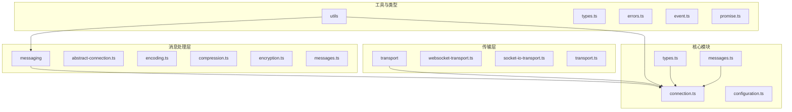
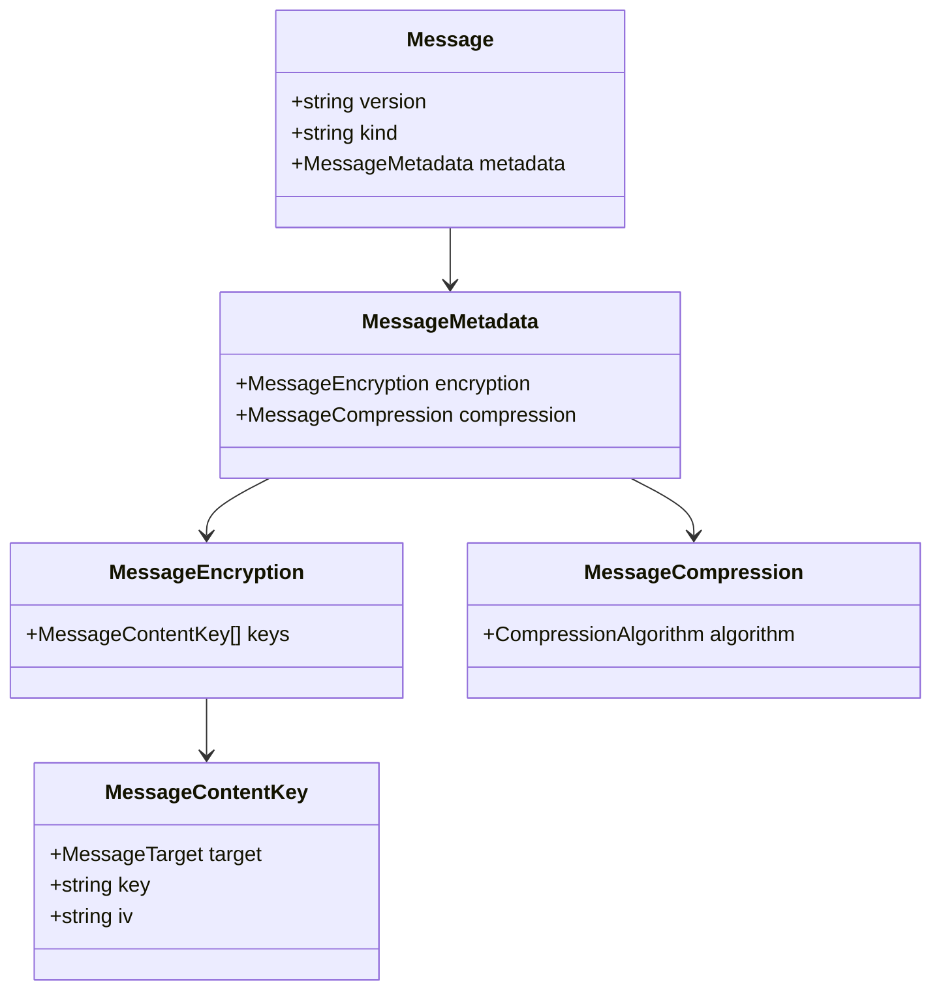
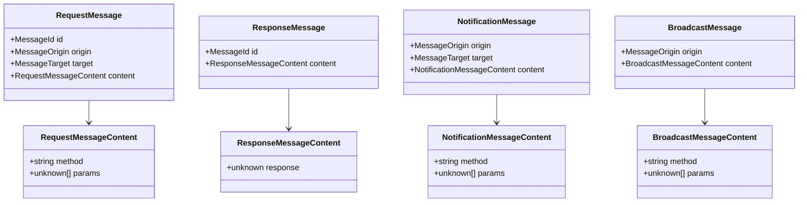
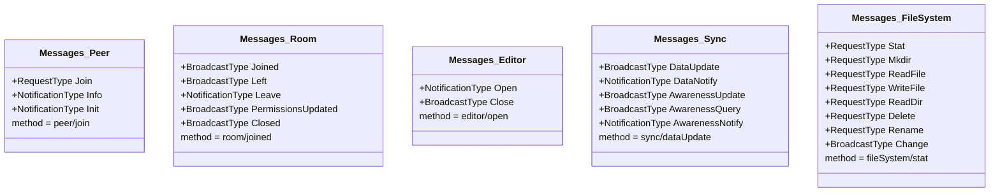
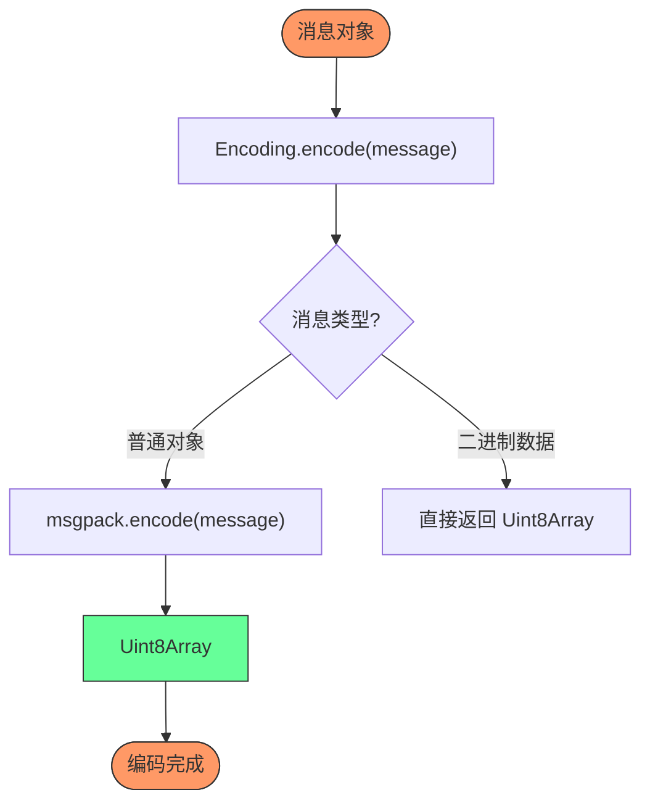
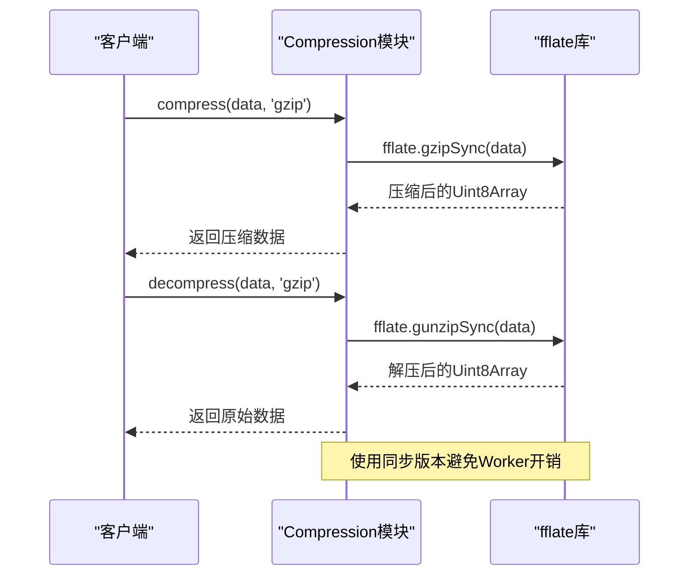
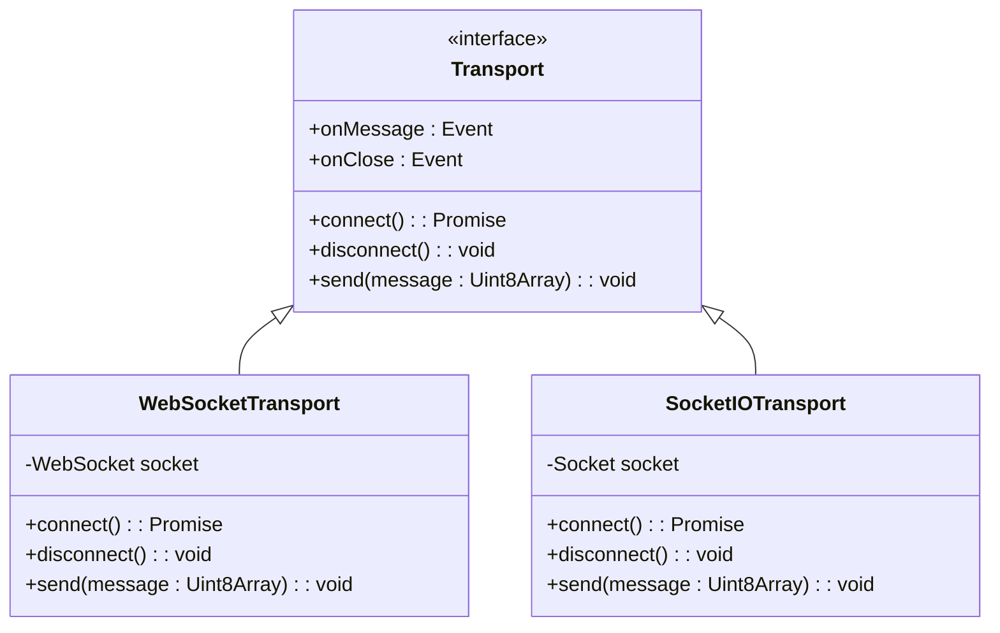
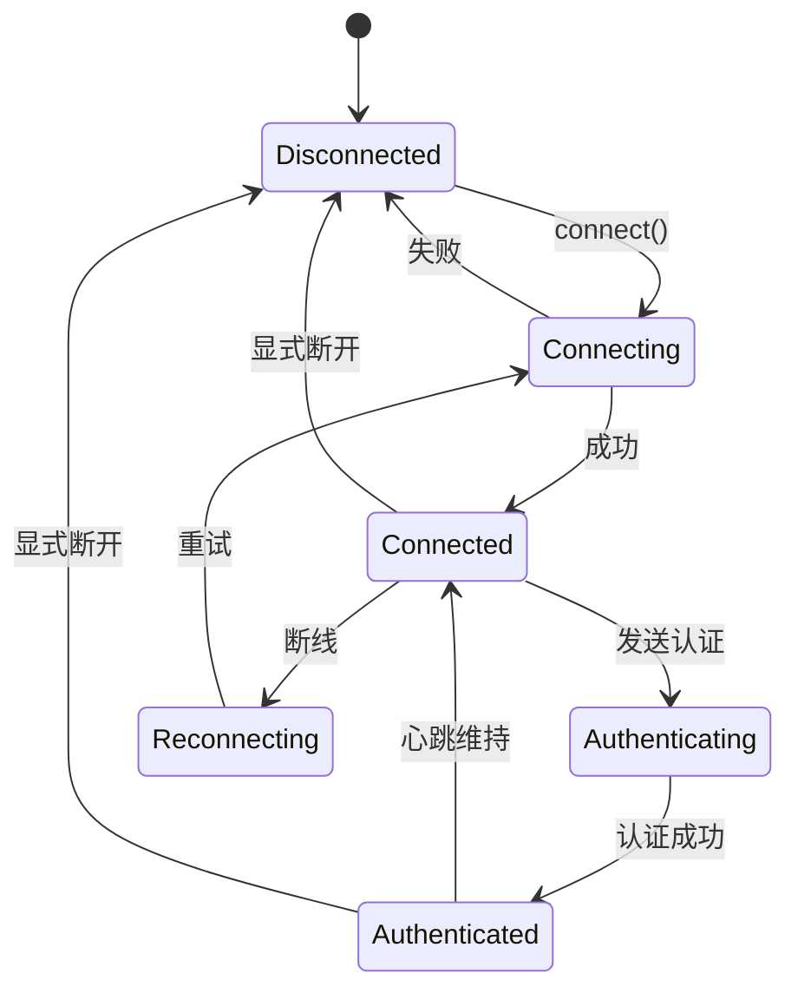
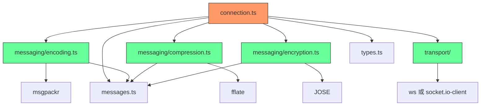

# 协议规范


## 简介
开放协作协议（Open Collaboration Protocol）是一个用于实现实时共享IDE内容的通信协议，旨在通过开放技术提升远程团队协作效率。该协议定义了客户端与服务器之间交互的消息格式、序列化机制、传输层适配及安全特性。本规范文档详细说明协议的核心实现，包括消息结构、编码方式、压缩与加密机制、连接生命周期管理以及传输层实现差异，为第三方开发者提供构建兼容客户端的完整指南。

## 项目结构
`open-collaboration-protocol` 模块是整个协作系统的核心通信层，采用分层架构设计，主要包含以下目录：

- **messaging**: 消息处理核心，包含消息定义、编码、压缩、加密等逻辑
- **transport**: 传输层适配器，支持 WebSocket 和 Socket.IO 两种通信方式
- **utils**: 工具函数库，提供类型检查、事件处理、错误管理等通用功能
- **根目录**: 包含连接管理、配置、主入口及核心类型定义

该结构实现了关注点分离，将协议逻辑与传输机制解耦，便于扩展和维护。




## 核心组件
协议的核心组件围绕消息通信构建，主要包括：

- **消息系统**: 定义请求、响应、通知、广播四种消息类型
- **编码机制**: 使用 MessagePack 进行高效二进制序列化
- **压缩支持**: 基于 fflate 库实现 Gzip 压缩
- **加密能力**: 支持基于密钥的内容加密
- **传输适配**: 提供 WebSocket 和 Socket.IO 两种传输实现
- **连接管理**: 处理连接建立、认证、心跳与重连

这些组件共同构成了一个高效、安全、可扩展的实时通信协议。

## 架构概述
开放协作协议采用分层通信架构，从下至上分为传输层、编码层、消息层和应用层。客户端与服务器通过传输层建立持久连接，所有通信均以结构化消息形式进行，经过编码、压缩、加密处理后传输。

```mermaid
graph TB
subgraph "客户端"
C1[应用层]
C2[消息层]
C3[编码/压缩/加密]
C4[传输层]
end
subgraph "服务器"
S1[应用层]
S2[消息层]
S3[编码/压缩/加密]
S4[传输层]
end
C4 < --> |WebSocket 或 Socket.IO| S4
C3 < --> |MessagePack + Gzip + AES| S3
C2 < --> |请求/响应/通知/广播| S2
C1 < --> |协作操作| S1
style C1 fill:#f9f,stroke:#333
style S1 fill:#f9f,stroke:#333
style C2 fill:#bbf,stroke:#333
style S2 fill:#bbf,stroke:#333
style C3 fill:#ffcc00,stroke:#333
style S3 fill:#ffcc00,stroke:#333
style C4 fill:#9f9,stroke:#333
style S4 fill:#9f9,stroke:#333
```


## 详细组件分析

### 消息格式分析
协议定义了统一的消息结构，所有通信均遵循此格式：




#### 消息类型系统
协议支持四种消息类型，通过 `kind` 字段区分：




### 消息类型定义
`Messages` 命名空间定义了所有具体的协作消息类型，按功能模块组织：




### 编码与序列化机制
协议使用 MessagePack 进行高效二进制序列化，显著减少网络传输数据量：




### 压缩机制分析
协议支持可配置的压缩算法，当前实现 Gzip 压缩：




### 传输层实现
协议提供两种传输适配器，均实现统一的传输接口：




### 连接生命周期管理
连接管理模块负责处理完整的连接生命周期：




## 依赖分析
协议的依赖关系清晰分层，确保各组件职责明确：




## 性能考虑
协议在设计上充分考虑性能优化：

- **高效序列化**: 采用 MessagePack 而非 JSON，减少 50-75% 的数据大小
- **选择性压缩**: 小消息不压缩，大消息使用 Gzip 同步压缩避免线程阻塞
- **二进制传输**: 所有消息以二进制形式传输，避免 Base64 编码开销
- **连接复用**: 单个持久连接传输所有消息，减少连接开销
- **增量更新**: 文档同步采用增量更新而非全量传输

这些优化确保了低延迟、高吞吐的实时协作体验。

## 故障排除指南
常见问题及解决方案：

### 连接失败
- **检查网络**: 确保客户端能访问服务器地址
- **验证传输方式**: 确认服务器支持 WebSocket 或 Socket.IO
- **检查认证**: 确保提供有效的 roomToken 和 loginToken

### 消息丢失
- **检查序列化**: 验证消息对象可被 MessagePack 正确序列化
- **检查压缩**: 确认两端使用兼容的压缩算法
- **查看日志**: 启用调试日志查看消息收发详情

### 性能问题
- **监控消息大小**: 避免单条消息过大
- **优化压缩**: 对于小消息（<1KB）建议禁用压缩
- **检查加密开销**: 加密会增加计算负担，根据安全需求权衡

## 结论
开放协作协议提供了一个完整、高效、安全的实时协作通信解决方案。通过清晰的分层架构、灵活的传输适配、高效的编码压缩机制，为构建跨平台的协作工具奠定了坚实基础。第三方开发者可基于此协议实现兼容的客户端，接入现有的协作生态系统。