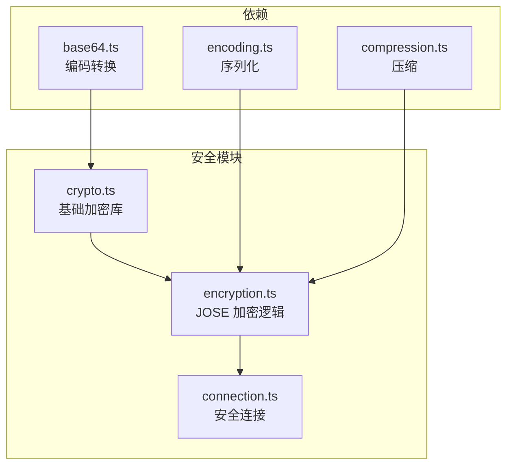
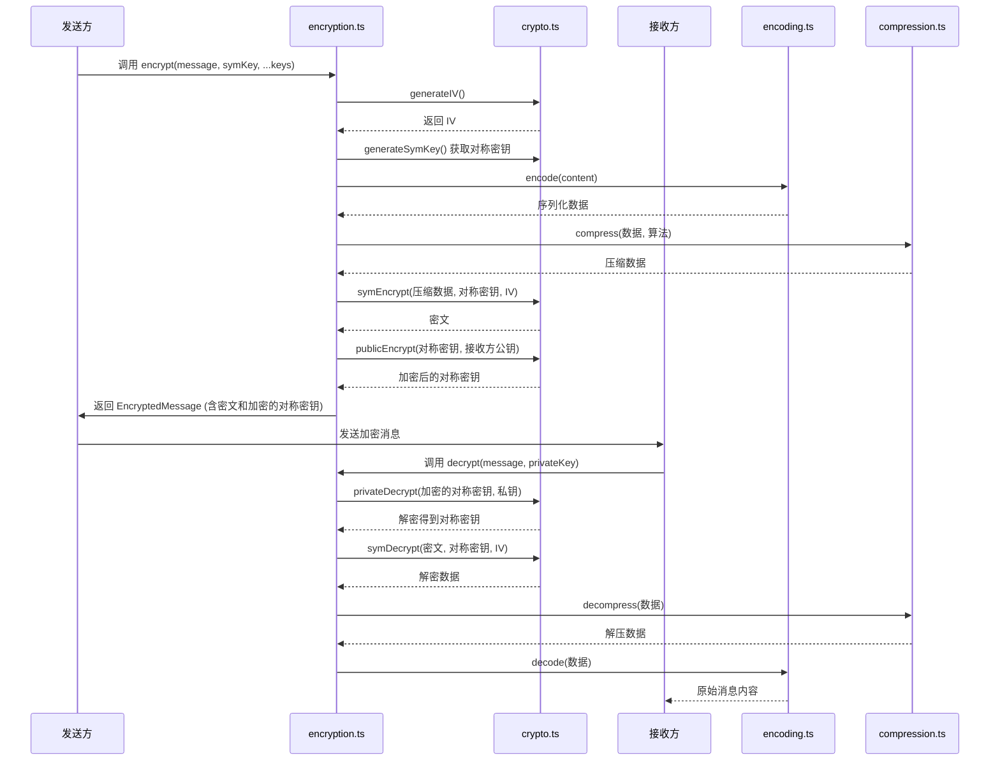
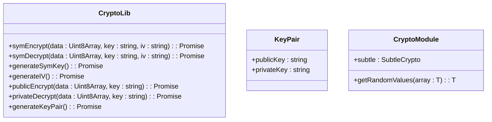
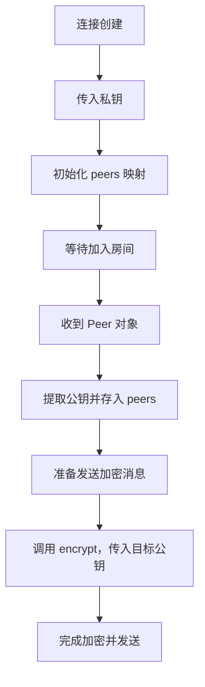

# 安全特性


## 简介
本文件系统性地文档化了协作工具协议中的安全机制，重点分析基于 JOSE（JSON Object Signing and Encryption）标准实现的端到端与通道加密体系。文档详细阐述了 `encryption.ts`、`crypto.ts` 和 `connection.ts` 三个核心模块如何协同工作，构建起完整的加密通信链路。内容涵盖加密原语、密钥交换流程、消息签名与解密逻辑、安全上下文集成、完整性校验及性能考量，旨在为开发者提供全面的安全实现指南。

## 项目结构
项目采用模块化设计，安全功能主要集中在 `open-collaboration-protocol` 包中。`messaging` 子目录负责消息的加密/解密，`utils` 提供底层加密原语，`connection` 模块则将安全上下文与连接生命周期集成。



## 核心安全组件
系统安全架构由三个核心组件构成：`crypto.ts` 提供基础加密原语，`encryption.ts` 实现 JOSE 标准的加密封装，`connection.ts` 将加密能力集成到通信连接中。

## 加密机制详解
### JOSE 标准实现
`encryption.ts` 模块实现了类 JOSE 的加密标准，采用“信封加密”（Envelope Encryption）模式，结合对称加密与非对称加密的优势。

#### 加密流程


#### 加密函数分析
`encrypt` 函数是核心入口，其工作流程如下：
1. **获取对称密钥**：从 `EncryptionKey.symmetricKey` 获取 Promise 形式的对称密钥。
2. **序列化与压缩**：使用 `Encoding.encode` 序列化消息内容，再根据接收方支持的压缩算法进行压缩。
3. **生成 IV**：调用 `generateIV()` 生成随机初始化向量。
4. **对称加密**：使用 `symEncrypt` 函数（基于 AES-CBC）加密压缩后的数据。
5. **加密对称密钥**：使用每个接收方的公钥通过 `publicEncrypt`（基于 RSA-OAEP）加密对称密钥。
6. **构建消息**：将加密后的对称密钥（含目标 ID 和 IV）放入元数据，密文作为内容。

### 基础加密原语
`crypto.ts` 模块通过 Web Crypto API 提供底层加密能力。

#### CryptoLib 接口


#### 算法实现
- **对称加密**：使用 `AES-CBC` 算法，密钥长度 256 位。
- **非对称加密**：使用 `RSA-OAEP` 算法，模数长度 4096 位，哈希函数 SHA-256。
- **密钥生成**：`generateSymKey` 生成 AES 密钥，`generateKeyPair` 生成 RSA 密钥对。
- **IV 生成**：`generateIV` 使用 `crypto.getRandomValues` 生成 16 字节随机 IV。

## 密钥管理与交换
### 密钥对生成
系统通过 `generateKeyPair()` 函数为每个对等节点（Peer）生成唯一的 RSA 密钥对。私钥由节点本地安全存储，公钥则通过 `Peer` 对象的元数据在加入房间时广播给其他成员。

### 信封加密
采用信封加密策略，确保高效性与安全性：
- **会话密钥**：为每次通信或会话生成临时的 AES 对称密钥（`symmetricKey`）。
- **密钥分发**：使用接收方的 RSA 公钥加密该对称密钥，并随消息一同发送。
- **密钥缓存**：`EncryptionKey.cache` 字段允许缓存已加密的对称密钥，避免为同一接收方重复加密，提升性能。

## 连接生命周期中的安全集成
`connection.ts` 模块通过 `ProtocolBroadcastConnectionImpl` 类将加密机制无缝集成到连接的整个生命周期中。

### 安全上下文初始化
在创建连接时，通过 `ProtocolBroadcastConnectionOptions` 传入节点的私钥，作为解密消息的凭证。

### 对等节点管理
`ProtocolBroadcastConnectionImpl` 维护一个 `peers` 映射，存储所有已知对等节点的 `Peer` 对象。这些对象包含其公钥和压缩支持信息，是加密消息时查找接收方公钥的基础。



### 公钥检索
`getPublicKey` 和 `getPublicKeys` 方法是加密流程的关键桥梁。当需要向特定目标或所有成员发送消息时，连接层会调用这些方法，从 `peers` 映射中获取对应的 `AsymmetricKey` 信息（含公钥），供 `encryption.ts` 使用。

## 消息完整性与防重放攻击
### 消息完整性
虽然当前实现主要依赖加密保证机密性，但通过以下机制间接保障完整性：
- **加密算法**：`AES-CBC` 模式本身对数据篡改敏感，解密时若数据被修改，通常会导致解密失败或产生乱码。
- **序列化/反序列化**：`Encoding.decode` 在反序列化时会进行格式校验，无效数据将导致解析错误。

### 防重放攻击
当前代码未显式实现防重放机制（如时间戳、序列号）。其安全性依赖于：
- **IV 随机性**：每次加密生成的随机 IV 确保了即使相同消息，密文也完全不同，增加了重放攻击的难度。
- **应用层协议**：上层应用（如 YJS 协作）可能有自己的状态同步和冲突解决机制，能识别并处理重复或过时的消息。

## 性能影响与配置示例
### 性能考量
- **CPU 开销**：RSA-OAEP 加解密（非对称）计算密集，是主要性能瓶颈。AES-CBC（对称）相对高效。
- **延迟**：加密/解密过程引入额外延迟，尤其在弱客户端设备上。
- **带宽**：压缩可显著减少带宽占用，但增加了 CPU 开销。系统通过 `Compression.bestFit` 协商最优算法。

### 配置示例
```typescript
// 初始化加密模块
import { setCryptoModule } from 'open-collaboration-protocol';

// 在浏览器中
setCryptoModule(window.crypto);

// 在 Node.js 中
// setCryptoModule(require('node:crypto').webcrypto);

// 创建连接并启用加密
const keyPair = await Encryption.generateKeyPair();
const connection = createConnection({
    privateKey: keyPair.privateKey,
    transport: websocketTransport
});

// 发送加密消息 (内部自动处理)
await connection.sync.dataUpdate(targetPeerId, binaryData);
```

## 开发者安全最佳实践
### 密钥管理
- **私钥安全**：严格保护私钥，切勿硬编码或通过不安全渠道传输。建议使用安全存储（如浏览器的 Keychain 或 Node.js 的环境变量）。
- **密钥轮换**：定期轮换密钥对以降低长期风险。

### 证书配置
- **公钥验证**：在生产环境中，应实现公钥验证机制（如数字证书），防止中间人攻击。
- **信任链**：建立可信的对等节点列表或使用中心化认证服务。

### 漏洞防范
- **初始化检查**：确保在调用 `getCryptoLib()` 前已调用 `setCryptoModule()`，避免运行时错误。
- **错误处理**：妥善处理加密/解密失败，避免信息泄露。
- **未来增强**：考虑增加显式的消息签名（HMAC）和防重放机制（如 nonce）以提升安全性。