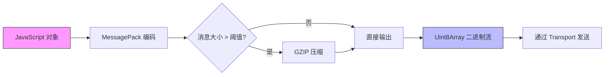

# 序列化与编码机制


## 简介
本文件深入阐述协作协议中的序列化与编码机制，重点分析 `encoding.ts`、`compression.ts` 和 `base64.ts` 模块如何协同工作，将 JavaScript 对象高效转换为可传输的二进制字节流。文档涵盖从对象到二进制的完整转换流程，包括 MessagePack 编码、可选压缩及 Base64 编码的应用场景，并提供性能优化建议和开发者使用指南。

## 项目结构概览
项目采用模块化设计，核心协议逻辑位于 `packages/open-collaboration-protocol` 包中。序列化相关功能集中于 `src/messaging` 和 `src/utils` 目录：

```
open-collaboration-protocol/
├── src/
│   ├── messaging/
│   │   ├── encoding.ts        # MessagePack 编码
│   │   ├── compression.ts     # 消息压缩
│   │   └── ...
│   └── utils/
│       └── base64.ts          # Base64 编解码
```

该结构清晰分离了编码、压缩与传输逻辑，便于维护和扩展。

## 核心编码流程
系统采用分层处理模型实现高效数据传输：
1. **编码**：使用 MessagePack 将 JS 对象序列化为紧凑二进制格式
2. **压缩**（可选）：对大消息进行 GZIP 压缩以减少带宽占用
3. **传输编码**：在特定场景下使用 Base64 编码以兼容文本协议

此流程确保了高性能与广泛兼容性的平衡。

## MessagePack 编码机制
`encoding.ts` 模块利用 `msgpackr` 库实现高效的二进制序列化。

### 功能实现
```ts
export namespace Encoding {
    export function encode(message: unknown): Uint8Array {
        return msgpack.encode(message);
    }
    export function decode(data: Uint8Array): unknown {
        return msgpack.decode(data);
    }
}
```

- **encode**: 接收任意 JS 对象并返回 `Uint8Array` 二进制数据
- **decode**: 将二进制数据还原为原始对象结构

### 与 JSON 的对比优势
| 特性 | JSON | MessagePack |
|------|------|-------------|
| **体积效率** | 文本格式，冗余较多 | 二进制格式，空间节省 30%-50% |
| **解析速度** | 需要字符串解析 | 直接二进制读取，更快 |
| **类型支持** | 有限（无 Uint8Array 等） | 支持二进制、日期等扩展类型 |
| **带宽消耗** | 较高 | 显著降低 |

## 压缩模块实现
`compression.ts` 模块集成 `fflate` 库提供动态压缩能力。

### 压缩算法支持
```ts
export type Algorithm = 'none' | 'gzip' | (string & {});
```
当前支持 `gzip` 算法，设计上允许扩展其他算法。

### 压缩触发逻辑
- **同步压缩**：使用 `gzipSync` / `gunzipSync` 避免 Worker 开销
- **适用场景**：消息体较大时（通常 > 1KB），避免主线程阻塞
- **性能权衡**：小消息压缩收益低且增加 CPU 开销，建议设置阈值控制

### 算法协商机制
`bestFit` 函数实现客户端-服务器压缩算法协商：
```ts
export function bestFit(algs: Algorithm[][]): Algorithm
```
通过比较双方支持的算法列表，选择最优匹配方案。

### 压缩/解压接口
```ts
export async function compress(data: Uint8Array, alg: Algorithm): Promise<Uint8Array>
export async function decompress(data: Uint8Array, alg: Algorithm): Promise<Uint8Array>
```
返回 `Promise` 保持接口一致性，实际调用同步版本提升性能。

## Base64 编解码支持
`base64.ts` 提供跨平台的 Base64 编解码工具。

### 实现细节
```ts
export function fromBase64(data: string): Uint8Array
export function toBase64(data: Uint8Array): string
```
- **Node.js 环境**：使用 `Buffer` 实现
- **浏览器环境**：使用 `base64-js` 库替代

### 使用场景
- **配置传输**：在文本协议（如 HTTP Headers）中安全传输二进制配置
- **调试日志**：将二进制消息转为可读字符串便于分析
- **兼容性需求**：对接仅支持文本的旧系统

## 完整序列化链路分析
从消息对象到最终传输字节流的完整转换路径如下：




## 性能对比与优化建议
### 性能测试建议
| 测试项 | 推荐方法 |
|-------|---------|
| **序列化速度** | 使用 `performance.now()` 对 1000+ 次 encode/decode 计时 |
| **压缩率** | 对不同大小消息（1KB, 10KB, 100KB）测试压缩前后体积 |
| **内存占用** | Chrome DevTools Memory Profiler 监控 ArrayBuffer 分配 |

### 优化建议
1. **批量编码**：合并多个小消息一次性编码，减少函数调用开销
2. **压缩阈值**：设置合理阈值（如 2KB），避免小消息压缩负优化
3. **预分配缓冲区**：对固定结构消息使用结构化克隆或自定义编码器
4. **连接复用**：保持长连接减少握手开销

## API 使用示例
### 基础编码/解码
```ts
import { Encoding } from './messaging/encoding';

const message = { type: 'update', content: 'Hello', version: 1 };
const binary = Encoding.encode(message);
const restored = Encoding.decode(binary);
```

### 带压缩的完整流程
```ts
import { Encoding } from './messaging/encoding';
import { Compression } from './messaging/compression';

async function sendWithCompression(data: unknown, algorithm: Compression.Algorithm) {
    const encoded = Encoding.encode(data);
    if (encoded.length > 2048) { // 大于 2KB 才压缩
        return await Compression.compress(encoded, algorithm);
    }
    return encoded;
}
```

### 配置传输中的 Base64 使用
```ts
import { toBase64, fromBase64 } from './utils/base64';

// 发送端
const configBinary = Encoding.encode(config);
const configBase64 = toBase64(configBinary);
// 通过 HTTP Header 发送 configBase64

// 接收端
const receivedBinary = fromBase64(configBase64);
const receivedConfig = Encoding.decode(receivedBinary);
```

## 结论
本系统通过 `MessagePack + 可选压缩 + Base64` 的分层编码策略，在性能、带宽和兼容性之间取得了良好平衡。`encoding.ts` 提供高效二进制序列化，`compression.ts` 实现智能压缩决策，`base64.ts` 确保跨环境兼容性。开发者应根据消息大小和传输场景合理选择编码组合，并通过批量处理等优化手段进一步提升性能。