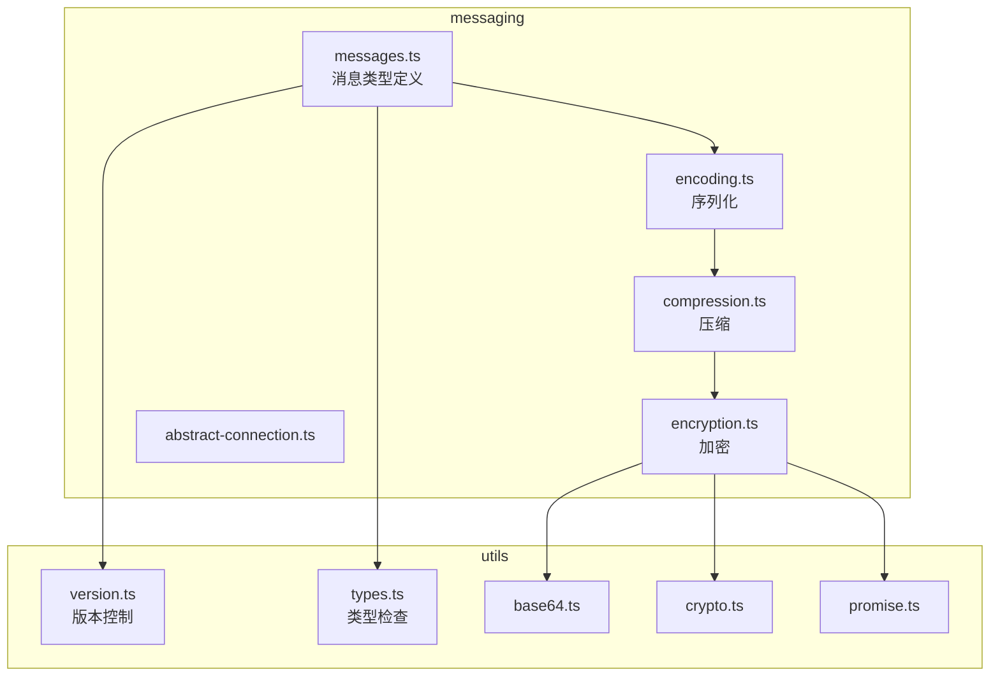
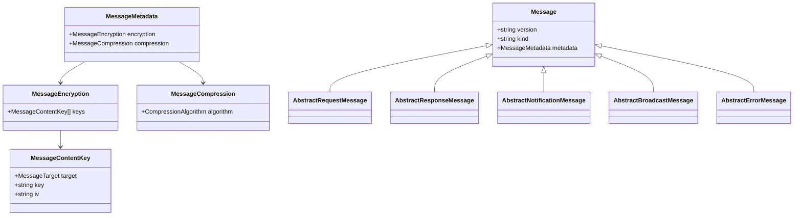
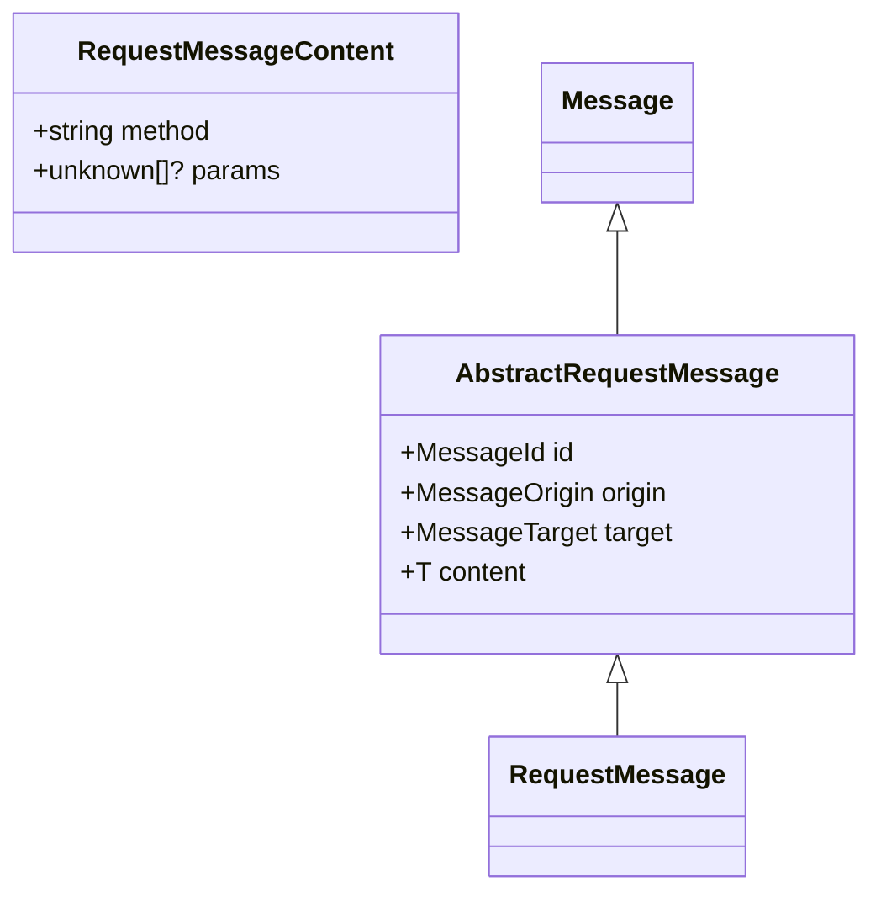
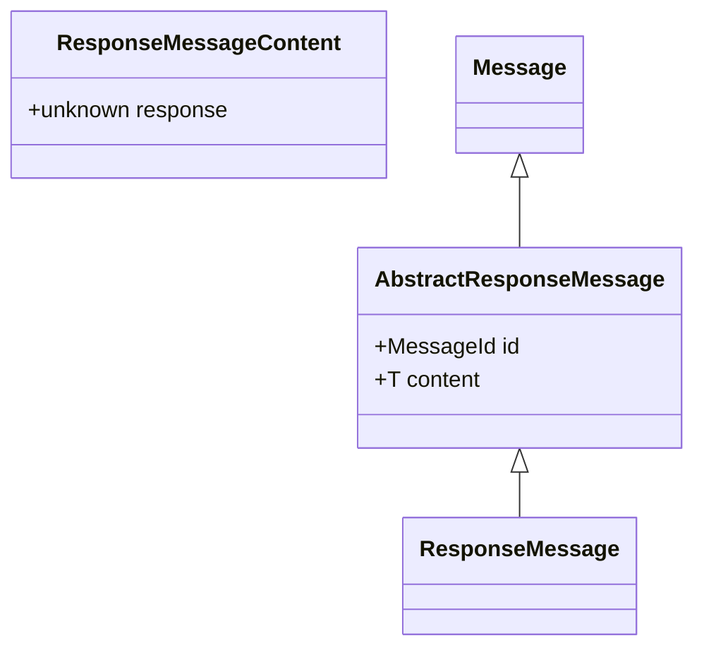
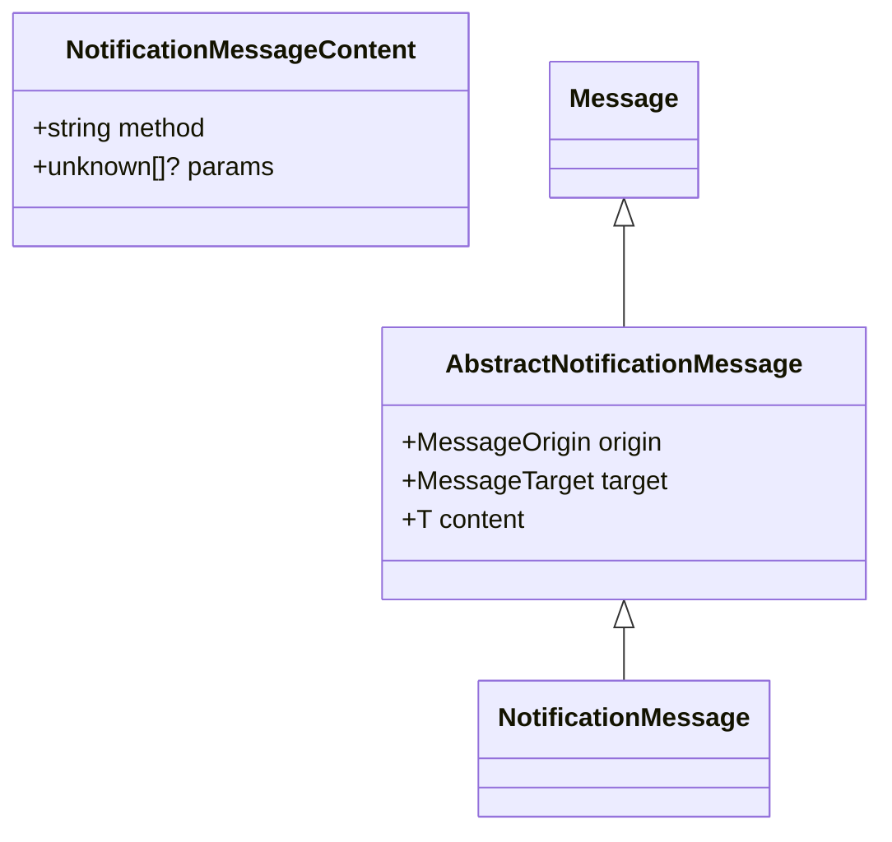
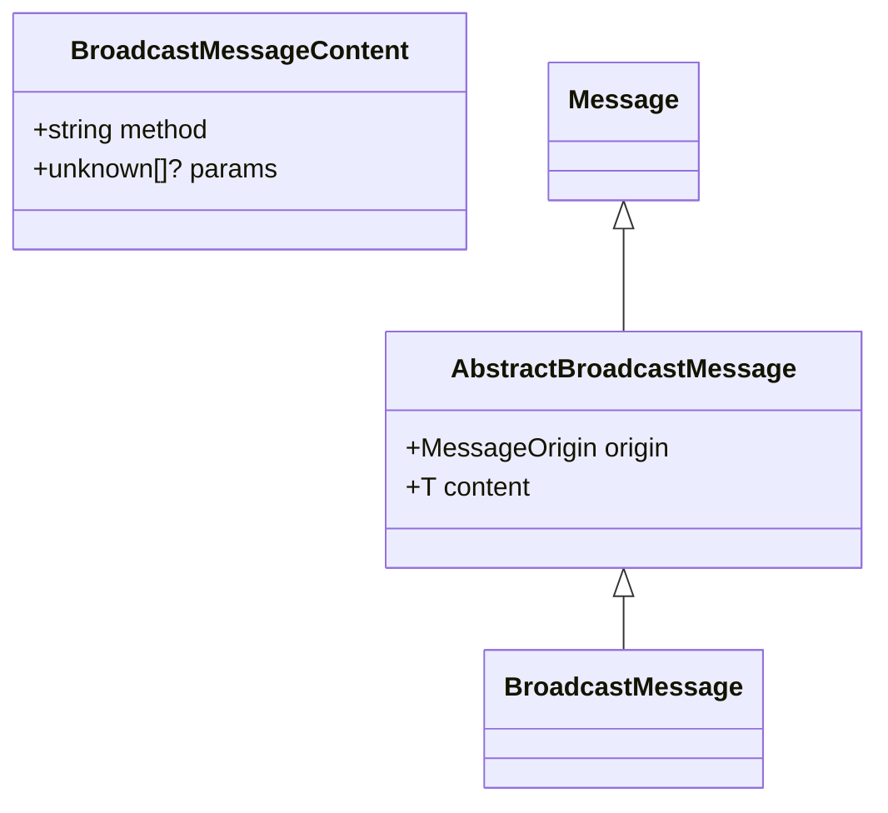
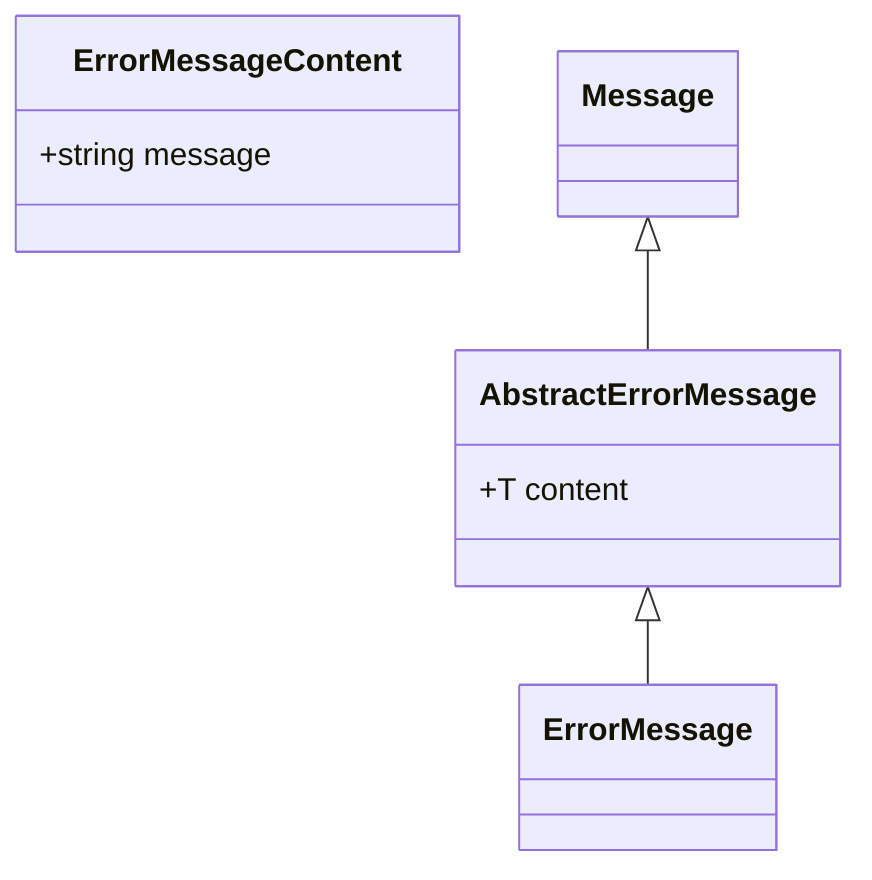
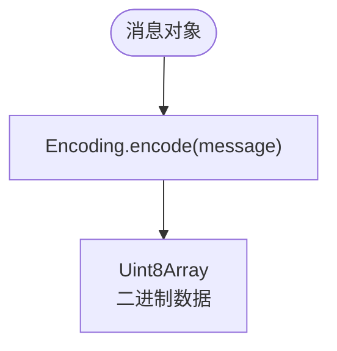
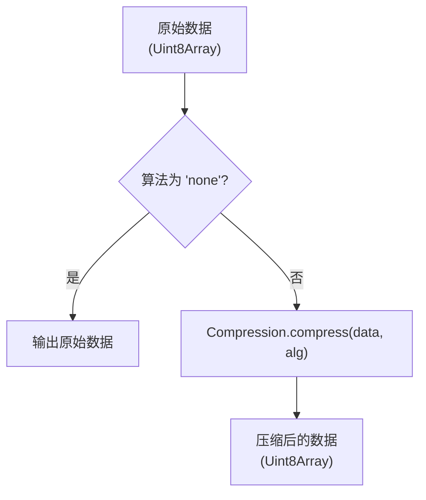
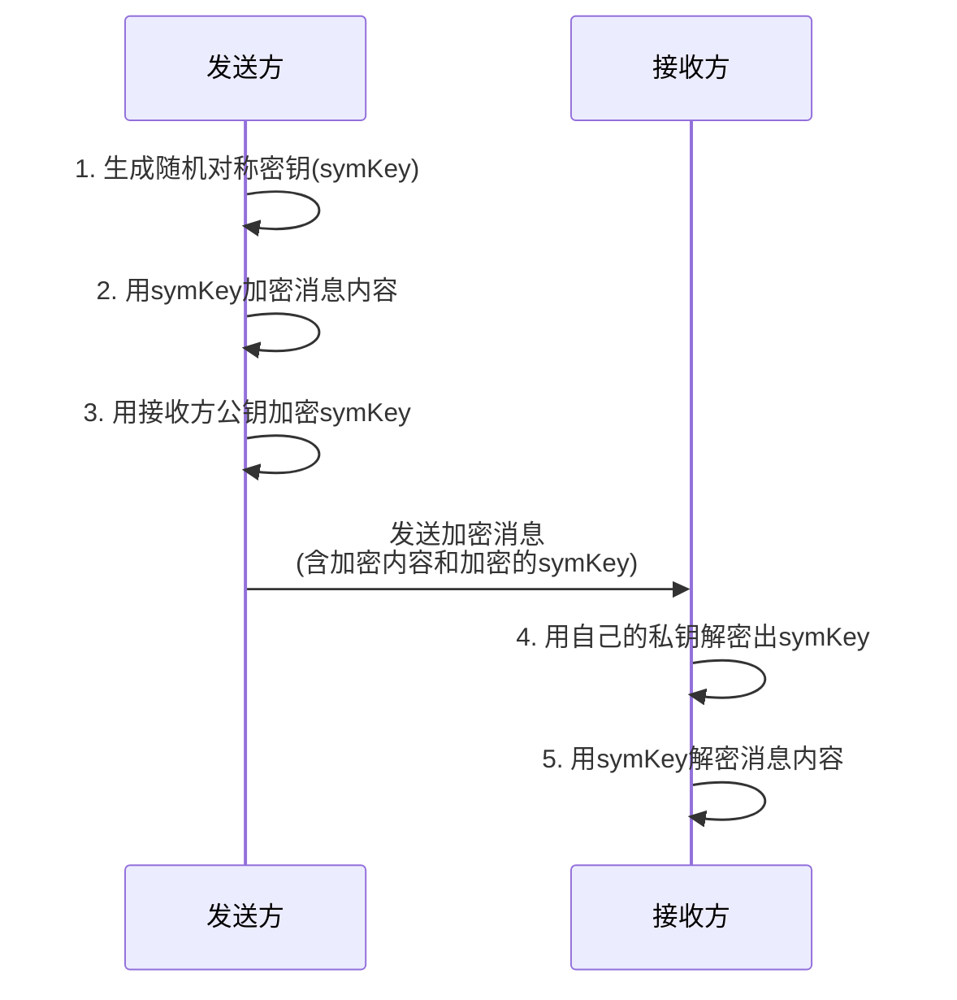

# 消息格式规范


## 简介
本规范详细描述了 `open-collaboration-protocol` 协议中的消息格式设计，涵盖消息的通用结构、各类消息类型（请求、响应、通知、广播等）的字段定义、数据类型与语义含义。文档基于 `messages.ts` 中的 TypeScript 接口定义，解释了消息的继承与扩展机制，并结合 `version.ts`、`encoding.ts`、`compression.ts` 和 `encryption.ts` 文件说明了版本控制、序列化、压缩与加密等关键机制。目标是为开发者提供构建、解析和调试协作消息的完整技术参考。

## 项目结构
`open-collaboration-protocol` 是协作系统的核心通信协议包，其主要功能模块位于 `src/messaging` 目录下。该模块负责定义消息格式、处理编码、压缩和加密等底层通信细节。



## 核心消息结构
所有消息都遵循一个统一的基类结构 `Message`，该接口定义了所有消息共有的字段。



### 字段定义
- **version**: `string` - 协议版本号，用于版本兼容性检查。
- **kind**: `string` - 消息类型，如 `'request'`、`'response'`、`'notification'`、`'broadcast'` 或 `'error'`。
- **metadata**: `MessageMetadata` - 包含加密和压缩元数据的对象。
  - **metadata.encryption**: `MessageEncryption` - 加密信息。
    - **keys**: `MessageContentKey[]` - 一个或多个加密密钥条目。
      - **target**: `MessageTarget` - 密钥的目标接收者 ID（字符串或 undefined）。
      - **key**: `string` - 使用接收者公钥加密的对称密钥（Base64 编码）。
      - **iv**: `string` - 对称加密的初始化向量（Base64 编码）。
  - **metadata.compression**: `MessageCompression` - 压缩信息。
    - **algorithm**: `CompressionAlgorithm` - 使用的压缩算法，如 `'none'` 或 `'gzip'`。

## 消息类型详解
协议定义了五种主要的消息类型，它们都继承自 `Message` 接口。

### 请求消息 (Request)
`AbstractRequestMessage<T>` 用于发起一个需要回复的远程调用。



#### 字段定义
- **id**: `number | string` - 请求的唯一标识符，用于匹配响应。
- **origin**: `string` - 发起请求的对等方（peer）ID。
- **target**: `string | undefined` - 请求的目标对等方 ID。
- **content**: `RequestMessageContent` - 请求内容。
  - **method**: `string` - 要调用的方法名。
  - **params**: `unknown[]` - 方法参数数组。

### 响应消息 (Response)
`AbstractResponseMessage<T>` 用于回复一个请求。



#### 字段定义
- **id**: `number | string` - 对应请求的 ID。
- **content**: `ResponseMessageContent` - 响应内容。
  - **response**: `unknown` - 方法调用的返回值。

### 通知消息 (Notification)
`AbstractNotificationMessage<T>` 用于发送一个无需回复的单向消息。



#### 字段定义
- **origin**: `string` - 发送通知的对等方 ID。
- **target**: `string | undefined` - 通知的目标对等方 ID。
- **content**: `NotificationMessageContent` - 通知内容。
  - **method**: `string` - 要触发的事件或方法名。
  - **params**: `unknown[]` - 传递的参数。

### 广播消息 (Broadcast)
`AbstractBroadcastMessage<T>` 用于向房间内的所有对等方发送消息。



#### 字段定义
- **origin**: `string` - 发送广播的对等方 ID。
- **content**: `BroadcastMessageContent` - 广播内容。
  - **method**: `string` - 广播事件名。
  - **params**: `unknown[]` - 事件参数。

### 错误消息 (Error)
`AbstractErrorMessage<T>` 用于报告错误。



#### 字段定义
- **content**: `ErrorMessageContent` - 错误内容。
  - **message**: `string` - 错误描述信息。

## 序列化与编码机制
消息在传输前需要被序列化为二进制数据。该协议使用 `msgpackr` 库进行高效的二进制序列化。



### 实现细节
`encoding.ts` 文件中的 `Encoding` 命名空间提供了两个核心函数：
- **encode(message: unknown)**: 将任意 JavaScript 对象（如消息）编码为 `Uint8Array`。
- **decode(data: Uint8Array)**: 将 `Uint8Array` 解码回原始的 JavaScript 对象。

## 压缩与加密机制
为了优化网络传输和保障数据安全，协议支持可选的压缩和端到端加密。

### 压缩机制


`compression.ts` 实现了基于 `fflate` 库的压缩。目前支持 `'gzip'` 算法。`bestFit` 函数用于在通信双方协商出最优的压缩算法。

### 加密机制
加密流程较为复杂，涉及对称加密和非对称加密的结合。



`encryption.ts` 中的 `encrypt` 函数执行以下步骤：
1.  生成一个随机的对称密钥（AES）。
2.  使用该对称密钥和随机 IV 加密消息内容。
3.  使用每个目标接收者的公钥加密这个对称密钥。
4.  将加密后的对称密钥、IV 和目标 ID 存入 `metadata.encryption.keys`。
5.  将加密后的内容放入 `content` 字段，并将 `content` 类型变为 `Uint8Array`。

`decrypt` 函数则执行相反的步骤。

## 版本控制与兼容性
协议的版本号定义在 `version.ts` 文件中，并通过 `compatibleVersions` 函数检查兼容性。

### 版本号
- **VERSION**: `string` - 当前协议版本，定义为 `'0.3.1'`。
- **SEM_VERSION**: `SemVer` - 基于 `semver` 库的版本对象。

### 兼容性规则
`compatibleVersions` 函数根据以下规则判断两个版本是否兼容：
- 如果主版本号（major）不同，则**不兼容**。
- 如果主版本号都为 `0`（即 `0.x` 范围），则需要**次版本号（minor）相同**才兼容。
- 如果主版本号大于等于 `1`，则只要主版本号相同，即认为兼容（允许次版本号不同）。

此规则意味着在 `0.x` 版本阶段，任何次版本更新都可能引入不兼容的变更，而在 `1.x` 及以上版本，次版本更新保证向后兼容。

## 实际消息示例
以下是一个未加密的文档更新广播消息的 JSON 表示形式。

### 序列化前 (JavaScript 对象)
```json
{
  "version": "0.3.1",
  "kind": "broadcast",
  "metadata": {
    "encryption": {
      "keys": []
    },
    "compression": {
      "algorithm": "none"
    }
  },
  "origin": "user-123",
  "content": {
    "method": "document/update",
    "params": [
      "doc-456",
      { "ops": [ /* Yjs 操作 */ ] }
    ]
  }
}
```

### 序列化后 (传输中的二进制数据)
在实际传输中，上述 JSON 对象会被 `msgpack.encode` 转换为一个紧凑的 `Uint8Array` 二进制流。其内容是二进制的，无法直接阅读，但比 JSON 更小、更快。

## 开发者使用指南
### 构建消息
可以使用 `messages.ts` 中提供的 `create` 工具函数来创建消息。

```typescript
import { BroadcastMessage, BroadcastType } from './messages';

// 定义广播类型
const DOCUMENT_UPDATE = new BroadcastType('document/update');

// 创建广播消息
const message = BroadcastMessage.create(
  DOCUMENT_UPDATE, // 或直接使用字符串 'document/update'
  'user-123',      // origin
  ['doc-456', updateData] // params
);
```

### 解析消息
使用 `is` 系列函数进行类型检查和安全解析。

```typescript
import { Message, BroadcastMessage } from './messages';

function handleMessage(data: unknown) {
  if (!Message.is(data)) {
    console.error('无效的消息格式');
    return;
  }

  if (BroadcastMessage.is(data)) {
    console.log(`收到广播: ${data.content.method}`);
    // 处理 data.content.params
  } else if (RequestMessage.is(data)) {
    // 处理请求
  }
  // ... 其他类型
}
```

## 常见错误与调试
### 常见错误
1.  **字段缺失**: 忘记设置 `version`、`kind` 或 `metadata` 等必需字段。
2.  **类型错误**: 将 `id` 设置为 `null` 而不是 `number` 或 `string`，或将 `params` 设置为对象而非数组。
3.  **版本不兼容**: 客户端和服务器使用了不兼容的协议版本。
4.  **加密密钥错误**: 在解密时，`metadata.encryption.keys` 数组为空或长度不为1。

### 调试方法
1.  **日志记录**: 在发送和接收消息时，打印消息的 `kind` 和 `content.method` 字段。
2.  **类型守卫**: 务必使用 `Message.is()` 和 `XXXMessage.is()` 等函数验证接收到的数据，避免运行时错误。
3.  **检查版本**: 在连接建立时，立即交换并检查协议版本。
4.  **单元测试**: 为消息的创建和解析逻辑编写单元测试，确保其正确性。

