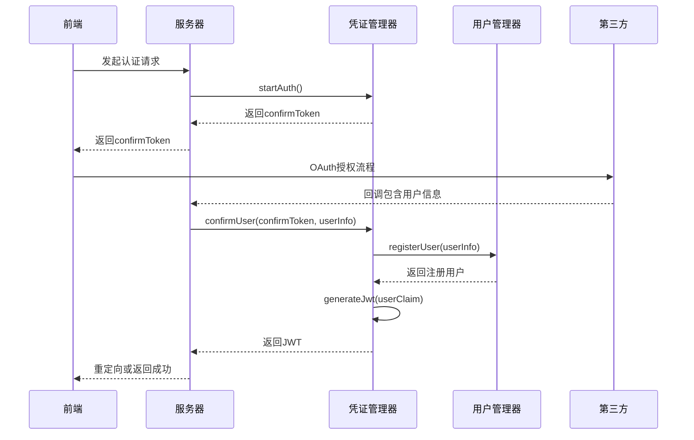
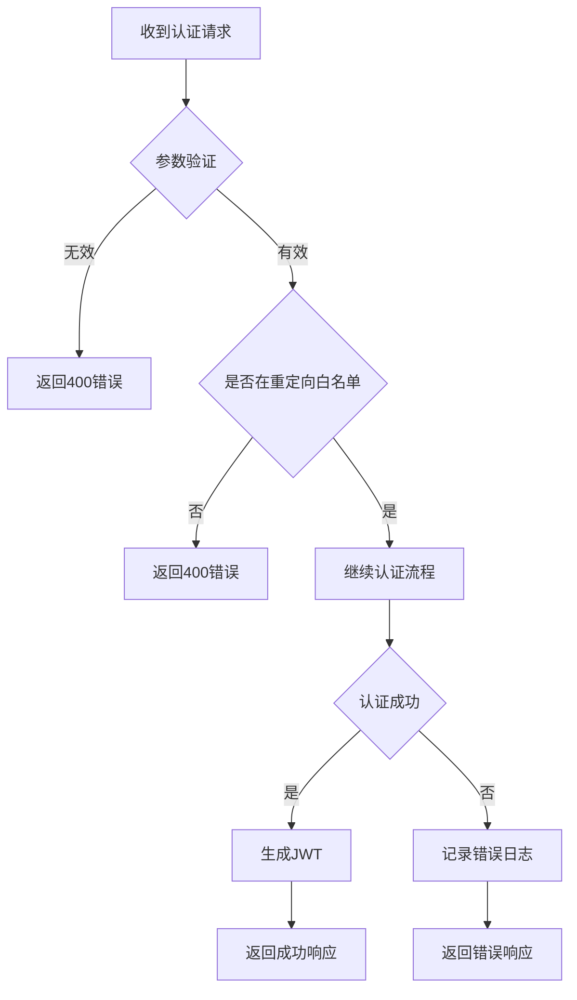

# 安全与认证

## 简介
本项目提供了一个协作式开发环境，支持多种安全认证方式，确保用户身份的合法性与通信的安全性。系统设计了灵活的认证架构，支持OAuth（GitHub/Google）、Keycloak集成以及简易登录三种主要认证方式。同时，系统实现了端到端的消息加密、房间访问控制和防滥用机制，保障协作过程中的数据安全。

由于种种原因，在实际开发过程中，主要使用简单认证方式。

## 项目结构
项目采用模块化设计，核心安全与认证功能分布在多个包中。`open-collaboration-server` 包含服务器端认证逻辑，`open-collaboration-protocol` 包含通信协议与加密机制。

## 核心认证机制

### 简易登录 (Simple Login)
简易登录提供了一种无需第三方身份提供商的快速认证方式，适用于开发和测试环境。用户通过提供用户名和可选邮箱进行登录。

**配置参数：**
- `oct-activate-simple-login`: 布尔值，启用简易登录功能
- 登录端点：`/api/login/simple`

### OAuth 认证 (GitHub/Google)（跳过）
OAuth 认证支持通过 GitHub 和 Google 账户进行安全登录，提供标准化的第三方身份验证流程。

**配置参数：**
- GitHub: `oct-oauth-github-clientid`, `oct-oauth-github-clientsecret`
- Google: `oct-oauth-google-clientid`, `oct-oauth-google-clientsecret`
- 登录端点：`/api/login/github`, `/api/login/google`

### Keycloak 集成（跳过）
Keycloak 集成提供了企业级的身份和访问管理解决方案，支持OpenID Connect协议。

**配置参数：**
- `keycloak-host`: Keycloak服务器地址
- `keycloak-realm`: Realm名称
- `keycloak-client-id`: 客户端ID
- `keycloak-client-secret`: 客户端密钥
- `keycloak-username-claim`: 用户名声明字段
- 登录端点：`/api/login/keycloak`

## 认证流程与Token管理

### Token生成与验证

系统使用JWT（JSON Web Token）进行用户身份验证和会话管理。凭证管理器负责Token的生成、验证和过期处理。

**主要功能：**

- 使用HS256算法签名JWT
- 支持自定义私钥或使用开发密钥
- 5分钟认证超时机制
- 安全的Token存储与传输

### 认证流程时序

完整的认证流程包括前端请求、服务器处理和Token生成三个阶段。



## 通信层加密机制

### 消息级加密实现
系统实现了端到端的消息加密，确保通信内容的机密性和完整性。

**加密特性：**
- 支持对称加密（AES）和非对称加密（RSA）
- 自动密钥管理与缓存
- 支持多种压缩算法
- 基于IV（初始化向量）的加密模式

### 加密API接口
加密模块提供了一套完整的API用于消息的加密和解密操作。

```typescript
namespace Encryption {
    // 密钥生成
    export function generateKeyPair(): Promise<KeyPair>
    export function generateSymKey(): Promise<string>
    export function generateIV(): Promise<string>
    
    // 加密操作
    export function symEncrypt(data: Uint8Array, key: string, iv: string): Promise<Uint8Array>
    export function publicEncrypt(data: Uint8Array, key: string): Promise<Uint8Array>
    export function encrypt(message: Message, symKey: EncryptionKey, ...keys: AsymmetricKey[]): Promise<EncryptedMessage>
    
    // 解密操作
    export function symDecrypt(data: Uint8Array, key: string, iv: string): Promise<Uint8Array>
    export function privateDecrypt(data: Uint8Array, key: string): Promise<Uint8Array>
    export function decrypt(message: EncryptedMessage, privateKey: DecryptionKey): Promise<Message>
}
```

## 凭证与访问控制

### 房间访问控制
系统通过Token机制实现房间级别的访问控制。每个协作房间都有独立的访问凭证，确保只有授权用户才能加入。

**控制策略：**
- 基于JWT的房间访问令牌
- 令牌有效期管理
- 用户身份与房间权限绑定
- 防止令牌泄露的缓存机制

### 凭证管理器
凭证管理器是整个安全体系的核心组件，负责协调认证流程和凭证生命周期管理。

**主要职责：**
- 管理待处理的认证请求
- 生成和验证JWT令牌
- 维护用户会话状态
- 处理认证超时和失败情况

### 敏感信息保护
系统提供了多种机制来保护敏感信息：

**环境变量管理：**
- `OCT_JWT_PRIVATE_KEY`: JWT私钥，应使用强随机字符串
- OAuth客户端密钥等敏感信息应通过环境变量配置
- 开发环境中会提示缺少私钥，生产环境必须配置

**安全警告：**
当未设置JWT私钥时，系统会记录警告：
```
OCT_JWT_PRIVATE_KEY env variable is not set. Using a static key for development purposes.
```

### 审计日志记录
系统实现了全面的日志记录机制，用于安全审计和故障排查。

**日志级别：**
- info: 记录成功的认证事件
- error: 记录认证失败和异常情况
- warn: 记录潜在的安全风险

**日志内容：**
- 认证尝试的时间戳
- 用户标识信息
- 认证结果（成功/失败）
- 相关错误详情（不包含敏感信息）

### 防滥用机制
系统内置了多种防滥用机制：

**超时控制：**
- 认证请求5分钟超时
- 自动清理过期的认证状态

**输入验证：**
- 严格的参数验证
- 防止空值和无效输入

**重定向白名单：**
- OAuth回调重定向URL白名单验证
- 防止开放重定向攻击

