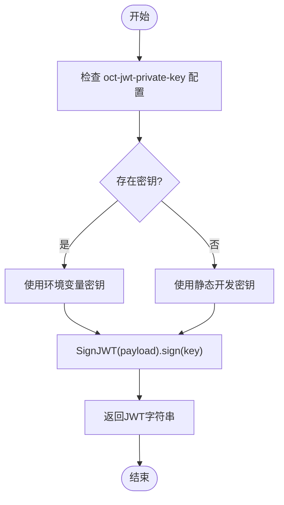

# 简易登录

## 简介
本文档详细描述了协作工具平台中的简易登录机制实现。该机制通过 `simple-login-endpoint.ts` 提供基于用户名和可选邮箱的本地认证功能，结合 `credentials-manager.ts` 实现会话管理与JWT令牌签发，并通过 `user-manager.ts` 完成用户注册与状态维护。系统采用无密码验证的“简易登录”模式，适用于开发或信任环境下的快速接入。

## 项目结构

项目采用模块化设计，核心认证逻辑位于 `open-collaboration-server` 包中，按功能划分为多个子模块：

- `auth-endpoints/`：包含多种认证方式的端点实现，如简易登录、OAuth、Keycloak等。
- `utils/`：提供配置读取与日志记录工具。
- `credentials-manager.ts`：负责JWT生成、验证及延迟认证流程。
- `user-manager.ts`：管理用户注册与信息存储。
- `collaboration-server.ts`：主服务入口，集成所有认证端点并处理登录流程。

## 核心组件
系统围绕三个核心文件构建简易登录流程：

- **simple-login-endpoint.ts**：处理登录请求，验证输入并触发认证成功事件。
- **credentials-manager.ts**：管理JWT令牌生命周期，包括生成、验证与会话绑定。
- **user-manager.ts**：为新用户分配唯一ID并返回注册信息。

这些组件协同工作，完成从用户提交登录信息到获得有效会话令牌的全过程。

## 详细组件分析

### 简易登录端点分析

`SimpleLoginEndpoint` 类实现了基于表单的简易认证流程，其主要功能包括：

- 检查是否启用简易登录（通过配置 `oct-activate-simple-login` 控制）。
- 提供 `/api/login/simple` 接口接收用户名、邮箱和令牌。
- 验证请求参数完整性。
- 触发认证成功事件以继续后续流程。

### 凭证管理器分析

`CredentialsManager` 是认证流程的核心，负责：

- 使用 `startAuth()` 生成一次性确认令牌（confirmToken）。
- 维护一个 `deferredAuths` 映射表，跟踪未完成的认证请求。
- 在5分钟后自动清理超时请求。
- 调用 `generateJwt()` 生成JWT令牌。
- 使用HMAC-SHA256算法（HS256）对JWT进行签名。

#### JWT生成与验证流程

### 用户管理器分析
`UserManager` 提供最基础的用户注册功能：

- 接收来自认证端点的用户信息（用户名、邮箱、认证提供者）。
- 使用 `nanoid(24)` 生成唯一的24位用户ID。
- 返回包含ID的完整用户对象。

当前实现未持久化用户数据，每次注册均为临时用户。

## 性能考虑
- **内存使用**：`deferredAuths` 存储所有待确认的认证请求，每个请求占用少量内存。5分钟自动清理机制防止内存泄漏。
- **加密性能**：JWT使用HS256签名，计算开销低，适合高频认证场景。
- **ID生成**：`nanoid` 使用安全随机源生成唯一ID，性能良好且冲突概率极低。

## 故障排除指南
常见问题及解决方案：

| 问题现象 | 可能原因 | 解决方案 |
|--------|--------|--------|
| 登录失败，提示“No token provided” | 客户端未传递token参数 | 检查前端是否正确传递`token`字段 |
| 认证超时 | 用户未在5分钟内完成登录 | 增加超时时间或优化前端流程 |
| JWT验证失败 | `oct-jwt-private-key` 配置不一致 | 确保所有实例使用相同密钥 |
| 用户ID重复 | `nanoid` 冲突（极罕见） | 检查随机数生成器状态 |

## 结论
简易登录机制为协作平台提供了轻量级的身份验证方案，适用于开发、演示或内部可信网络环境。其设计简洁，依赖少，易于集成。然而，由于缺乏密码验证和持久化用户存储，不建议在生产环境中用于敏感场景。未来可扩展支持密码哈希、双因素认证和数据库持久化以提升安全性。