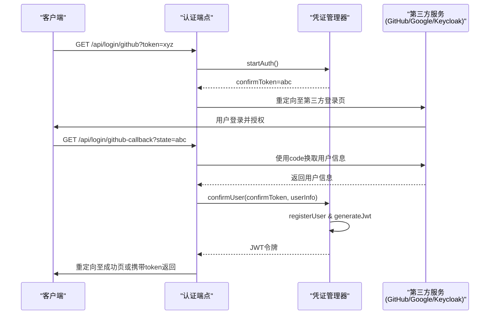

# 认证机制

## 简介

本文档详细描述了协作工具系统中的认证机制，涵盖三种主要认证方式：OAuth（支持 GitHub 和 Google）、Keycloak 集成以及简易登录。文档将深入分析每种认证方式的工作流程、配置参数、适用场景，并结合代码实现说明其设计原理。同时，还将介绍凭证管理器（CredentialsManager）如何安全地生成和验证 JWT 令牌，以及配置系统如何加载环境变量和配置文件。

本项目在实际开发中主要使用简易登录方式。

## 项目结构

系统认证功能集中于 `open-collaboration-server` 包的 `auth-endpoints` 模块中，采用模块化和依赖注入的设计模式，便于扩展和维护。

## 核心组件
系统的核心认证组件包括 `AuthEndpoint` 接口、具体的认证实现类（如 `GitHubOAuthEndpoint`）以及负责凭证管理的 `CredentialsManager`。这些组件通过 Inversify 依赖注入框架进行解耦，确保了高内聚低耦合的设计。

## 架构概览

整个认证流程遵循标准的 OAuth 2.0 授权码流程或自定义的简易登录流程，最终通过 `CredentialsManager` 生成 JWT 令牌，实现用户会话的建立。

## 详细组件分析

### AuthEndpoint 接口设计

`AuthEndpoint` 是所有认证方式的统一接口，定义了认证模块必须实现的核心方法，确保了系统扩展性。

#### OAuth 认证流程（GitHub/Google）（不重要）

OAuth 认证基于 Passport.js 库实现，遵循标准的 OAuth 2.0 流程。

**工作流程：**
1. 客户端发起登录请求，携带临时 `token`。
2. 服务端生成 `confirmToken` 并存储，然后重定向用户到第三方登录页面。
3. 用户在第三方完成登录和授权。
4. 第三方回调服务端指定的 `redirectPath`，携带 `state`（即 `confirmToken`）。
5. 服务端验证 `state`，使用授权码换取用户信息。
6. 调用 `CredentialsManager.confirmUser()` 完成用户注册和 JWT 生成。
7. 将 JWT 通过重定向或页面返回给客户端。

**配置参数：**
- `oct-oauth-github-clientid`：GitHub OAuth 客户端ID
- `oct-oauth-github-clientsecret`：GitHub OAuth 客户端密钥
- `oct-oauth-google-clientid`：Google OAuth 客户端ID
- `oct-oauth-google-clientsecret`：Google OAuth 客户端密钥
- `oct-base-url`：服务基础URL，用于构建回调地址

**适用场景：** 适用于需要与 GitHub 或 Google 账户集成的生产环境，提供安全且用户友好的登录体验。

#### Keycloak 集成认证（不重要）

Keycloak 是一个开源的身份和访问管理解决方案。`KeycloakOAuthEndpoint` 类通过 OpenID Connect 协议与其集成。

**工作流程：**
与标准 OAuth 流程一致，但使用 Keycloak 特定的授权、令牌和用户信息端点。
- 授权URL: `${host}/realms/${realm}/protocol/openid-connect/auth`
- 令牌URL: `${host}/realms/${realm}/protocol/openid-connect/token`
- 用户信息URL: `${host}/realms/${realm}/protocol/openid-connect/userinfo`

**配置参数：**
- `keycloak-host`：Keycloak 服务器地址
- `keycloak-realm`：Keycloak 领域（Realm）
- `keycloak-client-id`：客户端ID
- `keycloak-client-secret`：客户端密钥（可选）
- `keycloak-username-claim`：用于提取用户名的 JWT 声明字段（默认为 `preferred_username`）
- `keycloak-client-label`：在前端显示的标签名称

**适用场景：** 适用于企业级应用，需要集中式身份管理和 SSO（单点登录）的场景。

#### 简易登录（Simple Login）（主要使用此方式）
简易登录提供了一种无需第三方依赖的本地认证方式，适用于开发和测试环境。

**工作流程：**
1. 客户端通过 POST 请求发送用户名、邮箱和临时 `token` 到 `/api/login/simple`。
2. 服务端验证参数。
3. 调用 `CredentialsManager.confirmUser()` 完成用户注册和 JWT 生成。
4. 返回成功响应。

**配置参数：**
- `oct-activate-simple-login`：布尔值，启用或禁用简易登录功能（在 `config.json` 中设置为 `true`）。

**适用场景：** 本地开发、内部测试或对安全性要求不高的临时协作场景。

### 凭证管理与安全机制
`CredentialsManager` 是认证流程的核心服务，负责 JWT 令牌的生成、验证和用户会话管理。

**主要功能：**
- **延迟认证（DelayedAuth）**：使用 `Map<string, DelayedAuth>` 存储临时的认证请求，`confirmToken` 作为键，有效期为5分钟。
- **JWT 生成**：使用 `jose` 库生成 HS256 算法签名的 JWT 令牌。密钥优先从 `OCT_JWT_PRIVATE_KEY` 环境变量读取，若未设置则使用本地文件路径作为静态密钥（仅限开发）。
- **JWT 验证**：验证令牌签名和有效期，并确保载荷符合 `User` 类型。
- **安全ID生成**：使用 `nanoid` 生成安全的随机ID，用于 `confirmToken`。

**安全建议：**
- **生产环境**：必须设置 `OCT_JWT_PRIVATE_KEY` 环境变量，使用强密钥。
- **启用双因素认证**：在第三方服务（如 GitHub）或 Keycloak 中配置 MFA。
- **限制登录尝试**：当前简易登录未实现，建议在前端或通过中间件增加限制。
- **回调URL白名单**：`oauth-endpoint.ts` 中实现了 `oct-redirect-url-whitelist` 配置，防止开放重定向攻击。

## 结论
本系统提供了灵活且可扩展的认证机制，支持从简易开发登录到企业级 SSO 的多种场景。通过清晰的接口设计和模块化实现，开发者可以轻松集成新的认证提供者。安全方面，系统依赖 JWT 和第三方服务的安全性，但在生产部署时必须正确配置密钥和回调白名单，以确保整体安全性。