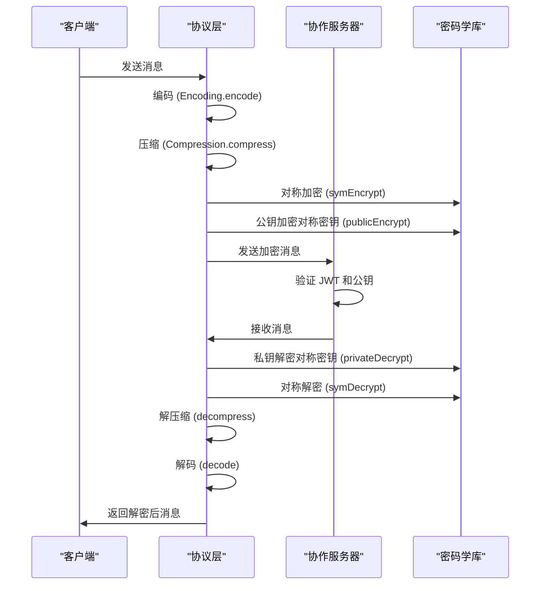
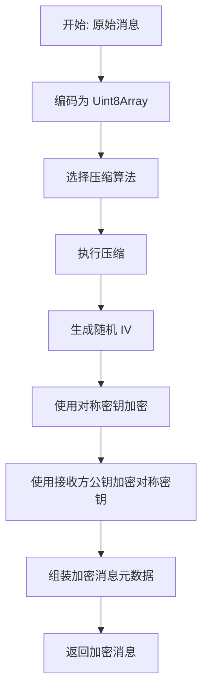
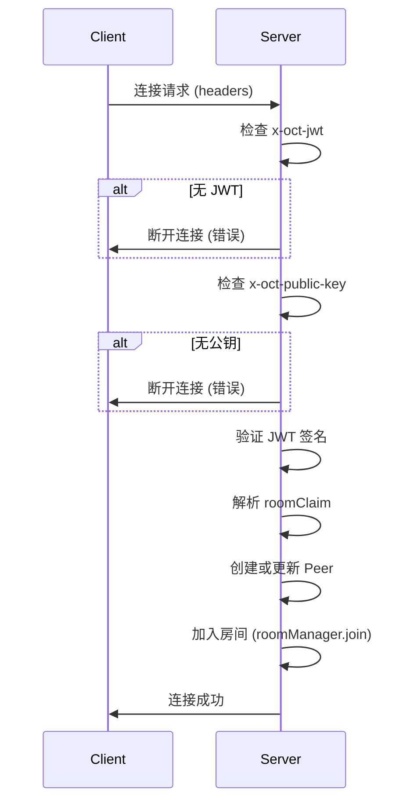

# 通信安全

## 引言
本文档深入阐述协作系统中的通信安全机制，重点分析基于 JOSE（JSON Object Signing and Encryption）标准的消息级加密实现。文档涵盖端到端加密（E2EE）与传输层加密（TLS）的配置方式、密钥交换协议、对称加密算法（如 AES-CBC）的应用、压缩与加密的处理顺序，以及服务器如何验证消息完整性并防范重放攻击。同时提供配置示例、密钥管理最佳实践和调试工具建议。

## 项目结构
协作系统的通信安全机制主要分布在 `open-collaboration-protocol` 和 `open-collaboration-server` 两个核心包中。`open-collaboration-protocol` 负责定义加密、压缩和消息编码的协议层逻辑，而 `open-collaboration-server` 则负责在服务端处理安全相关的连接和消息验证。

## 核心组件
通信安全的核心组件包括：
- **加密模块** (`encryption.ts`)：实现消息级加密与解密，支持对称与非对称加密。
- **压缩模块** (`compression.ts`)：在加密前对数据进行压缩以优化带宽。
- **密码学库** (`crypto.ts`)：提供底层加密算法（如 RSA-OAEP、AES-CBC）的 Web Crypto API 封装。
- **配置模块** (`configuration.ts`)：初始化加密所依赖的密码学模块。
- **协作服务器** (`collaboration-server.ts`)：在连接建立时验证客户端的公钥和 JWT 令牌，确保通信双方身份可信。

## 架构概览

系统的通信安全架构采用分层设计，消息在发送前依次经过编码、压缩和加密处理，接收端则逆向执行解密、解压缩和解码。服务器在连接阶段负责验证客户端身份和加密能力。

## 详细组件分析

### 加密机制分析
`encryption.ts` 文件实现了基于 JOSE 标准的消息级加密。其核心是使用对称加密（AES-CBC）加密消息内容，并使用非对称加密（RSA-OAEP）加密对称密钥，确保只有目标接收方能解密。

#### 加密流程

### 压缩与加密顺序
`compression.ts` 模块在加密前对消息内容进行压缩，以减少网络传输量。系统支持 `gzip` 和 `none` 两种算法，并通过 `bestFit` 函数协商最优压缩方式。

### 服务器安全验证
`collaboration-server.ts` 在客户端连接时执行关键安全验证：
1. **JWT 验证**：确保客户端拥有有效的身份令牌。
2. **公钥验证**：客户端必须提供用于加密通信的公钥。
3. **压缩算法协商**：客户端声明支持的压缩算法，服务器记录以备后续通信。

## 依赖分析
通信安全模块的依赖关系清晰，遵循单一职责原则。

## 性能考量
- **加密算法选择**：当前使用 AES-CBC 而非 AES-GCM，牺牲了认证加密（AEAD）的安全性以换取更广泛的兼容性。
- **压缩性能**：`fflate` 库使用同步压缩 (`gzipSync`)，避免了异步 Worker 的开销，适合小消息场景。
- **密钥缓存**：`EncryptionKey` 和 `DecryptionKey` 支持缓存已加密/解密的对称密钥，显著减少重复的非对称加解密开销。

## 故障排查指南
### 常见问题
- **连接失败，提示 "No encryption key set"**：客户端未在 HTTP 头中设置 `x-oct-public-key`。
- **解密失败，提示 "Expected exactly one key for decryption"**：消息元数据中包含多个加密密钥，可能服务器未正确处理广播消息。
- **Crypto module is not available**：未调用 `initializeProtocol()` 初始化密码学模块。

### 调试工具
- **日志分析**：检查 `collaboration-server` 的日志输出，重点关注 `logger.error` 和 `logger.warn`。
- **配置验证**：确保 `config.json` 中的 `oct-cors-allowed-origins` 等配置项正确。
- **密钥管理**：使用 `generateKeyPair()` 生成密钥对，并确保私钥安全存储。

## 结论
该协作系统实现了基于消息级别的端到端加密，通过组合对称与非对称加密技术保障了通信机密性。服务器在连接阶段执行严格的身份和密钥验证，确保了通信起点的安全。尽管当前实现使用 AES-CBC，未来可升级至 AES-GCM 以增强安全性。整体架构清晰，模块职责分明，为构建安全的实时协作应用提供了坚实基础。