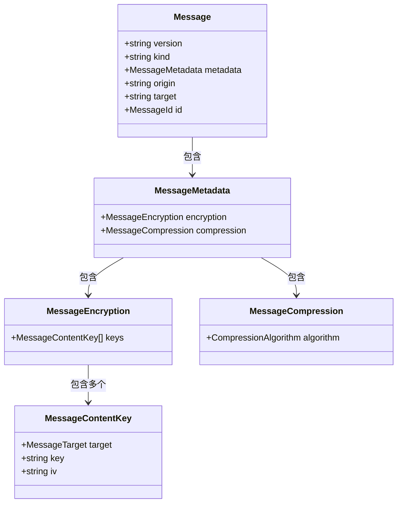
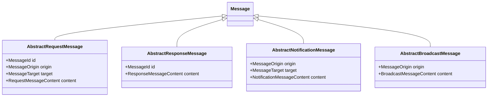
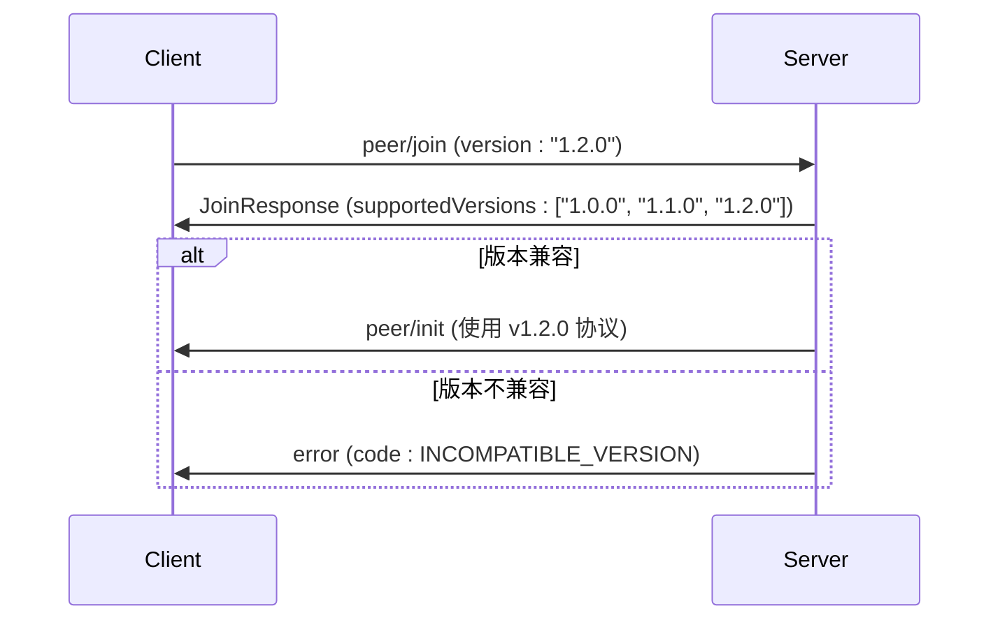
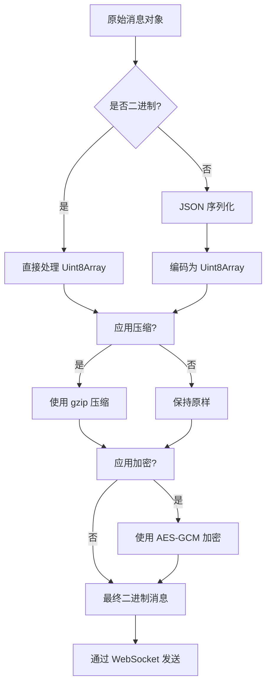
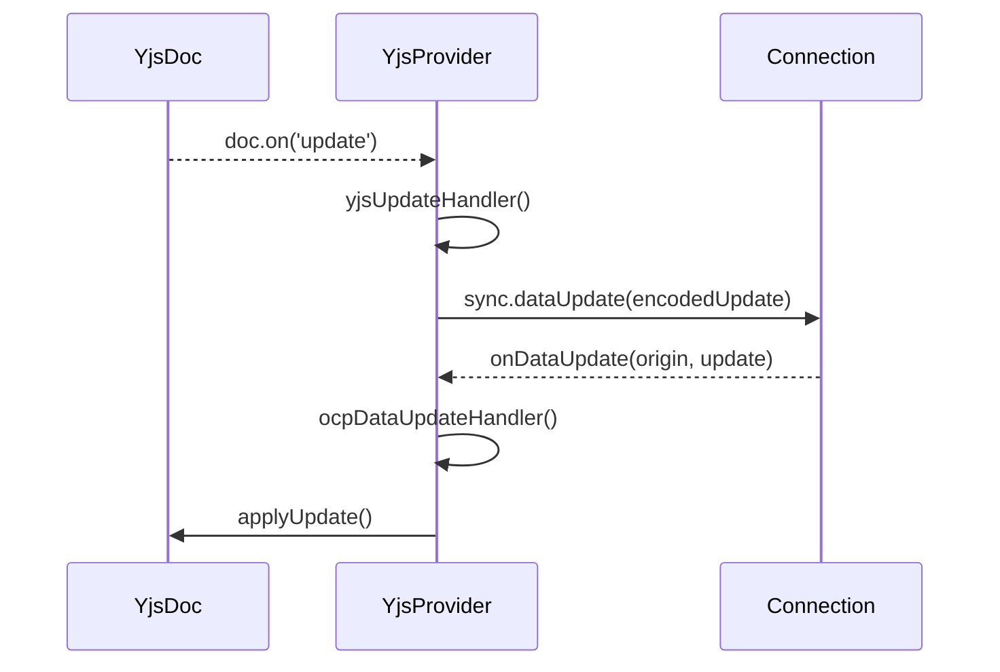
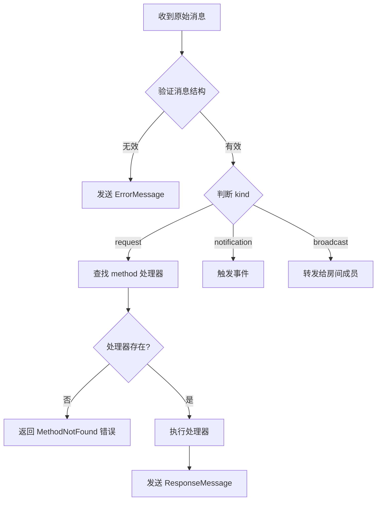

# 协议扩展与消息定制


## 引言

本指南旨在为开发者提供一套完整的协议扩展方法论，用于在现有协作系统中安全地引入新消息类型或自定义数据通道。通过深入分析 `messages.ts` 中定义的消息结构，本文将指导如何定义新消息、确保序列化格式兼容性，并集成至 Yjs 等 CRDT 框架中。同时，强调通信性能优化、错误处理机制及向后兼容的重要性。

## 核心消息结构分析

协作协议中的所有消息均遵循统一的结构设计，确保跨平台与版本间的互操作性。

### 消息基础结构

所有消息均实现 `Message` 接口，包含以下关键字段：

**:version**  
协议版本号，用于版本控制与兼容性判断。

**:kind**  
消息类型，区分请求、响应、通知、广播等语义。

**:metadata**  
元数据，包含加密与压缩配置信息。

**:origin**  
消息发起方的唯一标识（Peer ID）。

**:target**  
消息目标接收方的 Peer ID（可选）。

**:id**  
请求/响应配对标识符，用于关联请求与响应。




### 消息分类

根据通信模式，消息分为四类：

**:RequestType**  
请求-响应模式，需携带 `id` 以匹配响应。

**:NotificationType**  
单向通知，无需响应。

**:BroadcastType**  
广播消息，由发送者向房间内所有成员分发。

**:ErrorResponse**  
错误响应，携带原始请求 `id`。




## 消息类型扩展指南

### 定义新消息类型

在 `messages.ts` 中，使用命名空间组织消息类型。新增消息应遵循以下模式：

```typescript
export namespace Custom {
    export const NewEvent = new NotificationType<[string]>('custom/newEvent');
    export const QueryData = new RequestType<[], { result: string }>('custom/queryData');
    export const DataUpdate = new BroadcastType<[DataPayload]>('custom/dataUpdate');
}
```

**:method** 字符串应采用 `模块/动作` 的命名规范，避免冲突。

### 类型安全与参数定义

使用泛型确保类型安全：

- `NotificationType<P extends unknown[]>`：P 为参数数组类型
- `RequestType<P, R>`：P 为请求参数，R 为响应类型
- `BroadcastType<P>`：P 为广播数据类型

示例：定义文件评论请求

```typescript
export namespace FileComment {
    export interface Comment {
        fileId: string;
        text: string;
        author: string;
        timestamp: number;
    }
    export const Add = new RequestType<[Comment], boolean>('fileComment/add');
    export const Notify = new BroadcastType<[Comment]>('fileComment/notify');
}
```


## 序列化与版本兼容策略

### 版本控制机制

所有消息携带 `version` 字段，默认使用 `VERSION` 常量（来自 `utils/version.ts`）。建议遵循语义化版本（SemVer）：

- 主版本变更：不兼容的 API 修改
- 次版本变更：向后兼容的功能新增
- 修订号变更：向后兼容的问题修正

### 向后兼容设计原则

1. **字段只增不减**：旧客户端忽略未知字段
2. **避免重命名字段**：使用别名或映射层过渡
3. **默认值处理**：对可选字段提供默认行为
4. **版本协商机制**：连接初始化时交换版本信息




## 消息编码、压缩与加密流程

### 处理层级

消息在传输前经历三层处理：

1. **编码层**：结构化数据 → 二进制流（Uint8Array）
2. **压缩层**：二进制流 → 压缩数据（gzip 等）
3. **加密层**：明文 → 密文（AES-GCM）

### 流程图解




### 压缩算法支持

`:CompressionAlgorithm` 类型定义支持的算法：

```typescript
type CompressionAlgorithm = 'none' | 'gzip' | (string & {});
```

允许扩展自定义算法（如 `zstd`），但需确保两端支持。

### 加密机制

`:MessageEncryption` 支持多目标加密，每个 `MessageContentKey` 包含：

- `target`: 接收者 ID
- `key`: 加密密钥（Base64）
- `iv`: 初始向量（Base64）

实现端到端加密时，仅目标客户端可解密对应数据。

## Yjs 协同状态同步机制集成

### YjsProvider 核心职责

`OpenCollaborationYjsProvider` 类桥接 Yjs 文档与协作协议，实现：

- Yjs 文档更新 → 协议 `dataUpdate` 广播
- 协议 `dataUpdate` → 应用至 Yjs 文档
- Awareness 状态同步

### 集成流程图




### 自定义 CRDT 类型绑定

要支持自定义 CRDT 类型（如 `Y.Map` 或自定义类型），需：

1. 在 Yjs 文档中定义类型
2. 确保编码/解码器支持该类型
3. 通过 `dataUpdate` 通道同步二进制更新

示例：同步自定义表单数据

```typescript
const doc = new Y.Doc();
const form = doc.getMap('form-data');

// 自动通过 YjsProvider 同步
form.set('name', 'Alice');
form.set('age', 30);
```

### 元数据同步机制

通过 `awareness` 协议同步用户光标、选择状态等非文档数据：

```typescript
awareness.setLocalStateField('cursor', { line: 10, ch: 5 });
// 自动触发 awarenessUpdate 广播
```


## 客户端与服务端消息处理注册模式

### 事件驱动注册模型

采用观察者模式注册消息处理器：

#### 客户端注册示例

```typescript
connection.onPeerInfo((peer) => {
    console.log('新成员加入:', peer);
});

connection.sync.onDataUpdate((origin, update) => {
    yjsProvider.receiveUpdate(update, origin);
});
```

#### 服务端路由注册

在 `message-relay.ts` 或 `channel.ts` 中注册处理器：

```typescript
router.on('custom/queryData', async (request) => {
    const result = await fetchData();
    return { result };
});
```

### 消息分发流程




## 向后兼容性与错误降级处理

### 兼容性检查策略

1. **版本范围匹配**：服务端声明支持的版本区间
2. **功能探测**：通过可选消息探测客户端能力
3. **优雅降级**：高版本功能在低版本客户端静默忽略

### 错误处理最佳实践

#### 客户端错误处理

```typescript
connection.on('error', (err) => {
    if (err.content.message.includes('INCOMPATIBLE_VERSION')) {
        showUpdateRequiredDialog();
    } else {
        showToast('协作连接异常');
    }
});
```

#### 服务端错误响应

```typescript
try {
    const result = await handler(params);
    return ResponseMessage.create(id, result);
} catch (error) {
    return ResponseErrorMessage.create(id, error.message);
}
```

### 降级处理场景

| 场景 | 处理策略 |
|------|----------|
| 未知消息类型 | 忽略并记录警告 |
| 不支持的压缩算法 | 断开连接并提示升级 |
| 加密密钥缺失 | 请求重新同步状态 |
| 版本不兼容 | 拒绝连接并返回支持版本列表 |


## 最佳实践总结

1. **遵循命名规范**：使用 `模块/动作` 统一命名消息方法
2. **保持消息轻量**：避免在单条消息中传输大量数据
3. **优先使用广播**：状态同步优先用 `BroadcastType`
4. **压缩大消息**：超过 1KB 的消息启用 gzip 压缩
5. **加密敏感数据**：用户隐私信息必须端到端加密
6. **版本前向兼容**：新版本必须能处理旧版本消息
7. **错误码标准化**：定义统一的错误码体系
8. **日志与监控**：记录消息处理延迟与失败率

通过遵循本指南，开发者可安全、高效地扩展协作协议，确保系统稳定性与可维护性。