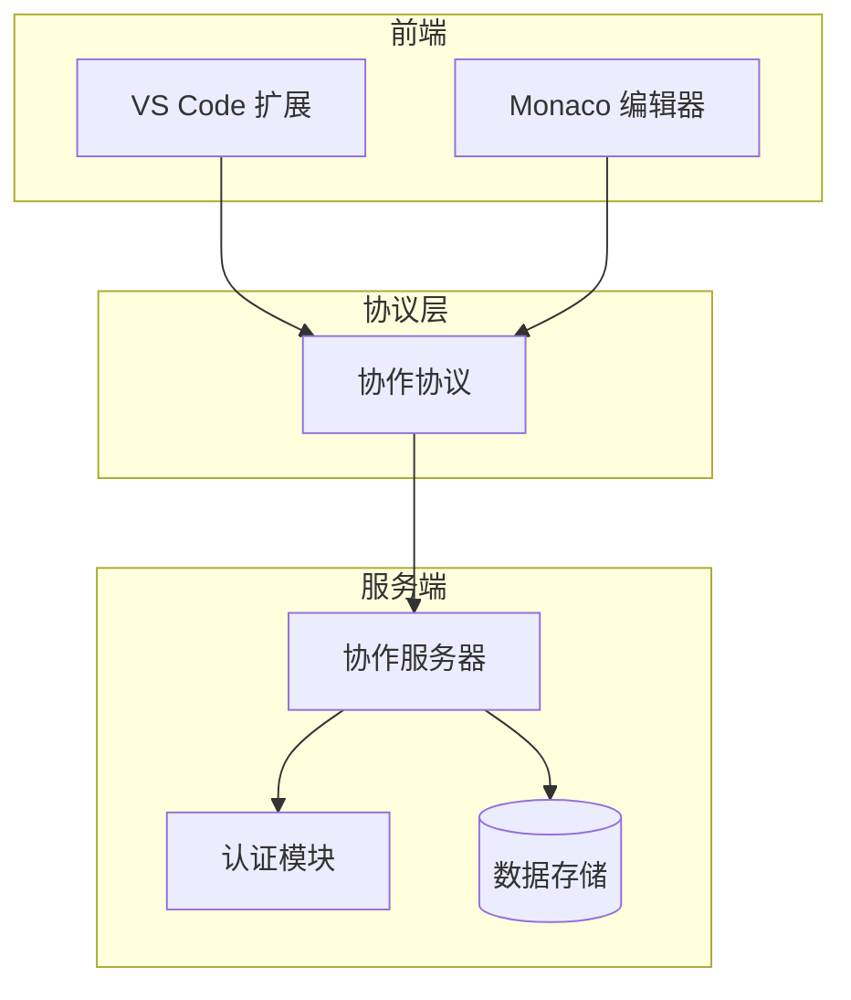
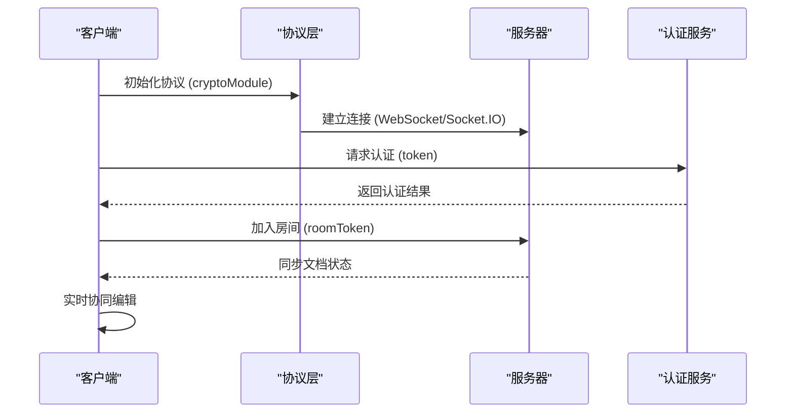
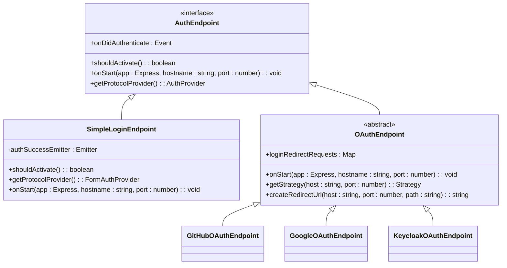
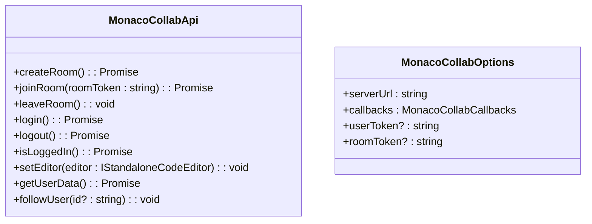
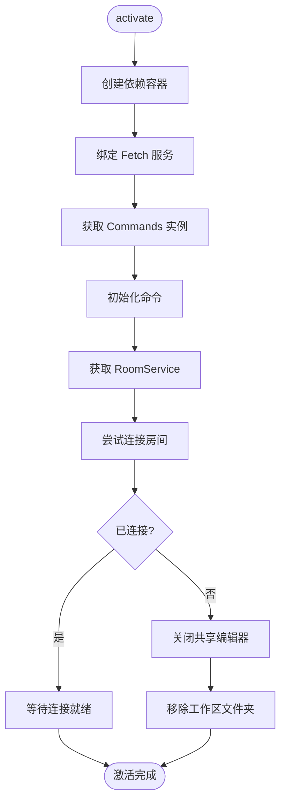
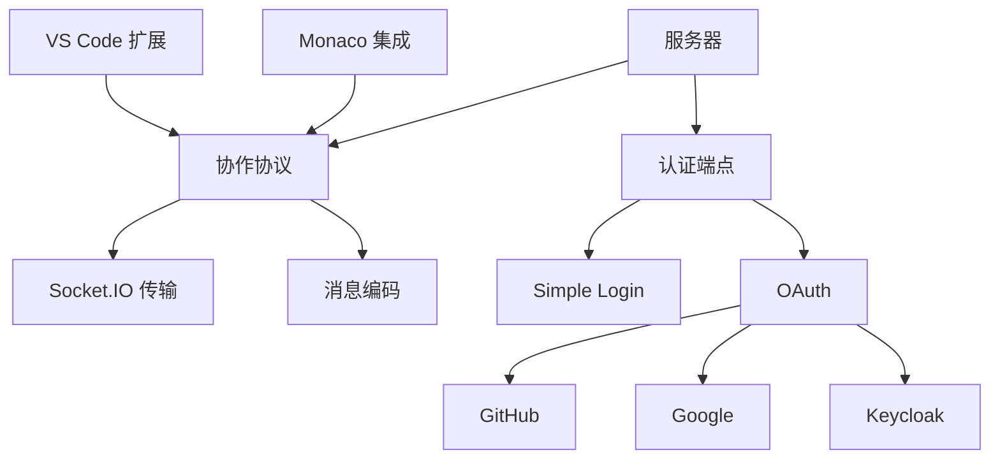

# 扩展开发指南


## 简介
本文档为二次开发者提供扩展指南，重点介绍如何基于现有协作系统集成新功能、新编辑器或自定义认证机制。涵盖 VS Code 扩展激活机制、Monaco 编辑器集成模式、自定义认证提供者实现，以及服务端插件接口建议。通过代码模板与最佳实践，帮助开发者快速构建兼容的协作功能。

## 项目结构
本项目采用多包（monorepo）结构，各模块职责清晰，便于独立开发与集成。主要模块包括：

- `open-collaboration-agent`：智能代理功能
- `open-collaboration-monaco`：Monaco 编辑器集成
- `open-collaboration-protocol`：核心通信协议
- `open-collaboration-server`：后端服务与认证
- `open-collaboration-vscode`：VS Code 扩展
- `open-collaboration-yjs`：协同编辑状态同步



## 核心组件
系统核心由协议层、客户端集成层和服务端组成。`open-collaboration-protocol` 定义了消息格式与通信规范；`open-collaboration-monaco` 和 `open-collaboration-vscode` 分别封装了编辑器集成；`open-collaboration-server` 提供房间管理与认证服务。

## 架构概览
系统采用客户端-服务器架构，支持多种认证方式与编辑器集成。所有协作消息通过统一协议传输，服务端负责状态同步与权限控制。



## 详细组件分析

### 自定义认证提供者实现
系统支持通过插件机制扩展认证方式。所有认证提供者需实现 `AuthEndpoint` 接口。

#### AuthEndpoint 接口结构


#### 实现步骤
1. 创建新类继承 `AuthEndpoint`
2. 实现 `shouldActivate()` 判断是否启用
3. 实现 `getProtocolProvider()` 返回认证元数据
4. 在 `onStart()` 中注册 Express 路由
5. 认证成功时触发 `onDidAuthenticate` 事件

#### 代码模板
```typescript
import { injectable } from 'inversify';
import { Express } from 'express';
import { AuthEndpoint, AuthSuccessEvent } from './auth-endpoint';
import { Configuration } from '../utils/configuration';

@injectable()
export class CustomAuthEndpoint implements AuthEndpoint {
    @inject(Configuration) protected configuration: Configuration;

    private authSuccessEmitter = new Emitter<AuthSuccessEvent>();
    onDidAuthenticate = this.authSuccessEmitter.event;

    shouldActivate(): boolean {
        return this.configuration.getValue('enable-custom-auth', 'boolean') ?? false;
    }

    getProtocolProvider() {
        return {
            type: 'web',
            name: 'custom',
            endpoint: '/api/login/custom',
            label: { message: 'Custom Auth' },
            group: { message: 'Custom' }
        };
    }

    onStart(app: Express, hostname: string, port: number): void {
        app.get('/api/login/custom', (req, res) => {
            const token = req.query.token as string;
            // 自定义认证逻辑
            const userInfo = { name: 'user', authProvider: 'Custom' };
            this.authSuccessEmitter.fire({ token, userInfo });
            res.redirect('/success');
        });
    }
}
```

### Monaco 编辑器集成
通过 `monaco-api.ts` 提供的封装，可快速将协作功能集成到任何基于 Monaco 的编辑器中。

#### 集成 API


#### 集成示例
```typescript
import { monacoCollab } from 'open-collaboration-monaco';

const collab = monacoCollab({
    serverUrl: 'http://localhost:3000',
    callbacks: {
        onUserRequestsAccess: async (user) => {
            return confirm(`${user.name} 请求加入协作？`);
        },
        statusReporter: (info) => {
            console.log('协作状态:', info.message);
        }
    }
});

// 绑定编辑器
const editor = monaco.editor.create(document.getElementById('editor')!);
collab.setEditor(editor);

// 创建房间
const roomToken = await collab.createRoom();
console.log('房间创建成功:', roomToken);
```

### VS Code 扩展开发
`extension.ts` 定义了 VS Code 扩展的激活机制与命令注册。

#### 激活流程


#### 命令注册
通过 `Commands` 类集中管理所有 VS Code 命令。开发者可扩展 `commands-list.ts` 添加新命令。

#### 协作工具栏开发
1. 在 `commands.ts` 中定义新命令
2. 在 `package.json` 的 `contributes.commands` 中声明
3. 实现命令处理逻辑
4. 在状态栏或侧边栏中添加 UI 元素

## 依赖分析
系统各模块通过清晰的接口进行通信，耦合度低，易于扩展。



## 性能考虑
- 认证请求应使用缓存避免重复验证
- 大文件同步建议启用协议层压缩
- 频繁状态更新应合并发送
- 客户端应实现连接重试机制

## 故障排除指南
- **无法连接服务器**：检查 `serverUrl` 配置与网络连通性
- **认证失败**：确认认证端点已正确激活且配置完整
- **编辑器不同步**：确保 `setEditor()` 已正确调用
- **命令未注册**：检查 `package.json` 中的 `contributes` 配置

## 结论
本系统提供了完善的扩展接口，支持开发者轻松集成新编辑器、认证方式与协作功能。通过遵循模块化设计与清晰的接口规范，可快速构建定制化的协作解决方案。