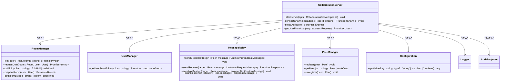

# 服务端插件开发


## 简介
本文档旨在为开发者提供一份全面的**服务端插件开发指南**，重点介绍如何基于 `collaboration-server.ts` 核心模块，通过事件监听或依赖注入机制扩展服务端功能。内容涵盖自定义消息处理器注册、用户加入/退出事件拦截、房间管理逻辑扩展等关键能力。同时，指导开发者利用 Inversify 容器注册新服务，或通过 `message-relay.ts` 插入审计日志、AI 增强建议、操作记录等中间处理逻辑。文档还将提供典型用例、插件生命周期管理、错误隔离与热加载建议。

## 项目结构
`open-collaboration-server` 包是整个协作系统的核心服务端实现，其结构清晰地体现了模块化和依赖注入的设计思想。


## 核心组件
服务端的核心功能由几个关键类协同完成，它们通过 Inversify 框架进行依赖注入和管理。

## 架构概览
系统采用基于依赖注入（Inversify）的分层架构，`CollaborationServer` 作为主控制器，协调 `RoomManager`、`UserManager`、`MessageRelay` 等服务。


## 详细组件分析
本节深入分析实现插件扩展的关键组件。

### CollaborationServer 分析
`CollaborationServer` 是服务的入口点，负责启动HTTP和Socket.IO服务器，并通过依赖注入管理所有核心服务。




### 扩展机制：依赖注入与事件监听
开发者可以通过两种主要方式扩展服务端功能：

1.  **依赖注入 (Inversify)**：通过修改或替换 `inversify-module.ts` 中的绑定，可以注入自定义的服务实现。
2.  **事件监听**：虽然代码中未显式暴露事件总线，但可以通过重写或包装核心服务（如 `RoomManager`）的方法来实现类似事件监听的效果。

#### 示例：注册自定义消息处理器
通过 `MessageRelay` 类，可以在消息广播前进行拦截和处理。

```typescript
// 自定义消息处理器
class AuditLogProcessor {
    constructor(
        @inject(MessageRelay) private relay: MessageRelay,
        @inject(Logger) private logger: Logger
    ) {}

    // 重写或包装 sendBroadcast 方法以插入逻辑
    enhancedSendBroadcast(origin: Peer, message: UnknownBroadcastMessage): void {
        // 插入审计日志
        this.logger.info(`Audit: User ${origin.user.name} sent message type ${message.method} in room ${origin.room.id}`);
        
        // 可以在此处添加敏感操作告警逻辑
        if (this.isSensitiveOperation(message)) {
            this.logger.warn(`Sensitive operation detected: ${message.method}`);
            // 触发告警...
        }

        // 调用原始的广播逻辑
        this.relay.sendBroadcast(origin, message);
    }

    private isSensitiveOperation(message: UnknownBroadcastMessage): boolean {
        // 判断是否为敏感操作的逻辑
        return message.method === 'deleteFile' || message.method === 'changePermissions';
    }
}
```

#### 示例：扩展房间管理逻辑
通过继承或包装 `RoomManager`，可以扩展用户加入/退出的逻辑。

```typescript
// 扩展房间管理器
@injectable()
class ExtendedRoomManager extends RoomManager {
    constructor(
        @inject(Logger) logger: Logger,
        @inject(PeerManager) peerManager: PeerManager,
        @inject(UserManager) userManager: UserManager,
        @inject(MessageRelay) private relay: MessageRelay // 注入 relay 用于发送通知
    ) {
        super(logger, peerManager, userManager);
    }

    async join(peer: Peer, roomId: string): Promise<void> {
        // 在用户加入前执行自定义逻辑，例如会话录制检查
        await this.preJoinChecks(peer, roomId);

        // 调用父类的 join 方法
        await super.join(peer, roomId);

        // 用户成功加入后，可以发送欢迎消息或触发自动化测试注入
        this.onUserJoined(peer, roomId);
    }

    private async preJoinChecks(peer: Peer, roomId: string): Promise<void> {
        // 例如，检查房间是否处于录制状态
        const room = this.getRoomById(roomId);
        if (room?.isRecording) {
            // 向用户发送通知，告知其会话正在被录制
            const notification = {
                jsonrpc: '2.0',
                method: 'sessionRecordingActive',
                params: { recording: true }
            };
            this.relay.sendNotification(peer, notification);
        }
    }

    private onUserJoined(peer: Peer, roomId: string): void {
        // 记录操作日志
        this.logger.info(`User ${peer.user.name} joined room ${roomId}`);
        
        // 可以触发自动化测试脚本注入
        // this.injectTestScript(peer);
    }
}
```

## 依赖分析
系统依赖关系清晰，核心服务均通过 Inversify 容器进行管理，降低了耦合度。


## 性能考量
- **消息广播**：`MessageRelay.sendBroadcast` 方法会遍历房间内所有对等点，房间成员越多，开销越大。应避免发送过大或过于频繁的广播消息。
- **依赖注入**：Inversify 容器在解析依赖时有一定开销，但单例作用域（`inSingletonScope`）的服务只创建一次，影响较小。
- **配置读取**：`Configuration.getValue` 方法会检查环境变量和配置文件，频繁调用可能影响性能，建议在初始化时读取并缓存。

## 故障排查指南
- **插件未生效**：检查 `inversify-module.ts` 中的绑定是否正确，确保自定义服务已正确注入。
- **消息无法接收**：确认 `MessageRelay` 的 `sendBroadcast` 或 `sendNotification` 方法是否被正确调用，检查目标 `Peer` 的 `channel` 是否有效。
- **用户无法加入房间**：检查 `RoomManager` 的 `join` 和 `requestJoin` 方法的逻辑，确认房间ID和用户凭证是否有效。
- **配置项不生效**：确认环境变量名是否正确（如 `OCT_SERVER_OWNER`），或配置文件路径是否正确加载。

## 结论
通过深入分析 `collaboration-server.ts` 和 `message-relay.ts` 等核心文件，本文档展示了如何利用依赖注入和面向对象的继承/包装机制来实现强大的服务端插件功能。开发者可以基于此框架，轻松地添加审计日志、敏感操作告警、会话录制、AI 建议等高级特性。建议在开发插件时，遵循单一职责原则，确保插件的错误不会影响核心服务的稳定性，并考虑实现热加载机制以提升开发效率。