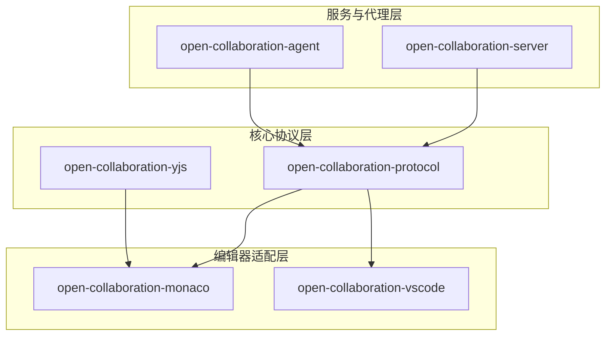
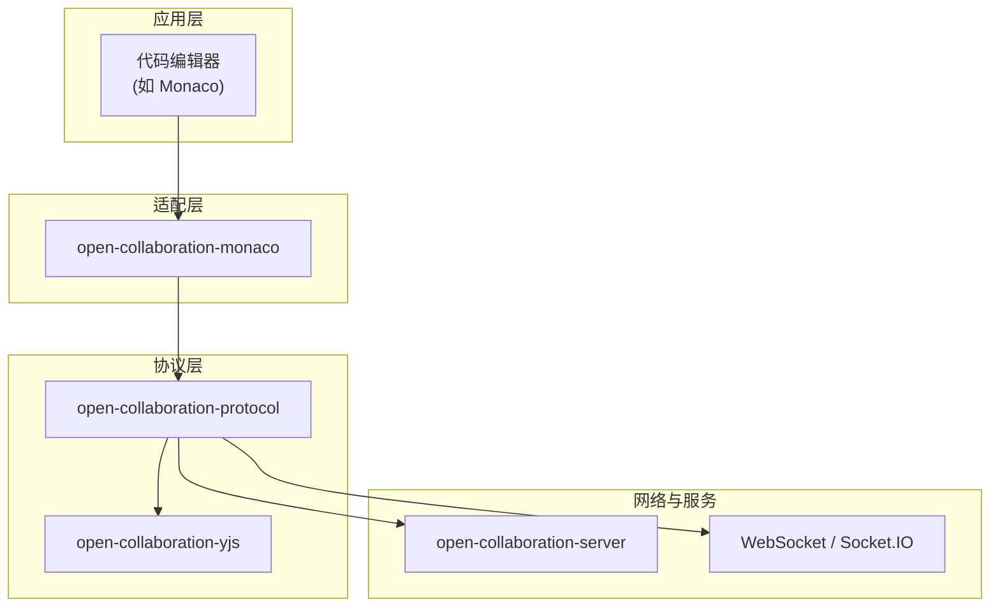
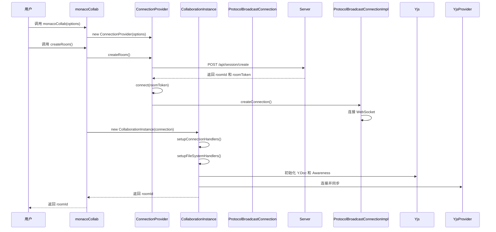
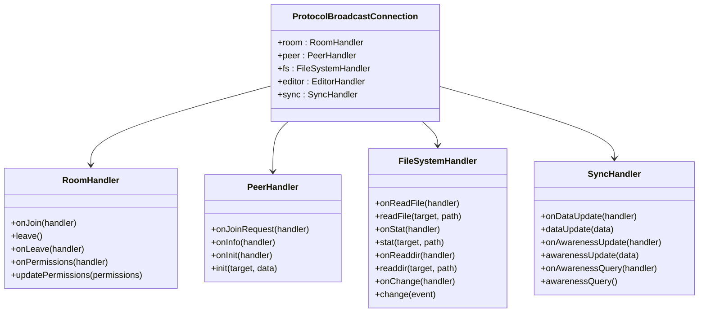
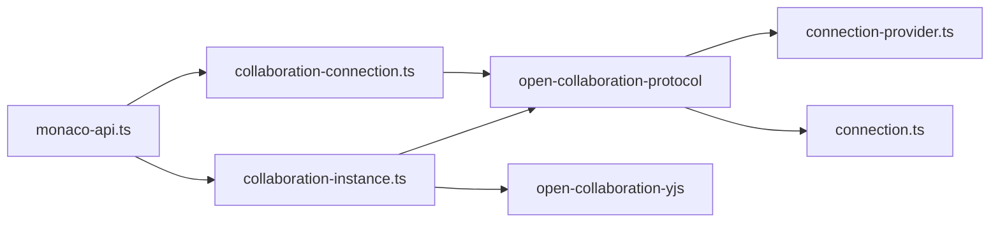

# 编辑器集成指南


## 简介
本文档旨在为开发者提供一份详尽的指南，说明如何将实时协作功能集成到新的代码编辑器中。以 `monaco-api.ts` 的封装模式为范例，深入解析协作实例（`CollaborationInstance`）的初始化流程、连接提供者（`ConnectionProvider`）的抽象设计以及与协议层的交互方式。文档涵盖编辑器适配层的实现，包括文档同步钩子、光标状态更新和事件监听机制。同时提供 TypeScript 接口定义参考，确保与 `open-collaboration-protocol` 协议的兼容性。通过完整的数据流示例，展示从编辑器事件绑定到 Yjs 文档同步的全过程，并指出性能优化的关键点，如变更批处理与网络节流。

## 项目结构
本项目采用模块化设计，核心功能被拆分为多个独立的 npm 包，每个包负责特定的职责。这种设计提高了代码的可维护性和可复用性。



## 核心组件
本节将深入分析实现协作功能的核心组件，包括 `ConnectionProvider`、`CollaborationInstance` 和 `ProtocolBroadcastConnection`。

## 架构概览
整个协作系统的架构可以分为三层：协议层、适配层和应用层。



## 详细组件分析
本节将对关键组件进行深入分析，包括其类结构、数据流和交互逻辑。

### CollaborationInstance 分析
`CollaborationInstance` 是适配层的核心类，它桥接了编辑器（如 Monaco）和底层的协作协议。

#### 类结构图
```
classDiagram
class CollaborationInstance {
+yjs : Y.Doc
+yjsAwareness : Awareness
+yjsProvider : OpenCollaborationYjsProvider
+identity : Deferred~Peer~
+peers : Map~string, DisposablePeer~
+connectedUsers : DisposablePeer[]
+ownUserData : Promise~Peer~
+following : string | undefined
+fileName : string
+workspaceName : string
+setEditor(editor : IStandaloneCodeEditor) : void
+setFileName(fileName : string) : Promise~void~
+dispose() : void
+leaveRoom() : void
+followUser(id? : string) : void
+registerEditorEvents() : void
+registerTextDocument(document : ITextModel) : Promise~void~
+updateTextDocument(event : IModelContentChangedEvent, document : ITextModel) : void
+rerenderPresence() : void
}
class DisposablePeer {
+peer : Peer
+decoration : {cursorClassName : string, selectionClassName : string, cursorInvertedClassName : string}
}
CollaborationInstance --> DisposablePeer : "拥有"
CollaborationInstance --> Y.Doc : "使用"
CollaborationInstance --> Awareness : "使用"
CollaborationInstance --> OpenCollaborationYjsProvider : "使用"
```

#### 初始化与连接流程
当用户创建或加入一个协作房间时，`monacoCollab` 函数会创建一个 `ConnectionProvider` 实例，并调用 `createRoom` 或 `joinRoom` 函数。



### 协议层交互分析
`ProtocolBroadcastConnection` 定义了与服务器通信的抽象接口。

#### 接口结构图


#### 文档同步数据流
文档的实时同步是通过 `Yjs` 和 `sync` 处理程序实现的。

```
flowchart TD
A[用户在编辑器中输入] --> B[触发 onDidChangeModelContent 事件]
B --> C[CollaborationInstance.updateTextDocument()]
C --> D[Yjs 文档进行事务性更新]
D --> E[YjsProvider 捕获变更]
E --> F[通过 sync.dataUpdate() 发送二进制增量]
F --> G[网络传输到服务器]
G --> H[服务器广播给其他客户端]
H --> I[其他客户端的 sync.onDataUpdate 处理程序]
I --> J[YjsProvider 应用增量到本地 Yjs 文档]
J --> K[Yjs 文档触发 observe 事件]
K --> L[CollaborationInstance.updateDocument()]
L --> M[更新 Monaco 编辑器视图]
```

## 依赖分析
本系统各组件之间的依赖关系清晰，遵循了依赖倒置原则。



## 性能考虑
为了确保协作体验的流畅性，系统在多个层面进行了性能优化。

1.  **变更批处理**：`updateTextDocument` 方法使用 `yjsMutex` 来确保对 Yjs 文档的修改是原子的，避免了并发修改导致的冲突。
2.  **网络节流**：`getOrCreateThrottle` 方法使用 `lodash.debounce` 对 `resyncThrottle` 进行节流，防止在用户快速输入时产生过多的网络同步请求。
3.  **光标状态更新**：`awarenessDebounce` 对光标状态（presence）的更新进行了 2 秒的防抖处理，减少了不必要的网络流量。
4.  **Yjs 事务**：所有对 Yjs 文档的修改都包裹在 `yjs.transact()` 中，确保了数据的一致性。

## 故障排除指南
在集成过程中，可能会遇到以下常见问题：

### 无法连接到服务器
- **检查**：确保 `serverUrl` 配置正确，并且服务器正在运行。
- **检查**：查看浏览器控制台是否有 CORS 或网络错误。

### 文档内容不同步
- **检查**：确认 `registerTextDocument` 和 `registerTextObserver` 是否被正确调用。
- **检查**：确保 `yjsMutex` 被正确使用，以防止竞态条件。

### 光标状态不显示
- **检查**：确认 `yjsAwareness` 是否已正确初始化，并且 `awarenessUpdate` 事件被正确发送和接收。
- **检查**：`rerenderPresence` 方法是否被正确调用。

## 结论
通过遵循本文档的指南，开发者可以成功地将实时协作功能集成到任何支持事件监听和文档操作的代码编辑器中。关键在于理解 `ConnectionProvider` 负责建立和管理网络连接，`CollaborationInstance` 作为适配层的核心，负责桥接编辑器和协议层，而 `Yjs` 则提供了强大的 CRDT 算法来保证数据的一致性。通过合理利用批处理和节流等优化手段，可以构建出高性能、低延迟的协作编辑体验。