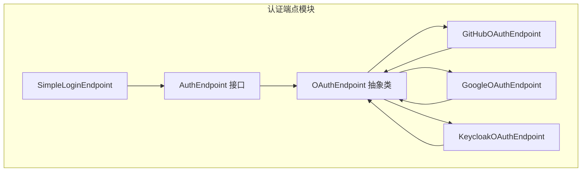
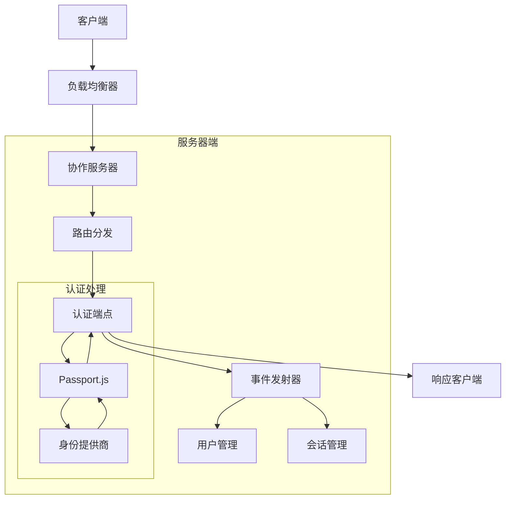
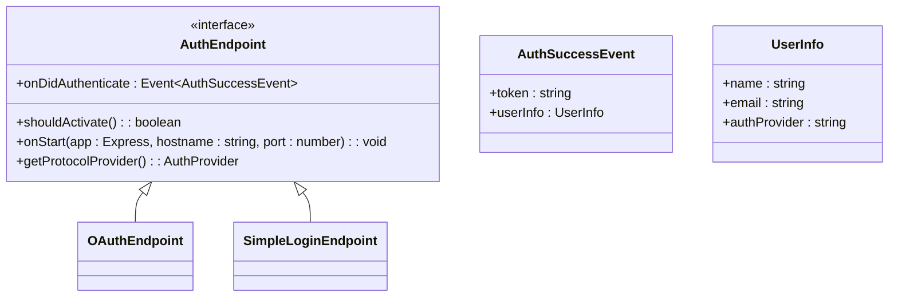
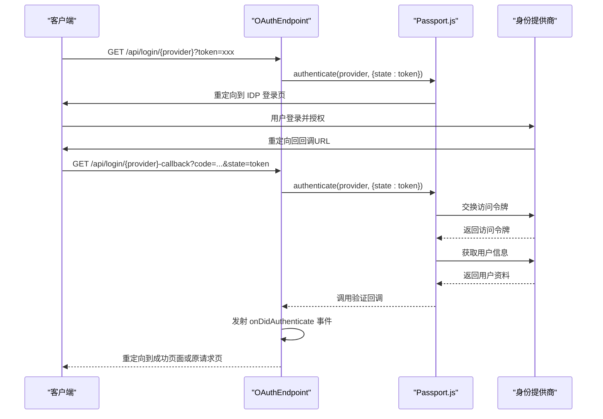
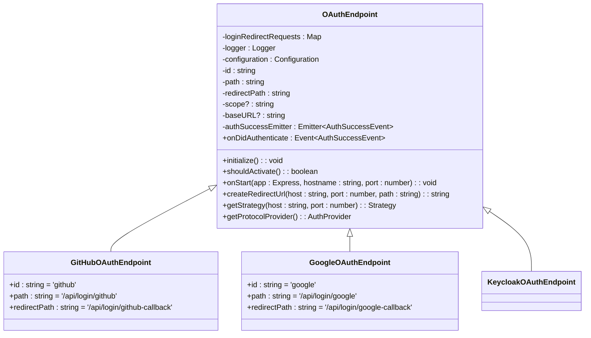
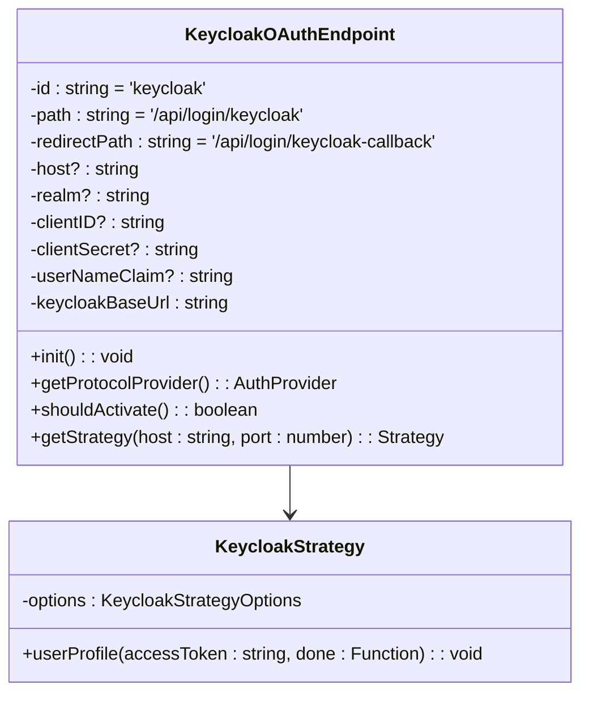
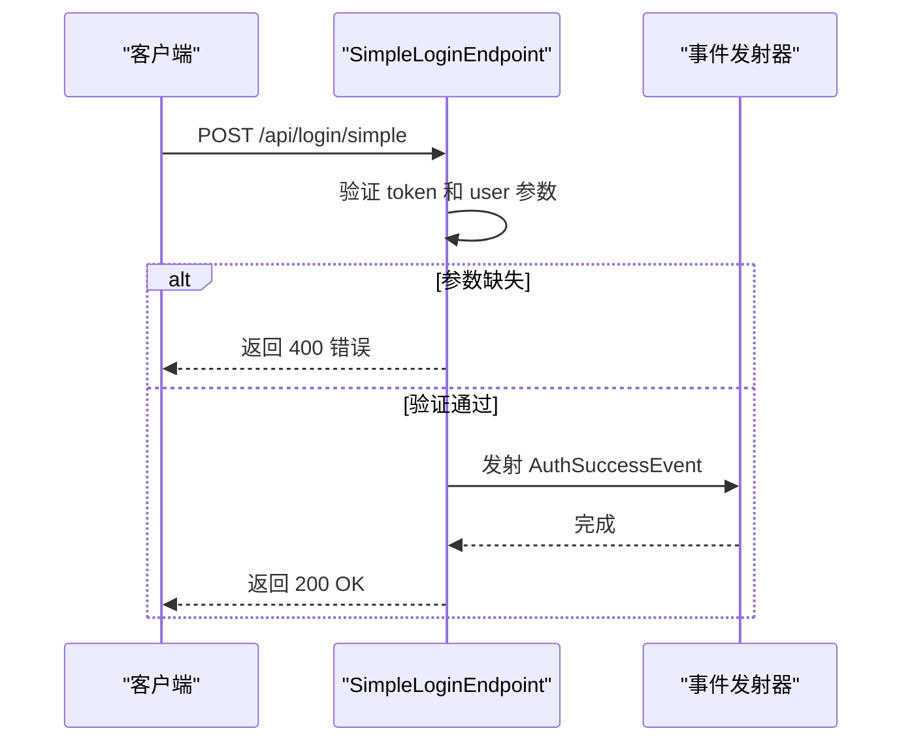
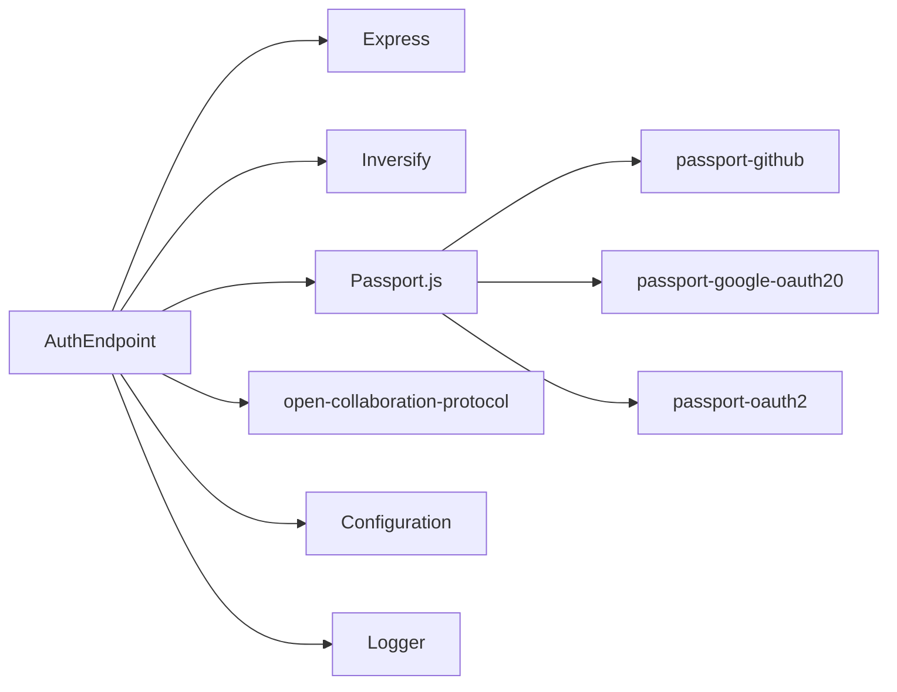

# 自定义认证提供者

## 简介
本文档旨在为开发者提供实现自定义认证提供者（AuthEndpoint）的完整技术指导。基于 `auth-endpoint.ts` 中定义的抽象接口，详细说明如何扩展 OAuth、Keycloak 或简易登录机制以支持新的身份源。文档涵盖中间件集成模式、Token 验证逻辑、用户信息映射、会话管理策略，并结合现有实现展示请求拦截、回调处理与错误传播的最佳实践。同时提供安全建议和可复用的代码模板。

## 项目结构
本项目采用模块化设计，核心认证逻辑位于 `packages/open-collaboration-server/src/auth-endpoints/` 目录下。该目录包含抽象接口定义和多个具体实现：

- `auth-endpoint.ts`：定义了所有认证提供者必须实现的 `AuthEndpoint` 接口
- `oauth-endpoint.ts`：基于 Passport.js 的 OAuth 抽象基类及 GitHub/Google 实现
- `keycloak-endpoint.ts`：Keycloak OAuth 2.0 认证实现
- `simple-login-endpoint.ts`：简易表单登录实现

认证模块通过 Inversify 依赖注入框架集成到主应用中，由配置驱动激活。

## 核心组件
核心组件围绕 `AuthEndpoint` 接口构建，定义了认证提供者的标准行为契约。所有实现必须提供激活判断、启动逻辑、认证成功事件和协议提供者信息。

关键类型包括：
- `AuthEndpoint`：认证提供者接口
- `AuthSuccessEvent`：认证成功时发射的事件数据结构
- `UserInfo`：用户信息数据模型

这些组件共同构成了可扩展的认证体系基础。

## 架构概览
系统采用分层架构，认证模块作为独立组件通过 Express 中间件集成。整体流程如下：

## 详细组件分析

### AuthEndpoint 接口分析
`AuthEndpoint` 是所有认证提供者的基接口，定义了四个核心成员：

### OAuth 认证流程分析
OAuth 认证采用标准的重定向流程，包含两个关键端点：登录发起和回调处理。

### OAuthEndpoint 抽象类分析
`OAuthEndpoint` 为基于 OAuth 的认证提供通用实现框架，采用模板方法模式。

### Keycloak 实现分析
Keycloak 实现展示了如何集成企业级身份管理平台。

### 简易登录实现分析
简易登录提供无需第三方身份验证的快速登录方式。

## 依赖分析
认证模块依赖多个外部库和内部组件：

## 性能考虑
- **会话管理**：避免在每次请求时重新验证 Token
- **缓存策略**：对用户信息进行适当缓存
- **并发处理**：使用 Promise.all() 并行处理事件监听器
- **连接池**：数据库连接应使用连接池管理
- **超时设置**：为外部 API 调用设置合理的超时

## 故障排除指南
常见问题及解决方案：

### 缺失 Token 参数
**现象**：返回 "Error: Missing token parameter in request"  
**原因**：客户端未在登录请求中包含 token 参数  
**解决方案**：确保在发起登录请求时包含 token 查询参数

### 重定向 URL 不在白名单
**现象**：返回 "Error: Redirect URL not in whitelist"  
**原因**：配置中的 `oct-redirect-url-whitelist` 未包含目标域名  
**解决方案**：在配置文件中添加完整的域名到白名单

### Passport 认证失败
**现象**：返回 "Error retrieving user info"  
**原因**：第三方身份提供商返回错误或用户拒绝授权  
**解决方案**：检查客户端 ID/密钥配置，验证回调 URL 是否正确

### 简易登录失败
**现象**：返回 "No token provided" 或 "No user provided"  
**原因**：POST 请求缺少必要字段  
**解决方案**：确保请求体包含 token 和 user 字段

## 结论
本文档详细解析了自定义认证提供者的实现机制。通过继承 `AuthEndpoint` 接口或 `OAuthEndpoint` 抽象类，开发者可以轻松集成新的身份验证源。关键要点包括：
- 遵循接口契约实现必要的方法
- 利用配置驱动激活机制
- 正确处理认证成功事件
- 实施适当的安全措施
- 遵循错误处理最佳实践

该架构设计灵活、可扩展，支持多种认证方式的共存与管理。