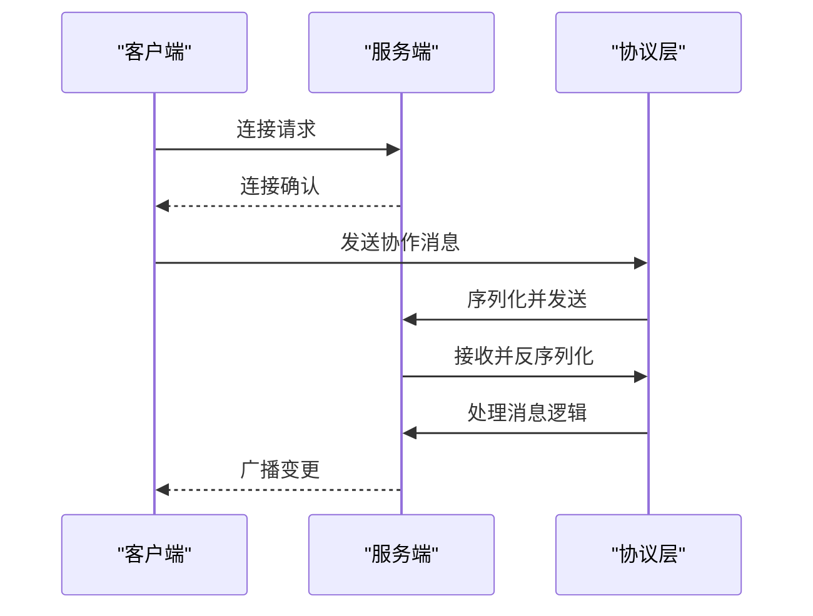

# 技术栈与架构

## 项目概述

本项目是一个基于开源技术的实时协作工具套件，旨在提升远程团队在集成开发环境（IDE）中的协作效率。系统采用 TypeScript 构建，支持多用户实时共享代码编辑状态，包括光标位置、文本选择和文档变更。整体架构由多个 npm 包组成，采用 Monorepo 管理模式，涵盖客户端、服务端、协议层、AI 代理等多个组件。

系统工作流程为：一名用户作为主机启动协作会话，其他用户通过邀请加入。IDE 扩展将主机的工作区内容分发给参与者，并实时同步编辑行为。所有变更通过 WebSocket 或 Socket.IO 进行实时通信，结合 Yjs 实现分布式文档同步，确保数据一致性。

## 技术选型详解

### TypeScript 作为主要语言

本项目全面采用 **TypeScript** 作为核心开发语言，主要基于以下优势：

- **类型安全**：在编译期捕获类型错误，减少运行时异常，提升代码可靠性。
- **开发体验**：提供智能提示、自动补全和重构支持，显著提升开发效率。
- **可维护性**：清晰的接口定义和类型契约，便于大型项目的长期维护。
- **生态兼容**：无缝兼容 JavaScript 生态，同时支持现代 ES 特性。

项目根目录的 `tsconfig.json` 文件统一配置了编译选项，各子包继承此配置，确保类型系统一致性。

## 核心依赖分析

### Yjs：分布式文档同步

**Yjs** 是一个用于构建实时协作应用的开源库，采用 **CRDT（无冲突复制数据类型）** 算法实现最终一致性。在本项目中，`open-collaboration-yjs` 包封装了 Yjs 的核心功能，提供文档同步能力。

其主要职责包括：
- 创建和管理共享文档（`Y.Doc`）
- 处理文本编辑操作的冲突合并
- 提供与 Monaco 编辑器的集成适配

### Socket.IO/WebSocket：实时通信

项目采用 **Socket.IO** 和原生 **WebSocket** 双协议支持，确保在不同网络环境下都能建立稳定连接。

- `open-collaboration-protocol` 包中的 `websocket-transport.ts` 和 `socket-io-transport.ts` 分别实现了两种传输层。
- `socket.io-client` 和 `socket.io` 分别用于客户端和服务端的连接管理。
- 支持自动重连、心跳检测和消息确认机制。



### Express：服务端框架

`open-collaboration-server` 使用 **Express** 作为 Web 服务框架，负责处理 HTTP 请求、静态资源服务和 API 路由。

关键功能包括：
- 提供登录页面（`static/login.html`）
- 集成 Passport 实现多种认证方式（GitHub、Google、OAuth2）
- 通过 `app.ts` 启动服务，支持开发模式热重载


### InversifyJS：依赖注入（应该不重要）

项目采用 **InversifyJS** 实现依赖注入（DI），提升代码的可测试性和模块化程度。

- 通过 `reflect-metadata` 启用装饰器元数据
- `inversify-module.ts` 定义了依赖容器的绑定规则
- 使用 `@injectable()` 和 `@inject()` 装饰器管理服务生命周期

该模式使得组件间解耦，便于单元测试和替换实现。

### msgpackr 和 fflate：消息传输优化（应该不重要）

为了提升实时通信效率，项目采用以下优化技术：

- **msgpackr**：使用 MessagePack 二进制格式序列化消息，相比 JSON 更小、更快。
- **fflate**：对消息进行压缩，进一步减少网络传输体积。

这些优化在 `open-collaboration-protocol` 的 `messaging/compression.ts` 和 `encoding.ts` 中实现，显著降低带宽消耗，提升响应速度。

## Monorepo 与构建流程

项目采用 **npm workspaces** 实现 Monorepo 架构，所有子包位于 `packages/` 目录下。

### 工作区配置

根目录 `package.json` 中定义了 workspaces：

```json
"workspaces": [
  "packages/*"
]
```

这使得所有子包可以共享依赖、统一脚本和版本管理。

### 构建工具链

- **esbuild**：用于快速打包 TypeScript，`scripts/esbuild.ts` 配置了构建逻辑。
- **Vite**：前端开发服务器，提供极速热更新。
- 各子包通过 `build` 脚本调用相应工具，如 `open-collaboration-server` 使用 `tsx scripts/esbuild.ts`。

## 前端开发与 Vite 优势

虽然项目主要为 IDE 扩展，但 `open-collaboration-monaco` 提供了与 Monaco 编辑器的集成。

**Vite** 的优势包括：
- 基于 ES 模块的原生支持，启动速度快
- 热模块替换（HMR）几乎瞬时更新
- 内置 TypeScript、JSX、CSS 支持
- 与现代前端工具链无缝集成

## 服务端架构与 Express

`open-collaboration-server` 是核心服务端组件，职责包括：

- 管理用户会话（`user-manager.ts`）
- 维护协作房间（`room-manager.ts`）
- 处理客户端连接（`peer-manager.ts`）
- 转发消息（`message-relay.ts`）
- 认证授权（`auth-endpoints/`）

其架构基于 Express + Socket.IO + InversifyJS，形成清晰的分层结构。

## 实时通信机制

系统通过 **Socket.IO** 建立双向通信通道，实现低延迟消息传递。

- 客户端通过 `open-collaboration-protocol` 连接服务端
- 服务端使用 `socket.io` 监听事件
- 消息经 `message-relay.ts` 路由到目标房间
- 使用 `channel.ts` 管理广播范围

该机制支持大规模并发连接，具备良好的扩展性。

## 依赖注入与 InversifyJS

`InversifyJS` 在服务端实现控制反转，关键实现位于：

- `inversify-module.ts`：定义容器绑定
- 各服务类使用 `@injectable()` 标记
- 构造函数通过 `@inject()` 获取依赖

此模式解耦了组件创建与使用，便于替换实现和单元测试。

## 消息传输优化

`open-collaboration-protocol` 包通过以下方式优化传输：

1. **序列化**：使用 `msgpackr` 替代 JSON
2. **压缩**：使用 `fflate` 进行 GZIP 级别压缩
3. **编码**：支持二进制安全的 Base64 编码

这些优化在高频率编辑场景下显著降低网络负载。

## 版本兼容性与升级策略

项目通过以下方式管理版本：

- 所有子包版本保持同步（~0.3.x）
- 使用 `~` 限定符允许补丁更新
- 核心依赖如 `socket.io`、`express` 指定兼容版本
- 通过 `engines` 字段声明 Node.js 和 npm 版本要求（>=20.10.0）

升级策略建议：
- 先升级核心协议包（`open-collaboration-protocol`）
- 同步更新所有依赖该包的组件
- 测试跨版本兼容性，避免破坏性变更

## 容器化部署配置

项目提供完整的 Docker 支持，便于生产部署。

### Dockerfile

定义了服务端镜像构建流程：
- 基于 Node.js 22 镜像
- 安装依赖并构建
- 暴露指定端口
- 启动服务

### docker-compose.yml

编排多容器应用：
- 定义 `oct-server` 服务
- 配置端口映射
- 设置环境变量
- 支持一键启动（`docker compose up`）

```bash
docker compose build
docker compose up -d
```
