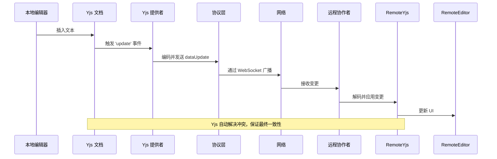

# 数据模型与状态同步

## 简介
本文档深入探讨了基于 Yjs 的分布式数据模型与实时状态同步机制。重点分析 `open-collaboration-yjs` 模块如何利用 Yjs 作为底层 CRDT（无冲突复制数据类型）引擎，实现多用户协作场景下的无冲突文档同步。文档详细说明了 `yjs-provider.ts` 如何将 Yjs 文档与协作协议连接，实现变更捕获与广播；`yjs-normalized-text.ts` 如何处理跨平台文本规范化问题，确保编辑器间内容一致性；并阐述了用户存在性（Presence）模型、光标同步机制以及冲突自动解决策略。

## 项目结构
`open-collaboration-yjs` 是协作系统的核心数据同步模块，位于 `packages/open-collaboration-yjs` 目录下。该模块提供 Yjs 与上层协作协议之间的桥梁，封装了文档同步、状态广播和文本规范化等关键功能。

## 核心组件
本模块的核心组件包括 `OpenCollaborationYjsProvider` 和 `YjsNormalizedTextDocument`，分别负责 Yjs 文档与网络协议的桥接，以及跨平台文本内容的规范化处理。

## 架构概览
整个同步机制基于 Yjs 的 CRDT 模型，通过 `OpenCollaborationYjsProvider` 将本地 Yjs 文档的变更与网络层 `ProtocolBroadcastConnection` 进行双向绑定。当本地文档修改时，变更被编码并通过协议广播；当收到远程变更时，解码后应用到本地 Yjs 文档，Yjs 自动处理合并与冲突。`YjsNormalizedTextDocument` 则作为适配层，确保不同编辑器（如 VS Code、Monaco）在处理换行符（CRLF vs LF）时保持一致。

## 详细组件分析

### OpenCollaborationYjsProvider 分析
`OpenCollaborationYjsProvider` 类是 Yjs 与协作协议之间的核心适配器。它继承自 `ObservableV2`，监听 Yjs 文档和感知（Awareness）对象的变更，并通过 `ProtocolBroadcastConnection` 将变更广播给其他协作者。

#### 关键方法分析

- **`yjsUpdateHandler`**: 当本地 Yjs 文档更新时触发。它检查变更来源是否为本地（`origin !== this`），避免循环广播，然后将变更编码并通过 `dataUpdate` 发送。
- **`ocpDataUpdateHandler`**: 当收到远程数据更新时触发。它使用 `y-protocols/sync` 解码并应用变更到本地文档，实现双向同步。
- **`connect`**: 初始化连接时，发送同步步骤1和步骤2的数据，并查询和广播用户存在性信息，确保新加入的用户能获取完整状态。

### YjsNormalizedTextDocument 分析

`YjsNormalizedTextDocument` 解决了不同操作系统和编辑器间换行符不一致的问题（如 Windows 的 CRLF `\r\n` 与 Unix 的 LF `\n`）。它维护一个规范化后的文本副本，确保所有协作者看到的内容在逻辑上一致。

## 结论
`open-collaboration-yjs` 模块通过 Yjs 的 CRDT 引擎，为协作系统提供了强大、可靠的状态同步能力。`OpenCollaborationYjsProvider` 实现了 Yjs 与网络协议的无缝集成，而 `YjsNormalizedTextDocument` 则解决了跨平台文本编辑的关键痛点。该设计保证了操作的最终一致性，支持离线编辑，并能自动解决并发冲突，是构建实时协作应用的理想基础。