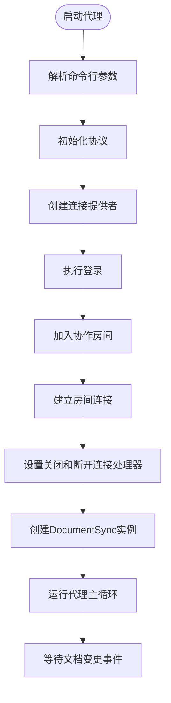

# open-collaboration-agent 模块

## 简介
`open-collaboration-agent` 是一个基于命令行的 AI 协作代理模块，旨在通过自然语言指令实时协助开发者在共享协作环境中进行代码编辑。该模块能够连接到指定的协作房间，监听文档变更事件，并在检测到特定触发词（如 `@agent`）时，调用大语言模型（LLM）生成智能建议或代码修改，最终将建议自动应用到共享文档中。本技术文档将深入分析其核心实现机制，涵盖从 CLI 启动、文档同步、提示词工程到 AI 响应处理的完整流程。

## 项目结构

`open-collaboration-agent` 模块位于 `packages/open-collaboration-agent` 目录下，其 `src` 子目录包含以下核心源文件：
- `main.ts`: 应用程序入口点，负责解析命令行参数并启动代理。
- `agent.ts`: 核心逻辑文件，处理与协作服务器的连接、房间加入以及文档变更事件的监听与响应。
- `document-sync.ts`: 负责与 Yjs 协同编辑引擎集成，实现文档的实时同步与变更分析。
- `prompt.ts`: 提示词工程的核心，负责与 LLM 交互，生成代码修改建议。
- `agent-util.ts`: 提供通用工具函数，如加载动画、文本变更应用等。

该模块依赖于 `open-collaboration-protocol` 和 `open-collaboration-yjs` 等底层库来处理网络通信和协同编辑状态同步。

## 核心组件
`open-collaboration-agent` 的核心功能由 `main.ts`、`agent.ts`、`prompt.ts` 和 `document-sync.ts` 四个文件协同完成。`main.ts` 作为入口，通过 `commander` 库解析 `-s` (服务器地址)、`-m` (LLM 模型) 和 `-r` (房间ID) 等命令行参数，并调用 `agent.ts` 中的 `startCLIAgent` 函数。`agent.ts` 负责建立与协作服务器的连接，加入指定房间，并创建 `DocumentSync` 实例来监听文档变化。当检测到用户输入包含触发词的提示时，`agent.ts` 会调用 `prompt.ts` 中的 `executePrompt` 函数。`prompt.ts` 则负责准备上下文、调用 LLM 并解析返回结果。最后，`agent-util.ts` 提供了将 LLM 生成的修改应用到文档的工具函数。

## 架构概览

该模块采用事件驱动的架构。其工作流程始于 CLI 启动，代理通过 `open-collaboration-protocol` 连接到服务器并加入房间。一旦连接成功，`DocumentSync` 类便开始监听 Yjs 文档的变更事件。当用户在编辑器中输入并以换行符结束一行，且该行包含 `@agent` 触发词时，`agent.ts` 中的事件处理器被激活。它会提取用户提示，调用 `prompt.ts` 模块。`prompt.ts` 模块会根据提示位置截取相关代码上下文，构建符合 LLM API 要求的请求，并发送给 OpenAI 或 Anthropic 的 API。收到响应后，`prompt.ts` 将解析出的修改区域返回给 `agent.ts`，后者再通过 `agent-util.ts` 中的 `applyChanges` 函数将修改应用到共享文档中。


## 详细组件分析

### CLI 启动与连接流程分析
`main.ts` 是整个代理的启动入口。它使用 `commander` 库定义了一个命令行界面，允许用户指定服务器地址、使用的 LLM 模型和要加入的房间 ID。当用户执行命令时，`main.ts` 会调用 `agent.ts` 中的 `startCLIAgent` 函数。

`startCLIAgent` 函数是连接逻辑的核心。它首先初始化 `open-collaboration-protocol`，然后创建一个 `ConnectionProvider` 实例，并使用提供的服务器地址进行配置。接着，它调用 `login` 方法，该方法会触发一个基于浏览器的登录流程（通过 `authenticationHandler` 回调打印登录 URL）。登录成功后，代理会调用 `joinRoom` 加入指定的协作房间，并使用返回的 `roomToken` 建立最终的连接。连接建立后，会设置信号处理器以确保优雅关闭。



### 提示词工程与AI交互分析
`prompt.ts` 文件是 AI 交互的核心，其设计体现了精细的提示词工程。

`executePrompt` 函数接收文档内容、用户提示、提示在文档中的偏移量和模型名称。首先，它调用 `getProviderForModel` 根据模型名（如 `claude-3-5-sonnet-latest` 或 `gpt-4o`）选择对应的 AI SDK 提供商（Anthropic 或 OpenAI）。然后，它调用 `prepareDocumentForLLM` 函数，该函数会根据 `promptOffset` 为中心，前后各截取最多 `CONTEXT_LIMIT` (12000字符) 的内容，确保发送给 LLM 的上下文既包含足够的信息，又不超出模型的上下文窗口限制。

构建请求时，系统会使用一个精心设计的 `systemPrompt`。该提示词明确规定了 AI 的角色（代码代理）、输入格式（包含用户提示的代码片段）以及**两种严格的输出格式**：1) 返回整个修改后的文件；2) 返回仅包含修改区域的片段，每个片段前后必须有至少一行未修改的代码作为上下文，并用 `==========` 分隔多个修改区域。这种结构化的输出格式是实现自动化修改的关键。

最后，`parseOutputRegions` 函数负责解析 LLM 的响应。它会移除可能存在的 `[...]` 等占位符，并根据 `==========` 分隔符将响应分割成多个独立的修改区域，以便后续应用。

### 文档同步与变更分析

`document-sync.ts` 文件负责与底层的协同编辑引擎进行交互。它基于 Yjs 和 `open-collaboration-yjs` 库，实现了 `DocumentSync` 类。

该类的核心是 `followDocument` 方法，它会监听协作房间内主机（host）的光标和选区变化。当主机打开一个新文件时，`DocumentSync` 会订阅该文件对应的 Yjs `Y.Text` 类型，并通过 `handleContentChange` 事件处理器来捕获所有变更。

`handleContentChange` 会将 Yjs 的 Delta 变更（包含 `retain`, `insert`, `delete` 操作）转换为更易理解的 `DocumentChange` 对象（`insert` 或 `delete` 类型），并包含字符偏移量和行列位置。这些变更事件通过 `onDocumentChange` 回调暴露给上层的 `agent.ts`，使其能够精确地知道文档的哪一部分发生了变化。

此外，`DocumentSync` 还提供了 `applyEdit` 方法，允许代理将 AI 生成的修改反向应用到 Yjs 文档中，从而实现对共享文档的修改。

### 通用工具函数分析
`agent-util.ts` 提供了两个关键的工具函数。

`animateLoadingIndicator` 函数用于在用户触发 AI 响应后，在光标位置显示一个旋转的加载动画（`|`, `/`, `-`, `\`）。它通过定时调用 `documentSync.applyEdit` 来更新动画字符，并接受一个 `AbortSignal` 用于在响应返回或出错时停止动画并清除字符。这提升了用户体验，让用户知道代理正在工作。

`applyChanges` 函数负责将 `prompt.ts` 解析出的修改区域应用到当前文档。其核心是 `locateChangeInDocument` 函数，它通过一个智能的上下文匹配算法来定位修改位置。该算法首先在文档中寻找修改区域的最长前缀匹配，然后寻找最长后缀匹配，从而确定需要被替换的代码范围。这种方法即使在文档已发生其他变更的情况下，也能尽可能准确地定位修改点，提高了鲁棒性。定位成功后，`applyChanges` 会计算出字符偏移量，并调用 `documentSync.applyEdit` 执行最终的编辑操作。

## 依赖分析
`open-collaboration-agent` 模块依赖于多个内部和外部包，形成了清晰的依赖链。

```mermaid
graph LR
A[open-collaboration-agent] --> B[open-collaboration-protocol]
A --> C[open-collaboration-yjs]
A --> D[@ai-sdk/anthropic]
A --> E[@ai-sdk/openai]
A --> F[commander]
A --> G[dotenv]
B --> H[yjs]
C --> H
D --> I[@ai-sdk/provider]
E --> I
```

## 性能考量
该模块的性能主要受以下几个因素影响：
1.  **网络延迟**：与协作服务器和 LLM API 的网络延迟是主要瓶颈，尤其是在处理大型文件或复杂提示时。
2.  **上下文截取**：`prepareDocumentForLLM` 函数通过截取上下文有效控制了发送给 LLM 的数据量，避免了不必要的开销，但可能在处理跨文件或大范围重构时丢失全局上下文。
3.  **事件处理**：代理采用防抖机制（通过 `state.executing` 标志），确保在前一个 AI 请求完成前不会启动新的请求，避免了并发冲突和资源浪费。
4.  **Yjs 同步**：底层的 Yjs 引擎负责高效的 OT/CRDT 操作同步，确保了文档变更的实时性和一致性。

## 结论
`open-collaboration-agent` 模块成功地将大语言模型的智能融入到实时协作开发环境中。通过清晰的模块划分和事件驱动的设计，它实现了从 CLI 启动、服务器连接、文档变更监听到 AI 提示生成与结果应用的完整闭环。其核心创新在于利用结构化的提示词和输出格式，使得 AI 生成的代码修改可以被自动化、精确地应用到共享文档中，极大地提升了协作效率。未来可通过支持更多 LLM、优化上下文管理、增加修改预览功能等方式进一步增强其能力。