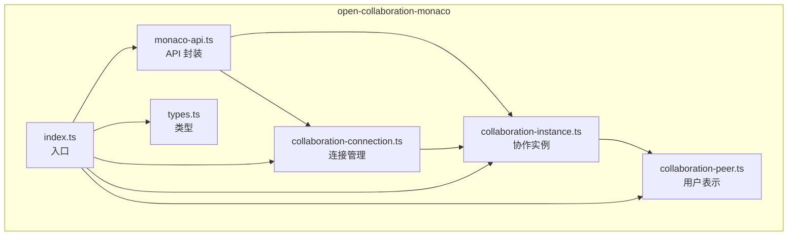
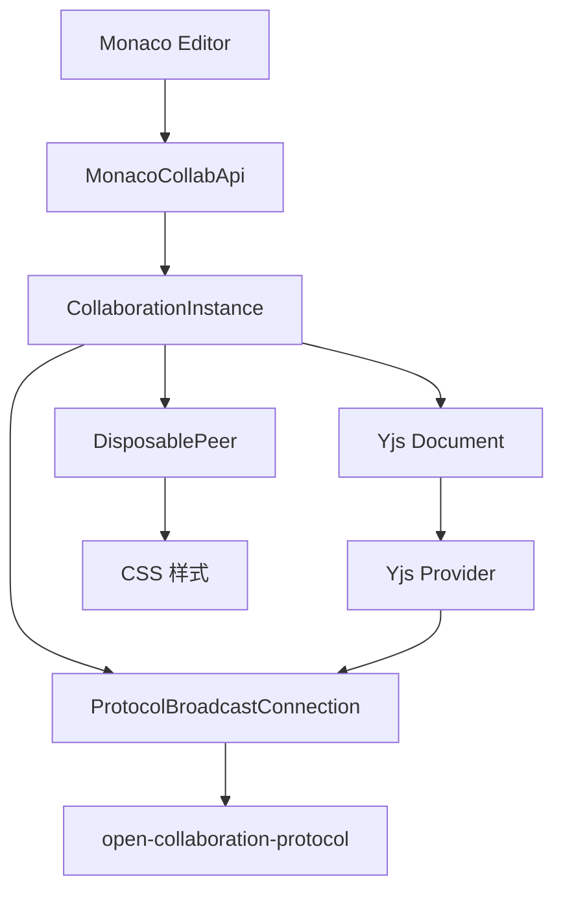
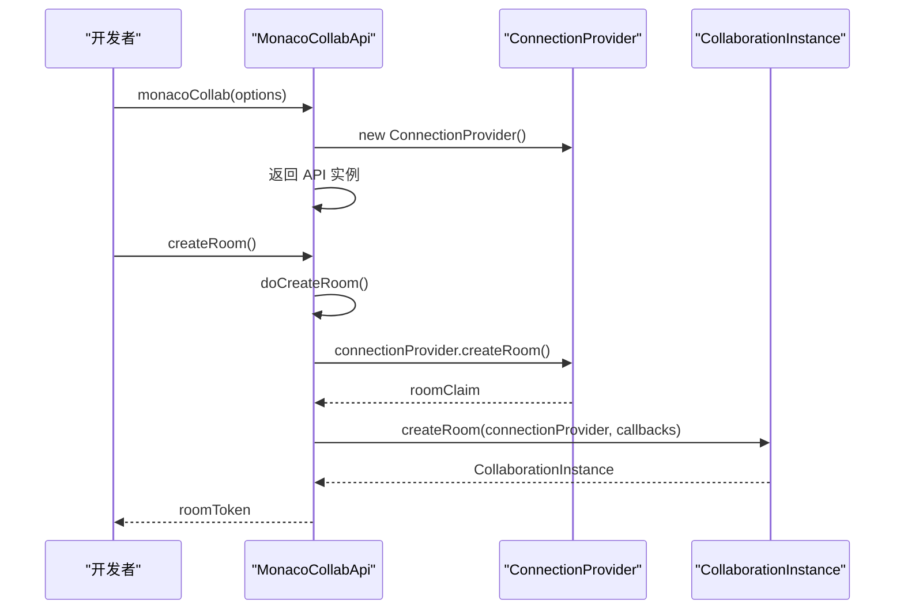
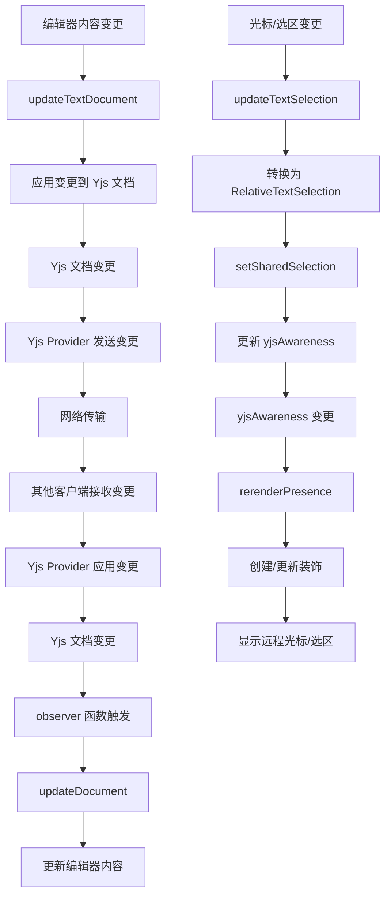
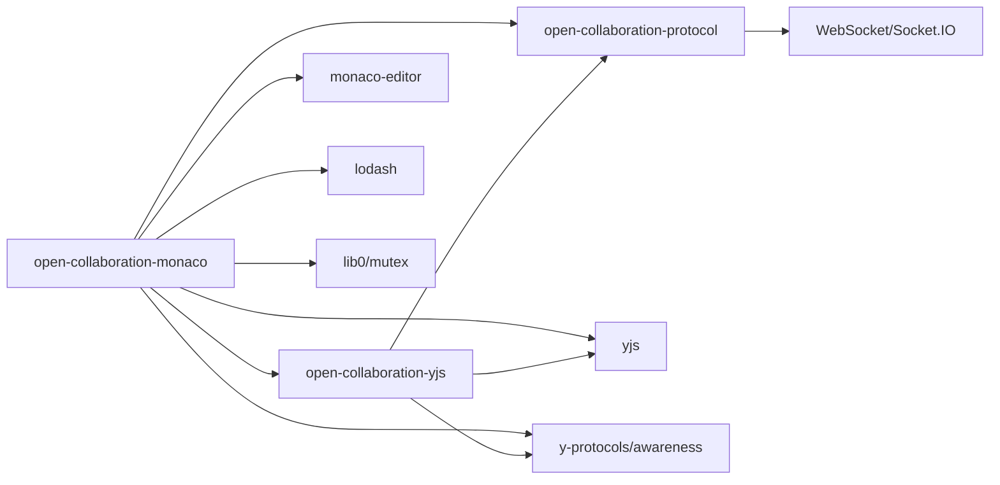

# open-collaboration-monaco 模块

## 简介

`open-collaboration-monaco` 是一个基于 TypeScript 的轻量级 Web 端协作编辑模块，旨在为 Monaco Editor 提供实时协作功能。该模块通过封装底层通信协议（如 `open-collaboration-protocol` 和 `Yjs`），实现了多用户同时编辑、光标同步、选区共享、用户跟随等核心协作特性。其设计目标是简化开发者在 Web 应用中集成实时协作功能的复杂度，提供清晰的 API 接口和灵活的配置选项。

本技术文档将深入解析该模块的设计与实现，重点阐述其如何通过 `monaco-api.ts` 封装 Monaco Editor API，并注入协作能力；如何通过 `collaboration-instance.ts` 和 `collaboration-connection.ts` 管理协作实例的生命周期与连接；并通过 `example.ts` 和 `index.html` 展示一个完整的前端集成示例。

## 项目结构

`open-collaboration-monaco` 模块位于 `packages/open-collaboration-monaco` 目录下，其 `src` 目录包含以下核心文件：
- `monaco-api.ts`：对外暴露的主要 API 封装。
- `collaboration-instance.ts`：协作实例的核心逻辑，管理编辑器、Yjs 文档和用户状态。
- `collaboration-connection.ts`：处理与协作服务器的连接和房间管理。
- `collaboration-peer.ts`：表示远程用户（对等体）并管理其光标和选区的视觉呈现。
- `types.ts`：类型定义的重新导出。
- `index.ts`：模块的入口点，导出所有公共 API。

此外，`vite.config.ts` 和 `index.html` 提供了开发和演示环境。



## 核心组件

`open-collaboration-monaco` 的核心功能由 `MonacoCollabApi` 类提供，它封装了所有协作相关的操作。用户通过 `monacoCollab(options)` 工厂函数创建一个 `MonacoCollabApi` 实例。该实例负责管理与协作服务器的连接、创建或加入协作房间、以及将协作功能绑定到 Monaco Editor 实例上。

关键功能包括：
- **房间管理**：`createRoom()` 和 `joinRoom(roomToken)` 用于创建新房间或加入现有房间。
- **用户认证**：`login()` 处理用户登录流程。
- **编辑器集成**：`setEditor(editor)` 将一个 Monaco Editor 实例与协作功能关联。
- **状态监听**：`onUsersChanged(evt)` 允许注册回调函数，以监听房间内用户列表的变化。
- **用户跟随**：`followUser(id?)` 实现跟随特定用户的编辑位置。

## 架构概览

该模块的架构遵循分层设计，从上到下分为 API 层、实例层、连接层和协议层。



## 详细组件分析

### monaco-api.ts 分析

`monaco-api.ts` 文件定义了 `MonacoCollabApi` 接口和 `monacoCollab` 工厂函数，是开发者与模块交互的主要入口。

#### API 接口定义

```typescript
export type MonacoCollabApi = {
    createRoom: () => Promise<string | undefined>;
    joinRoom: (roomToken: string) => Promise<string | undefined>;
    setEditor: (editor: monaco.editor.IStandaloneCodeEditor) => void;
    onUsersChanged: (evt: UsersChangeEvent) => void;
    followUser: (id?: string) => void;
    // ... 其他方法
}
```

此接口清晰地暴露了所有必要的协作功能。

#### 工厂函数实现

`monacoCollab(options)` 函数接收配置选项（如 `serverUrl` 和 `callbacks`），初始化一个 `ConnectionProvider`，并返回一个包含所有功能的 `MonacoCollabApi` 对象。该对象内部的方法（如 `doCreateRoom`, `doSetEditor`）会调用下层模块（`collaboration-connection.ts` 和 `collaboration-instance.ts`）来执行具体逻辑。



### collaboration-instance.ts 分析

`collaboration-instance.ts` 是协作功能的核心，`CollaborationInstance` 类负责协调编辑器、Yjs 文档和用户状态。

#### 核心数据结构

- `yjs: Y.Doc`：Yjs 文档，用于存储和同步编辑内容。
- `yjsAwareness: Awareness`：Yjs 的 Awareness 模块，用于共享用户光标、选区等非文本状态。
- `yjsProvider: OpenCollaborationYjsProvider`：连接 Yjs 文档与底层通信协议的适配器。
- `peers: Map<string, DisposablePeer>`：存储房间内所有其他用户的 `DisposablePeer` 实例。

#### 编辑器事件同步

该类通过监听 Monaco Editor 的事件来实现双向同步：

- **编辑器 -> Yjs**：当 `onDidChangeModelContent` 事件触发时，`updateTextDocument` 方法会将编辑操作转换为 Yjs 操作，并应用到 `yjs` 文档上。
- **Yjs -> 编辑器**：当 Yjs 文档发生变化时，`registerTextObserver` 中的 `observer` 函数会将 Yjs 的变更转换为 Monaco 的编辑操作，并通过 `updateDocument` 应用到编辑器上，从而实现内容同步。

#### 光标与选区同步

光标和选区信息通过 `yjsAwareness` 共享。`updateTextSelection` 方法在 `onDidChangeCursorSelection` 事件中被调用，它将 Monaco 的选区转换为 Yjs 的相对位置（`RelativeTextSelection`），然后通过 `setSharedSelection` 更新到 `yjsAwareness` 中。`rerenderPresence` 方法则负责监听 `yjsAwareness` 的变化，并为每个远程用户的选区创建或更新编辑器装饰（`IModelDeltaDecoration`），从而在界面上显示其光标和选区。



### collaboration-connection.ts 分析

`collaboration-connection.ts` 文件提供了与协作服务器建立连接和管理房间的高层函数。

#### 连接与房间管理

- `login(connectionProvider)`：处理用户登录逻辑，确保用户已通过身份验证。
- `createRoom(connectionProvider, callbacks)`：调用 `connectionProvider.createRoom()` 创建一个新房间，并使用 `connectToRoom` 函数建立 `CollaborationInstance`。
- `joinRoom(connectionProvider, callbacks, roomId)`：尝试加入一个现有房间，成功后同样通过 `connectToRoom` 创建 `CollaborationInstance`。
- `connectToRoom(...)`：这是核心函数，它使用 `connectionProvider.connect()` 建立与房间的通信连接，然后用该连接创建一个新的 `CollaborationInstance`。

这些函数将底层 `open-collaboration-protocol` 的复杂性封装起来，为上层提供了简洁的异步接口。

### collaboration-peer.ts 分析

`collaboration-peer.ts` 文件定义了 `DisposablePeer` 类，用于表示协作房间中的一个远程用户。

#### 视觉表示

`DisposablePeer` 的主要职责是为每个远程用户生成唯一的视觉样式，包括光标和选区的 CSS 类名和颜色。

- `createColor()`：从预设颜色列表中按顺序选取颜色，用尽后生成随机颜色。
- `generateCSS()`：动态创建 `<style>` 标签，将生成的 CSS 规则注入到页面的 `<head>` 中。
- `createDecorations()`：根据用户 ID 和颜色，生成一组唯一的 CSS 类名（如 `peer-abc123-cursor`），这些类名将用于编辑器装饰。

当 `rerenderPresence` 方法需要显示一个用户的光标时，它会使用 `DisposablePeer` 实例中的 `decoration` 对象来获取正确的 CSS 类名。

## 依赖分析

`open-collaboration-monaco` 模块依赖于多个外部库和内部模块，形成了一个清晰的依赖链。



## 性能考量

该模块在性能方面进行了多项优化：

- **变更节流（Throttling）**：`getOrCreateThrottle` 函数使用 `lodash.debounce` 对文档同步操作进行节流，避免在用户快速输入时产生过多的网络消息和编辑器更新，从而提升响应速度。
- **互斥锁（Mutex）**：`yjsMutex` 用于确保 Yjs 操作的原子性，防止在处理异步事件时出现竞态条件。
- **增量更新**：编辑器内容的同步是增量的，`createEditsFromTextEvent` 将 Yjs 的变更转换为 Monaco 的 `IIdentifiedSingleEditOperation`，只更新发生变化的部分，而不是替换整个文档。
- **动态样式注入**：`generateCSS` 在需要时才为每个用户创建 CSS 规则，避免了预定义大量无用样式的开销。

## 故障排除指南

### 常见问题
1.  **无法连接到服务器**：检查 `serverUrl` 配置是否正确，确保服务器正在运行且网络可达。
2.  **登录失败**：确认 `loginPageOpener` 回调是否正确处理了登录页面的打开。如果使用 Cookie 认证，检查 `useCookieAuth` 选项和服务器的 Cookie 配置。
3.  **内容不同步**：检查 `ConnectionProvider` 是否已正确连接，`CollaborationInstance` 是否已通过 `setEditor` 绑定编辑器。查看浏览器控制台是否有 Yjs 或网络相关的错误。
4.  **光标/选区不显示**：确认 `yjsAwareness` 是否正常工作。检查 `DisposablePeer` 是否成功创建了 CSS 规则，可以在浏览器开发者工具的 `<head>` 标签中搜索 `peer-` 前缀的类名。

## 结论

`open-collaboration-monaco` 模块成功地将复杂的实时协作功能封装成一个易于使用的 API。它通过分层架构，清晰地分离了关注点：`monaco-api.ts` 提供简洁的接口，`collaboration-instance.ts` 管理核心协作逻辑，`collaboration-connection.ts` 处理网络连接。该模块利用 Yjs 实现了高效、可靠的内容同步，并通过动态 CSS 注入实现了直观的用户光标和选区可视化。

对于希望在 Web 应用中集成实时协作功能的开发者，`open-collaboration-monaco` 提供了一个强大且灵活的解决方案。通过遵循本文档中的指南，开发者可以快速地将 Monaco Editor 变成一个功能完备的协作式代码编辑器。