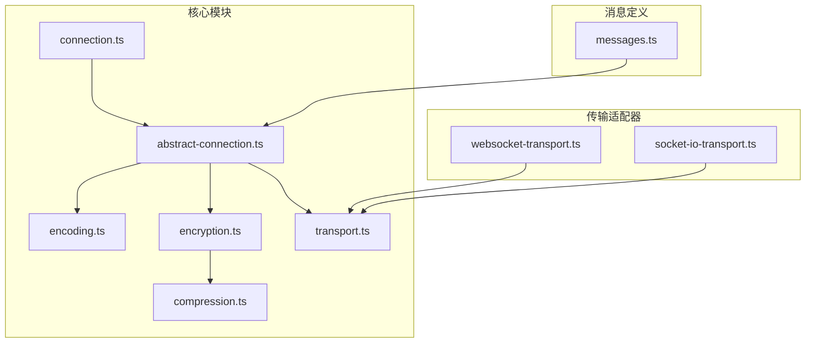
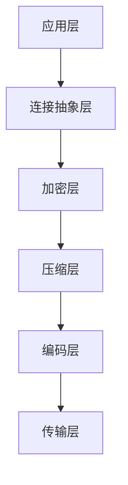
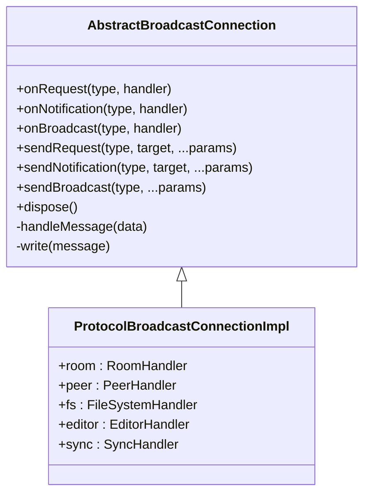
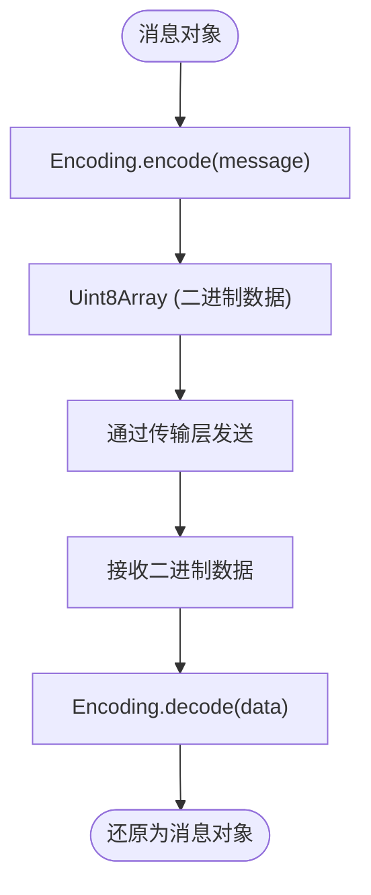
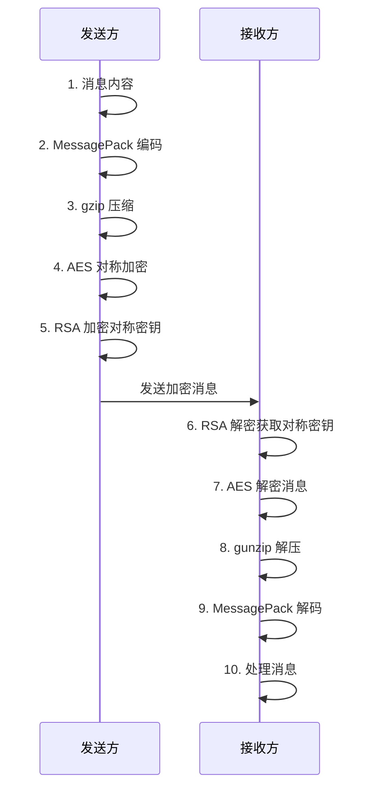
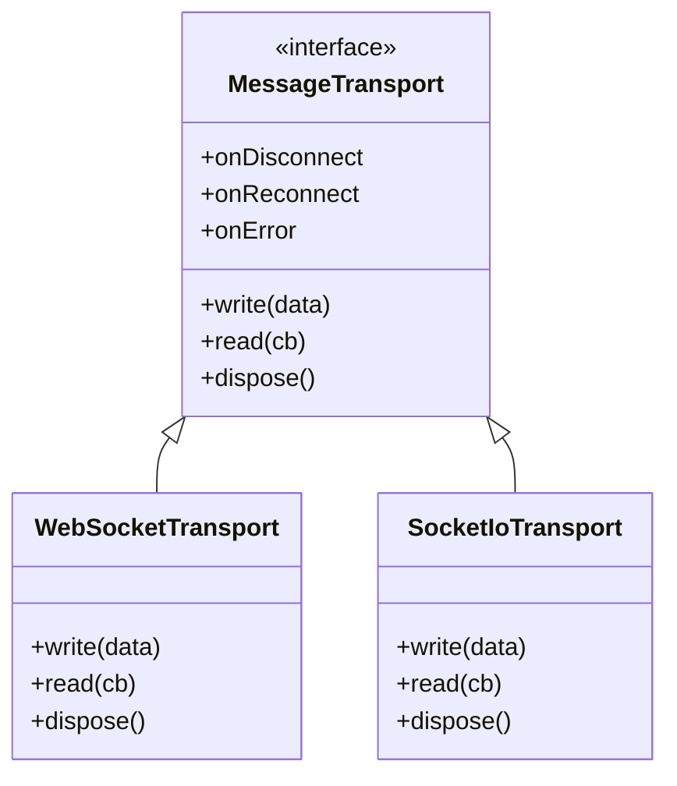
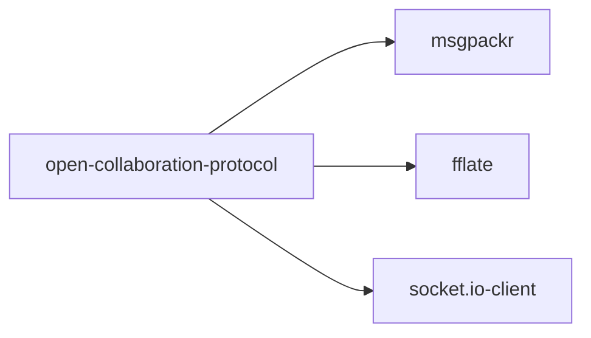

# open-collaboration-protocol 模块

## 简介
`open-collaboration-protocol` 是一个用于实现实时协作系统通信的模块，旨在为跨平台的客户端与服务端提供统一、安全、高效的通信基础。该模块采用分层设计，集成了连接抽象、消息编码、压缩、加密和多种传输适配器，确保在不同网络环境下都能稳定运行。其主要设计目标是支持多用户协同编辑、文件同步、状态感知等场景，同时保证数据的机密性与完整性。

## 项目结构
该模块位于 `packages/open-collaboration-protocol` 目录下，采用清晰的分层架构，主要分为以下几个子目录：

- `messaging`：包含消息处理的核心逻辑，如编码、加密、压缩和连接抽象。
- `transport`：提供不同的传输适配器，支持 WebSocket 和 Socket.IO。
- `utils`：通用工具函数，如事件发射器、Promise 工具、加密辅助等。
- 根目录：包含主入口文件、配置文件和类型定义。

这种结构使得各功能模块职责分明，易于维护和扩展。

## 核心组件
本模块的核心是 `ProtocolBroadcastConnectionImpl` 类，它继承自 `AbstractBroadcastConnection`，实现了 `ProtocolBroadcastConnection` 接口。该类封装了房间管理、对等节点通信、文件系统操作、编辑器状态同步和数据同步等功能。通过组合不同的消息类型（请求、通知、广播），实现了灵活的通信机制。

## 架构概述
该模块采用分层架构，从下到上依次为：

1. **传输层**：负责底层数据传输，支持 WebSocket 和 Socket.IO。
2. **编码层**：使用 `msgpackr` 对消息进行序列化和反序列化。
3. **压缩层**：使用 `fflate` 对消息内容进行压缩，支持 `gzip` 算法。
4. **加密层**：使用非对称加密（RSA）保护对称密钥，对称加密（AES）保护消息内容。
5. **连接抽象层**：提供统一的 API，屏蔽底层传输和安全细节。

这种分层设计使得各层可以独立演进，提高了模块的可维护性和可扩展性。

## 详细组件分析

### 连接抽象分析
`AbstractBroadcastConnection` 是连接抽象的核心类，它定义了请求、通知和广播三种消息模式，并提供了相应的处理方法。该类通过 `MessageTransport` 接口与底层传输层解耦，支持多种传输方式。

#### 类图

### 消息编码分析
`Encoding` 命名空间使用 `msgpackr` 库对消息进行高效编码。MessagePack 是一种二进制序列化格式，相比 JSON 具有更小的体积和更快的解析速度，适合在网络上传输大量结构化数据。

### 加密与压缩分析
`Encryption` 和 `Compression` 命名空间共同实现了消息的安全传输。加密流程如下：

1. 生成对称密钥（AES）用于加密消息内容。
2. 使用接收方的公钥（RSA）加密对称密钥。
3. 将加密后的对称密钥和加密后的消息内容一起发送。

压缩流程则根据双方支持的算法协商最佳压缩方式，默认支持 `gzip`。

### 传输适配分析
模块提供了两种传输适配器：`WebSocketTransport` 和 `SocketIoTransport`。前者基于原生 WebSocket API，后者基于 `socket.io-client` 库，支持自动重连和断线恢复。

## 依赖分析
该模块依赖以下外部库：

- `msgpackr`：用于高效的消息序列化。
- `fflate`：用于消息压缩。
- `socket.io-client`：用于 Socket.IO 传输支持。

这些依赖通过命名空间封装，避免了直接暴露给上层应用，提高了模块的封装性和可替换性。

## 性能考虑
为了优化性能，模块采用了以下策略：

- 使用二进制格式（MessagePack）减少消息体积。
- 支持消息压缩，可显著降低带宽消耗。
- 对称加密与非对称加密结合，平衡安全与性能。
- 缓存加密密钥，避免重复计算。
- 提供配置选项，允许根据网络状况调整压缩阈值。

建议在高延迟或低带宽网络中启用压缩，并合理设置压缩阈值以避免小消息的压缩开销。

## 故障排查指南
常见问题及解决方案：

- **消息丢失**：检查网络连接是否稳定，确认传输层未抛出错误。
- **解码失败**：确保发送方和接收方使用相同的 MessagePack 版本。
- **加密失败**：验证公钥和私钥是否匹配，检查密钥缓存是否正确。
- **连接中断**：使用 `SocketIoTransport` 可自动重连，或手动监听 `onReconnect` 事件。

可通过监听 `onError` 和 `onConnectionError` 事件获取详细的错误信息。

## 结论
`open-collaboration-protocol` 模块通过分层设计和模块化架构，为实时协作系统提供了强大而灵活的通信基础。其支持加密、压缩和多种传输方式，确保了数据的安全性和传输效率。通过清晰的 API 和事件总线模式，使得上层应用可以专注于业务逻辑，而无需关心底层通信细节。该模块的设计理念和实现方式值得在类似场景中借鉴和应用。