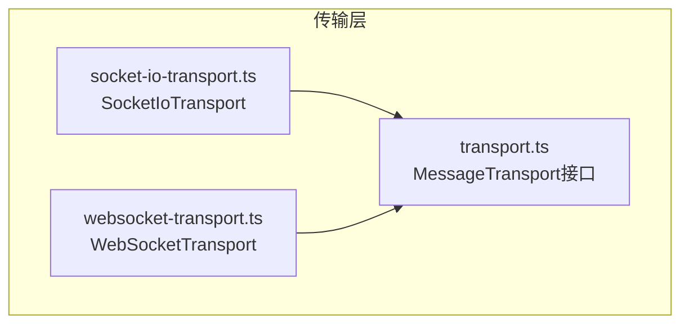
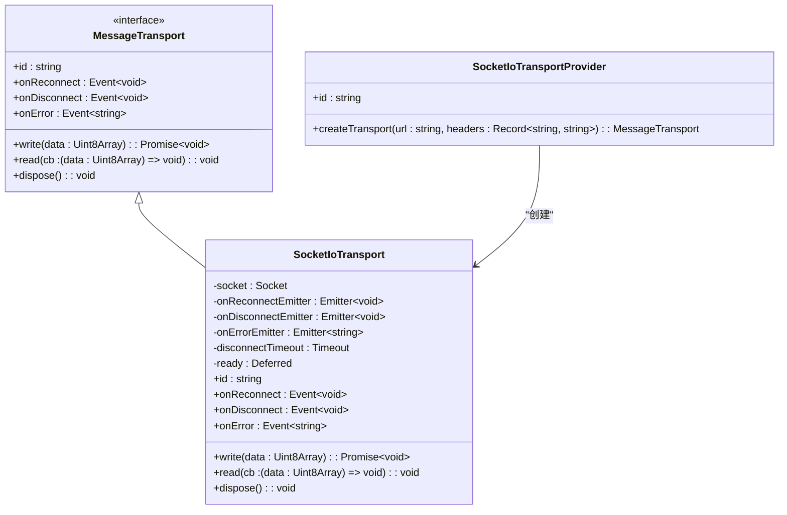
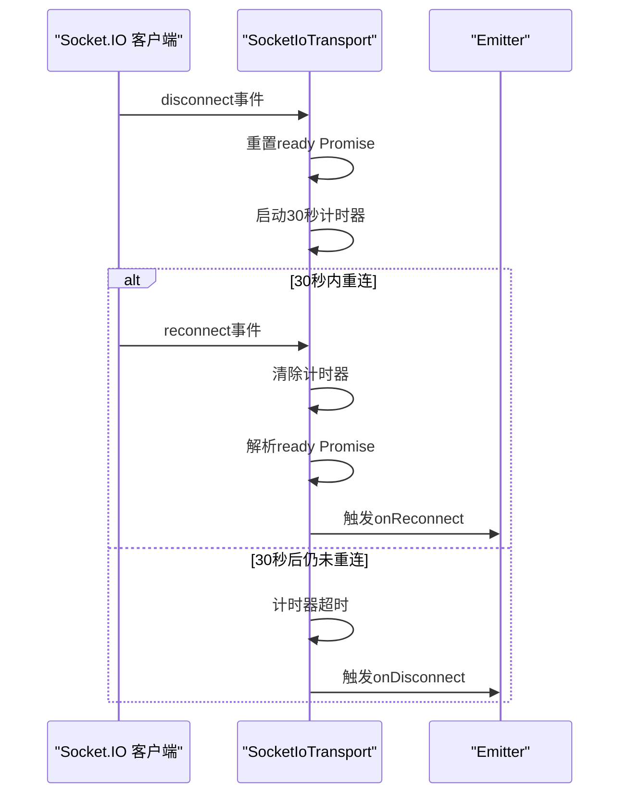
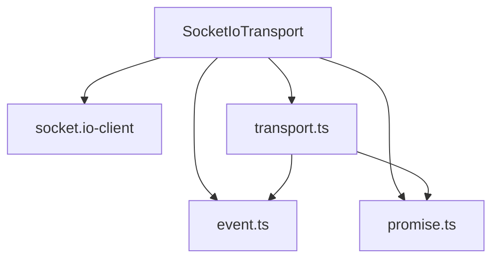

# Socket.IO 封装传输实现


## 简介
本文档全面阐述 `socket-io-transport.ts` 文件中对 Socket.IO 客户端的封装实现。该实现通过适配 `MessageTransport` 接口，提供了一种健壮、可重连、支持复杂网络环境的通信传输层。重点分析其连接管理机制、消息收发逻辑、错误传播方式，以及与原生 WebSocket 实现的对比优势。

## 项目结构
本项目采用模块化设计，`open-collaboration-protocol` 包负责定义核心协议与传输抽象。`transport` 目录下包含多种传输实现，其中 `socket-io-transport.ts` 是基于 Socket.IO 的具体实现。



## 核心组件
`SocketIoTransport` 类是本模块的核心，它实现了 `MessageTransport` 接口，封装了 Socket.IO 客户端的连接、消息收发和生命周期管理。

## 架构概述
该模块的架构围绕 `MessageTransport` 接口展开，实现了传输层的可插拔设计。`SocketIoTransportProvider` 作为工厂，负责创建 `SocketIoTransport` 实例。



## 详细组件分析

### SocketIoTransport 类分析
`SocketIoTransport` 类是 `MessageTransport` 接口的具体实现，它利用 Socket.IO 客户端库的强大功能，提供了比原生 WebSocket 更高级的特性。

#### 连接与事件管理
该类通过监听 Socket.IO 客户端的内置事件来管理连接状态，并将其映射为 `MessageTransport` 接口定义的事件。

- **连接事件 (`connect`)**：当 Socket.IO 成功连接时触发，它会解析 `ready` Promise，允许后续的 `write` 操作执行。
- **断开连接事件 (`disconnect`)**：当连接断开时，它会重置 `ready` Promise，并启动一个 30 秒的计时器。如果在此期间没有触发重连，则会触发 `onDisconnect` 事件。这实现了优雅的断开通知，避免了网络抖动导致的频繁断开。
- **重连事件 (`reconnect`)**：当 Socket.IO 成功重连时触发。它会清除断开计时器，解析 `ready` Promise，并触发 `onReconnect` 事件，通知上层应用连接已恢复。
- **错误事件 (`error`)**：当发生错误时，触发 `onError` 事件，传递预定义的错误信息。



#### 消息收发机制
- **发送 (`write`)**：`write` 方法是异步的。它首先等待 `this.ready.promise` 解析，确保连接已建立或已重连成功。一旦准备就绪，它会调用 `this.socket.send(data)` 将 `Uint8Array` 数据作为消息发送。这种设计保证了在连接不稳定时，消息不会丢失，而是会等待连接恢复后发送。
- **接收 (`read`)**：`read` 方法注册一个回调函数，该函数监听 Socket.IO 的 `'message'` 事件。当服务器或其他客户端发送数据时，此回调会被调用，并将接收到的 `data`（预期为 `Uint8Array`）传递给上层应用。

#### 资源清理 (`dispose`)
`dispose` 方法用于释放资源。它会释放 `onDisconnectEmitter`，并调用 `this.socket.close()` 关闭底层的 Socket.IO 连接，确保没有内存泄漏。

### 与 WebSocketTransport 的对比分析
`websocket-transport.ts` 提供了对原生 WebSocket 的封装，与 `SocketIoTransport` 形成对比。

```mermaid
classDiagram
class WebSocketTransport {
-socket : WebSocket
-onDisconnectEmitter : Emitter~void~
-onErrorEmitter : Emitter~string~
-ready : Deferred
+id : string
+onReconnect : Event~void~ // 返回 Event.None
+onDisconnect : Event~void~
+onError : Event~string~
+write(data : Uint8Array) : Promise~void~
+read(cb : (data : Uint8Array) => void) : void
+dispose() : void
}
class SocketIoTransport {
+id : string
+onReconnect : Event~void~ // 实际实现
+onDisconnect : Event~void~
+onError : Event~string~
}
MessageTransport <|-- WebSocketTransport
MessageTransport <|-- SocketIoTransport
note right of SocketIoTransport : : onReconnect
Socket.IO 内置重连机制，<br/>可桥接并触发 onReconnect 事件。
end note
note right of WebSocketTransport : : onReconnect
原生 WebSocket 无自动重连，<br/>因此 onReconnect 返回 Event.None。
end note
```

**关键差异**：
1.  **重连机制**：`SocketIoTransport` 利用 Socket.IO 的内置自动重连功能，并通过 `onReconnect` 事件通知上层。而 `WebSocketTransport` 的 `onReconnect` 返回 `Event.None`，因为它不提供自动重连，需要上层自行实现。
2.  **网络适应性**：Socket.IO 支持多种传输方式（如 WebSocket、长轮询），能自动降级以适应防火墙或代理服务器，NAT 穿透能力更强。原生 WebSocket 在某些网络环境下可能无法建立连接。
3.  **功能丰富性**：Socket.IO 支持房间（Rooms）和命名空间（Namespaces），便于实现广播和分组通信。原生 WebSocket 是点对点的，需要应用层自行实现广播逻辑。
4.  **运行时开销**：`SocketIoTransport` 引入了 Socket.IO 客户端库，增加了额外的运行时开销和依赖。`WebSocketTransport` 更轻量，仅依赖浏览器/Node.js 原生 API。

## 依赖分析
`SocketIoTransport` 的依赖关系清晰，体现了良好的分层设计。



- **外部依赖**：`socket.io-client` 是核心依赖，提供了与服务器通信的能力。
- **内部依赖**：
  - `event.ts`：提供 `Emitter` 和 `Event` 类，用于实现事件驱动的编程模型。
  - `promise.ts`：提供 `Deferred` 类，用于管理异步操作的完成状态。
  - `transport.ts`：定义了 `MessageTransport` 接口，是本实现的基础。

## 性能考量
- **优点**：自动重连和传输降级机制极大地提升了在复杂网络环境下的连接稳定性和用户体验。
- **缺点**：相比原生 WebSocket，Socket.IO 协议本身有额外的开销（如心跳包、握手信息），且库的体积更大。对于网络环境良好且对性能要求极高的场景，`WebSocketTransport` 可能是更优选择。

## 故障排查指南
- **问题**：`onDisconnect` 事件未按预期触发。
  - **原因**：`SocketIoTransport` 设计了 30 秒的延迟。只有在断开后 30 秒内未重连成功，才会触发 `onDisconnect`。
  - **解决**：检查网络状况，或确认是否在 30 秒内发生了重连。
- **问题**：`write` 操作长时间阻塞。
  - **原因**：`write` 依赖于 `ready.promise`。如果连接断开且重连失败，`ready` Promise 将永远不会被解析。
  - **解决**：监听 `onError` 或最终的 `onDisconnect` 事件，以便在连接彻底失败时采取相应措施（如提示用户或尝试其他传输方式）。

## 结论
`SocketIoTransport` 是一个功能强大且健壮的传输层实现。它通过封装 Socket.IO 客户端，成功适配了 `MessageTransport` 接口，并实现了连接管理、消息收发和错误处理。其最大的优势在于利用 Socket.IO 的自动重连和传输降级能力，显著提升了应用在复杂网络环境下的可用性。尽管引入了额外的运行时开销，但对于需要高可靠性和良好用户体验的协作应用而言，这是一个非常有价值的权衡。开发者可以通过 `SocketIoTransportProvider` 轻松地将其集成到系统中，替换默认的传输层。