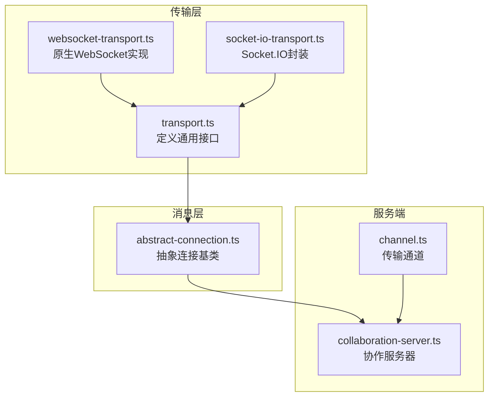
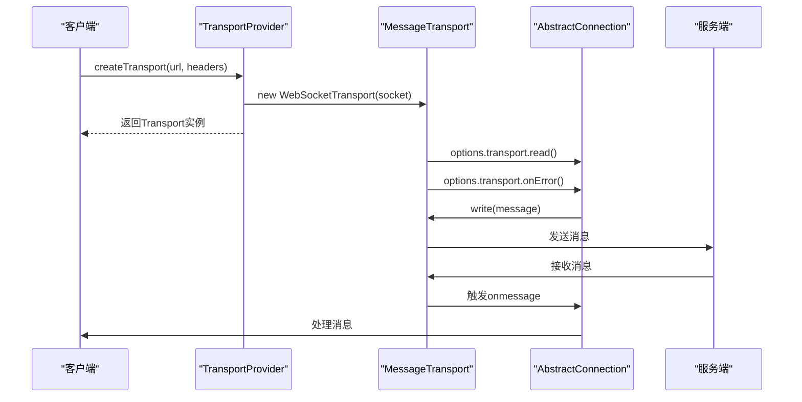
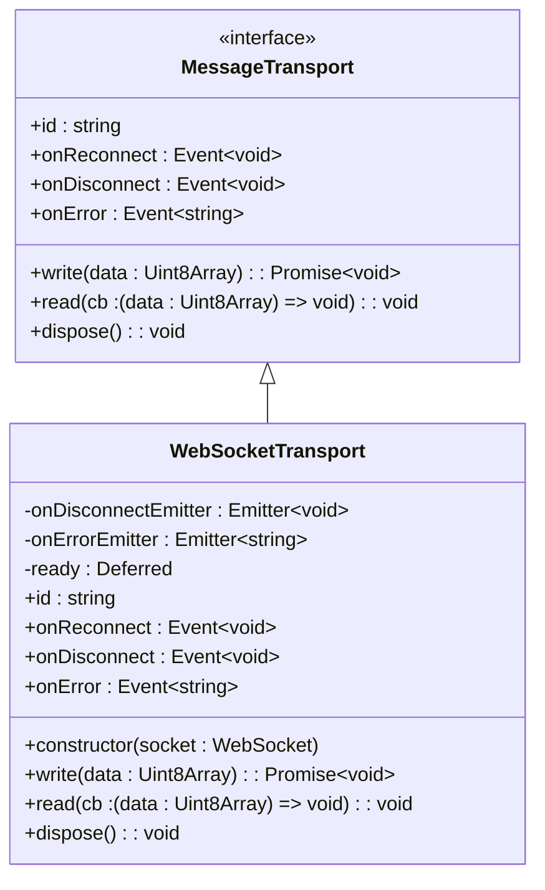
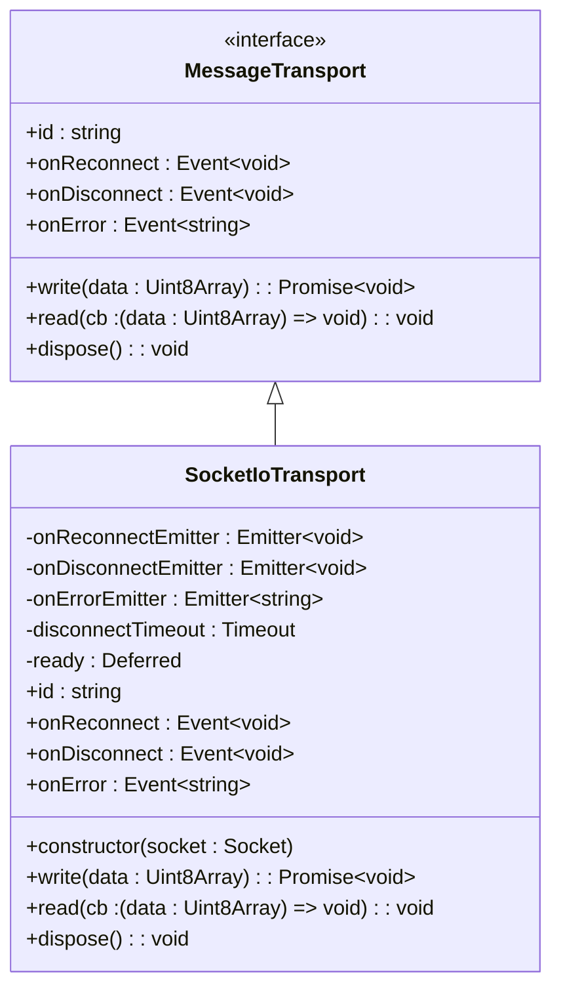
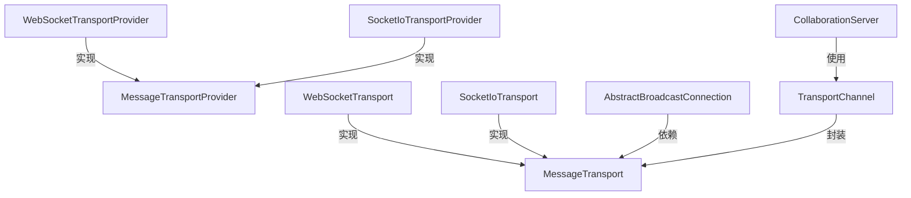

# 传输层适配实现


## 简介
本文档详细阐述了协作工具项目中传输层适配机制的设计与实现。重点分析了 `transport.ts` 定义的通用传输接口，以及其在 `websocket-transport.ts` 和 `socket-io-transport.ts` 中的具体实现。文档对比了两种传输方式在连接建立、消息发送、错误处理和重连机制上的设计差异，并解释了 `Transport` 抽象层如何屏蔽底层协议差异，使上层应用无需关心具体通信机制。同时提供了配置方法、适用场景、性能对比及自定义扩展指南。

## 项目结构
项目采用模块化设计，核心通信逻辑位于 `packages/open-collaboration-protocol` 包中。`transport` 目录下包含了传输层的核心接口与实现。



## 核心组件
传输层的核心是 `MessageTransport` 接口，它定义了所有传输实现必须遵循的契约，包括消息读写、资源释放和事件监听。

## 架构概览
系统通过 `MessageTransportProvider` 创建具体的 `MessageTransport` 实例，该实例被注入到 `AbstractBroadcastConnection` 中，用于实际的消息收发。服务端通过 `TransportChannel` 与客户端传输层对接。



## 详细组件分析

### 传输接口定义
`transport.ts` 文件定义了传输层的抽象接口，是整个适配机制的基础。

```typescript
export interface MessageTransport {
    readonly id: string;
    write: ConnectionWriter;
    read: ConnectionReader;
    dispose(): void;
    onReconnect: Event<void>;
    onDisconnect: Event<void>;
    onError: Event<string>;
}
```

该接口通过 `write` 和 `read` 方法实现双向通信，`dispose` 用于资源清理，`onReconnect`、`onDisconnect` 和 `onError` 事件用于状态监听。

### WebSocket 传输实现
`WebSocketTransport` 是对原生 WebSocket API 的封装，实现了 `MessageTransport` 接口。

#### 连接建立
`WebSocketTransportProvider` 负责创建实例。它会自动将 `http`/`https` 协议转换为 `ws`/`wss`，并附加 `/websocket` 路径和查询参数。

#### 消息发送
发送前通过 `Deferred` 机制确保连接已就绪，保证消息不会在连接未建立时发送。

#### 错误处理
监听 `onerror` 事件，触发 `onError` 事件并传递错误信息。

#### 重连机制
**原生 WebSocket 不支持自动重连**，因此 `onReconnect` 事件返回 `Event.None`，表示不提供重连功能。



### Socket.IO 传输实现
`SocketIoTransport` 是对 Socket.IO 客户端库的封装，提供了更高级的网络功能。

#### 连接建立
使用 `socket.io-client` 的 `io()` 函数创建连接，支持通过 `extraHeaders` 传递自定义头信息。

#### 消息发送
与 `WebSocketTransport` 类似，使用 `Deferred` 确保连接就绪。

#### 错误处理
监听 `error` 事件，触发 `onError` 事件。

#### 重连机制
这是与原生 WebSocket 的主要区别。`SocketIoTransport` 实现了完整的重连逻辑：
- 断开连接时启动 30 秒倒计时。
- 若在倒计时内重连成功，则取消倒计时并触发 `onReconnect` 事件。
- 若倒计时结束仍未重连，则触发 `onDisconnect` 事件。



### 上层应用集成
`AbstractBroadcastConnection` 类通过依赖注入的方式使用 `MessageTransport`，完全解耦了上层逻辑与底层传输。

```typescript
constructor(readonly options: AbstractBroadcastConnectionOptions) {
    options.transport.read(data => this.handleMessage(new Uint8Array(data)));
    options.transport.onDisconnect(() => this.dispose());
    options.transport.onError(message => {
        this.onConnectionErrorEmitter.fire(message);
        this.dispose();
    });
    options.transport.onReconnect(() => this.onReconnectEmitter.fire());
}
```

此设计使得上层应用只需关注 `MessageTransport` 接口，无需关心具体是 WebSocket 还是 Socket.IO。

## 依赖分析
传输层与其他模块紧密协作，形成完整的通信链路。



## 性能考量
- **WebSocket 传输**：性能最优，开销最小，但缺乏内置重连和心跳机制，需要应用层自行实现。
- **Socket.IO 传输**：性能稍低，因为增加了额外的协议层（如心跳包、ACK确认），但提供了可靠的自动重连和断线恢复功能。
- **选择建议**：在内网或网络稳定的环境中优先使用 WebSocket；在公网或网络不稳定的环境中，使用 Socket.IO 可以提供更好的用户体验。

## 故障排查指南
- **连接失败**：检查 URL 协议是否正确（`ws`/`wss`），服务端是否监听 `/websocket` 路径。
- **消息收发失败**：确保 `write` 调用前连接已就绪（`ready` Promise 已 resolve）。
- **重连不触发**：对于 `WebSocketTransport`，确认应用层是否有重连逻辑；对于 `SocketIoTransport`，检查 `extraHeaders` 是否正确传递。
- **内存泄漏**：确保调用 `dispose()` 方法释放资源，避免事件监听器堆积。

## 结论
本项目通过 `MessageTransport` 抽象接口成功实现了传输层的可插拔设计。`WebSocketTransport` 提供了高性能的基础通信能力，而 `SocketIoTransport` 则在复杂网络环境下提供了更强的健壮性。开发者可以根据具体场景选择合适的传输方式，或通过实现 `MessageTransportProvider` 接口扩展新的传输机制，体现了良好的架构设计和扩展性。