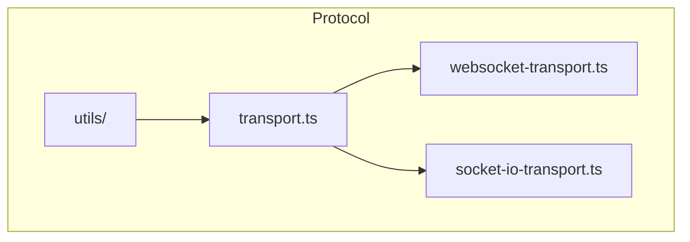
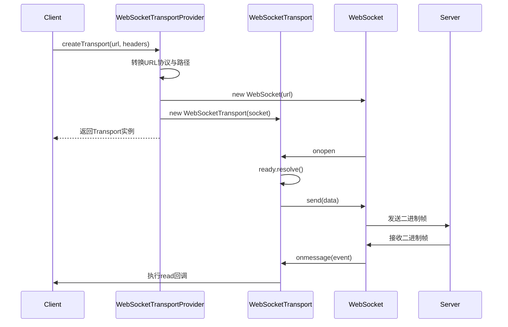
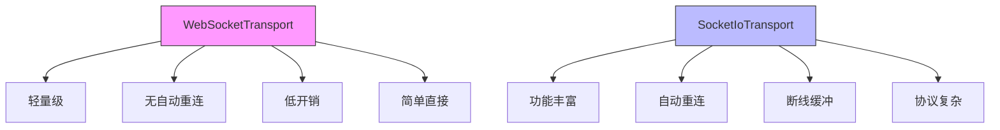
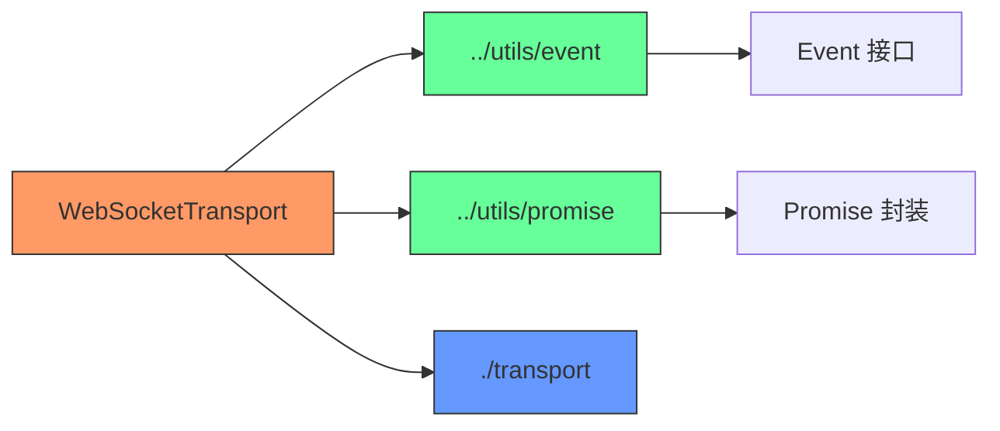

# 原生 WebSocket 传输实现


## 简介
本文档深入解析 `websocket-transport.ts` 文件中基于原生 WebSocket 的传输层实现。该实现提供了一个轻量级、低开销的通信机制，用于在协作系统中传输二进制消息。文档将详细说明其如何实现 `MessageTransport` 接口，涵盖连接建立、数据发送、消息监听、错误处理等关键机制，并与抽象定义进行契约对比。同时，还将分析其在高延迟网络下的行为，并与 Socket.IO 实现进行对比，突出其优势与局限性。

## 项目结构
本项目采用模块化设计，`open-collaboration-protocol` 包负责定义通信协议和传输层抽象。其中，`transport` 目录包含多种传输实现，包括原生 WebSocket 和 Socket.IO。




## 核心组件
核心组件包括 `MessageTransport` 接口定义、`WebSocketTransport` 类实现以及 `WebSocketTransportProvider` 工厂对象。这些组件共同构成了基于原生 WebSocket 的消息传输机制。


## 架构概览
系统采用接口抽象与具体实现分离的设计模式。`MessageTransport` 定义了统一的传输契约，`WebSocketTransport` 提供原生 WebSocket 实现，而 `SocketIoTransport` 提供基于 Socket.IO 的实现。

```mermaid
classDiagram
class MessageTransport {
<<interface>>
+id : string
+write(data : Uint8Array) : Promise~void~
+read(cb : (data : Uint8Array) => void) : void
+dispose() : void
+onReconnect : Event~void~
+onDisconnect : Event~void~
+onError : Event~string~
}
class WebSocketTransport {
-onDisconnectEmitter : Emitter~void~
-onErrorEmitter : Emitter~string~
-ready : Deferred
+constructor(socket : WebSocket)
+write(data : Uint8Array) : Promise~void~
+read(cb : (data : Uint8Array) => void) : void
+dispose() : void
}
class SocketIoTransport {
-onReconnectEmitter : Emitter~void~
-onDisconnectEmitter : Emitter~void~
-onErrorEmitter : Emitter~string~
-disconnectTimeout : Timeout
-ready : Deferred
+write(data : Uint8Array) : Promise~void~
+read(cb : (data : Uint8Array) => void) : void
+dispose() : void
}
class WebSocketTransportProvider {
+id : string
+Constructor : typeof WebSocket
+createTransport(url : string, headers : Record~string, string~) : MessageTransport
}
MessageTransport <|-- WebSocketTransport
MessageTransport <|-- SocketIoTransport
MessageTransportProvider <|-- WebSocketTransportProvider
note right of WebSocketTransport
基于原生 WebSocket 实现
无自动重连机制
轻量、低开销
end
note right of SocketIoTransport
基于 Socket.IO 客户端
支持自动重连
提供断线重连缓冲
end
```


## 详细组件分析

### WebSocketTransport 实现分析
`WebSocketTransport` 类实现了 `MessageTransport` 接口，封装了原生 WebSocket 的连接、发送、接收和销毁逻辑。

#### 连接建立与握手
`WebSocketTransportProvider.createTransport` 方法负责创建连接。它会自动将 HTTP/HTTPS URL 转换为 WS/WSS 协议，并附加 `/websocket` 路径和查询参数。创建 WebSocket 实例后，设置 `binaryType` 为 `arraybuffer` 以支持二进制数据传输。

```typescript
const socket = new WebSocketTransportProvider.Constructor(url + '/websocket' + (query ? '?' + query : ''));
socket.binaryType = 'arraybuffer';
```

#### 数据发送机制
`write` 方法通过 `Deferred` 对象确保连接建立完成后再发送数据。它返回一个 Promise，保证异步写入的顺序性。

```typescript
async write(data: Uint8Array): Promise<void> {
    await this.ready.promise.then(() => this.socket.send(data));
}
```

#### 消息监听与解析
`read` 方法注册 `onmessage` 回调，直接将接收到的 `ArrayBuffer` 数据传递给用户回调函数。WebSocket 原生支持二进制帧，无需额外解析。

```typescript
read(cb: (data: Uint8Array) => void): void {
    this.socket.onmessage = event => cb(event.data);
}
```

#### 事件处理机制
- **onDisconnect**: WebSocket `onclose` 事件触发时，通过 `onDisconnectEmitter` 通知上层。
- **onError**: `onerror` 事件触发时，发出固定错误消息。
- **onReconnect**: 原生 WebSocket 不支持自动重连，因此返回 `Event.None`。




### 与抽象契约的对比分析
`transport.ts` 定义了 `MessageTransport` 接口，`WebSocketTransport` 实现了该接口。关键差异在于 `onReconnect` 事件的处理。

```mermaid
classDiagram
class MessageTransport {
<<interface>>
+onReconnect : Event~void~
+onDisconnect : Event~void~
+onError : Event~string~
}
class WebSocketTransport {
+get onReconnect() : Event~void~ // 返回 Event.None
+get onDisconnect() : Event~void~
+get onError() : Event~string~
}
MessageTransport <|-- WebSocketTransport
note right of WebSocketTransport
onReconnect 始终返回 Event.None
因为原生 WebSocket 不提供自动重连功能
end
```


### 与 Socket.IO 实现的对比
| 特性 | WebSocketTransport | SocketIoTransport |
|------|-------------------|-------------------|
| **依赖** | 原生 WebSocket | 需引入 socket.io-client |
| **重连机制** | 无自动重连 | 支持自动重连（30秒超时） |
| **onReconnect 事件** | 始终为 None | 可触发 |
| **协议开销** | 低 | 较高（包含心跳、ACK等） |
| **跨域支持** | 受浏览器策略限制 | 更灵活 |
| **消息格式** | 原生二进制帧 | 封装在 'message' 事件中 |




## 依赖关系分析
`WebSocketTransport` 依赖于项目内部的工具模块，形成清晰的依赖链。




## 性能考量
### 优势
- **轻量高效**：无额外依赖，直接使用原生 API，内存和 CPU 开销最小。
- **低延迟**：二进制帧直接传输，无协议封装开销。
- **简单可靠**：逻辑清晰，易于调试和维护。

### 局限性
- **无自动重连**：网络中断后需上层应用自行处理重连逻辑。
- **跨域限制**：受同源策略限制，需服务器配置 CORS。
- **无消息确认**：不保证消息送达，需应用层实现 ACK 机制。

### 调优建议
1. **帧大小控制**：避免单次发送过大数据块，建议分片传输。
2. **心跳保活**：应用层实现 ping/pong 机制，防止连接被中间代理关闭。
3. **错误重试**：在 `onDisconnect` 回调中实现指数退避重连策略。
4. **连接复用**：避免频繁创建/销毁连接，维持长连接。

```typescript
// 示例：简单的心跳实现
setInterval(() => {
    if (transport.socket.readyState === WebSocket.OPEN) {
        transport.socket.send(JSON.stringify({ type: 'ping' }));
    }
}, 30000);
```

## 故障排查指南
### 常见问题
- **连接失败**：检查 URL 协议是否正确转换（http→ws, https→wss）。
- **二进制数据乱码**：确认 `binaryType` 设置为 `arraybuffer`。
- **消息未接收**：确保 `read` 回调已正确注册。
- **频繁断开**：检查网络稳定性或实现心跳机制。

### 错误处理
- `onError` 仅在 `onerror` 事件触发时发出固定消息，不包含具体错误信息。
- `onDisconnect` 在 `onclose` 时立即触发，无重试缓冲。


## 结论
`WebSocketTransport` 是一个简洁、高效的原生 WebSocket 传输实现，适用于对性能要求高、网络环境稳定的场景。其优势在于轻量、低开销和直接性，但缺乏自动重连等高级功能。在选择时，应根据应用需求权衡：若需要复杂连接管理，建议使用 `SocketIoTransport`；若追求极致性能和简单性，`WebSocketTransport` 是理想选择。未来可考虑在上层封装重连和心跳机制，以弥补其局限性。