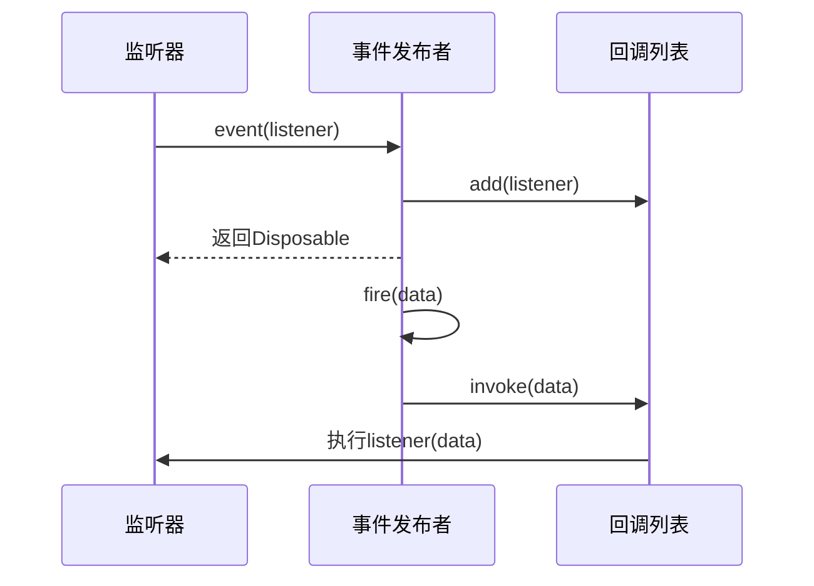
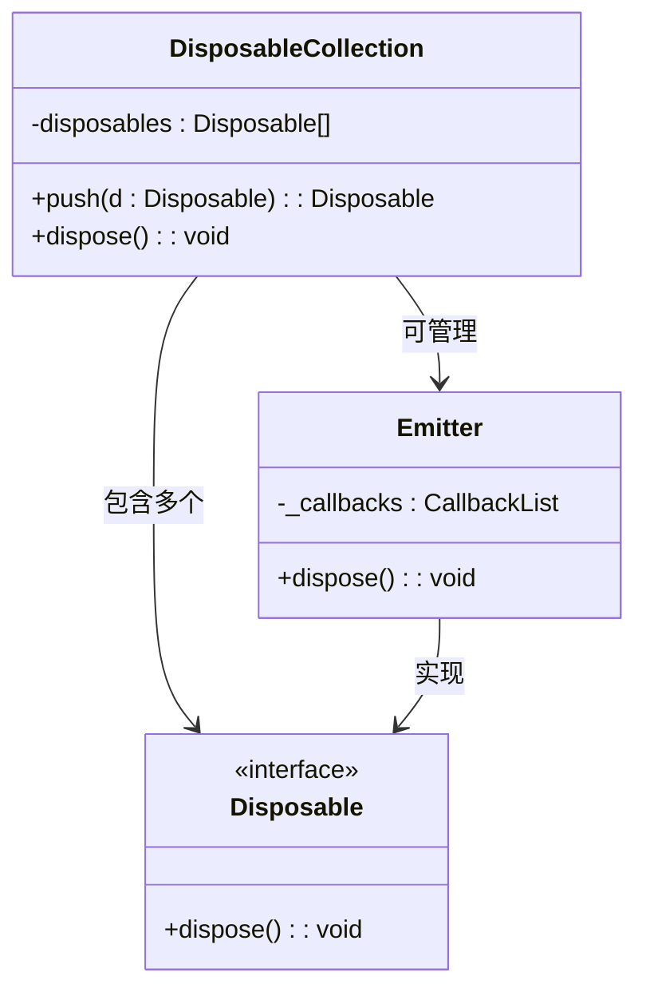
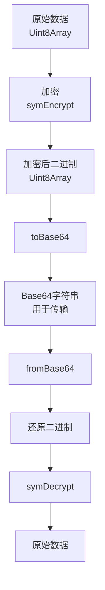

# 工具组件与辅助功能


## 简介
本文档系统性地介绍协作协议模块中 `utils` 目录下的核心工具集，涵盖事件管理、资源释放、异步控制、加密处理、信息封装和版本兼容性等关键功能。这些工具类为整个协作系统提供了健壮的底层支持，确保模块间的松耦合、高可维护性和安全性。


## 核心工具模块概览
`open-collaboration-protocol` 模块的 `utils` 目录提供了一系列独立且高度内聚的工具类，用于支撑协议层的通用功能。这些模块包括：

- **event.ts**：实现基于发布-订阅模式的事件总线，支持监听、触发和生命周期管理。
- **disposable.ts**：提供统一的资源释放接口和集合管理，防止内存泄漏。
- **promise.ts**：封装异步操作的辅助类型，简化Promise处理。
- **crypto.ts**：集成加密算法，支持对称与非对称加密。
- **base64.ts**：提供跨平台的Base64编码/解码功能。
- **info.ts**：定义标准化的信息结构，用于传递状态码和参数。
- **version.ts**：管理协议版本并实现兼容性检查。

这些工具共同构成了协议模块的“基础设施层”，确保系统在连接、认证、数据传输等环节的稳定性和安全性。

```
graph TB
subgraph "工具模块"
Event[事件总线<br/>event.ts]
Disposable[资源管理<br/>disposable.ts]
Promise[异步控制<br/>promise.ts]
Crypto[加密处理<br/>crypto.ts]
Base64[Base64编解码<br/>base64.ts]
Info[信息封装<br/>info.ts]
Version[版本管理<br/>version.ts]
end
Crypto --> Base64 : 依赖
Event --> Disposable : 依赖
Version --> Info : 用于错误提示
```


## 事件总线机制详解
事件总线（Event Bus）是实现模块间解耦的核心机制。`event.ts` 文件通过 `Event<T>` 接口和 `Emitter<T>` 类实现了类型安全的事件系统。

### 事件订阅与发布
`Event<T>` 是一个函数类型，允许注册监听器。`Emitter<T>` 是事件的发布者，通过 `event` 属性暴露订阅接口，并通过 `fire()` 方法触发事件。

```typescript
const emitter = new Emitter<string>();
const event = emitter.event;

// 订阅事件
const disposable = event(value => {
    console.log('收到事件:', value);
});

// 发布事件
emitter.fire('Hello World');

// 取消订阅
disposable.dispose();
```

### 事件生命周期管理
每次订阅都会返回一个 `Disposable` 对象，调用其 `dispose()` 方法即可移除监听器，避免内存泄漏。此外，`DisposableCollection` 可批量管理多个订阅。

### 高级事件操作
`Event` 命名空间提供了多种实用的事件转换函数：
- `once()`：创建只触发一次的事件。
- `map()`：将事件数据映射为新类型。
- `any()`：合并多个事件源。




## 资源释放与内存泄漏防护
`disposable.ts` 提供了统一的资源清理机制，是防止内存泄漏的关键。

### Disposable 接口
所有可释放资源都实现 `Disposable` 接口，必须提供 `dispose()` 方法。

```typescript
export interface Disposable {
    dispose(): void;
}
```

### DisposableCollection
该类用于集中管理多个 `Disposable` 对象，确保在需要时一次性释放所有资源。

```typescript
const collection = new DisposableCollection();
collection.push(setTimeout(() => {}, 1000));
collection.push(someEventSubscription);

// 释放所有资源
collection.dispose(); // 自动调用每个dispose()
```

### 自动清理机制
`DisposableCollection` 在 `dispose()` 时会遍历并调用所有子资源的 `dispose()` 方法，即使某个资源抛出异常也不会中断后续清理。




## 异步控制与Promise工具
`promise.ts` 提供了简化异步编程的工具类型。

### MaybePromise 类型
`MaybePromise<T>` 表示值可能是同步的 `T` 或异步的 `Promise<T>`，在处理回调时非常有用。

```typescript
type MaybePromise<T> = T | Promise<T>;
```

### Deferred 类
`Deferred` 类用于手动控制Promise的解决或拒绝，常用于将回调函数转换为Promise。

```typescript
const deferred = new Deferred<boolean>();
setTimeout(() => {
    deferred.resolve(true);
}, 1000);
const result = await deferred.promise; // 1秒后得到true
```


## 加密与Base64编解码协同
`crypto.ts` 和 `base64.ts` 协同工作，实现安全的数据传输。

### Base64 编解码
`base64.ts` 提供了跨平台（浏览器/Node.js）的Base64转换，确保二进制数据可安全传输。

```typescript
function toBase64(data: Uint8Array): string;
function fromBase64(data: string): Uint8Array;
```

### 加密库实现
`crypto.ts` 封装了Web Crypto API，提供：
- `generateKeyPair()`：生成RSA密钥对。
- `generateSymKey()`：生成AES对称密钥。
- `symEncrypt/Decrypt`：使用AES-CBC进行对称加密。
- `publicEncrypt/privateDecrypt`：使用RSA-OAEP进行非对称加密。

### 协同流程
加密数据通常为二进制（`Uint8Array`），需通过 `toBase64()` 转为字符串传输，接收方再用 `fromBase64()` 还原。




## 运行时信息与版本管理
### 信息结构（Info）
`info.ts` 定义了标准化的信息对象，用于传递状态码、消息和参数。

```typescript
interface Info {
    code: string;
    params: string[];
    message: string;
}
```

预定义了如 `PerformingLogin`、`AuthTimeout` 等状态码，便于统一处理。

### 版本兼容性
`version.ts` 定义了当前协议版本 `0.3.1`，并通过 `compatibleVersions()` 函数检查客户端与服务器的兼容性。

- 主版本号相同即兼容（正式版）。
- `0.x` 版本要求次版本号也相同（开发版不兼容）。

```typescript
// 检查版本兼容性
if (compatibleVersions(serverVersion, clientVersion)) {
    // 建立连接
}
```


## 综合应用示例
以下示例展示如何结合使用这些工具：

```typescript
// 1. 创建事件发射器
const authEmitter = new Emitter<Info>();
const disposables = new DisposableCollection();

// 2. 订阅认证事件
disposables.push(authEmitter.event(info => {
    if (info.code === Info.Codes.AuthTimeout) {
        console.error('认证超时');
    }
}));

// 3. 模拟异步认证流程
async function authenticate() {
    const deferred = new Deferred<boolean>();
    // 模拟网络延迟
    setTimeout(() => {
        const key = await getCryptoLib().generateSymKey();
        const iv = await getCryptoLib().generateIV();
        authEmitter.fire({
            code: Info.Codes.PerformingLogin,
            message: '正在登录...',
            params: []
        });
        deferred.resolve(true);
    }, 2000);
    return deferred.promise;
}

// 4. 清理资源
// disposables.dispose(); // 断开连接时调用
```

## 总结
本文档详细解析了协议模块中各工具组件的设计与实现。`event.ts` 提供了灵活的事件通信机制，`disposable.ts` 确保了资源的安全释放，`promise.ts` 简化了异步逻辑，`crypto.ts` 与 `base64.ts` 共同保障了数据安全，`info.ts` 和 `version.ts` 则为系统提供了统一的状态管理和版本控制。这些工具的协同工作，显著提升了系统的健壮性、可维护性和安全性。