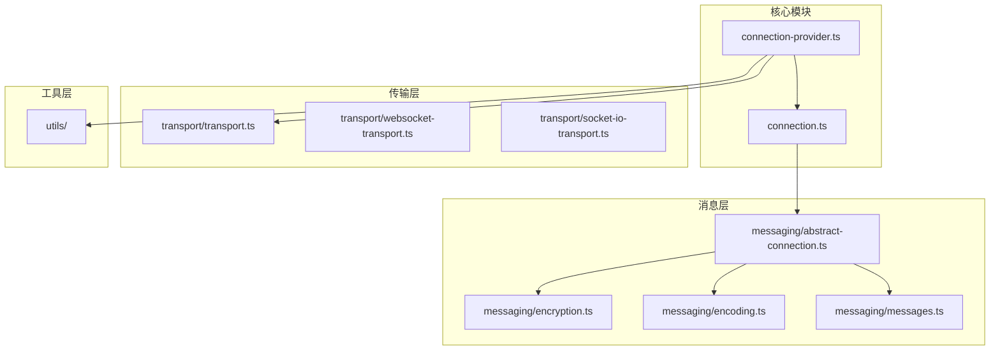
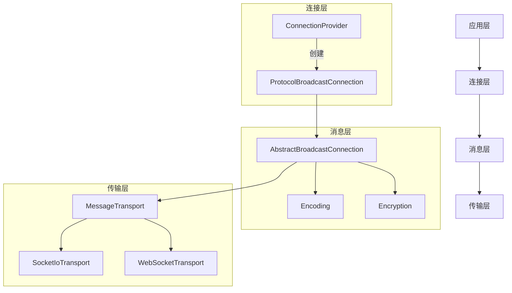
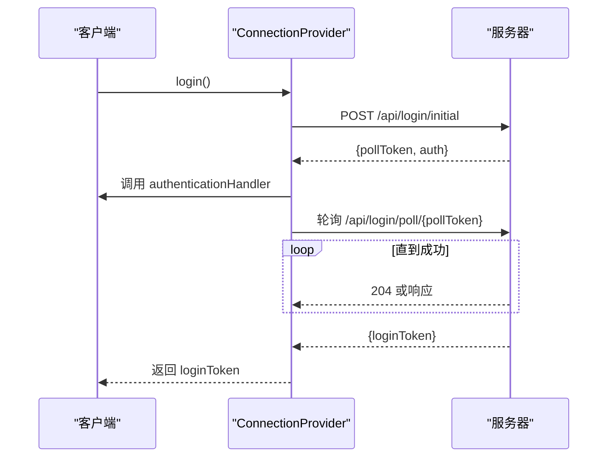
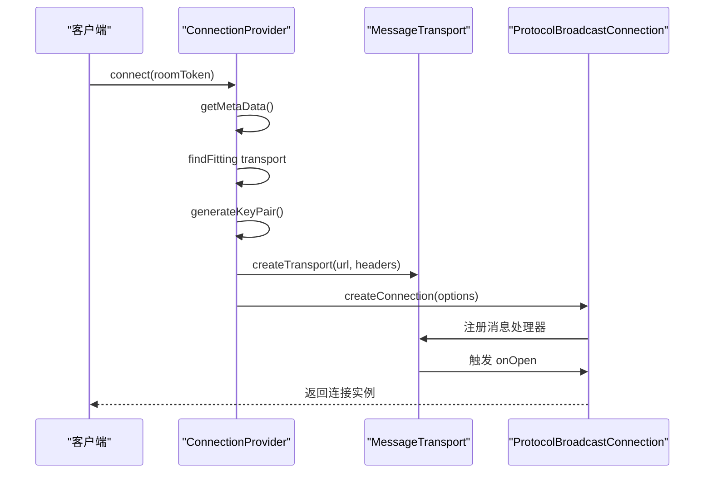
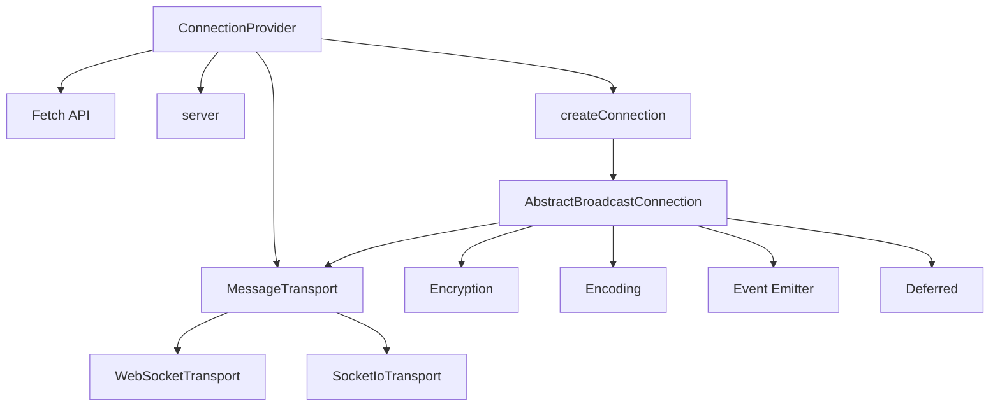

# 核心连接机制


## 简介
本文档深入分析 `open-collaboration-protocol` 模块中的核心连接机制，重点阐述 `Connection` 与 `ConnectionProvider` 的设计与实现。文档涵盖连接的生命周期管理、握手流程、心跳检测、断线重连策略、连接状态同步机制，以及事件驱动的通信模型。通过分析 `connection.ts` 和 `connection-provider.ts` 中的关键方法，揭示其如何支持多协议传输的统一接口，并说明依赖注入模式在客户端模块中的集成方式。

## 项目结构
`open-collaboration-protocol` 模块是协作系统的核心通信层，提供跨平台、安全、可扩展的实时连接能力。其结构清晰，按功能划分模块：

- **messaging**: 消息编码、加密、解密、抽象连接逻辑
- **transport**: 传输层适配器（WebSocket、Socket.IO）
- **utils**: 工具函数（事件、Promise、版本、错误处理）
- **根目录**: 核心连接与连接提供者实现




## 核心组件
`open-collaboration-protocol` 的核心由 `ConnectionProvider` 和 `ProtocolBroadcastConnection` 构成。前者负责连接前的认证与房间管理，后者负责连接建立后的实时通信。

`ConnectionProvider` 通过 HTTP API 与服务器交互，完成用户认证、创建或加入房间，并最终生成一个 `ProtocolBroadcastConnection` 实例。该实例基于加密的二进制消息协议，通过 WebSocket 或 Socket.IO 等传输层进行通信。


## 架构概览
整个连接机制采用分层架构，从上至下分为应用层、连接层、消息层和传输层。




## 详细组件分析

### ConnectionProvider 分析
`ConnectionProvider` 是连接的入口点，负责处理与服务器的交互，包括认证、房间创建与加入。

#### 认证与登录流程
`ConnectionProvider` 支持两种认证方式：JWT Token 和 Cookie。其 `login` 方法通过 `/api/login/initial` 获取初始登录信息，调用 `authenticationHandler` 处理浏览器跳转或表单输入，然后轮询 `/api/login/poll/{token}` 直到获取有效的 `loginToken`。




#### 房间管理
`ConnectionProvider` 提供 `createRoom` 和 `joinRoom` 方法。在执行这些操作前，会先调用 `ensureCompatibility` 检查客户端与服务器的协议版本兼容性，并通过 `validate` 验证当前认证状态。若未认证，则自动触发 `login` 流程。


### ProtocolBroadcastConnection 分析
`ProtocolBroadcastConnection` 是建立连接后用于实时通信的核心接口，它基于 `AbstractBroadcastConnection` 实现，提供类型化的事件处理和消息发送。

#### 连接生命周期
连接的生命周期由 `connect` 方法启动。该方法首先获取服务器元数据（支持的传输协议），选择合适的 `MessageTransportProvider`，生成密钥对，并创建底层传输实例。最终，`createConnection` 函数返回一个 `ProtocolBroadcastConnectionImpl` 实例。




#### 事件驱动通信模型
`ProtocolBroadcastConnection` 采用事件驱动模型，通过 `onOpen`、`onClose`、`onJoin` 等方法注册事件处理器。当收到对应消息时，处理器被调用。

例如，`editor.open` 方法发送一个通知消息，而 `editor.onOpen` 则注册一个处理器来接收此类消息。

```
flowchart TD
A[发送方调用 open(path)] --> B[构造 NotificationMessage]
B --> C[使用接收方公钥加密]
C --> D[通过 Transport 发送]
D --> E[接收方收到加密消息]
E --> F[使用私钥解密]
F --> G[解析为 NotificationMessage]
G --> H[查找 onOpen 处理器]
H --> I[调用处理器函数]
I --> J[执行业务逻辑]
```


#### 接口设计
`ProtocolBroadcastConnection` 定义了多个处理接口，将功能模块化：

- **RoomHandler**: 房间成员管理（加入、离开）
- **PeerHandler**: 对等节点信息交换
- **EditorHandler**: 编辑器状态同步（打开、关闭文件）
- **FileSystemHandler**: 文件系统操作（读、写、删除）
- **SyncHandler**: 实时数据同步（Yjs 数据、光标感知）

每个接口都提供 `onXxx`（注册监听）和 `xxx`（主动发送）方法，形成对称的 API 设计。


## 依赖分析
`ConnectionProvider` 和 `Connection` 的实现依赖于多个内部模块和外部库。




## 性能考虑
- **加密缓存**: 使用 `encryptionKeyCache` 和 `decryptionKeyCache` 缓存对称密钥，避免重复计算。
- **内存管理**: `cleanupCaches` 方法定期清理缓存，防止内存泄漏。
- **连接复用**: `MessageTransport` 实例在连接生命周期内复用，减少握手开销。
- **批量广播**: 广播消息使用单次加密和发送，提高效率。

## 故障排除指南
- **连接失败**: 检查 `authToken` 是否有效，确认服务器元数据中的传输协议是否匹配。
- **消息无响应**: 确认事件处理器已正确注册，检查 `requestId` 是否冲突。
- **版本不兼容**: 确保客户端与服务器的协议版本兼容（同主版本号，0.x 时需同次版本号）。
- **认证循环**: 若 `login` 失败，检查 `authenticationHandler` 是否正确处理了跳转或表单。


## 结论
`open-collaboration-protocol` 的核心连接机制设计精良，通过 `ConnectionProvider` 统一管理连接前的复杂流程，通过 `ProtocolBroadcastConnection` 提供类型安全、事件驱动的实时通信接口。其分层架构、加密设计和模块化接口使其具备高安全性、可扩展性和易用性，为协作应用奠定了坚实的基础。