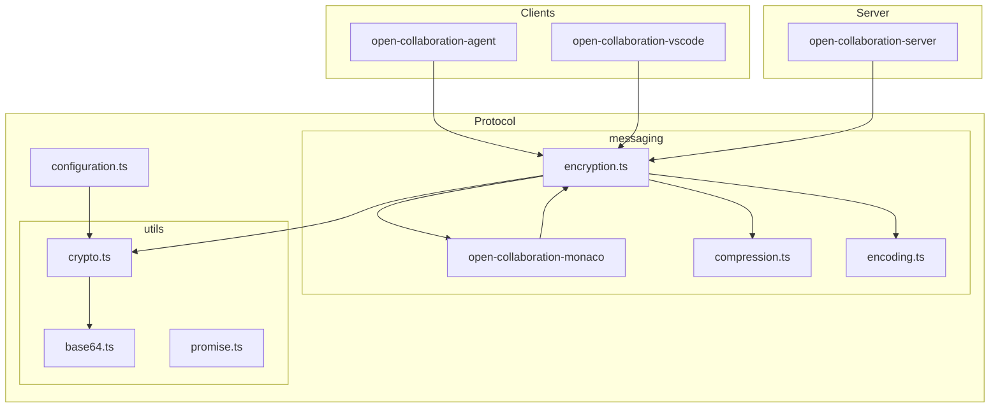
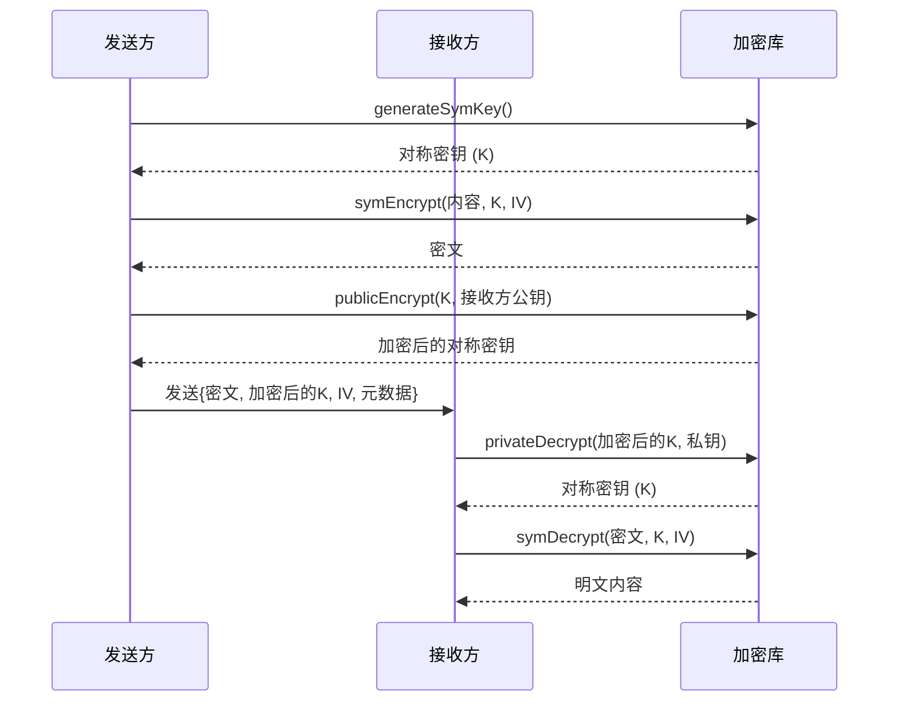
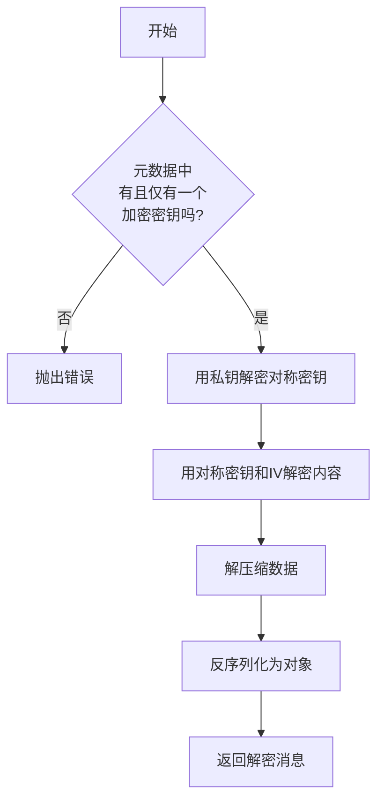
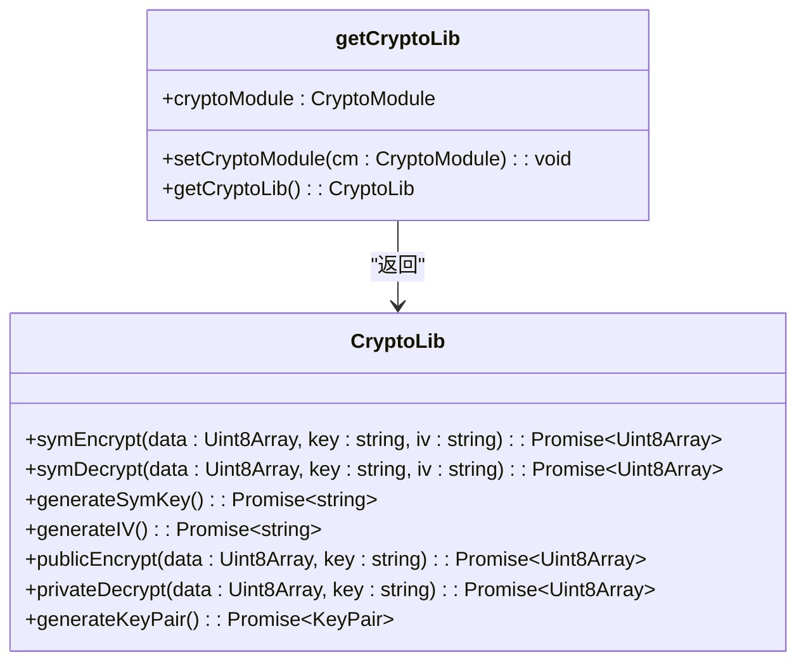
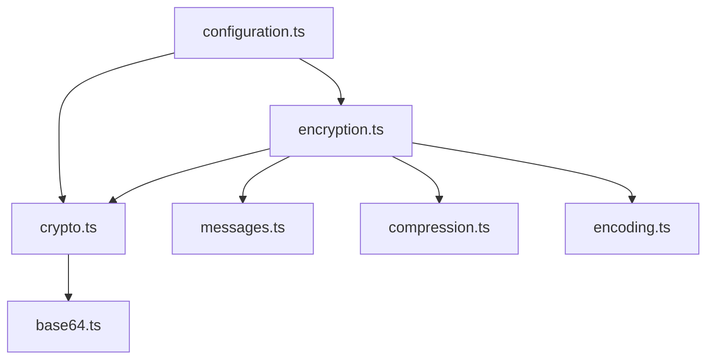

# 消息加密与安全传输


## 简介
本文档详细阐述协作工具中基于 JOSE（JSON Object Signing and Encryption）标准的消息加密机制。重点围绕 `encryption.ts` 文件，分析对称加密（AES-CBC）、非对称加密（RSA-OAEP）的实现，以及密钥管理、初始化向量（IV）生成、数据压缩与编码流程。同时，解释端到端加密（E2EE）与传输层加密（TLS）的区别，并提供安全实践建议。

## 项目结构
项目采用模块化设计，`open-collaboration-protocol` 包负责核心通信协议，其中 `messaging` 模块处理消息的加密、压缩与编码。



## 核心组件
核心加密功能由 `encryption.ts` 中的 `Encryption` 命名空间提供，它依赖于 `crypto.ts` 中的底层加密库和 `messages.ts` 中定义的消息结构。

## 架构概述
系统采用混合加密方案：使用非对称加密（RSA-OAEP）安全地分发对称密钥（AES-CBC），然后使用对称加密来加密实际的消息内容。这结合了非对称加密的安全性和对称加密的高效性。



## 详细组件分析

### 加密流程分析
`Encryption.encrypt` 函数是消息加密的核心，它执行以下步骤：

1.  **获取对称密钥**：从 `EncryptionKey.symmetricKey` 获取（可能是一个 Promise）。
2.  **序列化与压缩**：将消息内容通过 `Encoding.encode` 序列化为 `Uint8Array`，然后根据接收方支持的算法进行压缩。
3.  **生成初始化向量 (IV)**：调用 `generateIV()` 生成一个随机的 16 字节 IV。
4.  **对称加密**：使用 AES-CBC 算法和对称密钥加密压缩后的数据。
5.  **加密对称密钥**：使用每个接收方的公钥（`AsymmetricKey.publicKey`）通过 RSA-OAEP 算法加密对称密钥。
6.  **构建加密消息**：将加密后的对称密钥、IV 和目标 ID 存储在消息元数据中，并将密文作为消息内容。

```
flowchart TD
A[开始] --> B[获取对称密钥]
B --> C[序列化消息内容]
C --> D[压缩序列化数据]
D --> E[生成随机IV]
E --> F[用对称密钥和IV加密压缩数据]
F --> G[用接收方公钥加密对称密钥]
G --> H[构建元数据: {keys: [{target, key, iv}] }]
H --> I[返回加密消息]
```

### 解密流程分析
`Encryption.decrypt` 函数负责解密消息，其流程如下：

1.  **验证密钥**：确保元数据中恰好有一个加密的对称密钥。
2.  **解密对称密钥**：使用接收方的私钥（`DecryptionKey.privateKey`）解密元数据中的对称密钥。
3.  **对称解密**：使用解密出的对称密钥和 IV 解密消息内容。
4.  **解压缩与反序列化**：对解密后的数据进行解压缩，然后通过 `Encoding.decode` 反序列化为原始对象。



### 加密库实现分析
`crypto.ts` 文件通过 `getCryptoLib()` 提供了一个统一的加密接口，该接口基于 Web Crypto API (`subtle`) 实现。

#### 关键算法
- **非对称密钥生成**：使用 `RSA-OAEP` 算法，模数长度为 4096 位，哈希函数为 SHA-256。
- **对称密钥生成**：使用 `AES-CBC` 算法，密钥长度为 256 位。
- **初始化向量 (IV)**：生成一个 16 字节的随机数组，并进行 Base64 编码。
- **对称加解密**：使用 `AES-CBC` 模式。
- **非对称加解密**：使用 `RSA-OAEP` 算法。



### 消息结构分析
加密后的消息结构在 `messages.ts` 中定义，包含元数据和二进制内容。

#### 加密消息元数据
```json
{
  "metadata": {
    "encryption": {
      "keys": [
        {
          "target": "peer-123",
          "key": "base64_encoded_encrypted_symmetric_key",
          "iv": "base64_encoded_iv"
        }
      ]
    },
    "compression": {
      "algorithm": "gzip"
    }
  },
  "content": "base64_encoded_encrypted_data"
}
```

## 依赖分析
`encryption.ts` 模块高度依赖于其他工具模块，形成了清晰的分层架构。



## 性能考量
- **对称加密优势**：主要消息内容使用高效的 AES-CBC 加密，性能开销较小。
- **非对称加密开销**：RSA-OAEP 用于加密短小的对称密钥，避免了直接加密大量数据的性能瓶颈。
- **压缩影响**：启用压缩（如 gzip）可以减少网络传输量，但会增加 CPU 开销。系统通过 `Compression.bestFit()` 算法协商最优压缩方式。
- **缓存机制**：`EncryptionKey` 和 `DecryptionKey` 支持 `cache` 属性，可以缓存已加密/解密的对称密钥，避免重复计算，提升性能。

## 安全审计与漏洞规避
### 端到端加密 (E2EE) vs 传输层加密 (TLS)
- **端到端加密 (E2EE)**：消息在发送方设备上加密，在接收方设备上解密。服务器只能看到密文，无法访问明文内容。本文档描述的机制即为 E2EE。
- **传输层加密 (TLS)**：仅加密客户端与服务器之间的通信链路。服务器可以解密并查看所有消息内容。

**应用场景**：本系统使用 E2EE 来保护用户协作内容的隐私，即使服务器被攻破，攻击者也无法读取消息内容。

### 密钥交换与前向安全性
- **密钥交换**：通过 `initializeProtocol()` 函数注入 `cryptoModule`，确保加密库可用。对称密钥通过非对称加密安全分发给每个接收方。
- **前向安全性**：当前实现（AES-CBC + RSA-OAEP）**不提供**完美的前向安全性。如果长期私钥泄露，过去截获的所有消息都可能被解密。要实现前向安全性，需引入如 Diffie-Hellman (DH) 或 Elliptic Curve Diffie-Hellman (ECDH) 的临时密钥交换协议。

### 常见漏洞规避
- **密钥硬编码**：系统通过 `generateSymKey()` 和 `generateKeyPair()` 动态生成密钥，避免了在代码中硬编码密钥的风险。
- **IV 重用**：`generateIV()` 使用 `crypto.getRandomValues` 生成密码学安全的随机 IV，确保每次加密的 IV 都是唯一的，防止攻击。
- **初始化验证**：`getCryptoLib()` 在调用前检查 `cryptoModule` 是否已通过 `initializeProtocol()` 初始化，防止在无安全上下文时使用加密功能。

## 结论
本系统实现了一套基于 JOSE 标准的混合加密机制，有效保障了消息的机密性。通过结合对称与非对称加密，实现了安全与性能的平衡。然而，当前方案缺乏前向安全性，建议在未来的版本中集成 ECDH 等协议以增强长期安全性。开发者应确保正确调用 `initializeProtocol()` 并妥善管理密钥生命周期。