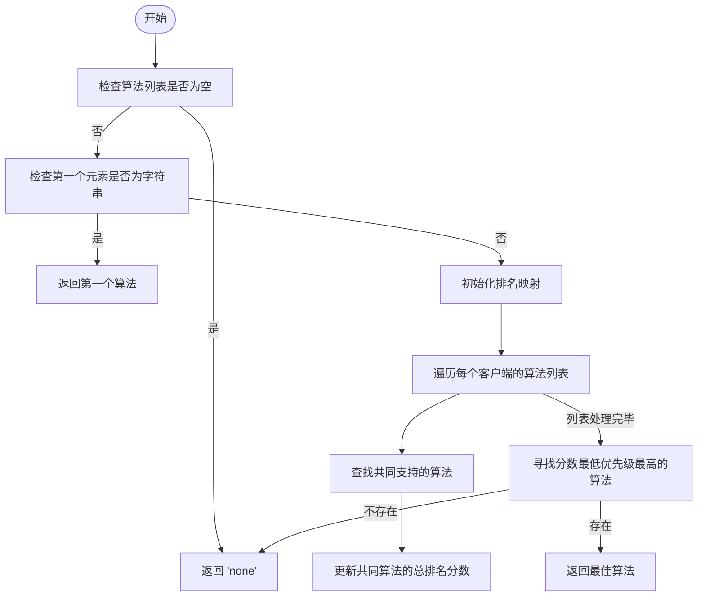
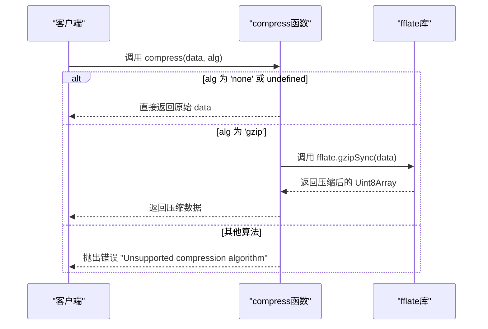
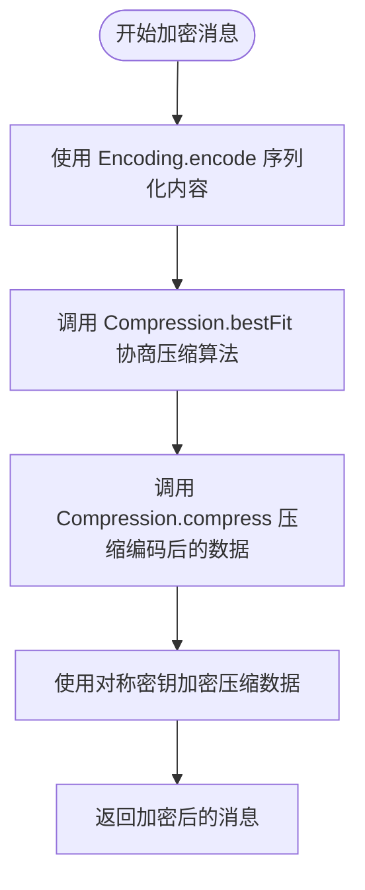

# 消息压缩策略


## 引言

本专项文档旨在深入解析协作系统中的消息压缩机制，基于 `compression.ts` 文件的实现，全面阐述消息在编码后如何通过 `fflate` 库进行无损压缩。文档将详细说明压缩的触发条件、可配置性、性能影响及异常处理流程，为开发者和运维人员提供清晰的技术指导和最佳实践建议。

## 核心机制概述

在协作协议中，消息的传输效率至关重要。为了优化带宽使用，系统在消息编码后引入了可选的无损压缩层。整个流程如下：

1.  **编码 (Encoding)**: 使用 `msgpackr` 库将 JavaScript 对象序列化为紧凑的二进制 `Uint8Array`。
2.  **压缩 (Compression)**: 根据协商的算法，对编码后的二进制数据进行压缩。
3.  **加密 (Encryption)**: （可选）对压缩后的数据进行加密。
4.  **传输**: 将最终的二进制数据通过 WebSocket 等传输层发送。

压缩功能由 `compression.ts` 文件中的 `Compression` 命名空间提供，其核心是 `compress` 和 `decompress` 两个异步函数。

## 压缩算法选择策略

系统支持多种压缩算法，但当前实现仅支持 `gzip` 和 `none`（不压缩）。算法的选择通过 `bestFit` 函数动态协商，确保通信双方使用共同支持的最佳算法。

### 算法类型定义
```typescript
export type Algorithm = 'none' | 'gzip' | (string & {});
```
此类型定义了支持的算法，`string & {}` 允许扩展自定义算法。

### bestFit 函数分析
`bestFit` 函数用于在多个客户端支持的算法列表中，找出一个双方都支持且优先级最高的算法。




该函数的逻辑如下：
1.  如果算法列表为空，则返回 `'none'`。
2.  如果传入的是单个算法列表（字符串数组），则直接返回第一个算法。
3.  如果传入的是多个客户端的算法列表（二维数组），则进行协商：
    *   初始化一个 `Map` 来记录每个算法的总排名分数。
    *   遍历每个客户端的算法列表，对于每个算法，如果它已在 `Map` 中，则将其在当前列表中的索引（位置）加到其总分数上。
    *   只有在所有列表中都出现的算法才会被保留。
    *   最后，选择总分数最低的算法作为最佳匹配（分数越低，表示在列表中位置越靠前，优先级越高）。

## 压缩与解压缩实现

`compress` 和 `decompress` 函数是压缩机制的核心，负责实际的数据处理。

### 函数签名
```typescript
export async function compress(data: Uint8Array, alg: Algorithm): Promise<Uint8Array>;
export async function decompress(data: Uint8Array, alg: Algorithm): Promise<Uint8Array>;
```

### 实现细节



关键实现点：
1.  **同步压缩 (`gzipSync`)**: 代码注释明确指出，使用 `fflate` 的同步版本 (`gzipSync` 和 `gunzipSync`) 比异步版本更快。因为异步调用会创建新的 Worker 线程，开销较大。而本系统的消息大小通常较小，使用同步压缩不会阻塞主线程，因此是更优的选择。
2.  **降级处理**: 当算法为 `'none'` 或未定义时，函数直接返回原始数据，实现了无压缩的降级。
3.  **错误处理**: 对于不支持的算法，函数会抛出明确的错误。

## 消息编码与压缩流程

压缩操作通常与编码和加密流程紧密结合。`encryption.ts` 文件中的 `encrypt` 函数提供了一个典型的调用场景。

### 流程分析



具体步骤（参考 `encryption.ts`）：
1.  **编码**: 首先使用 `Encoding.encode` 将消息内容（`unknown` 类型）转换为 `Uint8Array`。
2.  **算法协商**: 调用 `Compression.bestFit`，传入所有接收方支持的压缩算法列表，以确定本次通信使用的压缩算法。
3.  **压缩**: 调用 `Compression.compress`，传入编码后的数据和协商好的算法，得到压缩后的二进制数据。
4.  **加密**: 使用对称密钥对压缩后的数据进行加密，并生成最终的二进制消息体。

## 性能权衡分析

消息压缩在节省带宽的同时，也带来了额外的 CPU 开销。

### 带宽节省
*   **优势**: 对于文本内容（如代码片段、文档块），`gzip` 压缩通常能取得 60%-80% 的压缩率。例如，一个 10KB 的 JSON 消息可能被压缩到 2-3KB，显著减少了网络传输量，尤其在低带宽或高延迟网络中效果明显。
*   **影响因素**: 压缩率高度依赖于内容。重复性高、冗余多的文本（如日志、JSON、XML）压缩效果好；而已经压缩过的数据（如图片、视频）或随机数据则几乎无法压缩，甚至可能略微增大。

### CPU 开销
*   **优势**: 使用 `fflate` 的同步版本避免了 Worker 线程的创建开销，对于小消息（通常 < 100KB），压缩/解压缩的耗时在毫秒级别，对主线程影响极小。
*   **劣势**: 在高并发或处理超大消息时，CPU 开销会线性增长，可能导致主线程阻塞，影响应用响应速度。

### 权衡结论
*   **推荐开启**: 在大多数协作场景下，消息以文本为主且体积适中，开启压缩带来的带宽节省远大于其 CPU 开销，是推荐的配置。
*   **考虑关闭**: 在 CPU 资源极其紧张的客户端，或主要传输二进制数据的场景下，应考虑关闭压缩以降低 CPU 负载。

## 异常处理与降级机制

系统设计了完善的降级机制，以确保通信的健壮性。

### 降级流程
1.  **算法不支持**: 如果 `compress` 或 `decompress` 函数接收到不支持的算法，会立即抛出错误。上层逻辑（如 `encryption` 模块）应捕获此错误，并可能回退到 `'none'` 算法重新尝试，或直接报告通信失败。
2.  **压缩/解压缩失败**: `fflate` 库在处理损坏的压缩数据时可能会抛出异常。`decompress` 函数应能捕获此类异常，并根据业务逻辑决定是丢弃消息、请求重发，还是尝试以未压缩模式解析。
3.  **协商失败**: `bestFit` 函数在无法找到共同支持的算法时，会返回 `'none'`，这本身就是一种优雅的降级，保证了通信可以继续，只是不使用压缩。

这种“协商失败则降级”的策略，确保了即使在部分客户端不支持压缩的情况下，整个协作网络依然可以正常工作。

## 生产环境配置建议

1.  **默认启用**: 建议在生产环境中默认启用压缩（`algorithm: 'gzip'`），以优化用户体验和降低服务器带宽成本。
2.  **监控性能**: 部署后应监控客户端的 CPU 使用率，特别是在低端设备上。如果发现明显的性能瓶颈，可考虑提供一个运行时开关，允许动态关闭压缩。
3.  **合理设置阈值**: 虽然当前实现没有显式的大小阈值，但理论上可以优化：对于极小的消息（如 < 1KB），压缩的收益可能小于开销。未来可考虑在 `compress` 函数中加入大小判断，对小消息直接跳过压缩。
4.  **客户端兼容性**: `fflate` 库因其轻量级和良好的浏览器兼容性（支持 IE11+）而被选用，无需担心现代浏览器的兼容问题。
5.  **错误日志**: 建议在捕获压缩相关异常时，记录详细的错误日志（包括算法、数据大小等），以便于问题排查。