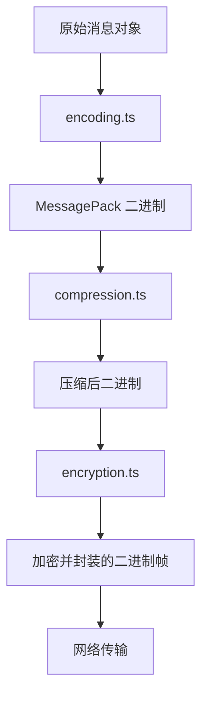
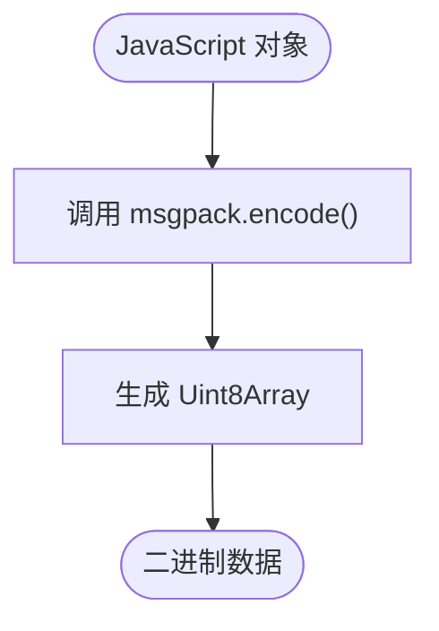
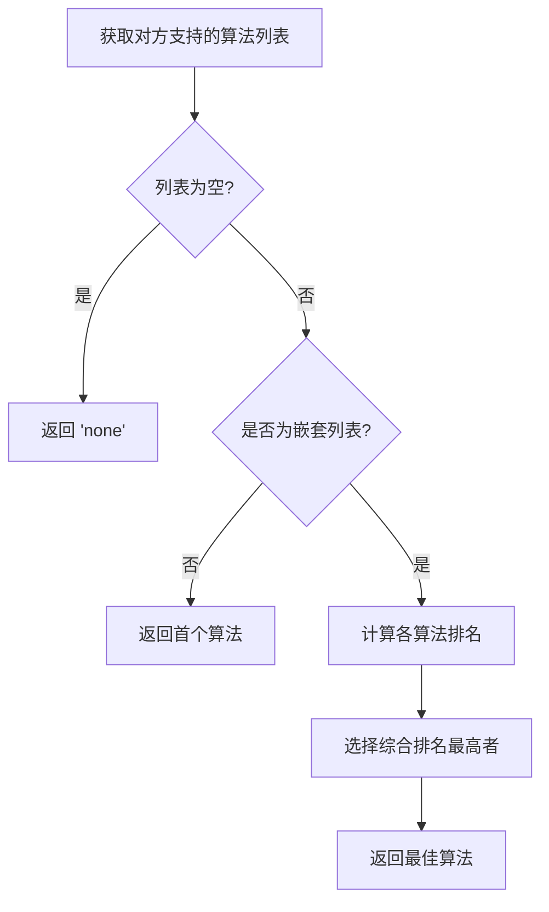
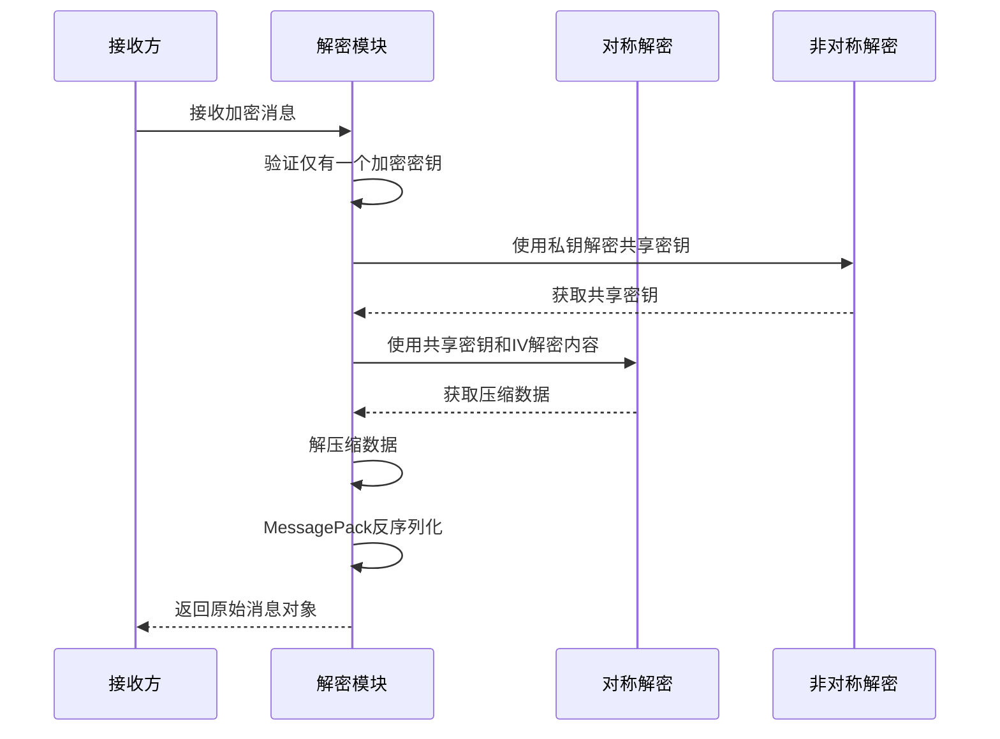
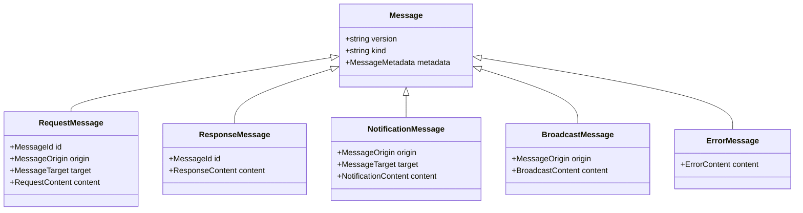
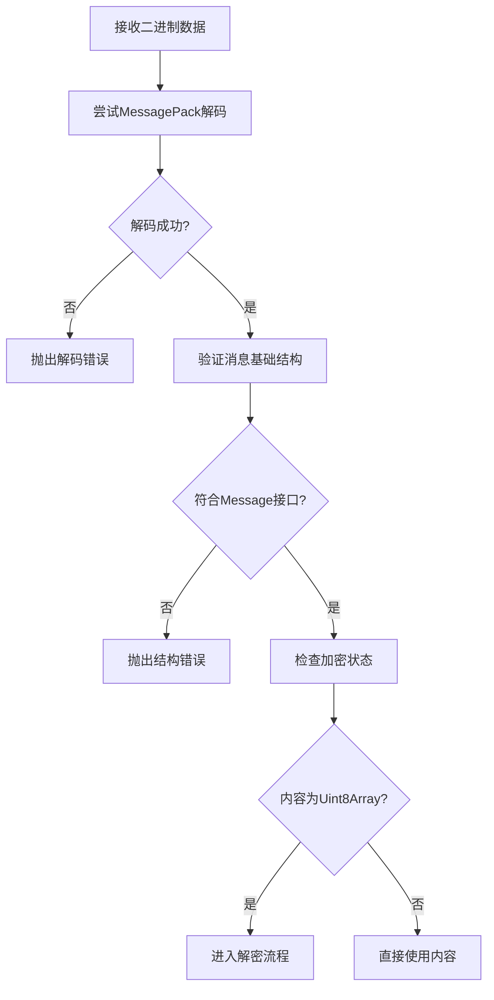

# 消息编码与处理机制


## 简介
本文档深入解析协作系统中协议层的消息处理子系统，涵盖从原始数据到网络传输帧的完整处理流程。重点分析基于 `MessagePack` 的序列化、`fflate` 压缩算法的应用以及符合 JOSE 标准的内容加密机制。文档旨在为开发者提供清晰的技术实现路径和优化指导。

## 核心组件概览
协议层消息处理由四个核心模块构成：编码（encoding）、压缩（compression）、加密（encryption）和消息定义（messages）。这些模块协同工作，确保消息在不同节点间高效、安全地传输。

**组件关系图**


## 消息编码机制

### MessagePack 序列化
`encoding.ts` 模块使用 `msgpackr` 库实现高效二进制序列化。相比 JSON，MessagePack 具有更小的体积和更快的解析速度，适合实时协作场景。

**: 编码函数**
```typescript
export namespace Encoding {
    export function encode(message: unknown): Uint8Array {
        return msgpack.encode(message);
    }
    export function decode(data: Uint8Array): unknown {
        return msgpack.decode(data);
    }
}
```

- **encode**: 将任意 JavaScript 对象转换为 `Uint8Array` 二进制流
- **decode**: 将二进制流还原为原始对象
- **性能优势**: 二进制格式避免了文本解析开销，特别适合频繁传输的小数据包

**序列化流程**


## 压缩算法与性能权衡

### fflate 压缩实现
`compression.ts` 模块集成 `fflate` 库，支持 `gzip` 算法。选择 `fflate` 是因为其轻量级和高性能，特别适合浏览器环境。

**: 压缩算法类型**
```typescript
export type Algorithm = 'none' | 'gzip' | (string & {});
```

**: 压缩/解压函数**
```typescript
export async function compress(data: Uint8Array, alg: Algorithm): Promise<Uint8Array> {
    if (alg === 'none' || alg === undefined) {
        return data;
    } else if (alg === 'gzip') {
        return fflate.gzipSync(data);
    }
    throw new Error('Unsupported compression algorithm: ' + alg);
}
```

**: 关键设计决策**
- **同步压缩**: 使用 `gzipSync` 而非异步版本，避免创建 worker 的开销
- **适用场景**: 适用于小消息（通常 < 1KB），不会阻塞主线程
- **压缩阈值建议**: 当消息编码后大小超过 **512 字节**时启用压缩，可获得显著收益

**: 压缩算法协商**
`bestFit` 函数实现压缩算法协商机制，确保通信双方使用最优且兼容的算法。



## 加密与密钥交换流程

### JOSE 标准实现
`encryption.ts` 模块实现类似 JOSE（JSON Object Signing and Encryption）的混合加密方案，结合对称加密和非对称加密优势。

**: 核心加密流程**
```typescript
export async function encrypt(message: Message & { content: unknown }, symKey: EncryptionKey, ...keys: AsymmetricKey[]): Promise<Message & { content: Uint8Array }> {
    const key = await symKey.symmetricKey;
    const keyBuffer = fromBase64(key);
    const content = message.content;
    const encoded = Encoding.encode(content);
    const compressionAlgo = Compression.bestFit(keys.map(key => key.supportedCompression));
    const compressed = await Compression.compress(encoded, compressionAlgo);
    const iv = await getCryptoLib().generateIV();
    const encrypted = await getCryptoLib().symEncrypt(compressed, key, iv);
    const encryptedKeys = await Promise.all(keys.map(async key => {
        let cachedKey = symKey.cache?.[key.peerId];
        if (!cachedKey) {
            cachedKey = toBase64(await getCryptoLib().publicEncrypt(keyBuffer, key.publicKey));
            if (symKey.cache) {
                symKey.cache[key.peerId] = cachedKey;
            }
        }
        return {
            target: key.peerId,
            key: cachedKey,
            iv
        } as MessageContentKey;
    }));
    return {
        ...message,
        metadata: {
            ...message.metadata,
            encryption: { keys: encryptedKeys },
            compression: { algorithm: compressionAlgo }
        },
        content: encrypted
    };
}
```

**: 加密步骤详解**
1. **内容编码**: 使用 MessagePack 序列化原始内容
2. **内容压缩**: 根据对方支持的算法选择最优压缩方式
3. **生成 IV**: 为对称加密生成初始化向量
4. **对称加密**: 使用共享密钥加密压缩后的内容
5. **密钥加密**: 使用接收方公钥加密共享密钥（密钥交换）
6. **封装消息**: 将加密内容、加密密钥、IV 和元数据封装成最终消息

**: 解密流程**


## 消息类型与数据结构

### 消息基础结构
所有消息遵循统一的基础结构，确保协议的可扩展性和一致性。

**: 基础消息接口**
```typescript
export interface Message {
    version: string;        // 协议版本
    kind: string;           // 消息类型
    metadata: MessageMetadata; // 元数据（加密、压缩等）
}
```

**: 元数据结构**
```typescript
export interface MessageMetadata {
    encryption: MessageEncryption;
    compression: MessageCompression;
}

export interface MessageEncryption {
    keys: MessageContentKey[]; // 加密密钥列表
}

export interface MessageContentKey {
    target: MessageTarget;     // 目标节点ID
    key: string;               // 加密后的共享密钥(Base64)
    iv: string;                // 初始化向量(Base64)
}
```

### 具体消息类型

**: 请求消息 (Request)**
```typescript
export interface RequestMessage extends Message {
    id: MessageId;            // 请求ID
    origin: MessageOrigin;    // 发起方ID
    target: MessageTarget;    // 目标方ID
    content: {
        method: string;       // 方法名
        params?: unknown[];   // 参数列表
    };
}
```
用于发起远程过程调用（RPC），如文档编辑操作。

**: 响应消息 (Response)**
```typescript
export interface ResponseMessage extends Message {
    id: MessageId;            // 对应的请求ID
    content: {
        response: unknown;    // 响应数据
    };
}
```
用于返回请求的执行结果。

**: 通知消息 (Notification)**
```typescript
export interface NotificationMessage extends Message {
    origin: MessageOrigin;    // 发起方ID
    target: MessageTarget;    // 目标方ID
    content: {
        method: string;       // 事件名
        params?: unknown[];   // 事件参数
    };
}
```
用于单向通知，如光标位置更新。

**: 广播消息 (Broadcast)**
```typescript
export interface BroadcastMessage extends Message {
    origin: MessageOrigin;    // 发起方ID
    content: {
        method: string;       // 广播事件名
        params?: unknown[];   // 事件参数
    };
}
```
用于向房间内所有成员广播消息，如聊天内容。

**: 错误消息 (Error)**
```typescript
export interface ErrorMessage extends Message {
    content: {
        message: string;      // 错误描述
    };
}
```
用于传递错误信息。

**消息类型关系图**


## 完整消息转换链示例

### 场景：发送文档更新通知
假设用户 A 向用户 B 发送文档更新通知，展示从原始数据到传输帧的完整转换过程。

**: 原始消息对象**
```json
{
  "version": "1.0",
  "kind": "notification",
  "origin": "userA",
  "target": "userB",
  "metadata": {
    "encryption": { "keys": [] },
    "compression": { "algorithm": "none" }
  },
  "content": {
    "method": "document/update",
    "params": ["Hello World"]
  }
}
```

**: 转换步骤**
1. **编码**: 使用 MessagePack 将对象序列化为二进制
2. **压缩**: 消息大小约 150 字节，低于 512 字节阈值，保持 `none`
3. **加密**: 
   - 生成 256 位 AES 共享密钥
   - 使用用户 B 的公钥加密共享密钥
   - 使用共享密钥和 IV 加密内容
4. **封装**: 更新 metadata，设置加密密钥和压缩算法

**: 最终传输帧结构**
```json
{
  "version": "1.0",
  "kind": "notification",
  "origin": "userA",
  "target": "userB",
  "metadata": {
    "encryption": {
      "keys": [{
        "target": "userB",
        "key": "base64_encoded_encrypted_symmetric_key",
        "iv": "base64_encoded_iv"
      }]
    },
    "compression": {
      "algorithm": "none"
    }
  },
  "content": "Uint8Array_binary_data"
}
```

## 错误处理机制

### 解码失败恢复
系统在解码阶段实施严格的错误处理，确保协议的健壮性。

**: 解码验证流程**


**: 关键错误类型**
- **解码失败**: 二进制数据损坏或格式错误
- **结构验证失败**: 缺少必要字段（如 version、kind）
- **加密验证失败**: 解密密钥数量不为1（安全要求）
- **算法不支持**: 使用了未实现的压缩或加密算法

**: 恢复策略**
- **静默丢弃**: 对于无法解析的消息，直接丢弃以防止错误传播
- **错误反馈**: 对于请求消息，返回标准化的 `ErrorMessage`
- **连接重置**: 连续多次解码失败时，建议重置连接状态

## 安全传输最佳实践

### 密钥管理
- **缓存机制**: `EncryptionKey` 支持缓存已加密的共享密钥，避免重复加密开销
- **私钥保护**: 私钥绝不通过网络传输，始终由客户端本地保管
- **前向保密**: 每次会话使用新的共享密钥，即使长期密钥泄露，历史消息仍安全

### 数据完整性
- **元数据完整性**: 所有元数据（加密、压缩配置）与消息内容一同加密，防止篡改
- **版本控制**: 强制检查协议版本，避免版本不兼容导致的安全漏洞

### 传输安全
- **最小化暴露**: 仅在必要时启用压缩，避免压缩比侧信道攻击
- **算法协商**: 通过 `bestFit` 函数安全协商算法，防止降级攻击

## 性能优化建议

### 编码层
- **避免大对象**: 单条消息建议控制在 1KB 以内，大更新应分片传输
- **复用对象**: 频繁发送的结构化消息可预定义类型，减少序列化开销

### 压缩层
- **动态阈值**: 实际应用中可根据网络状况动态调整 512 字节的压缩阈值
- **算法扩展**: 未来可考虑添加 `brotli` 等更高压缩比算法供选择

### 加密层
- **批量操作**: 对于频繁的小消息，可考虑批量加密以摊薄密钥交换开销
- **硬件加速**: 在支持的环境中启用 Web Crypto API 的硬件加速特性

### 整体策略
- **按需启用**: 在低延迟要求的场景（如光标移动），可临时禁用加密/压缩
- **连接复用**: 建立长连接，避免频繁的密钥协商开销
- **监控反馈**: 实时监控编码、压缩、加密的耗时，作为优化依据