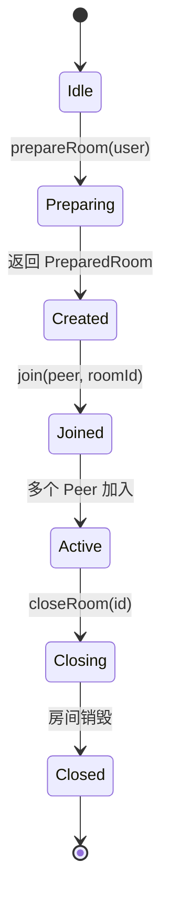
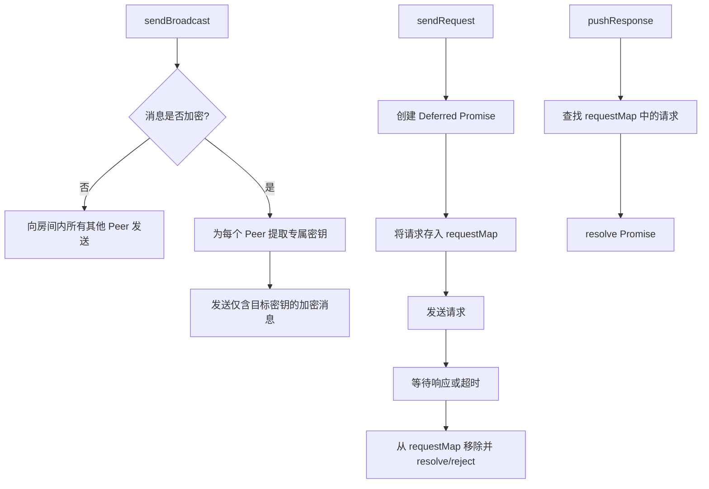
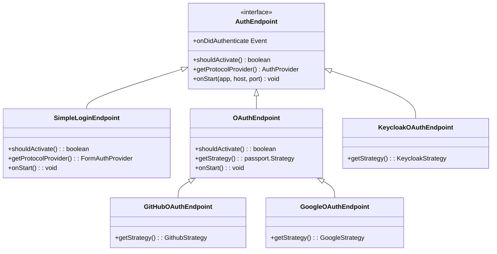
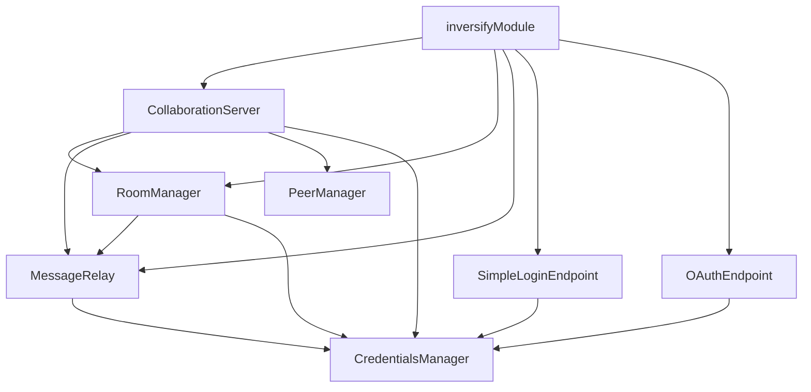

# open-collaboration-server 模块

## 简介

`open-collaboration-server` 是一个用于支持实时协作的后端服务模块，其核心职责包括房间管理、用户认证、消息中继与对等节点协调。该模块基于 WebSocket 和 Socket.IO 实现双向通信，结合 Yjs 状态同步协议，支持多用户协同编辑场景。服务采用依赖注入（Inversify）组织组件，具备可扩展的认证机制（OAuth、Keycloak、简易登录），并通过 `message-relay` 实现高效的消息广播与单播分发。本文档将深入解析其架构设计与运行机制。

## 项目结构

`open-collaboration-server` 模块位于 `packages/open-collaboration-server` 目录下，主要包含以下子目录与文件：

- `src/`: 源码目录
  - `auth-endpoints/`: 认证端点实现（OAuth、Keycloak、简易登录）
  - `static/`: 静态资源（如 `login.html`）
  - `utils/`: 工具类（配置、日志）
  - 核心模块：`app.ts`, `collaboration-server.ts`, `room-manager.ts`, `message-relay.ts`, `peer-manager.ts`, `peer.ts`, `inversify-module.ts`
- `config.json`: 服务配置文件
- `package.json`: 项目依赖与脚本

该结构采用功能模块化组织，核心逻辑与认证、工具分离，便于维护与扩展。

## 核心组件
本模块的核心组件包括：
- **协作服务器 (CollaborationServer)**: 服务入口，管理 WebSocket 连接、API 路由与认证流程。
- **房间管理器 (RoomManager)**: 负责房间的创建、加入、离开与销毁，维护房间生命周期。
- **消息中继 (MessageRelay)**: 实现消息的广播、单播与请求-响应模式，是通信核心。
- **对等节点管理器 (PeerManager)**: 跟踪所有连接的客户端（Peer），支持会话复用。
- **依赖注入模块 (InversifyModule)**: 组织服务组件，实现松耦合。
- **认证端点 (AuthEndpoint)**: 提供多种认证方式的统一接口。

这些组件通过依赖注入协同工作，形成一个高内聚、低耦合的协作服务系统。

## 架构概览

整个服务采用分层架构，自上而下分为：

1. **接入层**: 通过 Express 提供 REST API，通过 Socket.IO 处理实时连接。
2. **控制层**: `CollaborationServer` 协调所有操作，处理连接接入与 API 请求。
3. **业务逻辑层**: `RoomManager` 和 `MessageRelay` 实现核心协作逻辑。
4. **认证层**: 多种 `AuthEndpoint` 实现不同的用户登录方式。
5. **数据与会话层**: `PeerManager` 和内存中的 `Room` 对象维护会话状态。
6. **工具层**: `Configuration` 和 `Logger` 提供基础支持。

## 详细组件分析

### 协作服务器分析

`CollaborationServer` 是服务的主控制器，负责启动 HTTP 服务器、建立 Socket.IO 连接、注册 API 路由和初始化认证端点。

#### WebSocket 连接接入

当客户端通过 Socket.IO 连接时，服务器从请求头中提取 JWT、公钥等信息，验证后创建或复用 `Peer` 对象，并调用 `RoomManager.join()` 加入房间。

**代码逻辑**

1. 从 `headers` 中获取 `x-oct-jwt` 和 `x-oct-public-key`。
2. 使用 `CredentialsManager.verifyJwt()` 验证 JWT 并解析 `RoomClaim`。
3. 检查是否存在同 JWT 的 `Peer`，若存在则更新通道（重连场景）。
4. 否则，通过 `PeerFactory` 创建新 `Peer` 并注册到 `PeerManager`。
5. 调用 `RoomManager.join()` 加入指定房间。

### 房间管理器分析
`RoomManager` 是房间生命周期的核心管理者。

#### 房间生命周期管理


**创建房间**
- `prepareRoom(user)`: 生成唯一房间 ID 和 JWT，返回 `PreparedRoom` 对象。
- JWT 中包含 `RoomClaim`，标识用户为房主 (`host: true`)。

**加入/退出房间**
- `join(peer, roomId)`: 若 `peer.host` 为真，则创建新房间；否则加入现有房间。
- `leaveRoom(peer)`: 发送离开广播，从房间移除 `Peer`，房主退出则关闭房间。

### 消息中继分析

`MessageRelay` 负责消息的分发，支持广播、单播和请求-响应模式。

#### 消息分发策略



#### 与 Yjs 状态同步的集成

虽然 `message-relay.ts` 本身不直接处理 Yjs 数据，但它是 Yjs 状态同步消息的传输通道。Yjs 的 `awareness` 和 `update` 消息通过 `BroadcastMessage` 在 `Peer` 间广播，`MessageRelay.sendBroadcast()` 确保所有房间成员接收到同步消息。

### 认证机制分析
服务支持三种认证方式：简易登录、OAuth（GitHub/Google）、Keycloak。

#### 认证方式实现路径


**简易登录流程**
1. 客户端请求 `/api/login/initial` 获取 `pollToken`。
2. 重定向到 `/login.html?token=...`。
3. 用户提交用户名/邮箱，POST 到 `/api/login/simple`。
4. 服务验证后，通过 `onDidAuthenticate` 事件调用 `CredentialsManager.confirmUser()` 确认用户。

**OAuth 流程**
1. 客户端请求 `/api/login/github`。
2. 服务重定向到 GitHub 登录页（携带 `state=token`）。
3. GitHub 回调 `/api/login/github-callback`。
4. Passport 解析用户信息，触发 `onDidAuthenticate`。

**Token 验证与权限控制**
- 所有 API 请求（如 `/api/session/join/:room`）通过中间件 `getUserFromAuth()` 验证 JWT。
- `CredentialsManager.getUser()` 解析 JWT 并返回 `User` 对象，无有效 Token 则返回 403。

### 配置与依赖注入分析

#### config.json 配置项说明
```json
{
  "oct-activate-simple-login": true,  // 是否启用简易登录
  "oct-server-owner": "Local Development", // 服务器所有者
  "oct-base-url": "http://localhost:8100" // 基础 URL，用于 OAuth 回调
}
```

其他可能配置（未在文件中体现但代码中使用）：
- `oct-oauth-github-clientid`: GitHub OAuth 客户端 ID
- `oct-oauth-github-clientsecret`: GitHub OAuth 客户端密钥
- `oct-login-page-url`: 自定义登录页 URL
- `oct-login-success-url`: 登录成功后重定向 URL

#### 依赖注入作用
`inversify-module.ts` 使用 InversifyJS 实现依赖注入，优点包括：
- **解耦**: 组件通过接口注入，不直接依赖具体实现。
- **单例管理**: `inSingletonScope()` 确保 `RoomManager`、`MessageRelay` 等核心服务全局唯一。
- **工厂模式**: `PeerFactory` 动态创建 `PeerImpl` 实例，每个连接一个 `Peer`。
- **可扩展**: 通过 `multiInject(AuthEndpoint)` 支持多种认证方式的插件式加载。

## 依赖分析
模块内部依赖关系清晰，核心依赖注入图如下：



## 性能考量
在高并发场景下，可采取以下优化措施：

1. **连接复用**: `PeerManager` 支持相同 JWT 的连接复用，减少重复认证开销。
2. **消息批处理**: 可扩展 `MessageRelay` 支持消息批处理，减少网络往返。
3. **房间分片**: 当房间数量巨大时，可引入房间分片或集群模式，避免单点瓶颈。
4. **缓存 JWT**: 使用 Redis 缓存已验证的 JWT，避免重复解析。
5. **日志级别控制**: 生产环境使用 `info` 或 `warn` 级别，减少 `debug` 日志 I/O 开销。

### 日志监控配置
- 使用 `Logger` 接口统一日志输出。
- `ConsoleLogger` 实现将日志输出到控制台。
- 关键操作（如房间创建、用户加入）记录 `info` 级别日志。
- 错误（如连接失败、认证失败）记录 `error` 级别日志，便于监控与排查。

## 故障排查指南
常见问题及解决方案：

1. **无法连接 WebSocket**
   - 检查 `CORS` 配置，确保 `oct-cors-allowed-origins` 正确。
   - 确认客户端发送了 `x-oct-jwt` 和 `x-oct-public-key` 头。

2. **认证失败**
   - 检查 `config.json` 中 `oct-activate-simple-login` 是否为 `true`（简易登录）。
   - OAuth 配置需提供 `clientid` 和 `clientsecret`。
   - 确认 `oct-base-url` 与实际访问地址一致。

3. **用户无法加入房间**
   - 检查 JWT 是否过期或无效。
   - 确认房间 ID 存在且未被关闭。
   - 查看服务日志是否有 `RoomNotFound` 或 `JoinTimeout` 错误。

4. **消息不同步**
   - 检查 `MessageRelay.sendBroadcast()` 是否正常执行。
   - 确认客户端正确处理了 `BroadcastMessage`。

## 结论
`open-collaboration-server` 模块设计精良，采用依赖注入实现高内聚低耦合，通过 `RoomManager` 和 `MessageRelay` 高效管理协作会话。其灵活的认证体系支持多种登录方式，为实时协作应用提供了坚实的基础。通过合理的性能调优与日志监控，可稳定支撑高并发场景。