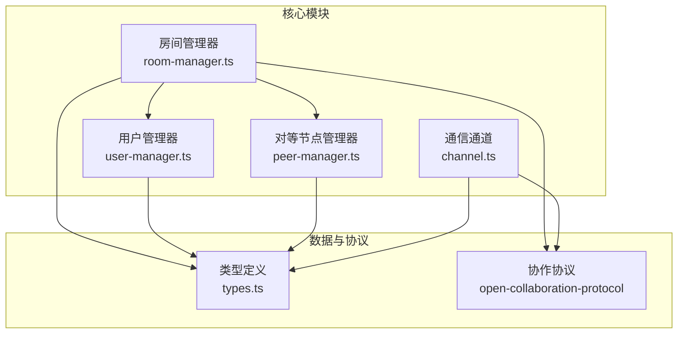
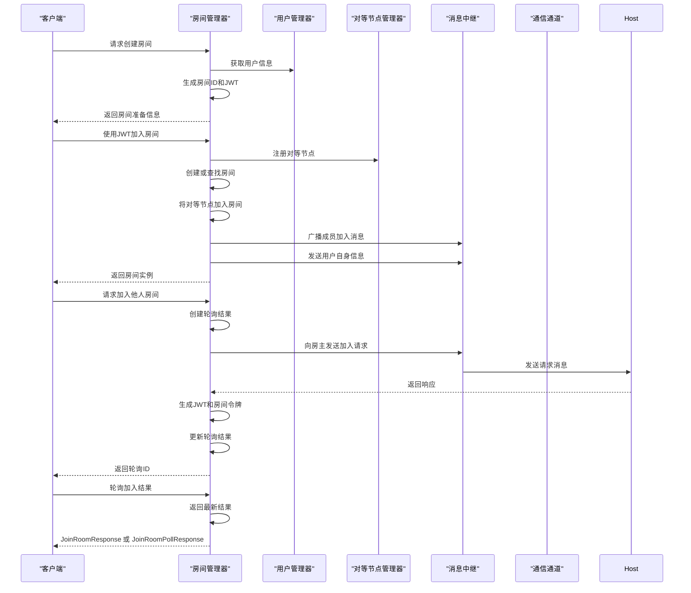
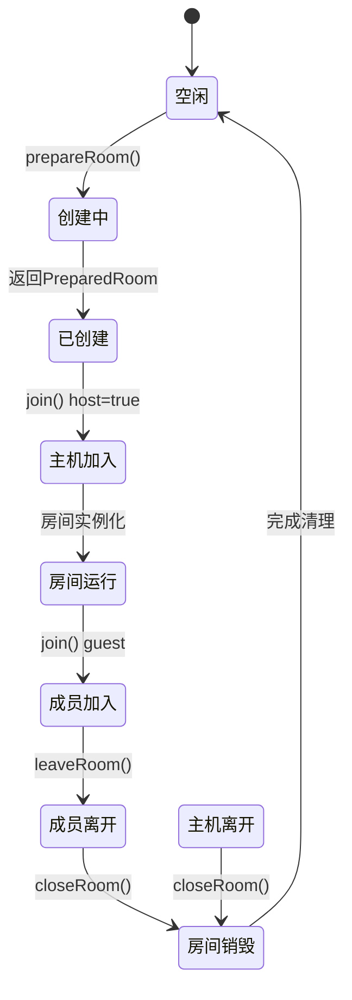
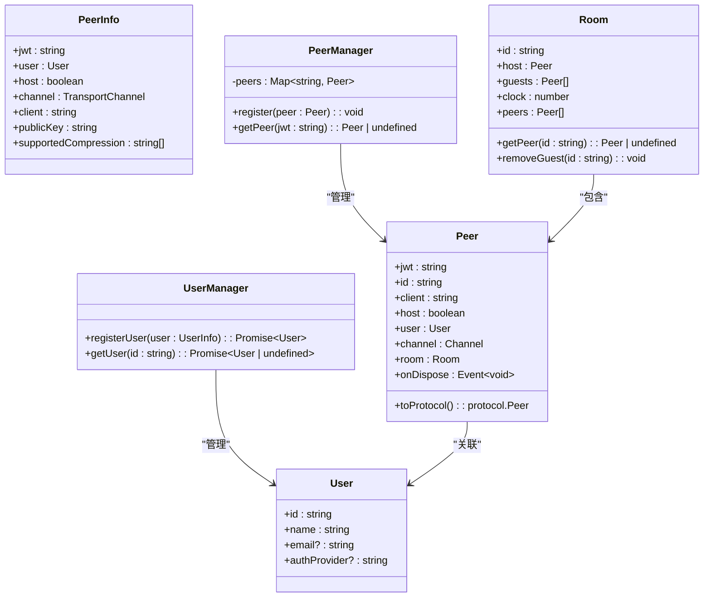
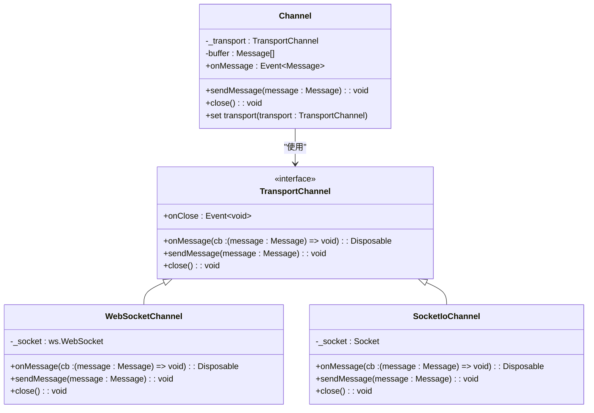
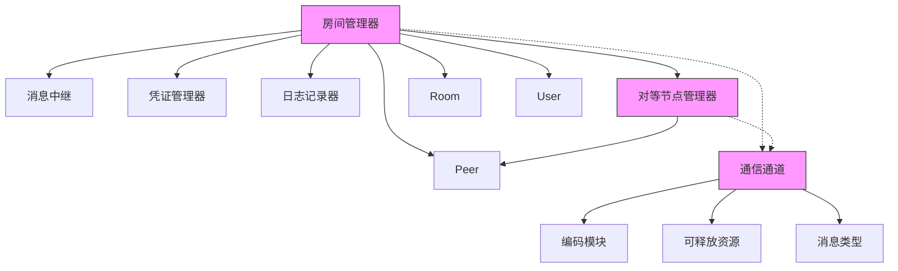

# 房间与用户管理机制

## 简介
本文档深入分析协作系统中的房间与用户管理子系统，重点阐述房间的创建、查找、成员加入/退出及销毁的完整生命周期。结合用户管理、对等节点（Peer）管理与通信通道机制，全面解析用户身份表示、状态管理、权限控制与存在性同步机制。同时提供大规模房间管理的性能优化策略，并通过代码片段展示关键API调用流程。

## 项目结构
协作服务器的核心逻辑集中在 `packages/open-collaboration-server/src/` 目录下。房间管理、用户管理、对等节点管理与通信通道是构成实时协作功能的四大支柱模块。

## 核心组件
本系统的核心组件包括：
- **房间管理器 (RoomManager)**：负责房间的创建、查找、成员加入/退出及销毁。
- **用户管理器 (UserManager)**：负责用户注册与信息管理。
- **对等节点管理器 (PeerManager)**：负责对等节点（Peer）的注册与查找。
- **通信通道 (Channel)**：抽象底层传输协议，提供可靠的消息收发机制。

这些组件共同协作，实现了多用户实时协作的基础功能。

## 架构概览
整个房间与用户管理系统的架构围绕 `RoomManager` 展开，它协调 `UserManager`、`PeerManager` 和 `Channel` 完成协作会话的建立与维护。

## 详细组件分析

### 房间管理器分析
`RoomManager` 是整个协作会话的核心控制器，负责管理所有房间的生命周期。

#### 房间生命周期管理
房间的生命周期包括创建、加入、成员管理与销毁。

#### 关键方法分析
- **prepareRoom(user: User)**: 为主机准备一个新房间。生成唯一的房间ID，并创建一个包含房间声明（RoomClaim）的JWT令牌，该令牌用于后续的身份验证。
- **join(peer: Peer, roomId: string)**: 处理对等节点加入房间的请求。如果是主机，则创建新房间；如果是访客，则将其添加到现有房间，并广播成员加入消息。
- **leaveRoom(peer: Peer)**: 处理成员离开房间的请求。如果是主机，则关闭整个房间；如果是访客，则仅将其从房间中移除，并广播离开消息。
- **closeRoom(id: string)**: 彻底关闭并清理一个房间，释放所有相关资源。

### 用户与对等节点管理分析
用户和对等节点是协作会话中的参与者实体。

#### 类图

#### 用户存在性与状态管理
- **用户 (User)**: 代表一个注册用户，包含ID、姓名、邮箱等基本信息。
- **对等节点 (Peer)**: 代表一个活跃的会话实例，它将 `User` 与当前的通信通道（Channel）关联起来。一个 `User` 可以有多个 `Peer`（例如，从不同设备登录）。
- **状态管理**: `Peer` 实现了 `Disposable` 接口，当连接断开时会触发 `dispose` 事件，从而自动从 `RoomManager` 和 `PeerManager` 中移除，确保状态同步。

### 通信通道分析
`Channel` 模块抽象了底层的网络传输，为上层应用提供统一的消息接口。

#### 通道抽象与实现

#### 消息缓冲与重连机制
`Channel` 实现了智能的消息缓冲机制：
1. 当底层传输断开时，`Channel` 会将 `sendMessage` 的消息暂存到 `buffer` 数组中。
2. 一旦新的 `TransportChannel` 被设置（例如，客户端重连），`Channel` 会立即将缓冲区中的所有消息重新发送。
3. 这确保了在网络不稳定的情况下，关键的协作消息不会丢失。

## 依赖关系分析
各组件之间的依赖关系清晰，遵循了依赖倒置原则。

## 性能考虑
为支持大规模房间管理，系统采用了以下优化策略：

1. **内存数据结构优化**：使用 `Map` 数据结构（`rooms`, `peers`, `pollResults`）进行 O(1) 时间复杂度的查找，确保在大量房间和用户场景下的高效性能。
2. **连接池管理**：`PeerManager` 通过 `Map` 管理所有活动的 `Peer`，实现了对等节点的快速注册与查找。
3. **JWT令牌机制**：`prepareRoom` 和 `requestJoin` 方法生成的JWT令牌包含了房间声明（`RoomClaim`），使得后续的身份验证无需查询数据库，极大提升了性能。
4. **异步非阻塞操作**：所有关键方法（如 `prepareRoom`, `join`, `requestJoin`）均返回 `Promise`，避免阻塞主线程，保证了服务器的高并发处理能力。
5. **资源自动清理**：通过 `Disposable` 模式和 `onDispose` 回调，确保当连接断开或房间关闭时，所有相关资源（如事件监听器、定时器）都能被及时释放，防止内存泄漏。

## 故障排查指南
### 常见问题
1. **无法加入房间**:
   - 检查 `roomId` 是否正确。
   - 确认房间是否已由主机创建。
   - 查看服务器日志中是否有 `Could not find room to join from id` 错误。

2. **加入请求超时**:
   - 检查房主客户端是否在线且能正常接收消息。
   - 确认 `requestJoin` 流程中，`MessageRelay` 是否成功将请求发送给房主。
   - 查看日志中是否有 `Join request has timed out` 记录。

3. **消息丢失**:
   - 检查 `Channel` 的 `buffer` 机制是否正常工作。
   - 确认 `WebSocketChannel` 或 `SocketIoChannel` 的 `onMessage` 解码逻辑是否正确处理了 `Encoding.decode`。

4. **内存泄漏**:
   - 确保 `Peer` 的 `dispose` 方法被正确调用。
   - 检查 `RoomManager` 的 `closeRoom` 和 `leaveRoom` 方法是否彻底清除了 `rooms` 和 `peers` 映射中的条目。

**本节来源**
- [room-manager.ts](file://packages/open-collaboration-server/src/room-manager.ts#L1-L260)
- [channel.ts](file://packages/open-collaboration-server/src/channel.ts#L1-L192)

## 结论
本文档详细解析了协作系统中房间与用户管理的核心机制。`RoomManager` 作为核心控制器，协同 `UserManager`、`PeerManager` 和 `Channel` 模块，实现了完整的房间生命周期管理、用户身份表示、状态同步与可靠通信。系统设计清晰，模块职责分明，并通过JWT、内存映射和消息缓冲等技术实现了高性能和高可靠性。该架构为构建大规模实时协作应用提供了坚实的基础。