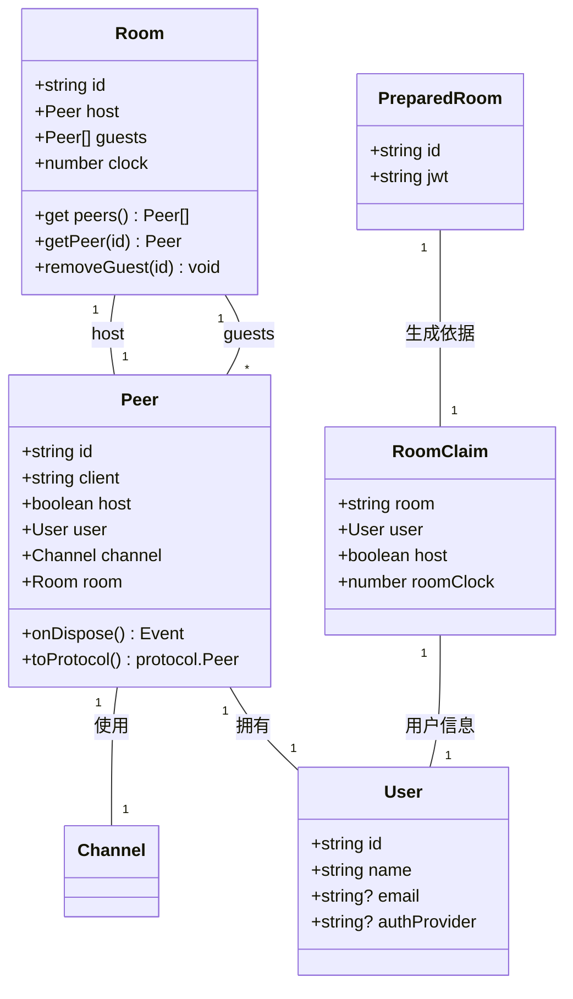
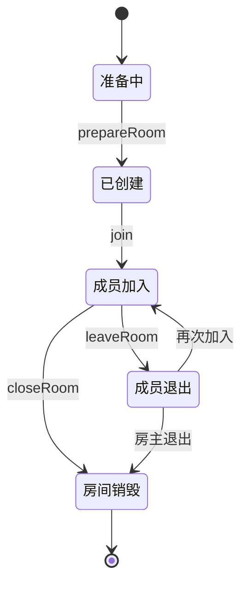
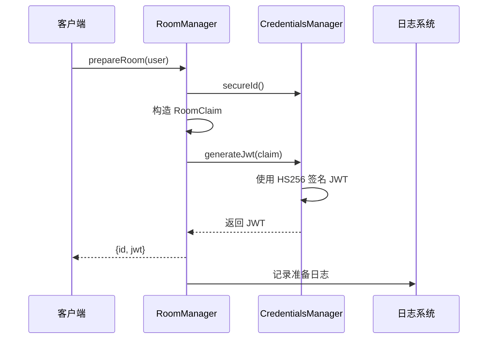
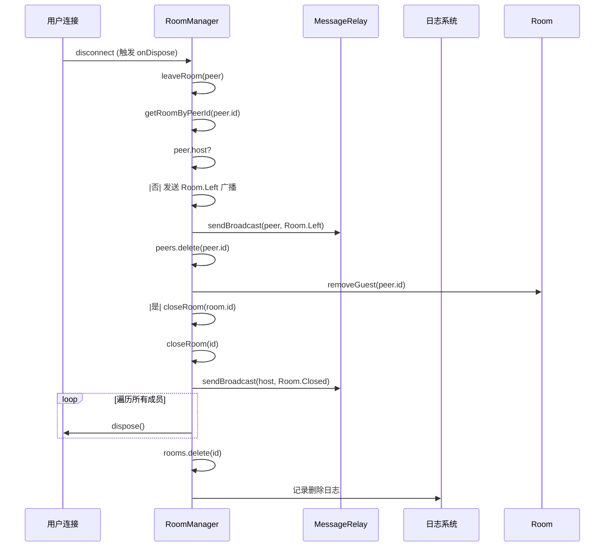
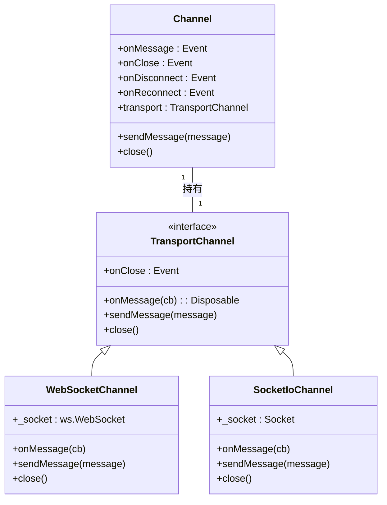

# 房间生命周期管理

## 引言
本文档深入分析基于 `room-manager.ts` 和 `channel.ts` 的房间生命周期管理机制。系统通过创建、加入、退出和销毁房间，实现多用户协作会话的动态管理。文档详细阐述了房间状态变更时的事件广播逻辑、JWT令牌生成机制、通信通道的动态绑定，以及在高并发场景下的资源清理策略，确保协作系统的稳定性与安全性。

## 核心数据结构

### Room 与 PreparedRoom 数据结构设计



**中文字段说明**  
- **Room.id**: 房间唯一标识符，由 `secureId()` 生成
- **Room.host**: 房主 `Peer` 实例，拥有房间控制权
- **Room.guests**: 当前加入的访客列表
- **Room.clock**: 时钟计数器，每次新会话递增，用于区分重连与新加入
- **PreparedRoom.jwt**: 用于身份验证的 JWT 令牌，包含房间、用户、时钟等声明
- **RoomClaim**: JWT 载荷结构，包含房间ID、用户信息、是否为房主、时钟值

**设计意图**  
- **时钟机制 (roomClock)**：防止用户使用旧JWT重连时产生冲突，每次加入递增时钟，确保JWT唯一性
- **JWT 令牌**：无状态认证，包含房间上下文，避免服务端存储会话
- **Peer 与 Channel 分离**：`Peer` 表示用户连接上下文，`Channel` 表示底层通信通道，便于复用与管理

## 房间生命周期流程



## 房间创建与准备

### prepareRoom 流程分析



**关键代码实现**

```typescript
async prepareRoom(user: User): Promise<PreparedRoom> {
    const id = this.credentials.secureId(); // 生成24位安全ID
    const claim: RoomClaim = {
        room: id,
        user: {
            id: user.id,
            name: user.name,
            email: user.email
        },
        host: true, // 标记为房主
        roomClock: 0  // 初始时钟为0
    };
    this.logger.info(`为用户准备房间 [id: '${claim.room}']...`);
    const jwt = await this.credentials.generateJwt(claim); // 生成JWT
    return {
        id,
        jwt
    };
}
```

**JWT 生成逻辑**  
- 使用 `jose.SignJWT` 进行HS256签名
- 私钥来自配置 `oct-jwt-private-key` 或默认文件
- 无过期时间（可配置），依赖房间生命周期管理

## 成员加入房间

### join 方法实现细节

```
flowchart TD
Start([join(peer, roomId)]) --> IsHost{是否为房主?}
IsHost --> |是| CreateRoom["创建新 Room 实例<br>rooms.set(id, room)<br>peers.set(peer.id, room)"]
CreateRoom --> SetDispose["设置 onDispose 回调<br>关闭房间"]
SetDispose --> LogCreate["记录创建日志"]
SetDispose --> SendInfo["发送 Peer.Info 通知"]
IsHost --> |否| FindRoom["查找房间<br>rooms.get(roomId)"]
FindRoom --> RoomExists{房间存在?}
RoomExists --> |否| ThrowError["抛出错误: 房间不存在"]
RoomExists --> |是| AddToRoom["peers.set(peer.id, room)<br>room.guests.push(peer)"]
AddToRoom --> SendBroadcast["发送 Room.Joined 广播"]
SendBroadcast --> SetLeaveCallback["设置 onDispose 回调<br>leaveRoom(peer)"]
SetLeaveCallback --> SendInfo
SendInfo --> ReturnRoom["返回 Room 实例"]
style Start fill:#4CAF50,stroke:#388E3C
style ThrowError fill:#F44336,stroke:#D32F2F
style ReturnRoom fill:#2196F3,stroke:#1976D2
```

**异常处理路径**  
当 `roomId` 不存在时，系统抛出日志错误：

```typescript
room = this.rooms.get(roomId);
if (!room) {
    throw this.logger.createErrorAndLog(`Could not find room to join from id: ${roomId}`);
}
```

此设计确保客户端能明确感知房间不存在，避免无效连接。

## 成员退出与房间销毁

### leaveRoom 与 closeRoom 逻辑



**关键代码片段**

```typescript
async leaveRoom(peer: Peer): Promise<void> {
    const room = this.getRoomByPeerId(peer.id);
    if (!room) return;

    if (peer.host) {
        // 房主退出即销毁房间
        this.closeRoom(room.id);
    } else {
        // 普通成员退出，广播离开事件
        const broadcastMessage = BroadcastMessage.create(Messages.Room.Left, '', [peer.toProtocol()]);
        this.messageRelay.sendBroadcast(peer, broadcastMessage);
        this.peers.delete(peer.id);
        room.removeGuest(peer.id);
    }
}
```

## 事件广播机制

### 广播事件类型与处理

| 事件类型 | 触发时机 | 接收方 | 说明 |
|--------|--------|-------|------|
| **Room.Joined** | 成员成功加入 | 房间内所有其他成员 | 通知新成员加入 |
| **Room.Left** | 成员退出 | 房间内所有其他成员 | 通知成员离开 |
| **Room.Closed** | 房间销毁 | 房间内所有成员 | 通知房间关闭 |
| **Peer.Info** | 成员加入后 | 成员自身 | 返回其在系统中的身份信息 |

**广播实现逻辑**  
通过 `MessageRelay.sendBroadcast()` 实现：

```typescript
sendBroadcast(origin: Peer, message: UnknownBroadcastMessage): void {
    const room = origin.room;
    message.origin = origin.id;
    for (const peer of room.peers) {
        if (peer !== origin) {
            peer.channel.sendMessage(message);
        }
    }
}
```

**加密广播支持**  
系统支持加密广播，通过 `metadata.encryption.keys` 为每个接收者分配密钥，确保消息安全。

## 通信通道管理

### Channel 与 TransportChannel 结构



**通道生命周期**  
- **构造时**：绑定底层Socket事件（message, close）
- **断开连接**：触发 `onDisconnect`，启动30秒关闭倒计时
- **重新连接**：清除倒计时，触发 `onReconnect`，重发缓冲消息
- **消息发送**：若通道未就绪，消息暂存 `buffer` 中，待连接恢复后发送

