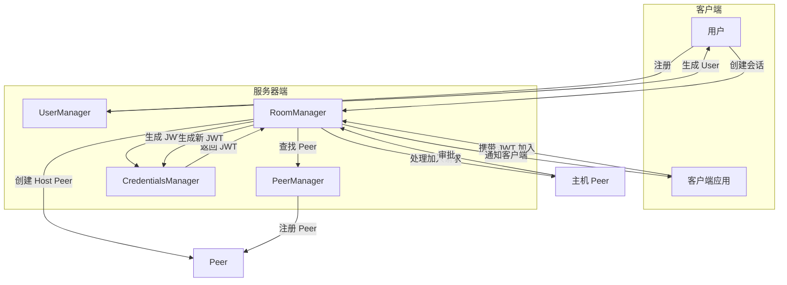
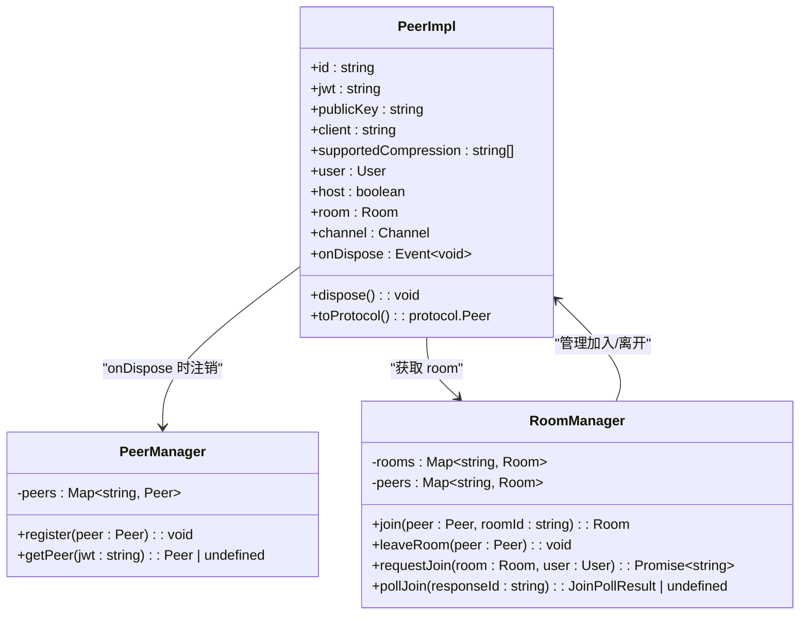
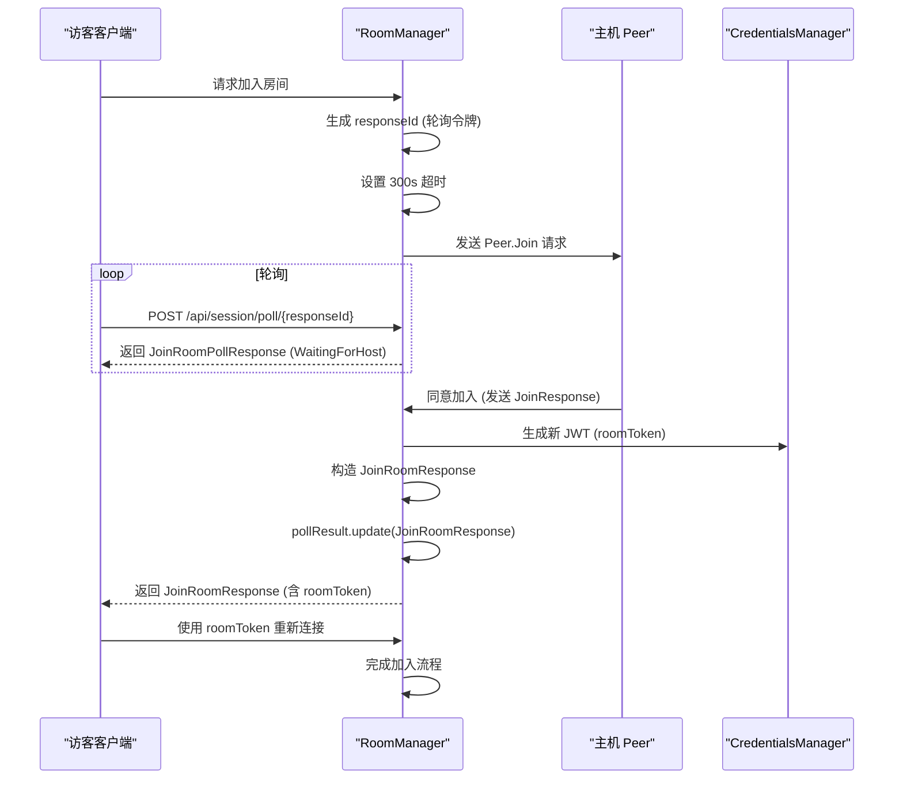

# 用户与对等节点管理

## 引言
本文档深入探讨协作系统中用户与对等节点（Peer）的管理机制。基于 `peer.ts`、`peer-manager.ts` 和 `user-manager.ts` 等核心文件，详细阐述用户如何在协作会话中被抽象为 Peer 实体，包括其身份信息、客户端标识、主机权限及生命周期管理。同时，分析 `room-manager.ts` 如何协调房间生命周期与用户加入流程，并解释用户存在性（Presence）同步机制与 JWT 会话令牌的动态生成过程。

## 项目结构
协作服务器的核心模块位于 `packages/open-collaboration-server/src/` 目录下。用户与对等节点管理主要涉及以下文件：
- `peer.ts`：定义 `PeerImpl` 类，表示连接到房间的单个客户端实例。
- `peer-manager.ts`：全局管理所有对等节点的映射关系。
- `user-manager.ts`：负责用户身份的注册与初始化。
- `room-manager.ts`：管理房间的创建、加入、离开及主机审批流程。
- `types.ts`：定义共享的数据结构，如 `User`、`Peer`、`Room` 等。

这些模块通过依赖注入（Inversify）协同工作，构成协作会话的基础。

## 核心组件
本系统的核心是将用户（User）抽象为对等节点（Peer），并将其与房间（Room）关联。`User` 代表用户的身份信息（ID、姓名、邮箱），而 `Peer` 则代表用户在特定会话中的运行时实例，包含客户端标识、加密公钥、压缩支持等元数据。`PeerManager` 负责全局注册和查找 `Peer`，而 `RoomManager` 负责管理 `Peer` 与 `Room` 的生命周期。

## 架构概览

## 详细组件分析

### 对等节点（Peer）分析
`PeerImpl` 类是用户在协作会话中的核心运行时抽象。每个连接的客户端都会在服务器端创建一个 `Peer` 实例。

#### Peer 的核心属性
- **id**: 由 `nanoid` 生成的唯一标识符。
- **jwt**: 该 Peer 的会话令牌，用于身份验证。
- **client**: 客户端类型标识（如 "vscode"）。
- **user**: 关联的用户身份信息（`User` 对象）。
- **host**: 布尔值，表示该 Peer 是否为房间的创建者（主机）。
- **room**: 通过 `RoomManager` 动态获取，表示该 Peer 所属的房间。

#### 生命周期管理
`Peer` 的生命周期由 `onDispose` 事件管理。当客户端断开连接或主动离开时，`dispose()` 方法会被调用，触发 `onDisposeEmitter`，并清理资源（如关闭通信通道 `Channel`）。`PeerManager` 通过监听此事件，自动从全局映射中移除已销毁的 Peer。

### 用户管理分析
`UserManager` 负责用户身份的初始化。`registerUser` 方法接收来自认证端点（如 Keycloak）的 `UserInfo`，为其生成唯一的 `id`，并返回一个完整的 `User` 对象。此 `User` 对象随后可用于创建房间或请求加入房间。

### 房间与会话管理分析
`RoomManager` 是协调用户加入流程的核心。

#### 主机创建房间
1.  用户通过 `UserManager` 获取身份。
2.  调用 `RoomManager.prepareRoom(user)`。
3.  `CredentialsManager` 生成一个包含 `RoomClaim`（含 `room` ID, `user` 信息, `host: true`）的 JWT。
4.  返回 `PreparedRoom`（包含 `id` 和 `jwt`），客户端使用此 JWT 作为主机加入。

#### 用户请求加入房间
1.  非主机 Peer 携带其 JWT 尝试加入。
2.  `RoomManager.join()` 将其加入房间的 `guests` 列表，并广播 `Room.Joined` 事件。
3.  调用 `RoomManager.requestJoin(room, user)` 发起加入请求。
    -   生成一个唯一的 `responseId` 作为轮询令牌。
    -   设置 300 秒（5分钟）超时。
    -   向房间主机发送 `Peer.Join` 请求消息。
    -   创建 `JoinPollResult` 对象，包含 `update` 和 `onUpdate` 方法，用于后续更新状态。

#### 主机审批与响应
1.  主机客户端收到 `Peer.Join` 请求，可选择接受或拒绝。
2.  若接受，主机返回 `JoinResponse` 消息。
3.  服务器收到响应后：
    -   生成新的 `claim`，`roomClock` 自增，确保会话唯一性。
    -   `CredentialsManager` 生成新的 `roomToken` (JWT)。
    -   构造 `JoinRoomResponse` 对象，包含 `roomId`, `roomToken`, `workspace` 和 `host` 信息。
    -   调用 `pollResult.update(joinRoomResponse)`。
4.  客户端通过轮询 `/api/session/poll/:token` 接口，获取最终的 `JoinRoomResponse`，从而获得加入房间所需的令牌。

## 故障排查指南
- **无法加入房间**: 检查 `RoomManager.join()` 是否成功，确认 `roomId` 是否正确，以及主机 Peer 是否在线。
- **轮询超时**: 检查主机客户端是否收到了 `Peer.Join` 请求，以及网络连接是否正常。查看日志中是否有 `JoinTimeout` 错误。
- **JWT 无效**: 确认 `CredentialsManager` 的密钥配置正确，且 JWT 未过期。检查 `RoomClaim` 中的 `roomClock` 是否正确递增。
- **内存泄漏**: 监控服务器内存使用情况。如果 `PeerManager.peers` 或 `RoomManager.pollResults` 的大小持续增长而不减少，检查 `Peer.dispose()` 是否被正确调用。

## 结论
本系统通过 `Peer` 抽象将用户身份与会话实例分离，利用 `PeerManager` 进行全局管理，并通过 `RoomManager` 实现复杂的房间加入与审批流程。基于 JWT 的会话令牌和轮询机制确保了安全性与灵活性。理解这些组件的交互对于维护和扩展协作功能至关重要。