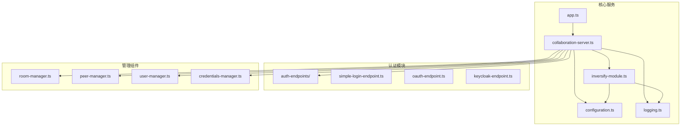
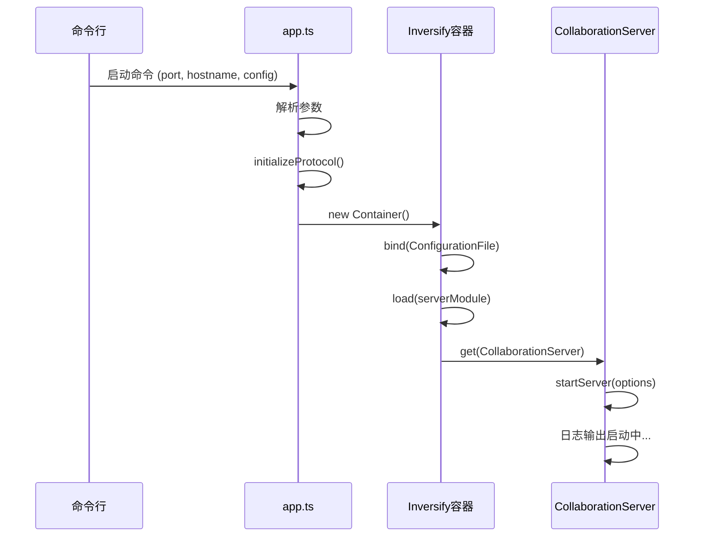
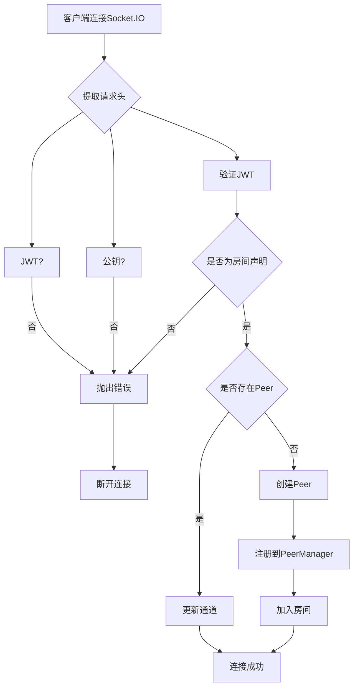

# 服务架构与启动流程

## 项目结构

`open-collaboration-server` 是协作系统的核心服务模块，采用模块化设计，主要包含以下目录结构：

- `auth-endpoints`：认证端点实现，支持简单登录、OAuth 和 Keycloak。
- `static`：静态资源文件，如登录页面。
- `utils`：工具类，包括配置和日志。
- 核心服务类：`app.ts`、`collaboration-server.ts`、`peer-manager.ts` 等。
- `inversify-module.ts`：依赖注入模块定义。

该结构体现了清晰的分层设计，便于扩展和维护。



## 核心组件

`open-collaboration-server` 的核心组件包括：

- **CollaborationServer**：主服务类，负责启动HTTP服务器和WebSocket连接。
- **RoomManager**：管理协作房间的创建、加入和状态。
- **PeerManager**：管理客户端对等连接。
- **UserManager**：用户信息管理。
- **CredentialsManager**：JWT认证和凭证管理。
- **MessageRelay**：消息中继服务。
- **AuthEndpoint**：认证端点抽象，支持多种认证方式。

这些组件通过依赖注入（Inversify）进行解耦，提高了可测试性和可扩展性。

## 服务启动流程

服务的启动入口是 `index.ts`，但实际启动逻辑在 `app.ts` 中通过 Commander CLI 工具解析命令行参数并调用 `startServer` 函数。

### 启动流程步骤：

1. 解析命令行参数（端口、主机名、配置文件路径）。
2. 初始化协议（`initializeProtocol`）。
3. 创建 Inversify 容器。
4. 绑定配置文件路径。
5. 加载依赖注入模块（`serverModule`）。
6. 从容器获取 `CollaborationServer` 实例并调用 `startServer`。



## 依赖注入容器分析

`inversify-module.ts` 定义了整个服务的依赖注入容器模块，使用 InversifyJS 实现控制反转。

### 主要绑定关系：

- 单例服务：`Logger`、`Configuration`、`RoomManager`、`CredentialsManager` 等。
- 工厂模式：`PeerFactory` 用于动态创建 `PeerImpl` 实例。
- 多重注入：`AuthEndpoint` 接口绑定多个实现（SimpleLogin、GitHub、Google、Keycloak）。

## HTTP路由与API初始化

`collaboration-server.ts` 中的 `setupApiRoute` 方法初始化了Express应用并注册了所有REST API端点。

### 主要API端点：

- `POST /api/login/initial`：登录初始化，返回认证令牌和登录页面。
- `POST /api/login/validate`：验证JWT有效性。
- `POST /api/login/poll/:token`：轮询登录结果。
- `GET /api/meta`：获取服务器元信息。
- `GET /api/logout`：登出，清除cookie。
- `POST /api/session/join/:room`：请求加入房间。
- `POST /api/session/poll/:token`：轮询加入房间结果。
- `POST /api/session/create`：创建新房间。

这些API通过中间件进行CORS和身份验证保护。

## WebSocket连接集成

服务使用 Socket.IO 实现WebSocket连接，替代了原生WebSocket。

### 连接流程：

1. 客户端通过Socket.IO连接到 `/` 路径。
2. 服务端监听 `connection` 事件。
3. 提取请求头中的JWT、公钥、压缩方式等信息。
4. 验证JWT并检查是否为房间声明（room claim）。
5. 如果已有相同JWT的Peer，则更新通道；否则创建新Peer并加入房间。



## 配置文件详解

`config.json` 文件定义了服务的运行时配置。

### 配置项说明：

- `"oct-activate-simple-login"`：是否启用简单登录认证。
- `"oct-server-owner"`：服务器所有者信息，用于元数据返回。
- `"oct-base-url"`：服务基础URL，用于生成回调链接。

这些配置通过 `Configuration` 接口在运行时读取，支持环境变量覆盖。

```json
{
  "oct-activate-simple-login": true,
  "oct-server-owner": "Local Development",
  "oct-base-url": "http://localhost:8100"
}
```

## 生命周期管理

### 启动：
通过 `startServer` 方法启动HTTP和WebSocket服务，绑定到指定端口。

### 健康检查：
- `GET /api/meta` 提供版本和元信息。
- 日志输出包含启动状态和错误信息。

### 关闭：
- 未显式实现优雅关闭，但Node.js进程终止时会自动释放资源。
- 建议在容器化环境中使用信号处理（SIGTERM）实现优雅关闭。

## 高可用部署建议

### 部署模式：
- 使用Docker容器化部署。
- 通过Kubernetes或Docker Compose进行编排。
- 配置反向代理（如Nginx）处理SSL和负载均衡。

### 容器化运行参数示例：

```dockerfile
# Dockerfile
FROM node:18-alpine
WORKDIR /app
COPY packages/open-collaboration-server ./
RUN npm install --production
EXPOSE 8100
CMD ["node", "src/index.js", "--port", "8100", "--hostname", "0.0.0.0", "--config", "config.json"]
```

```yaml
# docker-compose.yml
version: '3'
services:
  collaboration-server:
    build: .
    ports:
      - "8100:8100"
    environment:
      - NODE_ENV=production
    volumes:
      - ./config.json:/app/config.json
    restart: unless-stopped
```

### 高可用配置：
- 部署多个实例，使用Redis或数据库共享会话状态。
- 配置Socket.IO适配器支持多节点通信。
- 使用外部认证服务（如Keycloak）集中管理用户。