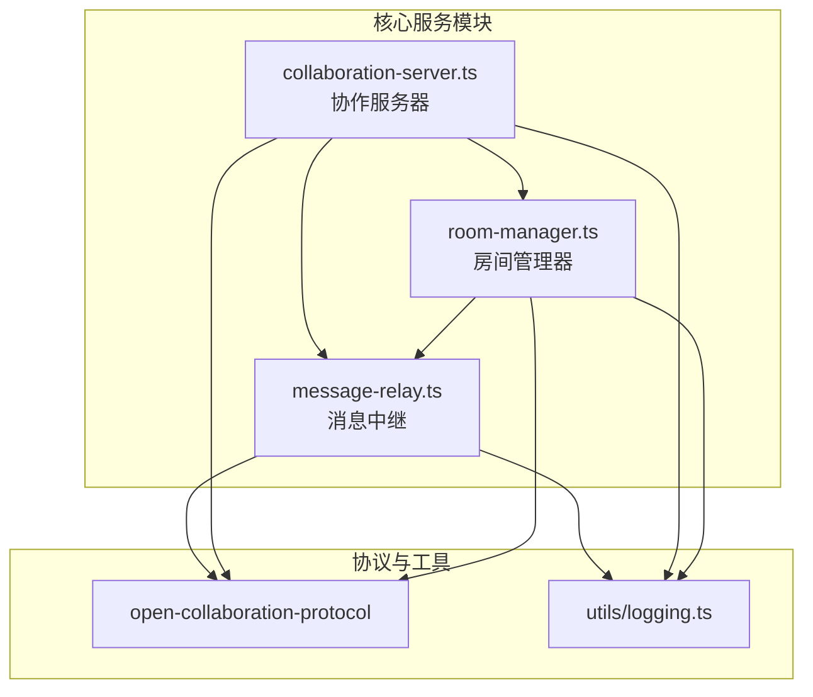
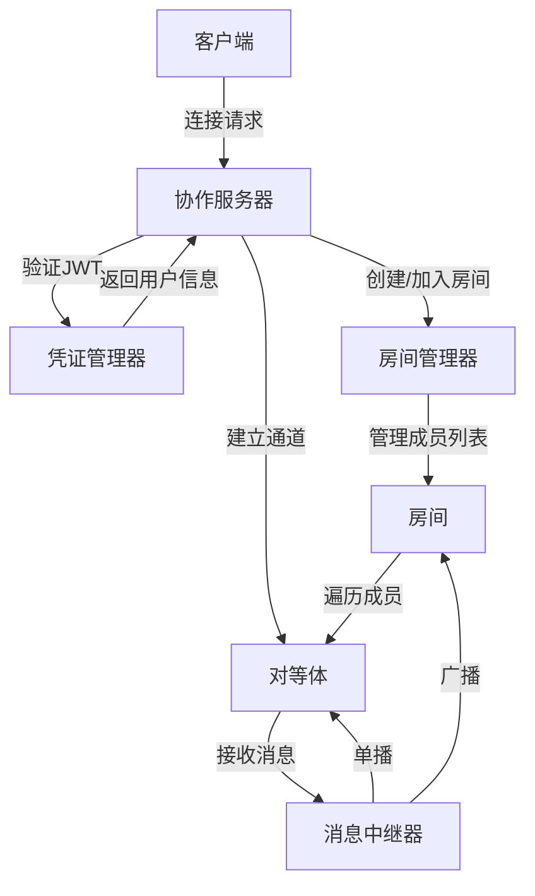
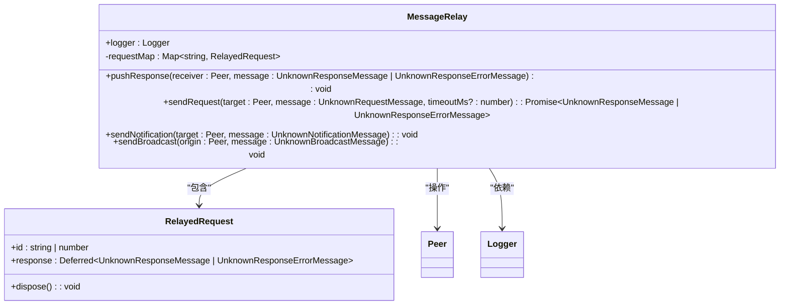
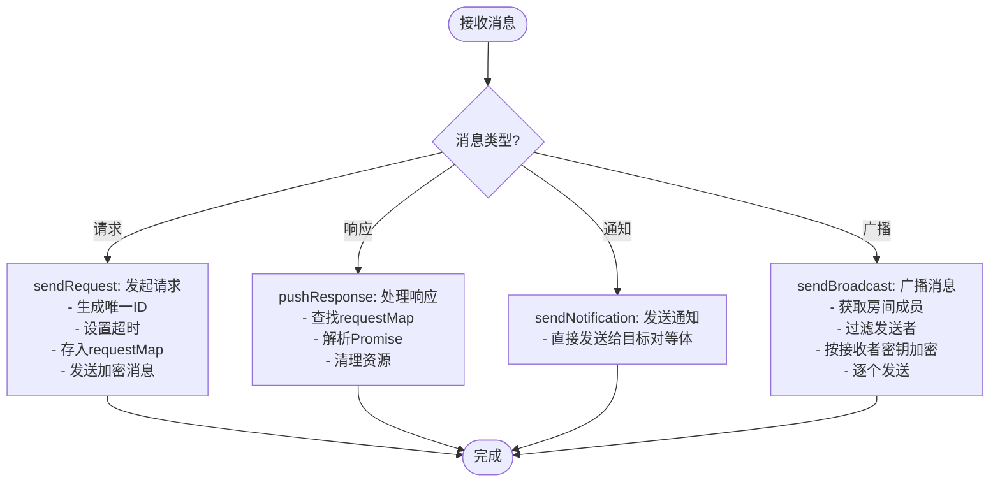
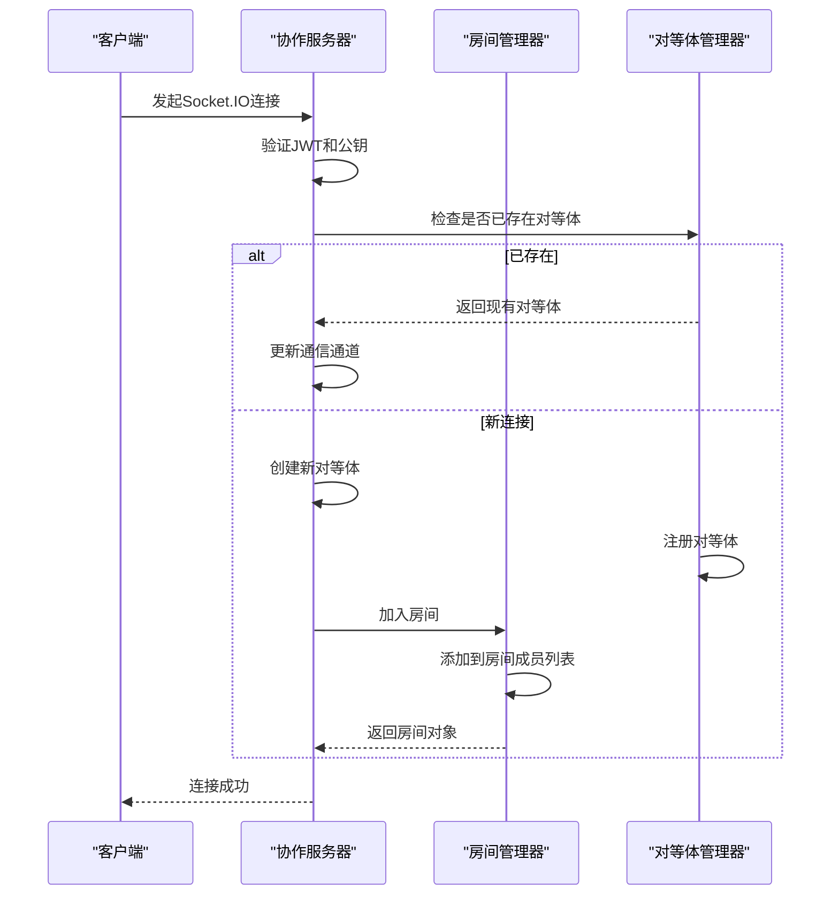
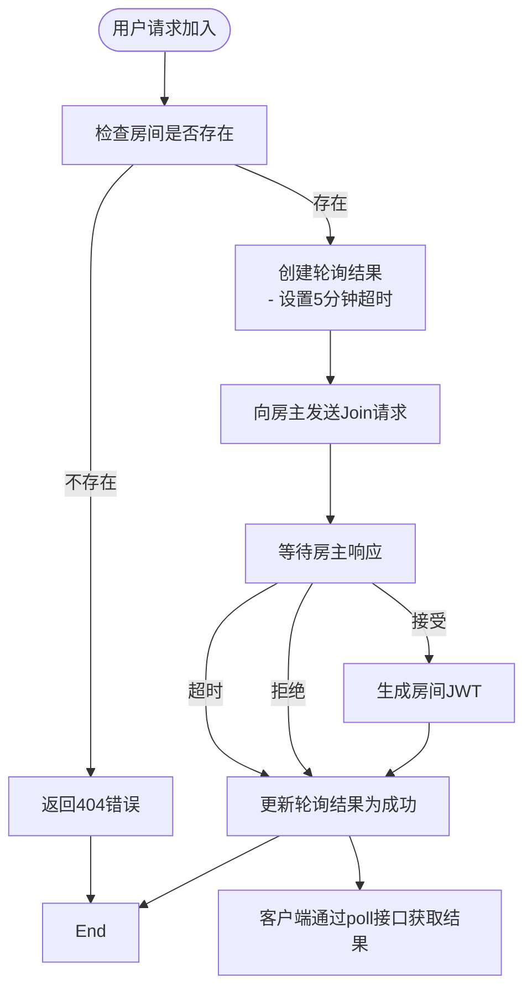
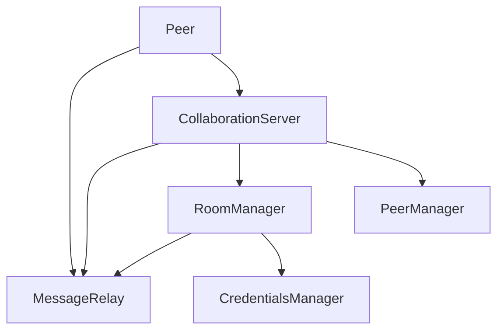

# 消息中继与广播系统

## 引言
本文档旨在深入解析基于 `message-relay.ts` 实现的消息中继与广播系统。系统支持单播、组播和广播三种消息分发模式，集成于协作服务器中，通过房间管理器获取会话成员列表，实现高效、安全的消息传递。文档涵盖消息接收、验证、分发流程，以及背压处理、异常重试机制，并提供性能监控与优化建议。

## 项目结构
项目采用模块化设计，核心功能分布在多个包中。`open-collaboration-server` 包含服务端核心逻辑，其中 `message-relay.ts`、`collaboration-server.ts` 和 `room-manager.ts` 是实现消息中继系统的关键文件。

## 核心组件
系统由三大核心组件构成：消息中继器（MessageRelay）、协作服务器（CollaborationServer）和房间管理器（RoomManager）。它们协同工作，完成从客户端连接到消息分发的完整流程。

## 架构概览
整个消息中继系统的架构围绕事件驱动和依赖注入模式构建。客户端通过WebSocket或Socket.IO连接，经由认证后加入房间，消息通过中继器根据类型和目标进行分发。

## 详细组件分析

### 消息中继器分析
`MessageRelay` 类是消息分发的核心，负责处理请求、通知和广播三种消息类型。

#### 类结构与关系

#### 消息处理流程

### 协作服务器分析
`CollaborationServer` 是系统的入口，负责HTTP API、WebSocket连接和认证流程。

#### 连接建立时序图

### 房间管理器分析
`RoomManager` 负责房间的生命周期管理和成员加入/离开逻辑。

#### 成员加入流程

## 依赖关系分析
系统各组件间存在清晰的依赖关系，通过Inversify实现依赖注入。

## 性能考量
系统在高并发场景下的性能表现良好，但仍有优化空间。

### 消息吞吐量监控指标
- **消息延迟**：从发送到接收的平均时间
- **每秒消息数 (TPS)**：系统处理的消息吞吐量
- **队列积压**：待处理消息队列长度
- **错误率**：消息发送失败的比例

### 优化建议
1. **批量发送**：对于高频小消息，可合并为批次发送，减少网络开销。
2. **消息压缩**：利用 `x-oct-compression` 头支持GZIP等压缩算法，减少带宽占用。
3. **连接复用**：确保WebSocket长连接稳定，避免频繁重连。
4. **异步处理**：将非关键消息（如日志）放入异步队列，避免阻塞主流程。

## 结论
消息中继系统通过 `MessageRelay`、`CollaborationServer` 和 `RoomManager` 三个核心组件的紧密协作，实现了高效、安全的实时消息传递。系统设计清晰，扩展性强，支持单播、组播和广播多种模式，并具备完善的错误处理和性能优化机制。未来可通过引入消息队列、增强压缩算法等方式进一步提升系统性能。