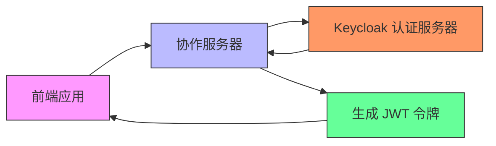
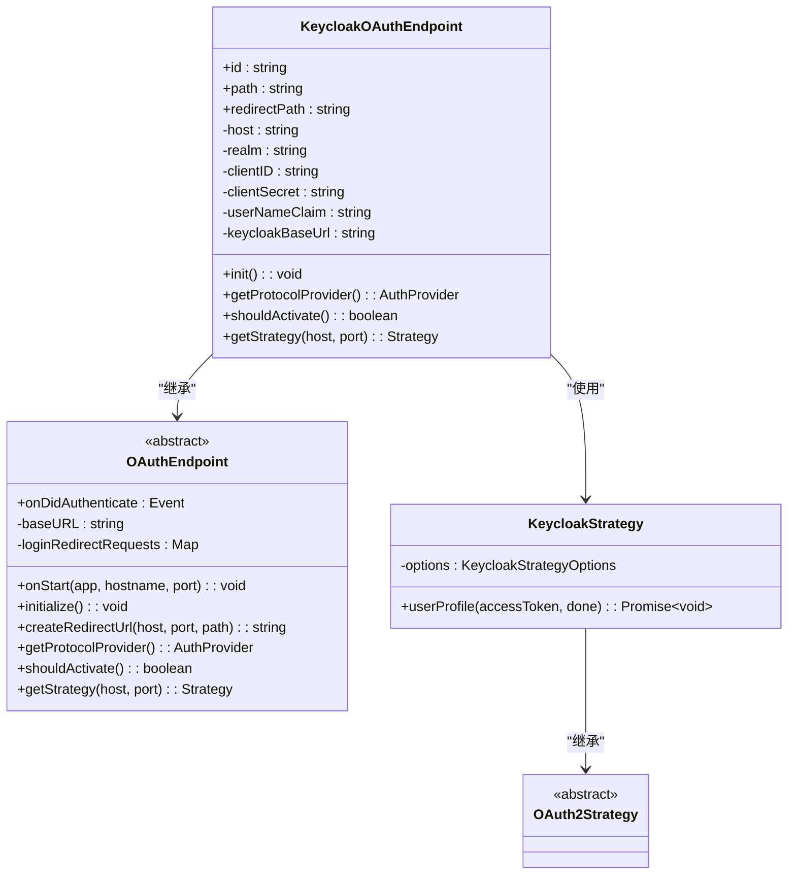
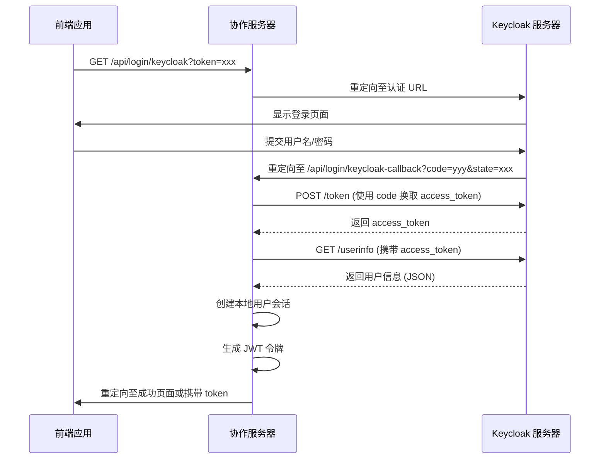
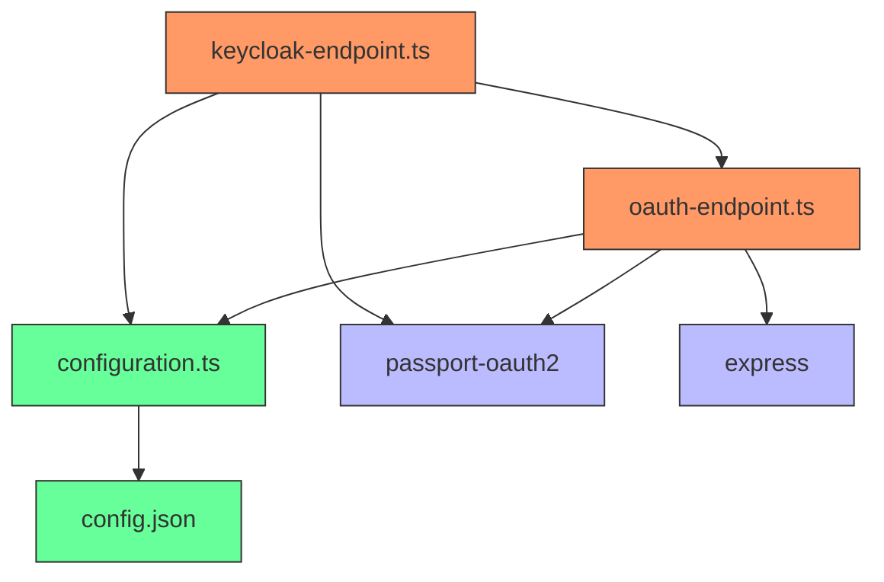

# Keycloak 单点登录

## 简介
本文档详细阐述了如何在协作服务器中集成 Keycloak 身份管理平台，实现单点登录（SSO）功能。基于 `keycloak-endpoint.ts` 的实现，文档涵盖 Realm 配置、客户端注册、JWT 令牌验证流程、配置项设置、完整数据流分析、调试技巧以及企业级部署的最佳实践。目标是为开发者提供一份全面的技术指南，帮助其顺利集成 Keycloak。

## 项目结构
协作工具项目采用模块化设计，核心服务位于 `packages/open-collaboration-server` 目录下。与身份认证相关的代码主要集中在 `src/auth-endpoints` 子目录中，其中 `keycloak-endpoint.ts` 是实现 Keycloak 集成的核心文件。配置管理由 `src/utils/configuration.ts` 统一处理，而服务器的基础配置则存储在 `config.json` 文件中。

```mermaid
graph TB
subgraph "认证模块"
KE[keycloak-endpoint.ts]
OE[oauth-endpoint.ts]
end
subgraph "配置模块"
CT[configuration.ts]
CJ[config.json]
end
subgraph "核心服务"
AS[open-collaboration-server]
end
KE --> OE : "继承"
KE --> CT : "依赖"
OE --> CT : "依赖"
CT --> CJ : "读取"
AS --> KE : "使用"
AS --> OE : "使用"
```


## 核心组件
本系统的核心认证组件是 `KeycloakOAuthEndpoint` 类，它负责处理与 Keycloak 服务器的整个 OAuth 2.0 认证流程。该类通过读取配置文件中的参数来初始化与 Keycloak 的连接，并利用 Passport.js 框架的 OAuth2 策略来完成用户身份验证。一旦用户成功认证，系统将创建一个本地会话并生成 JWT 令牌。

## 架构概述
系统的认证架构遵循标准的 OAuth 2.0 授权码流程。前端应用发起登录请求，后端服务（`open-collaboration-server`）作为客户端，将用户重定向到 Keycloak 的认证服务器。用户在 Keycloak 界面完成登录后，认证服务器将用户重定向回后端服务的回调端点，并附带一个授权码。后端服务再用此授权码向 Keycloak 交换访问令牌（Access Token），并使用该令牌获取用户信息。



## 详细组件分析
### KeycloakOAuthEndpoint 类分析
`KeycloakOAuthEndpoint` 是实现 Keycloak 集成的核心类，它继承自 `OAuthEndpoint` 抽象类，并实现了具体的认证逻辑。

#### 类结构与关系


#### 认证流程序列图


## 依赖分析
`KeycloakOAuthEndpoint` 的正常运行依赖于多个外部组件和配置。




## 性能考虑
目前的实现中，每次获取用户信息都需要向 Keycloak 服务器发起一次 HTTP 请求。在高并发场景下，这可能成为性能瓶颈。建议在生产环境中引入缓存机制，例如使用 Redis 缓存用户信息，以减少对 Keycloak 服务器的直接调用次数。此外，JWT 令牌的生成和验证是计算密集型操作，应确保服务器有足够的 CPU 资源。

## 故障排除指南
在集成过程中，可能会遇到以下常见问题：

1.  **配置项未正确设置**：确保 `config.json` 或环境变量中正确设置了 `keycloak-host`, `keycloak-realm`, `keycloak-client-id` 等关键配置。`shouldActivate()` 方法会检查这些值，如果为空则不会激活 Keycloak 认证。
2.  **回调 URL 不匹配**：在 Keycloak 管理控制台中注册的客户端，其 `Valid Redirect URIs` 必须包含协作服务器的回调地址（如 `/api/login/keycloak-callback`），否则认证会失败。
3.  **JWT 令牌验证失败**：如果前端收到 JWT 但无法被其他服务验证，请检查 `oct-jwt-private-key` 配置项是否正确，并确保所有服务共享相同的密钥。
4.  **用户信息获取失败**：检查 `keycloak-endpoint.ts` 中的 `userProfile` 方法，确保 `userInfoURL` 地址正确，并且 Keycloak 服务器返回的用户信息格式与代码中期望的（如 `preferred_username`）一致。

## 结论
通过 `KeycloakOAuthEndpoint` 的实现，协作服务器成功集成了 Keycloak 作为其身份提供商。该方案利用了成熟的 OAuth 2.0 协议，确保了安全性和标准化。开发者只需正确配置相关参数，即可快速启用单点登录功能。未来可进一步优化缓存策略和错误处理，以提升系统的稳定性和性能。