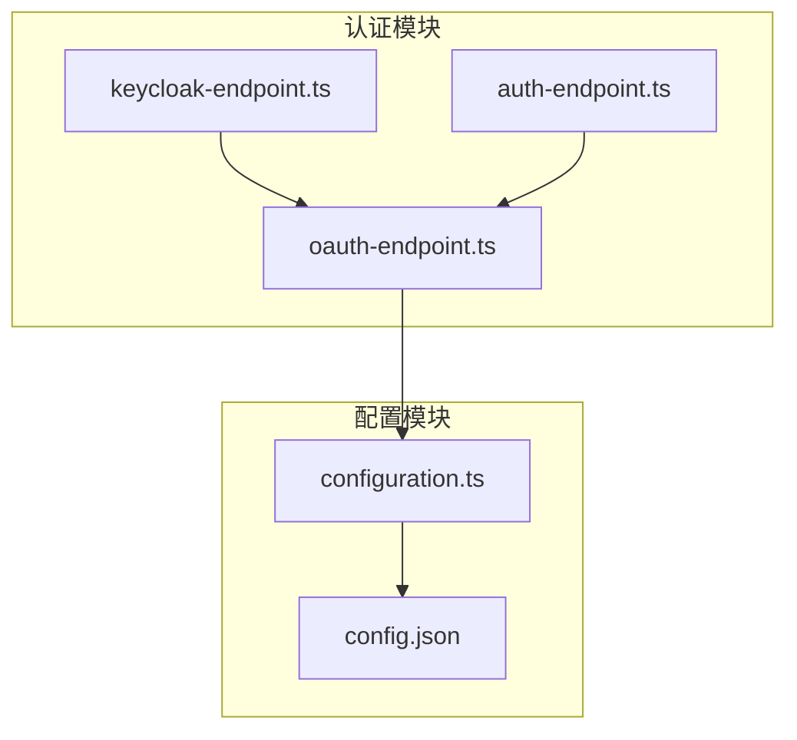
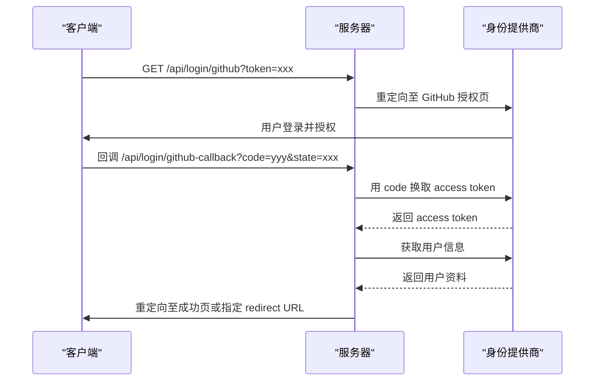
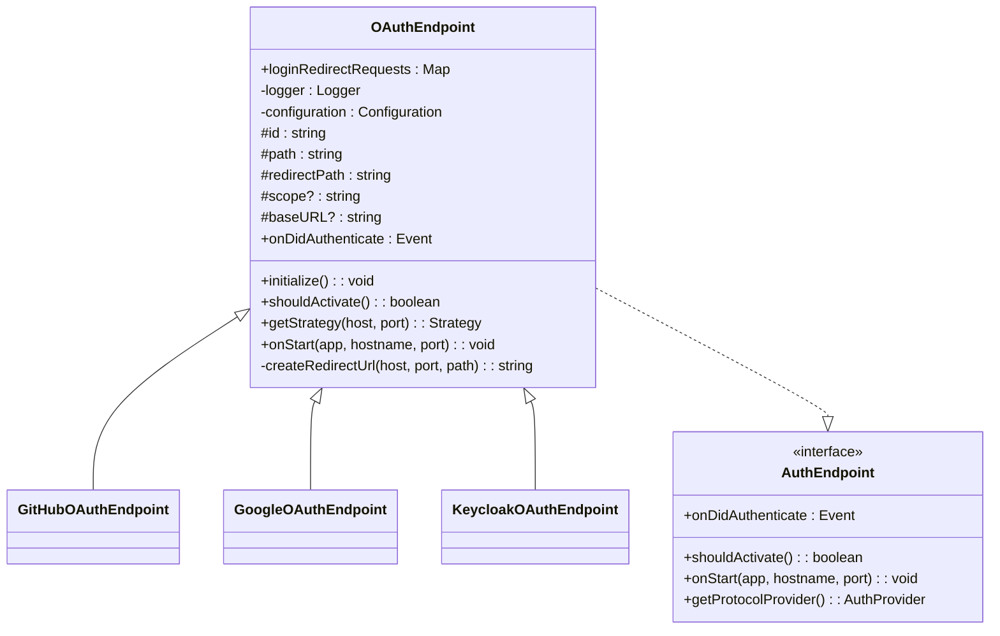
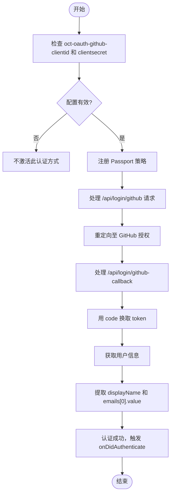
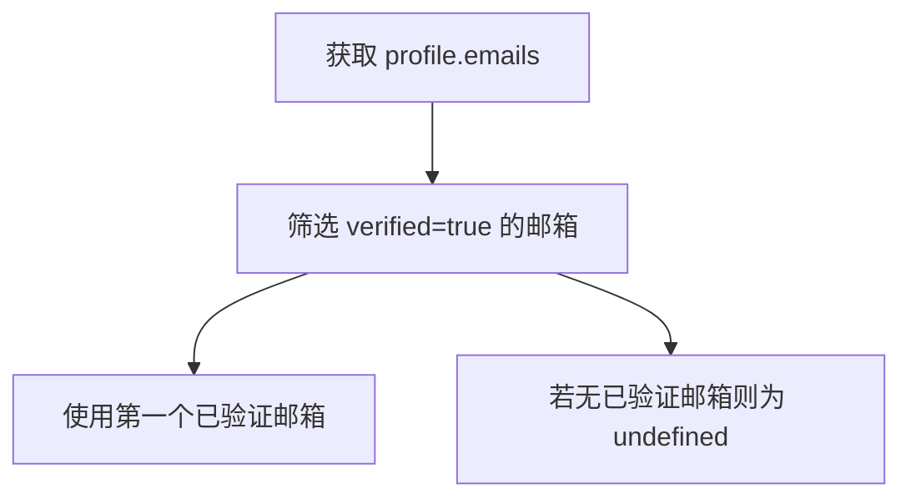
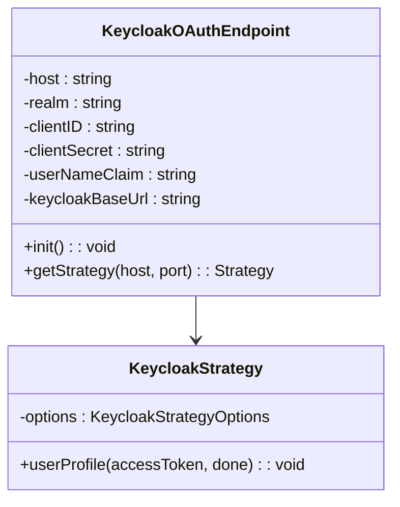
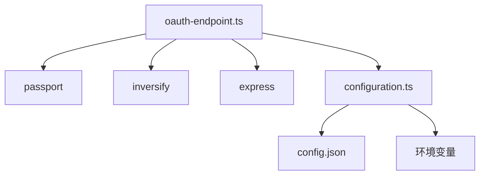

# OAuth 集成认证

<cite>
**本文档引用的文件**  
- [oauth-endpoint.ts](file://packages/open-collaboration-server/src/auth-endpoints/oauth-endpoint.ts)
- [keycloak-endpoint.ts](file://packages/open-collaboration-server/src/auth-endpoints/keycloak-endpoint.ts)
- [auth-endpoint.ts](file://packages/open-collaboration-server/src/auth-endpoints/auth-endpoint.ts)
- [configuration.ts](file://packages/open-collaboration-server/src/utils/configuration.ts)
- [config.json](file://packages/open-collaboration-server/config.json)
</cite>

## 目录
1. [简介](#简介)
2. [项目结构](#项目结构)
3. [核心组件](#核心组件)
4. [架构概述](#架构概述)
5. [详细组件分析](#详细组件分析)
6. [依赖分析](#依赖分析)
7. [性能考虑](#性能考虑)
8. [故障排除指南](#故障排除指南)
9. [结论](#结论)

## 简介
本文档详细说明了协作工具平台中的 OAuth 集成认证机制，重点分析 `oauth-endpoint.ts` 文件的实现逻辑。文档涵盖从客户端重定向、授权码获取、令牌交换到用户信息解析的完整流程。同时解释了如何配置 `config.json` 文件中的 OAuth 客户端 ID、密钥和回调 URL，并提供安全建议和常见问题解决方案。

## 项目结构
项目采用模块化设计，`open-collaboration-server` 模块负责认证功能，其 `auth-endpoints` 目录下包含多种认证方式的实现，包括 OAuth 认证。配置管理由 `utils/configuration.ts` 提供支持，配置文件 `config.json` 存放关键参数。

**图示来源**  
- [oauth-endpoint.ts](file://packages/open-collaboration-server/src/auth-endpoints/oauth-endpoint.ts#L1-L30)
- [configuration.ts](file://packages/open-collaboration-server/src/utils/configuration.ts#L1-L20)
- [config.json](file://packages/open-collaboration-server/config.json#L1-L6)

**本节来源**  
- [oauth-endpoint.ts](file://packages/open-collaboration-server/src/auth-endpoints/oauth-endpoint.ts#L1-L50)
- [config.json](file://packages/open-collaboration-server/config.json#L1-L10)

## 核心组件
核心组件包括 `OAuthEndpoint` 抽象类、`GitHubOAuthEndpoint` 和 `GoogleOAuthEndpoint` 具体实现类，以及配置管理类 `DefaultConfiguration`。这些组件共同实现了基于 Passport.js 的第三方身份验证流程。

**本节来源**  
- [oauth-endpoint.ts](file://packages/open-collaboration-server/src/auth-endpoints/oauth-endpoint.ts#L30-L100)
- [configuration.ts](file://packages/open-collaboration-server/src/utils/configuration.ts#L10-L50)

## 架构概述
系统采用基于 Passport.js 的策略模式实现 OAuth 认证。客户端发起登录请求后，服务器重定向至第三方身份提供商，用户授权后回调服务器，完成令牌交换和用户信息获取，最终建立会话。

**图示来源**  
- [oauth-endpoint.ts](file://packages/open-collaboration-server/src/auth-endpoints/oauth-endpoint.ts#L70-L100)
- [keycloak-endpoint.ts](file://packages/open-collaboration-server/src/auth-endpoints/keycloak-endpoint.ts#L50-L80)

## 详细组件分析

### OAuthEndpoint 抽象类分析
`OAuthEndpoint` 是所有 OAuth 认证实现的基类，定义了通用流程和抽象方法。

**图示来源**  
- [oauth-endpoint.ts](file://packages/open-collaboration-server/src/auth-endpoints/oauth-endpoint.ts#L30-L68)
- [auth-endpoint.ts](file://packages/open-collaboration-server/src/auth-endpoints/auth-endpoint.ts#L1-L25)

**本节来源**  
- [oauth-endpoint.ts](file://packages/open-collaboration-server/src/auth-endpoints/oauth-endpoint.ts#L30-L100)

### GitHubOAuthEndpoint 实现分析
GitHub 认证通过 `passport-github` 策略实现，从 GitHub 获取用户显示名称和邮箱。

**图示来源**  
- [oauth-endpoint.ts](file://packages/open-collaboration-server/src/auth-endpoints/oauth-endpoint.ts#L121-L153)
- [oauth-endpoint.ts](file://packages/open-collaboration-server/src/auth-endpoints/oauth-endpoint.ts#L155-L194)

**本节来源**  
- [oauth-endpoint.ts](file://packages/open-collaboration-server/src/auth-endpoints/oauth-endpoint.ts#L120-L200)

### GoogleOAuthEndpoint 实现分析
Google 认证使用 `passport-google-oauth20` 策略，特别筛选已验证的邮箱地址。

**图示来源**  
- [oauth-endpoint.ts](file://packages/open-collaboration-server/src/auth-endpoints/oauth-endpoint.ts#L196-L210)

**本节来源**  
- [oauth-endpoint.ts](file://packages/open-collaboration-server/src/auth-endpoints/oauth-endpoint.ts#L190-L210)

### KeycloakOAuthEndpoint 实现分析
Keycloak 认证支持自定义配置，通过 OpenID Connect 协议与 Keycloak 服务器通信。

**图示来源**  
- [keycloak-endpoint.ts](file://packages/open-collaboration-server/src/auth-endpoints/keycloak-endpoint.ts#L30-L108)

**本节来源**  
- [keycloak-endpoint.ts](file://packages/open-collaboration-server/src/auth-endpoints/keycloak-endpoint.ts#L1-L109)

## 依赖分析
系统依赖 Passport.js 进行认证流程管理，通过 inversify 实现依赖注入，配置信息从环境变量或配置文件中读取。

**图示来源**  
- [oauth-endpoint.ts](file://packages/open-collaboration-server/src/auth-endpoints/oauth-endpoint.ts#L1-L10)
- [configuration.ts](file://packages/open-collaboration-server/src/utils/configuration.ts#L1-L10)

**本节来源**  
- [oauth-endpoint.ts](file://packages/open-collaboration-server/src/auth-endpoints/oauth-endpoint.ts#L1-L30)
- [configuration.ts](file://packages/open-collaboration-server/src/utils/configuration.ts#L1-L50)

## 性能考虑
认证流程涉及多次网络请求，建议：
- 启用会话缓存减少重复认证
- 配置合理的超时时间
- 对频繁访问的用户信息进行本地缓存
- 监控第三方提供商的响应时间

## 故障排除指南
### 常见问题及解决方案
- **回调失败**：检查 `oct-base-url` 是否正确，确保回调 URL 在第三方提供商处正确注册
- **作用域不足**：在 `scope` 字段中添加所需权限，如 GitHub 的 `user:email`
- **重定向 URL 不在白名单**：配置 `oct-redirect-url-whitelist` 环境变量
- **客户端密钥错误**：验证 `oct-oauth-*-clientid` 和 `*-clientsecret` 配置项

**本节来源**  
- [oauth-endpoint.ts](file://packages/open-collaboration-server/src/auth-endpoints/oauth-endpoint.ts#L70-L94)
- [keycloak-endpoint.ts](file://packages/open-collaboration-server/src/auth-endpoints/keycloak-endpoint.ts#L50-L70)

## 结论
本文档全面分析了协作工具平台的 OAuth 集成认证机制。系统通过模块化设计支持多种第三方身份提供商，配置灵活且易于扩展。建议在生产环境中启用 PKCE 防止授权码拦截攻击，并定期轮换客户端密钥以增强安全性。