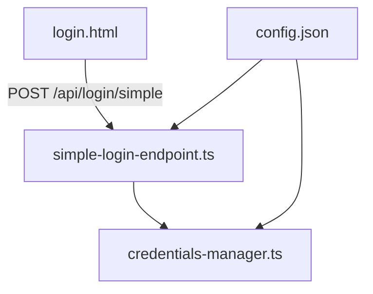
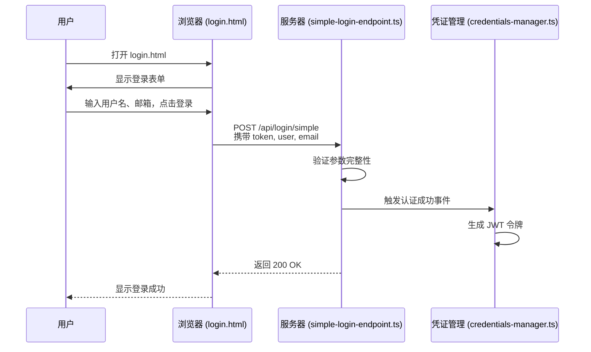
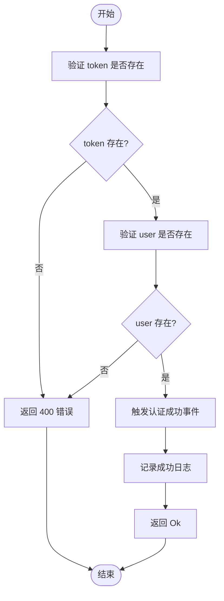
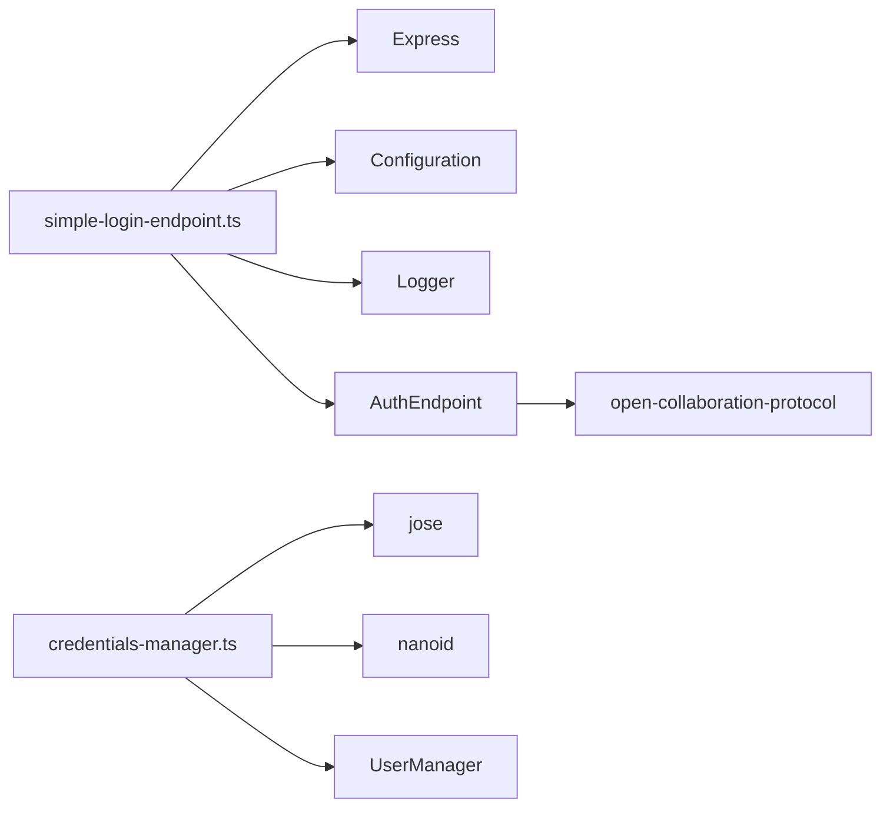

# 简易登录机制

## 简介
本文档详细描述了一个简易登录机制的实现，涵盖前端静态页面 `login.html` 与后端接口 `simple-login-endpoint.ts` 的协同工作流程。该机制适用于开发测试或内部可信环境，不推荐用于生产环境。文档将深入解析表单结构、前端交互逻辑、POST 请求处理流程、凭证校验机制、哈希存储安全策略、配置开关及默认凭证设置，并提供防暴力破解建议与使用风险说明。

## 项目结构
简易登录功能涉及以下关键文件：
- `src/auth-endpoints/simple-login-endpoint.ts`：处理登录请求的后端端点
- `src/static/login.html`：提供用户输入界面的静态登录页面
- `src/credentials-manager.ts`：管理用户凭证与 JWT 令牌生成
- `config.json`：控制简易登录功能的启用状态与基础配置




## 核心组件
本节分析简易登录机制的核心实现组件，包括前端页面、后端端点、凭证管理器和配置文件。


## 架构概览
简易登录机制采用前后端分离架构，用户通过浏览器访问静态登录页，输入用户名和邮箱后提交至服务器端点进行验证。服务器在确认请求合法后，通过事件机制通知认证成功，并生成 JWT 令牌供后续身份识别使用。




## 详细组件分析

### 前端登录页面分析
`login.html` 是一个轻量级静态页面，提供用户友好的登录界面。

#### 表单结构
该页面包含以下表单字段：
- **用户名输入框**（必填）：用于输入显示名称
- **邮箱输入框**（可选）：用于提供联系信息
- **登录按钮**：触发提交动作

#### 前端交互逻辑
使用内联 JavaScript 实现登录逻辑：
1. 从 URL 参数中提取 `token`
2. 收集表单中的 `user` 和 `email` 值
3. 向 `/api/login/simple` 发起 POST 请求，携带 JSON 格式数据
4. 根据响应结果更新页面状态（成功或错误）

```javascript
async function login() {
    const token = new URLSearchParams(location.search).get('token');
    const user = document.getElementById('user').value;
    const email = document.getElementById('email').value;
    const resp = await fetch('/api/login/simple', {
        method: 'POST',
        body: JSON.stringify({ user, email, token }),
        headers: { 'Content-Type': 'application/json' }
    });
    if (resp.ok) {
        // 显示成功消息
    } else {
        // 显示错误消息
    }
}
```


### 后端登录端点分析
`SimpleLoginEndpoint` 类实现了简易登录的核心逻辑。

#### 功能激活条件
通过配置项 `oct-activate-simple-login` 控制是否启用该功能：
```ts
shouldActivate(): boolean {
    return this.configuration.getValue('oct-activate-simple-login', 'boolean') ?? false;
}
```

#### POST 请求处理流程
1. 接收 POST 请求于 `/api/login/simple`
2. 提取请求体中的 `token`、`user`、`email`
3. 日志记录登录尝试
4. 验证 `token` 和 `user` 是否存在
5. 触发 `authSuccessEmitter` 事件，传递用户信息
6. 返回 "Ok" 响应




### 凭证管理器分析
`CredentialsManager` 负责用户身份的确认与 JWT 令牌的生成。

#### 安全校验机制
- 使用 `jose` 库进行 JWT 签名与验证
- 私钥来自配置 `oct-jwt-private-key`，若未设置则使用本地文件路径作为默认值
- 生成的 JWT 包含用户 ID、名称、邮箱和认证提供者信息

#### 哈希存储机制
虽然密码未在此机制中直接使用，但系统设计上通过 JWT 的签名机制防止令牌被篡改。所有敏感操作均依赖于安全生成的 `confirmToken` 和后续的 JWT 验证。

```ts
async generateJwt(payload: object): Promise<string> {
    const [key, expiration] = await Promise.all([
        this.getJwtPrivateKey(),
        this.getJwtExpiration()
    ]);
    return new jose.SignJWT(payload as jose.JWTPayload)
        .setProtectedHeader({ alg: 'HS256' })
        .setIssuedAt()
        .setExpirationTime(expiration)
        .sign(key);
}
```


### 配置文件分析
`config.json` 中的关键配置项：

| 配置项 | 类型 | 说明 |
|-------|------|------|
| `oct-activate-simple-login` | boolean | 是否启用简易登录功能 |
| `oct-server-owner` | string | 服务器所有者名称（用于显示） |
| `oct-base-url` | string | 服务基础 URL |

当前配置示例：
```json
{
  "oct-activate-simple-login": true,
  "oct-server-owner": "Local Development",
  "oct-base-url": "http://localhost:8100"
}
```

此配置表明简易登录功能已启用，适用于本地开发环境。


## 依赖分析
简易登录机制依赖以下模块：
- `inversify`：依赖注入容器
- `express`：Web 服务器框架
- `jose`：JWT 加密库
- `open-collaboration-protocol`：协议与事件定义
- `nanoid`：安全随机 ID 生成




## 性能考量
- 登录过程无数据库查询，响应速度快
- JWT 签名使用 HS256 算法，计算开销小
- 内存中维护 `deferredAuths` 映射表，需注意长期运行下的内存占用
- 默认 5 分钟超时机制可防止资源泄漏

## 故障排查指南
常见问题及解决方案：

| 问题现象 | 可能原因 | 解决方案 |
|--------|--------|--------|
| 登录失败，提示 "No token provided" | URL 中缺少 token 参数 | 确保跳转链接包含 `?token=xxx` |
| 页面无反应 | 浏览器阻止了脚本执行 | 检查浏览器控制台错误，确保 JS 正常加载 |
| 500 错误 | 服务未启动或配置错误 | 检查服务日志，确认 `oct-jwt-private-key` 设置 |
| 登录成功但无法使用 | JWT 验证失败 | 确认私钥一致性，检查时钟同步 |


## 结论
简易登录机制为开发和测试环境提供了快速便捷的身份验证方式。其优势在于实现简单、部署方便，但存在明显安全缺陷，如缺乏密码校验、依赖外部传入 token、无速率限制等。建议仅在受信任的内部网络或开发环境中使用，生产环境应采用 OAuth、Keycloak 等更安全的认证方案。未来可增强方向包括：添加基础密码校验、实现登录尝试限流、支持更复杂的用户属性验证等。