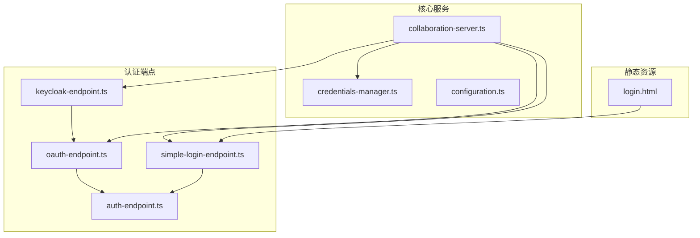
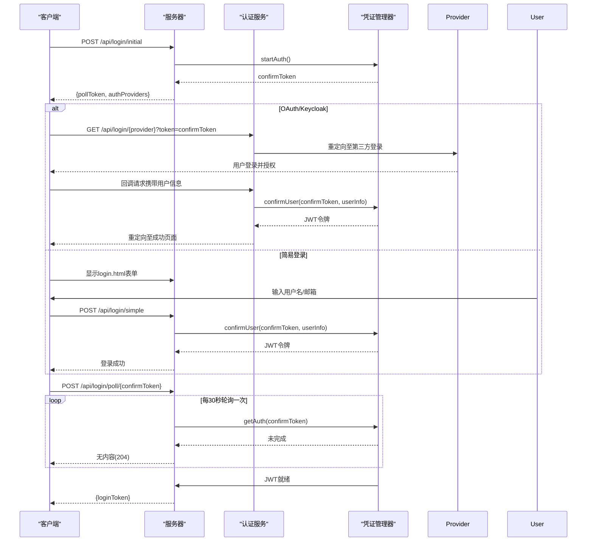
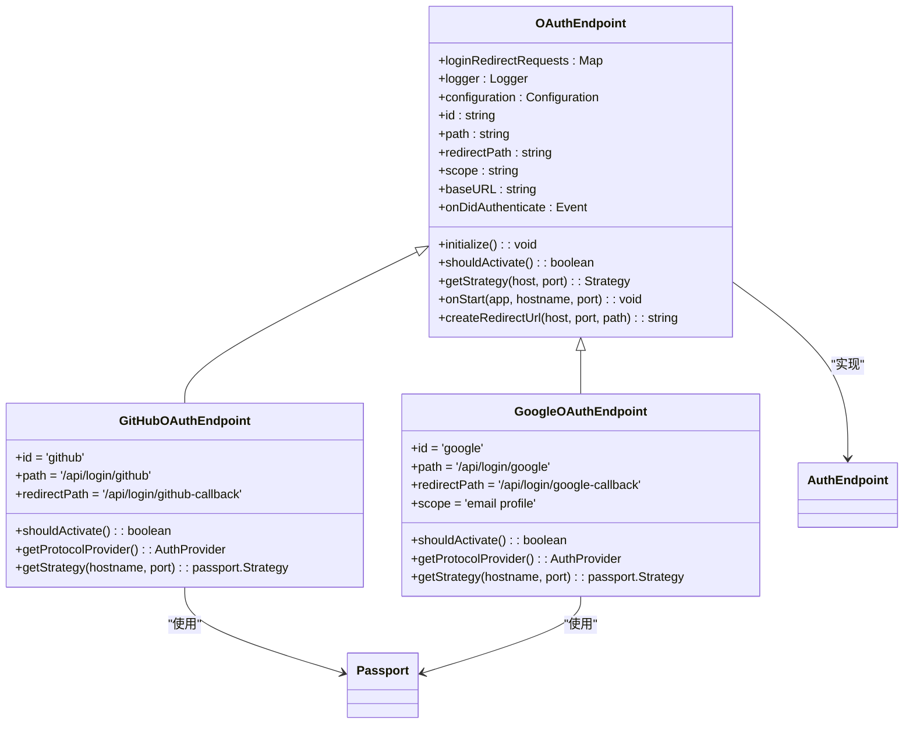
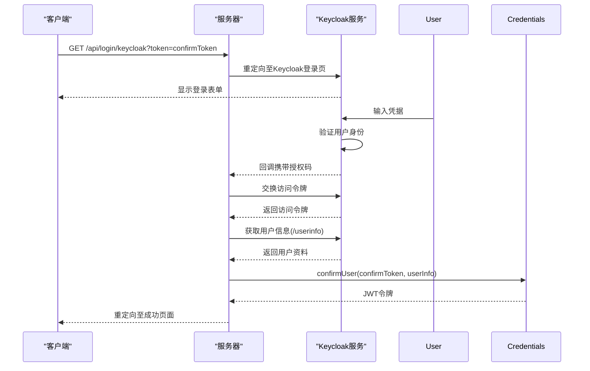
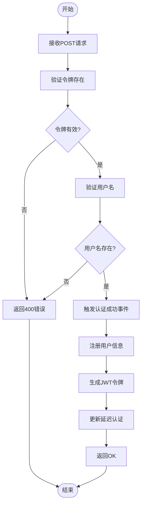
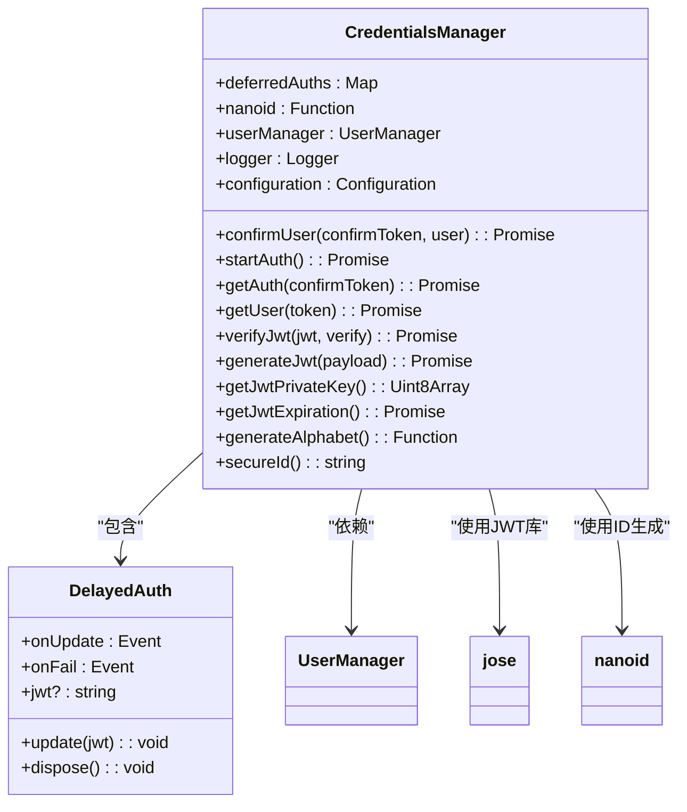

# 认证与安全接入

## 简介
本文档全面介绍协作工具系统的认证与安全接入机制，涵盖 OAuth、Keycloak 和简易登录三种认证方式。详细说明从客户端发起请求到服务器端完成用户会话建立的完整流程，包括 JWT 令牌验证、用户信息提取等关键环节。同时，文档还解释了凭证安全管理、静态登录页面作用以及安全配置的最佳实践。

## 项目结构
系统认证功能主要分布在 `open-collaboration-server` 包的 `src/auth-endpoints` 目录下，包含多种认证方式的具体实现。凭证管理由 `credentials-manager.ts` 统一处理，静态资源如登录页面存放在 `static` 目录。




## 核心组件
系统认证体系由多个核心组件构成，包括认证端点接口、具体实现类、凭证管理器和用户管理器。所有认证方式都遵循统一的接口规范，确保了系统的可扩展性和一致性。


## 认证流程总览
系统采用基于令牌的异步认证机制，客户端首先请求初始登录信息，获取确认令牌后进行身份验证，最后通过轮询方式获取最终认证令牌。




## 详细组件分析

### OAuth 认证分析
OAuth 认证通过第三方服务（如 GitHub、Google）实现用户身份验证，采用标准的 OAuth 2.0 授权码流程。




### Keycloak 认证分析
Keycloak 认证作为 OAuth 的扩展实现，专门用于集成 Keycloak 身份管理服务，支持企业级单点登录场景。




### 简易登录分析
简易登录提供无需第三方服务的本地认证方式，通过表单提交用户名和邮箱完成身份验证。




## 凭证管理机制
凭证管理器（CredentialsManager）负责处理所有与认证相关的令牌操作，包括 JWT 生成、验证和会话管理。




## 安全配置指南
系统通过 `config.json` 文件进行安全相关配置，以下是关键配置项说明：

**配置项说明**
- **oct-activate-simple-login**: 布尔值，控制是否启用简易登录功能
- **oct-base-url**: 字符串，服务器基础URL，用于构建回调地址
- **oct-login-success-url**: 字符串，登录成功后的重定向URL
- **oct-redirect-url-whitelist**: 字符串，允许的重定向URL白名单，多个用逗号分隔
- **oct-jwt-private-key**: 字符串，JWT签名私钥，未设置时使用开发密钥
- **oct-oauth-github-clientid**: 字符串，GitHub OAuth客户端ID
- **oct-oauth-github-clientsecret**: 字符串，GitHub OAuth客户端密钥
- **oct-oauth-google-clientid**: 字符串，Google OAuth客户端ID
- **oct-oauth-google-clientsecret**: 字符串，Google OAuth客户端密钥
- **keycloak-host**: 字符串，Keycloak服务器主机地址
- **keycloak-realm**: 字符串，Keycloak领域名称
- **keycloak-client-id**: 字符串，Keycloak客户端ID
- **keycloak-client-secret**: 字符串，Keycloak客户端密钥
- **keycloak-username-claim**: 字符串，用户名称声明字段，默认为preferred_username
- **keycloak-client-label**: 字符串，客户端显示标签

**示例配置**
```json
{
  "oct-activate-simple-login": true,
  "oct-base-url": "http://localhost:8100",
  "oct-login-success-url": "http://localhost:3000/success",
  "oct-redirect-url-whitelist": "http://localhost:3000,https://app.example.com",
  "oct-jwt-private-key": "your-secure-secret-key-here",
  "oct-oauth-github-clientid": "github_client_id",
  "oct-oauth-github-clientsecret": "github_client_secret",
  "keycloak-host": "https://keycloak.example.com",
  "keycloak-realm": "collaboration-tool",
  "keycloak-client-id": "collab-client"
}
```


## 安全最佳实践
为确保系统安全，建议遵循以下最佳实践：

**防止重放攻击**
- 所有认证请求必须包含一次性令牌（confirmToken）
- 令牌有效期限制为5分钟，超时自动失效
- 使用 `secureId()` 生成高强度随机令牌，防止猜测

**CSRF 防护**
- 关键API端点（如 `/api/login/poll`）采用POST方法
- 验证请求来源，通过 `oct-redirect-url-whitelist` 限制重定向目标
- 敏感操作要求包含有效的认证令牌

**JWT 安全**
- 使用HS256算法签名，确保令牌完整性
- 生产环境必须设置强密码的 `oct-jwt-private-key`
- 令牌包含签发时间，可选设置过期时间

**输入验证**
- 所有用户输入进行严格验证
- 用户名不能为空，邮箱格式需验证
- 防止XSS攻击，对输出内容进行适当转义

**日志记录**
- 记录所有认证尝试，包括成功和失败
- 敏感信息（如密码）不得记录
- 异常情况详细记录，便于审计和排查


## 扩展接口说明
系统提供清晰的接口设计，便于添加新的认证方式。

**AuthEndpoint 接口**
```typescript
interface AuthEndpoint {
    shouldActivate(): boolean;
    onStart(app: Express, hostname: string, port: number): void;
    onDidAuthenticate: Event<AuthSuccessEvent>;
    getProtocolProvider(): AuthProvider;
}
```

**实现新认证方式的步骤**
1. 创建新类继承 `AuthEndpoint` 接口
2. 实现 `shouldActivate()` 方法，根据配置决定是否启用
3. 实现 `getProtocolProvider()` 方法，定义认证提供者元数据
4. 实现 `onStart()` 方法，注册路由和认证策略
5. 在依赖注入模块中注册新服务

**自定义认证示例**
```typescript
@injectable()
export class CustomAuthEndpoint implements AuthEndpoint {
    shouldActivate(): boolean {
        return Boolean(this.configuration.getValue('custom-auth-enabled'));
    }

    getProtocolProvider(): AuthProvider {
        return {
            type: 'web',
            name: 'custom',
            endpoint: '/api/login/custom',
            label: { code: '', message: 'Custom Auth', params: [] },
            group: { code: '', message: 'Custom', params: [] }
        };
    }

    onStart(app: Express, hostname: string, port: number): void {
        app.get('/api/login/custom', (req, res) => {
            // 自定义认证逻辑
            const token = req.query.token as string;
            // 重定向到自定义认证页面
            res.redirect(`/custom-login?token=${token}`);
        });
    }

    onDidAuthenticate: Event<AuthSuccessEvent> = this.authSuccessEmitter.event;
}
```

