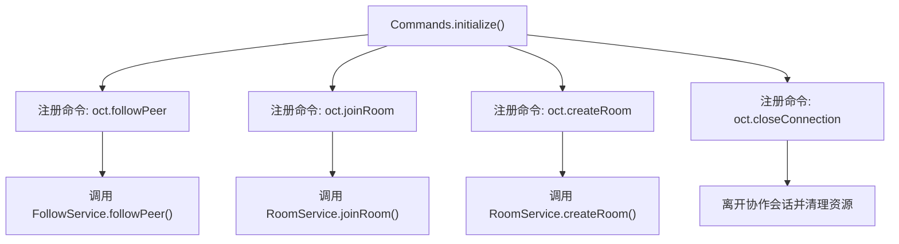
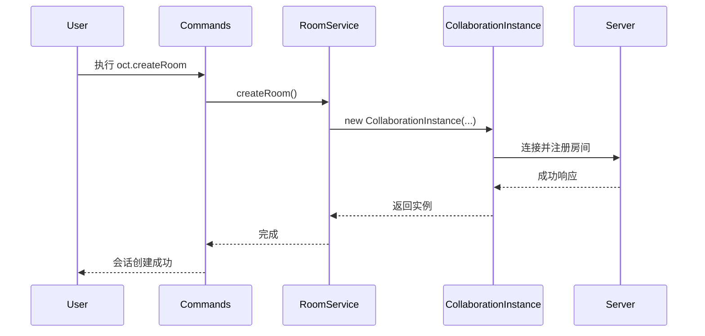

# UI 集成与命令系统

## 项目结构

`open-collaboration-vscode` 是 VS Code 扩展的核心模块，负责用户界面集成、命令注册、状态管理与协作会话控制。其主要结构如下：

```
src/
├── commands-list.ts        # 命令常量定义
├── commands.ts             # 命令注册与逻辑实现
├── collaboration-status-view.ts # 自定义视图提供者
├── collaboration-instance.ts   # 协作实例模型
├── follow-service.ts       # 跟随功能服务
└── utils/                  # 工具类（快速选择、设置、URI处理等）
```

该模块通过 `package.json` 中的 `contributes` 字段声明 UI 元素，并在 `extension.ts` 中初始化依赖注入容器与服务。

## 核心命令定义与注册机制

所有命令均通过 `commands-list.ts` 统一定义为常量，采用命名空间组织，确保类型安全与可维护性。

### 命令常量定义

```typescript
export namespace OctCommands {
    export const FollowPeer = 'oct.followPeer';
    export const StopFollowPeer = 'oct.stopFollowPeer';
    export const JoinRoom = 'oct.joinRoom';
    export const CreateRoom = 'oct.createRoom';
    export const CloseConnection = 'oct.closeConnection';
    export const SignOut = 'oct.signOut';
}
```

这些字符串与 `package.json` 中 `contributes.commands` 的 `command` 字段一一对应。

### 命令注册流程

在 `commands.ts` 中，`Commands` 类使用依赖注入管理 VS Code 命令注册。`initialize()` 方法通过 `vscode.commands.registerCommand()` 将命令 ID 绑定到具体执行逻辑。



## 命令执行流程与用户交互

### 创建与加入房间

- **创建房间 (`oct.createRoom`)**：仅当存在工作区且未连接时可用。触发 `CollaborationRoomService.createRoom()`，创建新会话并成为主机。
- **加入房间 (`oct.joinRoom`)**：通过输入邀请码加入现有会话。调用 `roomService.joinRoom()` 处理连接逻辑。

两者均通过快速选择面板（QuickPick）入口统一触发（`oct.enter`），根据当前状态动态显示“创建”或“加入”选项。

### 开始跟随与停止跟随

- **开始跟随 (`oct.followPeer`)**：接收可选的 `PeerWithColor` 参数，调用 `FollowService.followPeer(peerId)` 实现跟随指定用户。
- **停止跟随 (`oct.stopFollowPeer`)**：调用 `followService.unfollowPeer()` 停止当前跟随。

上下文菜单中，`viewItem == peer` 时显示“开始跟随”，`viewItem == followedPeer` 时显示“停止跟随”。

### 断开连接与登出

- **关闭连接 (`oct.closeConnection`)**：
  - 调用当前 `CollaborationInstance.leave()` 通知服务器。
  - 调用 `dispose()` 清理本地资源。
  - 若非主机，则执行 `workbench.action.closeFolder` 关闭工作区。
- **登出 (`oct.signOut`)**：
  - 先执行 `CloseConnection`。
  - 调用 `secretStorage.deleteUserTokens()` 删除用户凭证。
  - 显示信息提示：“已成功登出！”。



## 自定义视图与树形数据模型

`collaboration-status-view.ts` 实现了 `TreeDataProvider`，为 `oct.roomView` 提供树形数据。

### 数据模型

- **数据源**：`CollaborationInstance.connectedUsers`，类型为 `PeerWithColor[]`。
- **节点类型**：`PeerWithColor` 包含用户 ID、名称、颜色、是否为主机等信息。

### TreeDataProvider 实现

- **`getChildren()`**：根节点返回所有连接用户；不支持子节点展开。
- **`getTreeItem()`**：
  - 显示用户名作为标签。
  - 描述字段显示“(你)”或“(主机)”等标签。
  - 图标使用 `circle-filled` ThemeIcon，颜色由 `peer.color` 决定。
  - `contextValue` 根据是否为自己、是否被跟随动态设置为 `self`、`peer` 或 `followedPeer`，用于上下文菜单过滤。

### 动态更新机制

- `onConnection()` 方法接收 `CollaborationInstance` 实例。
- 监听 `onDidUsersChange` 事件，在用户列表变化时触发 `onDidChangeTreeDataEmitter.fire()`。
- 监听 `onDidDispose` 事件，在会话结束时清空数据并刷新视图。

## 菜单与上下文集成

命令通过 `package.json` 的 `contributes.menus` 字段绑定到不同 UI 区域。

### 命令面板 (`commandPalette`)

```json
{
  "command": "oct.followPeer",
  "when": "oct.connection"
}
```

- **条件**：仅在已建立协作连接时显示。

### 视图项上下文菜单 (`view/item/context`)

```json
{
  "command": "oct.followPeer",
  "when": "viewItem == peer",
  "group": "inline"
}
```

- **条件**：右键点击非自身的用户项时显示。
- **分组**：`inline` 确保显示在菜单顶部。

```json
{
  "command": "oct.stopFollowPeer",
  "when": "viewItem == followedPeer",
  "group": "inline"
}
```

- **条件**：右键点击正在跟随的用户时显示。

### 图标与分类

- 所有命令在 `contributes.commands` 中定义了 `title`、`category` 和 `icon`（如 `$(eye)`、`$(vm-connect)`）。
- `oct.dev.fuzzing` 仅在开发环境（`process.env.DEVELOPMENT === 'true'`）下注册并启用。

## 错误处理与用户提示最佳实践

### 用户提示 (`showInformationMessage`)

- **成功提示**：`vscode.window.showInformationMessage()` 用于确认操作成功，如登出提示。
- **带操作提示**：`inviteCallback()` 中，复制邀请码后显示消息，并提供“复制带服务器URL”和“复制Web客户端URL”两个可点击操作。

### 进度指示

虽然当前代码未使用 `withProgress`，但推荐在以下场景使用：
- **长时间连接操作**：如 `joinRoom` 或 `createRoom` 可能因网络延迟耗时。
- **文件同步**：大规模文件同步时显示进度条。

示例：
```typescript
await vscode.window.withProgress({
    location: vscode.ProgressLocation.Notification,
    title: "正在加入协作会话..."
}, async (progress) => {
    // 执行连接逻辑
});
```

### 错误处理

- **空编辑器检查**：`DevFuzzing` 命令中检查 `activeTextEditor` 是否存在。
- **资源清理**：`CloseConnection` 确保调用 `dispose()` 防止内存泄漏。
- **环境检查**：开发命令通过 `process.env` 安全启用。

## 扩展开发指南：添加新命令

### 步骤 1：定义命令常量

在 `commands-list.ts` 中添加新命令：

```typescript
export namespace OctCommands {
    export const NewCommand = 'oct.newCommand';
}
```

### 步骤 2：在 package.json 中声明

```json
"contributes": {
    "commands": [
        {
            "command": "oct.newCommand",
            "title": "%oct.newCommand%",
            "category": "Open Collaboration Tools",
            "icon": "$(new-icon)"
        }
    ],
    "menus": {
        "commandPalette": [
            {
                "command": "oct.newCommand",
                "when": "oct.connection"
            }
        ]
    }
}
```

### 步骤 3：实现命令逻辑

在 `commands.ts` 的 `initialize()` 中注册：

```typescript
vscode.commands.registerCommand(OctCommands.NewCommand, () => {
    // 实现你的逻辑
    vscode.window.showInformationMessage('新命令执行成功！');
});
```

### 步骤 4：添加多语言支持

在 `package.nls.json` 及各语言包中添加：

```json
{
    "oct.newCommand": "新命令"
}
```

### 步骤 5：测试与调试

- 使用 `F5` 启动扩展开发主机。
- 在命令面板中搜索“新命令”进行测试。