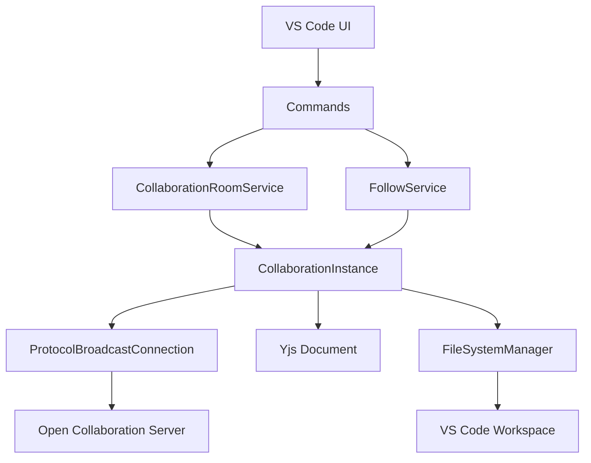
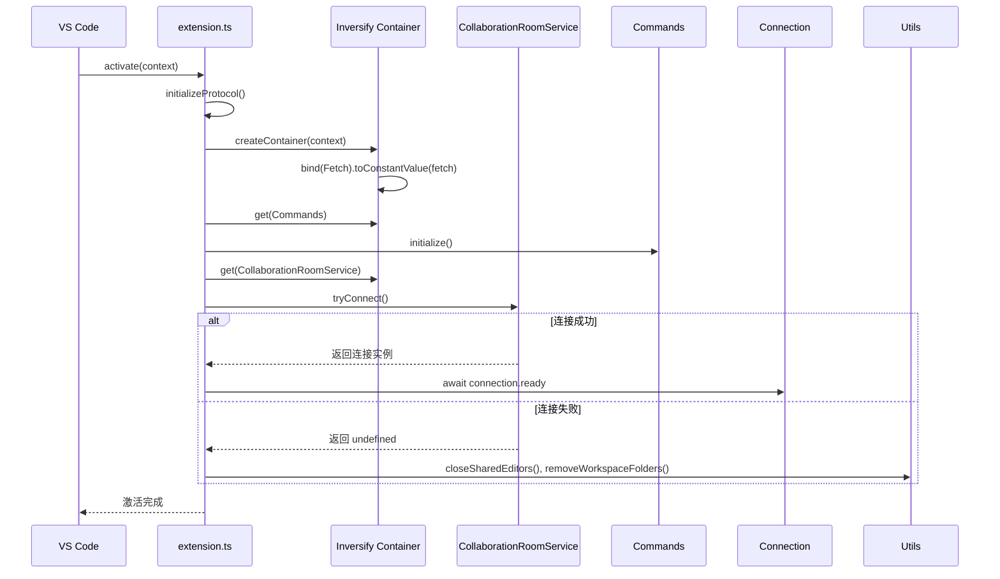
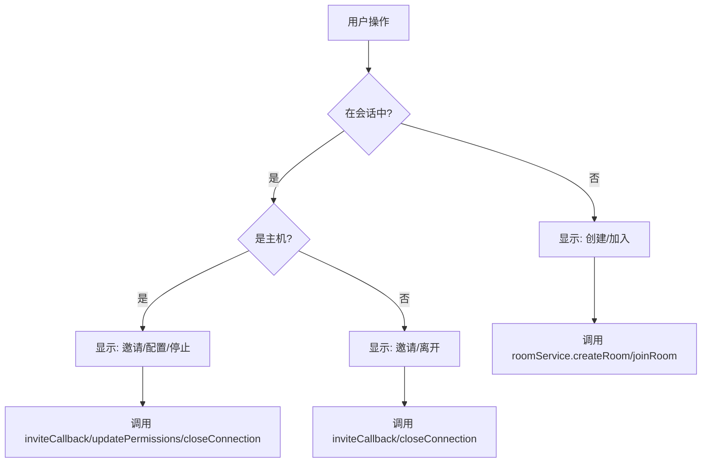

# open-collaboration-vscode 模块

## 简介
`open-collaboration-vscode` 是一个 VS Code 扩展，旨在实现多人实时代码协作功能。该模块允许用户创建或加入协作会话，共享代码编辑环境，支持远程文件访问、状态同步、用户跟随等功能。扩展基于 Inversify 实现依赖注入，利用 Yjs 和自定义协议处理实时同步，并通过 VS Code 的 API 提供用户界面集成。本文档将深入解析其技术实现，涵盖从扩展激活到协作会话管理的完整流程。

## 项目结构

`open-collaboration-vscode` 模块位于 `packages/open-collaboration-vscode` 目录下，其结构清晰，遵循模块化设计原则。核心源码位于 `src` 目录，包含扩展的主逻辑、服务、工具类等。`l10n` 目录存放多语言资源文件，支持国际化。`scripts` 目录包含构建和翻译脚本。`.temp-guest-data` 和 `.temp-guest-extensions` 用于存储临时的访客数据和扩展配置。

## 核心组件
本模块的核心组件包括扩展入口 `extension.ts`、协作实例管理 `collaboration-instance.ts`、房间服务 `collaboration-room-service.ts`、状态服务 `collaboration-status-service.ts` 以及依赖注入容器 `inversify.ts`。这些组件协同工作，实现了从用户交互到后端连接的完整协作流程。`commands.ts` 文件定义了所有用户可触发的命令，是 UI 与后端逻辑的桥梁。

## 架构概览
该扩展采用分层架构，上层为 VS Code UI 集成，中层为业务逻辑与服务，底层为协议与连接管理。其核心是 `CollaborationInstance` 类，它代表一个活跃的协作会话，管理着 Yjs 文档、用户状态、文件系统代理等。依赖注入（Inversify）用于解耦组件，`createContainer` 函数在扩展激活时创建容器并绑定服务。`CollaborationRoomService` 负责会话的创建与加入，而 `CollaborationStatusService` 则管理状态栏和侧边栏视图。

## 详细组件分析

### 扩展激活与依赖注入分析
扩展的入口点是 `extension.ts` 中的 `activate` 函数。当 VS Code 启动完成或触发 `onUri:oct` 事件时，此函数被调用。它首先初始化协议，然后通过 `createContainer` 创建一个 Inversify 容器，并将 `node-fetch` 实例绑定到 `Fetch` 接口。接着，从容器中获取 `Commands` 和 `CollaborationRoomService` 实例。`Commands` 被初始化以注册所有命令，而 `roomService` 则尝试连接到上次的会话。如果连接成功，则等待会话就绪；否则，清理共享编辑器和工作区文件夹。

### 协作实例生命周期分析

`collaboration-instance.ts` 是协作功能的核心。`CollaborationInstance` 类管理着整个会话的生命周期。当一个实例被创建时（通过 `CollaborationInstanceFactory`），`@postConstruct` 标记的 `init` 方法会被调用。它初始化 Yjs 文档和 `awareness` 实例，建立与服务器的 `ProtocolBroadcastConnection`，并监听各种事件。

关键的生命周期事件包括：
- **onInit**: 当实例作为访客加入时，服务器会发送初始化数据（`InitData`），包含主机信息、其他参与者、权限和工作区结构。实例会据此初始化本地状态。
- **onJoin**: 当有新用户加入时，创建一个 `DisposablePeer` 对象，用于管理该用户的光标和选择装饰。
- **onLeave**: 当用户离开时，清理其对应的 `DisposablePeer`。
- **onClose**: 当会话关闭时，非主机用户会收到通知，清理资源并关闭工作区。
- **onPermissions**: 当会话权限变更时，更新本地权限并通知 `FileSystemManager`。

实例的 `dispose` 方法确保了资源的正确释放，包括 Yjs 文档、连接、装饰器等。

### 命令与UI贡献点分析

`commands.ts` 文件定义了所有 VS Code 命令的注册和处理逻辑。`Commands` 类使用依赖注入获取所需服务，并在 `initialize` 方法中通过 `vscode.commands.registerCommand` 注册命令。这些命令在 `package.json` 的 `contributes.commands` 和 `contributes.menus` 中声明，从而在命令面板和上下文菜单中可见。

例如，`oct.joinRoom` 命令调用 `roomService.joinRoom()`，`oct.followPeer` 命令调用 `followService.followPeer()`。`openMainQuickpick` 方法根据当前状态（是否在会话中）动态生成不同的快速选择项，提供创建、加入、邀请、配置等选项。`inviteCallback` 方法处理邀请逻辑，将房间ID复制到剪贴板，并可选择复制包含服务器URL的链接。

### 连接提供者与文件系统代理分析

`collaboration-connection-provider.ts` 实现了 `open-collaboration-protocol` 中的 `ConnectionProvider` 接口。它负责创建与协作服务器的实际连接（如 WebSocket），并提供 `createRoom`、`joinRoom`、`connect` 等方法。`collaboration-file-system.ts` 则是一个代理，它拦截来自远程用户的文件系统请求（如读取、写入、删除文件），并将其转发到本地的 VS Code `vscode.workspace.fs` API，从而实现远程文件访问。

在 `collaboration-instance.ts` 中，`registerFileEvents` 方法设置了这些事件的监听器。例如，当远程用户请求读取文件时，`connection.fs.onReadFile` 回调会被触发，它使用 `CollaborationUri` 将协议路径转换为 VS Code URI，然后调用 `vscode.workspace.fs.readFile` 并返回结果。

### 多语言支持与自定义开发指引

多语言支持通过 VS Code 的 `vscode.l10n` API 实现。`package.json` 中的 `l10n` 字段指定了多语言资源目录 `./l10n`。`.nls.json` 文件（如 `package.nls.zh-cn.json`）和 `bundle.l10n.*.json` 文件存储了键值对形式的翻译。在代码中，使用 `vscode.l10n.t('key')` 来获取当前语言的翻译文本。

对于自定义开发，开发者可以：

1.  **添加新命令**：在 `commands-list.ts` 中定义新命令ID，在 `package.json` 的 `contributes.commands` 中声明，并在 `Commands` 类中注册处理函数。
2.  **扩展UI**：通过 `package.json` 的 `contributes.views` 添加新的视图，或通过 `contributes.menus` 将命令添加到现有菜单。
3.  **修改协议**：若需新增消息类型，需在 `open-collaboration-protocol` 模块中定义，并在 `collaboration-instance.ts` 中添加相应的事件监听器。
4.  **自定义主题**：在 `package.json` 的 `contributes.colors` 中定义新的颜色ID，供装饰器使用。

## 依赖分析

该模块依赖多个内部和外部包。内部依赖包括 `open-collaboration-protocol`（定义通信协议）、`open-collaboration-yjs`（Yjs 集成）、`open-collaboration-server`（后端服务）。外部依赖包括 `inversify`（依赖注入）、`yjs`（实时同步）、`lodash`（实用函数）、`node-fetch`（HTTP 请求）。`package.json` 中的 `dependencies` 和 `devDependencies` 清单明确了这些依赖关系。

## 性能考虑
该扩展在性能方面采取了多项优化措施：
- **防抖（Debounce）与节流（Throttle）**：在 `collaboration-instance.ts` 中，`getOrCreateThrottle` 使用 `lodash.debounce` 来延迟同步 Yjs 文档到 VS Code 文档的操作，避免在用户快速输入时产生过多的编辑操作。文件系统变更使用 `lodash.throttle` 批量发送，减少网络消息数量。
- **选择性渲染**：`rerenderPresence` 方法使用防抖，避免因频繁的光标移动而导致界面重绘。
- **资源清理**：所有事件监听器和装饰器都通过 `DisposableCollection` 进行管理，在实例销毁时统一释放，防止内存泄漏。
- **延迟加载**：`getNormalizedDocument` 等方法采用懒加载模式，仅在需要时创建 Yjs 文档的代理。

## 故障排除指南
- **无法连接到服务器**：检查 `oct.serverUrl` 设置是否正确。确保服务器正在运行且网络可达。
- **加入会话后工作区为空**：确认邀请者（主机）已正确设置了工作区文件夹。检查 `storeWorkspace` 是否成功创建了 `.code-workspace` 文件。
- **文件编辑不同步**：检查 `resyncing` 逻辑，确保 `applyEdit` 方法能成功应用更改。查看控制台日志是否有错误。
- **状态栏项不显示（Web版）**：Web 版本存在已知问题，代码中已通过定时器尝试恢复显示。
- **权限变更不生效**：确保 `setPermissions` 调用后，`connection.room.updatePermissions` 被正确触发，并且 `FileSystemManager` 更新了文件系统提供者的只读状态。

## 结论
`open-collaboration-vscode` 模块是一个结构良好、功能完整的 VS Code 协作扩展。它通过清晰的分层架构、依赖注入和事件驱动模型，实现了复杂的实时协作功能。对 Yjs 的深度集成保证了编辑同步的高效性，而对 VS Code API 的灵活运用则提供了无缝的用户体验。本文档详细解析了其核心机制，为理解、维护和扩展该模块提供了全面的技术指南。