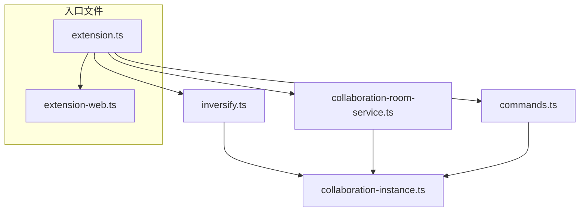
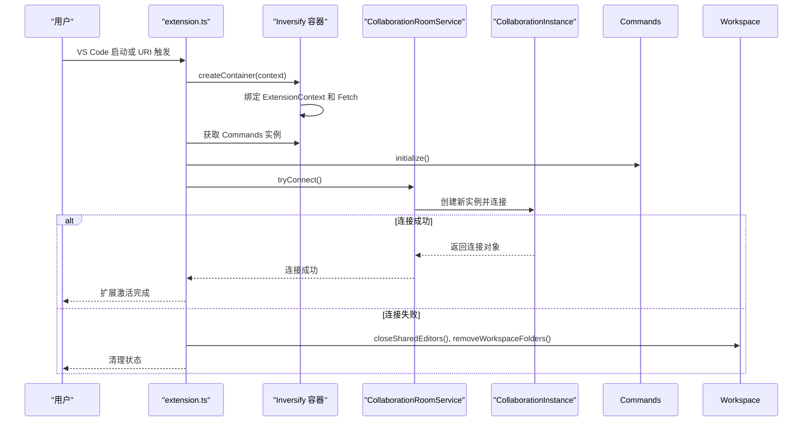
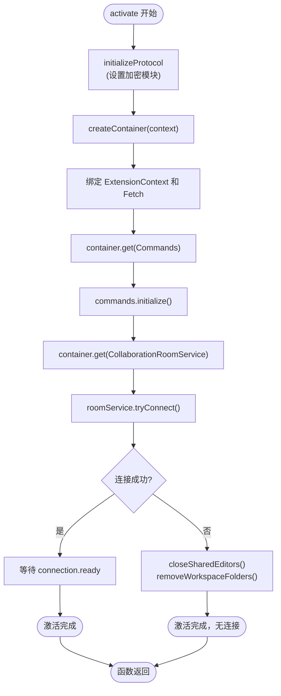
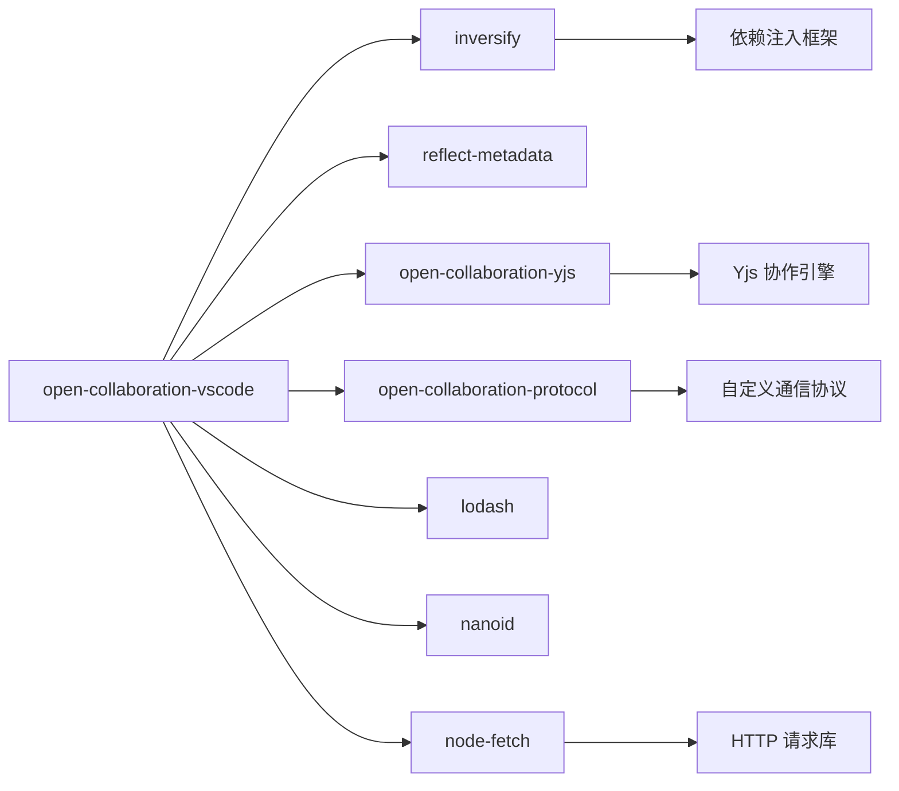

# 扩展架构与生命周期

## 简介
本文件深入解析 `open-collaboration-vscode` 扩展的启动架构与生命周期管理机制。重点分析 `extension.ts` 中 `activate` 函数的执行流程，涵盖依赖注入容器（Inversify）的初始化、服务绑定、模块加载逻辑，以及 Web 环境下的适配策略。结合 `package.json` 中的激活事件与贡献点，阐明扩展的激活条件与运行环境适配方案。同时，提供资源清理、调试建议与常见问题排查方法。

## 项目结构
`open-collaboration-vscode` 是一个基于 VS Code 的实时协作扩展，其核心位于 `src` 目录下，采用模块化设计，主要包含以下组件：
- **extension.ts**：桌面端扩展的主入口
- **extension-web.ts**：Web 端扩展的主入口
- **inversify.ts**：依赖注入容器的创建与配置
- **collaboration-instance.ts**：协作会话的核心实例
- **commands.ts**：命令注册与管理
- **collaboration-room-service.ts**：房间连接与管理服务

## 核心组件
扩展的核心由 `activate` 函数驱动，通过 Inversify 容器管理服务生命周期。关键组件包括：
- **Inversify 容器**：负责服务的依赖注入与实例化
- **CollaborationInstance**：代表当前的协作会话
- **Commands**：封装所有用户可触发的命令
- **CollaborationRoomService**：处理房间连接逻辑

## 架构概览
扩展采用依赖注入（DI）模式组织代码，确保高内聚低耦合。启动时，`activate` 函数创建 Inversify 容器，绑定核心服务，然后初始化命令和连接服务。

## 详细组件分析

### 启动流程分析
`activate` 函数是扩展的启动入口，其执行流程如下：

1.  **初始化协议**：调用 `initializeProtocol` 配置加密模块（Node.js 使用 `crypto.webcrypto`，Web 环境使用 `globalThis.crypto`）。
2.  **创建 DI 容器**：调用 `createContainer(context)` 创建 Inversify 容器，并将 VS Code 的 `ExtensionContext` 和 `fetch` 函数绑定为常量。
3.  **初始化命令**：从容器中获取 `Commands` 服务实例并调用 `initialize()` 方法，注册所有命令。
4.  **尝试连接**：获取 `CollaborationRoomService` 实例并调用 `tryConnect()` 方法，尝试恢复或建立新的协作连接。
5.  **等待就绪**：如果连接成功，等待连接的 `ready` 状态，确保其他扩展可以获取到协作信息。

### 依赖注入容器分析
`inversify.ts` 文件定义了 `createContainer` 函数，用于创建和配置 Inversify 容器。

- **自动绑定**：`autoBindInjectable: true` 允许使用 `@injectable()` 装饰器的类被自动绑定。
- **单例作用域**：`defaultScope: 'Singleton'` 确保服务在整个容器生命周期内为单例。
- **工厂模式**：为 `CollaborationInstance` 提供了一个工厂函数，确保同一时间只能存在一个活动的协作实例。

### Web 环境适配分析
`extension-web.ts` 是专为 VS Code for Web 环境设计的入口文件。

- **差异点**：与 `extension.ts` 相比，`extension-web.ts` 省略了 `tryConnect()` 的调用和连接就绪的等待。这表明 Web 版本的连接逻辑可能由其他机制（如用户手动触发）控制，或者其连接流程与桌面端不同。
- **协议初始化**：使用 `globalThis.crypto` 作为加密模块，这是浏览器环境的标准全局对象。

### 停用与资源清理
`deactivate` 函数负责在扩展停用时进行资源清理，防止内存泄漏。

- **离开协作会话**：调用 `CollaborationInstance.Current?.leave()` 通知服务器本端已断开。
- **释放资源**：调用 `dispose()` 方法释放 `CollaborationInstance` 占用的资源。
- **清理工作区**：关闭所有共享编辑器并移除临时工作区文件夹。

## 依赖分析
扩展通过 `package.json` 明确声明了其依赖关系。

## 性能考虑
- **延迟激活**：通过 `onStartupFinished` 激活事件，避免在 VS Code 启动时阻塞主进程。
- **连接异步化**：`tryConnect()` 是异步操作，不会阻塞 UI。
- **DI 容器优化**：使用单例作用域减少对象创建开销。

## 故障排除指南
### 常见激活失败问题
1.  **依赖未安装**：确保 `node_modules` 已通过 `npm install` 正确安装。
2.  **Inversify 配置错误**：检查 `inversify.ts` 中的绑定是否正确，特别是 `@injectable()` 装饰器的使用。
3.  **连接服务异常**：`CollaborationRoomService.tryConnect()` 抛出异常，需检查网络或服务器状态。
4.  **Web 环境限制**：在浏览器中，`node:crypto` 不可用，必须使用 `globalThis.crypto`。

### 调试启动性能
- **使用 `console.time()`**：在 `activate` 函数的关键步骤前后添加计时，定位性能瓶颈。
- **检查 `activationEvents`**：确保 `onUri:oct` 等事件配置正确，避免不必要的激活。

## 结论
`open-collaboration-vscode` 扩展通过清晰的分层架构和依赖注入模式，实现了高效的启动与生命周期管理。`extension.ts` 和 `extension-web.ts` 分别处理桌面端和 Web 端的启动逻辑，`inversify.ts` 提供了强大的服务管理能力。通过遵循本文档的分析，开发者可以更好地理解扩展的内部机制，进行有效的开发、调试和优化。