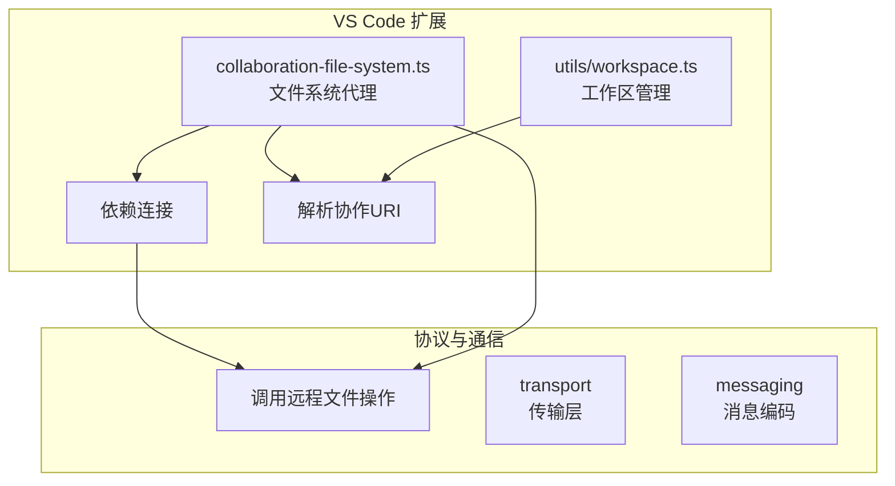
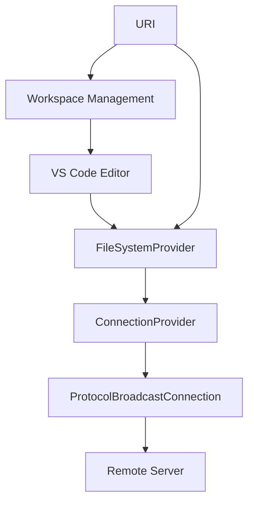
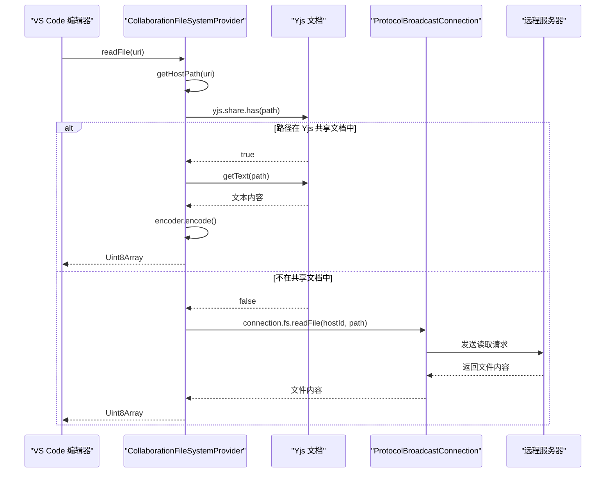
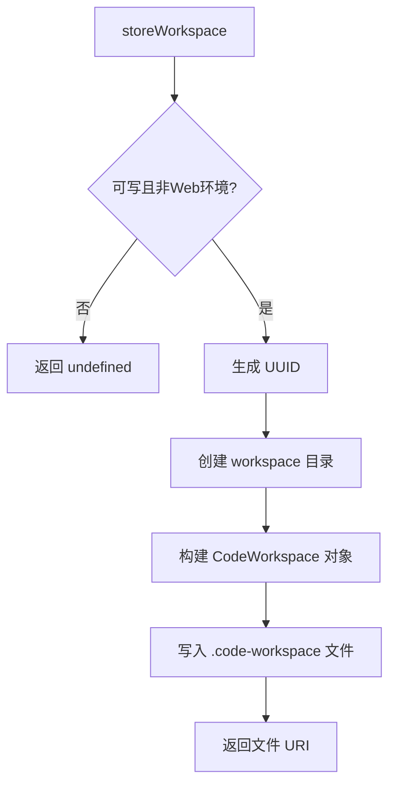
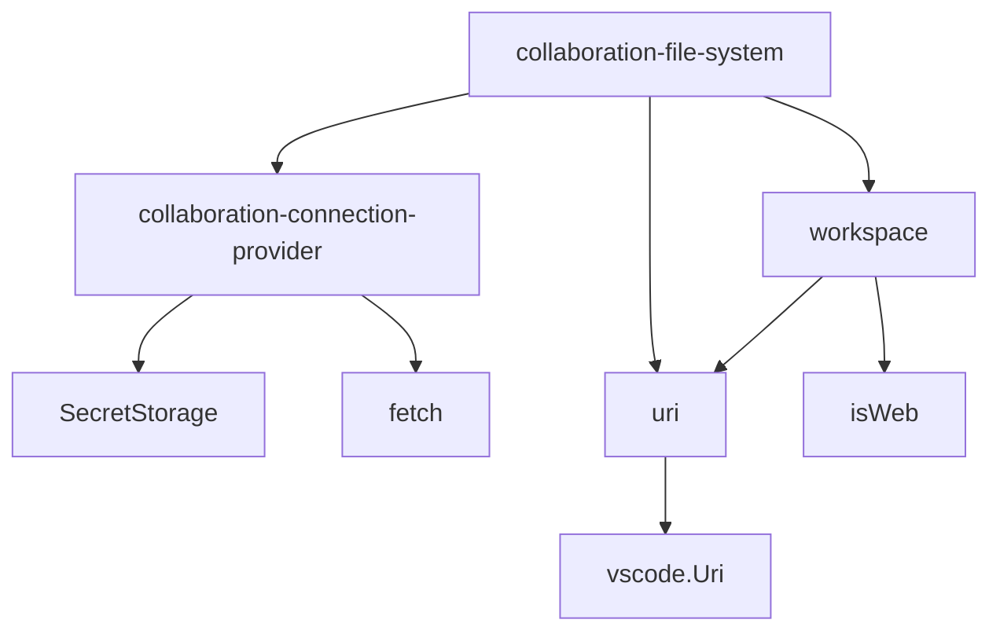

# 文件系统代理与远程访问

## 简介
本文档深入解析协作扩展中远程文件系统的实现机制。重点说明 `collaboration-file-system.ts` 如何实现 VS Code 的 `FileSystemProvider` 接口，支持文件浏览、读取、写入与监听操作，并通过协作协议代理远程文件访问。阐述 `collaboration-connection-provider.ts` 如何实现 `ConnectionProvider` 接口，为文件系统提供底层连接通道。结合 `uri.ts` 中的 URI 构建规则，解释协作文件路径的命名约定与解析逻辑。描述 `workspace.ts` 如何管理多根工作区与协作上下文的映射关系。提供文件操作缓存、冲突处理与权限控制的实现策略，并说明如何扩展支持自定义文件系统后端。

## 项目结构
协作工具项目采用模块化设计，包含多个功能包，分别负责代理、协议、服务器、VS Code 扩展等职责。其中，`open-collaboration-vscode` 模块是核心前端集成组件，实现了远程文件系统的访问与管理。



## 核心组件

本系统的核心组件包括：

- **文件系统管理器（FileSystemManager）**：注册并管理协作文件系统提供者。
- **协作文件系统提供者（CollaborationFileSystemProvider）**：实现 VS Code 的 `FileSystemProvider` 接口，代理远程文件操作。
- **连接提供者（CollaborationConnectionProvider）**：创建与远程服务器的连接通道。
- **协作 URI 工具（CollaborationUri）**：定义和解析协作文件路径。
- **工作区管理工具（workspace.ts）**：管理本地与远程工作区的映射与同步。

这些组件协同工作，使 VS Code 能够像操作本地文件一样访问远程协作环境中的文件。

## 架构概述
系统采用分层架构，将文件系统接口、连接管理、URI 解析与工作区管理解耦，确保高内聚低耦合。



## 详细组件分析

### 文件系统代理实现分析

`collaboration-file-system.ts` 实现了 VS Code 的 `FileSystemProvider` 接口，使远程文件可通过 `oct://` 协议访问。

#### 文件读取流程


### 连接提供者分析
`collaboration-connection-provider.ts` 负责创建与远程协作服务器的安全连接。

#### 认证流程

```
flowchart TD
    A[createConnection(serverUrl)] --> B{是否有认证提供者?}
    B -- 否 --> C{是否有登录页面?}
    C -- 是 --> D[打开外部登录页面]
    C -- 否 --> E[显示错误信息]
    B -- 是 --> F[显示认证方式选择]
    F --> G{选择表单认证?}
    G -- 是 --> H[收集字段输入]
    H --> I[POST 到 endpoint]
    I --> J{响应成功?}
    J -- 是 --> K[显示登录成功]
    J -- 否 --> L[显示登录失败]
    G -- 否 --> M[打开 Web 认证链接]
```

### URI 与工作区管理分析
`uri.ts` 和 `workspace.ts` 共同管理协作文件的路径解析与工作区映射。

#### URI 结构
- **协议**：`oct://`
- **格式**：`oct:///workspaceName/relative/path/to/file`
- **解析**：通过 `getHostPath` 去除工作区名称，获取远程服务器路径

#### 工作区管理流程



## 依赖关系分析
系统各组件间依赖清晰，无循环依赖。



## 性能考虑
- **缓存机制**：Yjs 文档缓存已打开的文件内容，避免重复网络请求。
- **异步操作**：所有文件系统调用均为异步，防止阻塞 UI。
- **批量事件**：文件变更事件支持批量触发，减少事件监听开销。
- **连接复用**：`ConnectionProvider` 复用底层连接，降低握手开销。

## 故障排除指南
- **无法连接服务器**：检查 `serverUrl` 是否正确，网络是否通畅。
- **认证失败**：确认 `userToken` 是否有效，认证方式是否被服务器支持。
- **文件读取为空**：检查 `hostId` 是否正确，远程路径是否存在。
- **工作区未同步**：调用 `removeWorkspaceFolders` 清理旧工作区，重新加入。

## 结论
该协作文件系统通过标准化接口与模块化设计，实现了远程文件的无缝访问。其核心在于 `FileSystemProvider` 的代理实现、安全的连接管理、清晰的 URI 映射与灵活的工作区控制。系统具备良好的扩展性，可适配不同后端存储与认证机制，为远程协作开发提供了坚实基础。