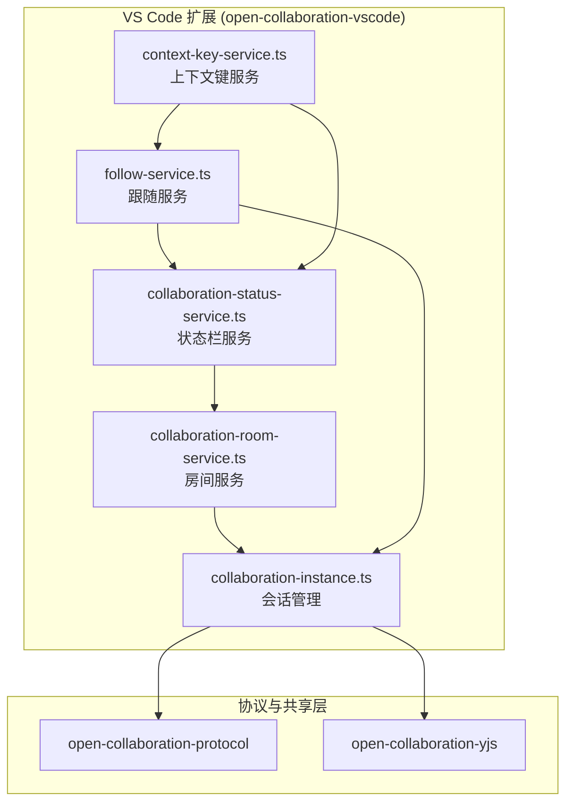
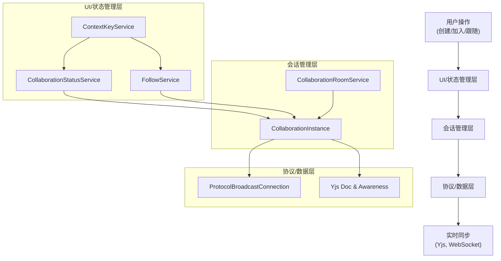
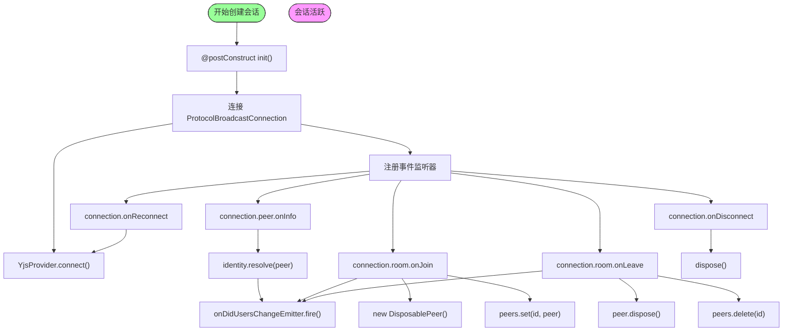
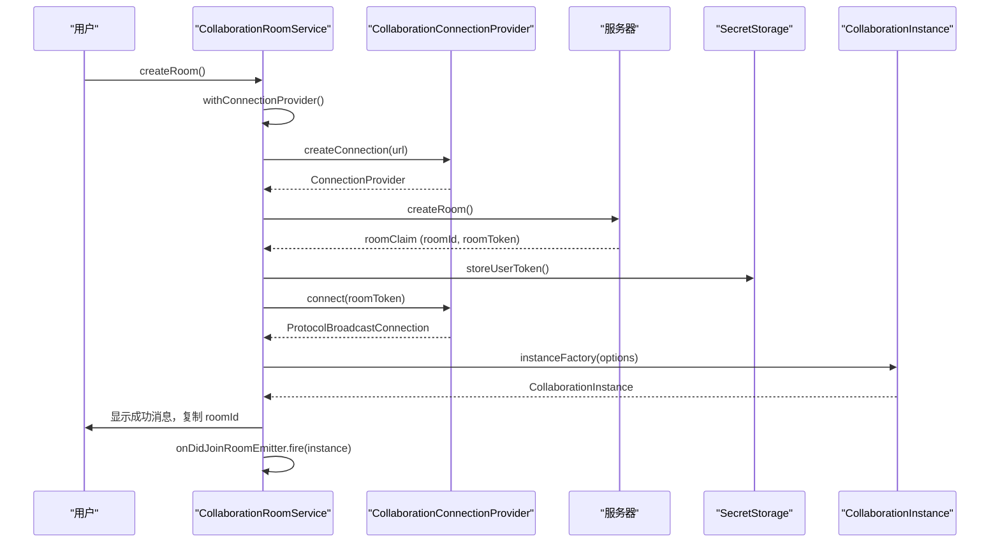
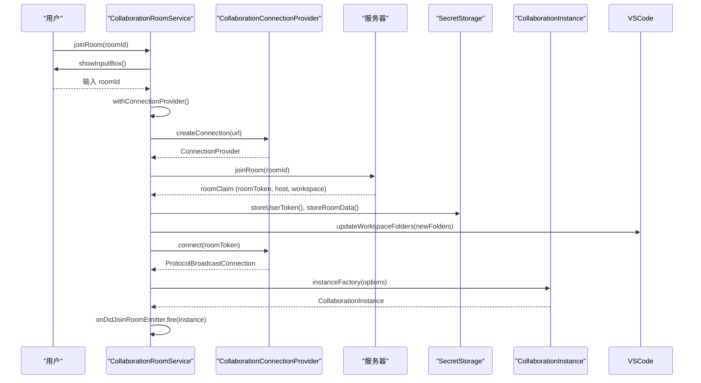
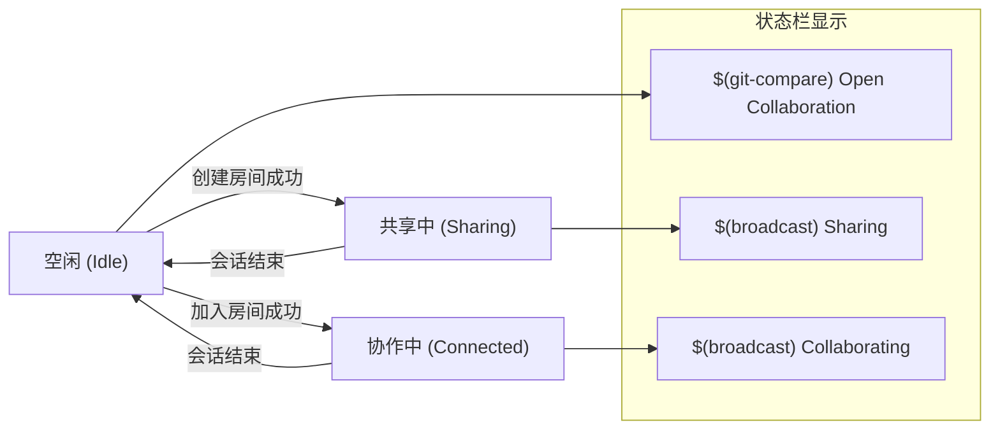
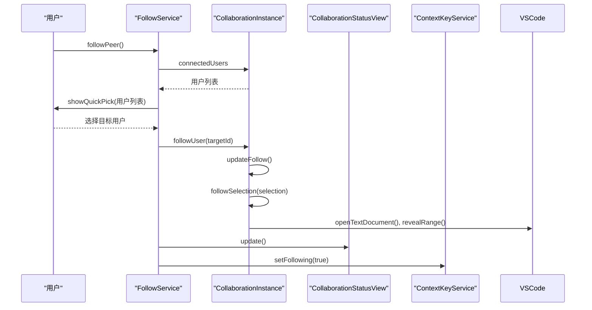
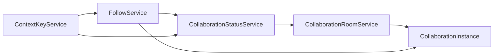

# 核心服务与状态管理

## 简介
本文档系统阐述了 VS Code 扩展中协作功能的核心服务实现。重点分析了 `collaboration-instance.ts` 如何管理单个协作会话的连接状态、协议交互与生命周期；`collaboration-room-service.ts` 如何处理房间的创建与加入；`collaboration-status-service.ts` 如何驱动状态栏 UI 更新；`follow-service.ts` 如何实现跟随功能；以及 `context-key-service.ts` 如何通过上下文键控制 UI 可见性。文档结合代码逻辑与调用链，揭示服务间的依赖与通信机制，并为扩展开发提供指引。

## 项目结构
项目采用模块化设计，核心协作功能位于 `packages/open-collaboration-vscode` 目录下。该模块负责 VS Code 扩展的 UI 集成、状态管理与用户交互。关键服务文件包括 `collaboration-instance.ts`（会话实例）、`collaboration-room-service.ts`（房间服务）、`collaboration-status-service.ts`（状态服务）、`follow-service.ts`（跟随服务）和 `context-key-service.ts`（上下文键服务）。这些服务通过依赖注入（Inversify）进行解耦，共同构建了协作功能的前端逻辑层。



## 核心组件
核心组件围绕 `CollaborationInstance` 构建，它代表一个活跃的协作会话。`CollaborationRoomService` 负责会话的建立（创建或加入），`CollaborationStatusService` 将会话状态反映到 UI（状态栏），`FollowService` 提供用户间的跟随功能，而 `ContextKeyService` 则作为桥梁，将运行时状态同步到 VS Code 的上下文系统，从而控制命令和视图的可见性。

## 架构概览

整个协作系统的架构分为三层：UI/状态管理层、会话管理层和协议/数据层。UI/状态管理层（如 Status Service, Follow Service）响应用户操作并更新界面。会话管理层（Room Service, Instance）处理会话的生命周期和核心逻辑。协议/数据层（Protocol, Yjs）负责底层通信和实时数据同步。服务间通过事件（EventEmitter）和依赖注入进行通信，确保了高内聚低耦合。



## 详细组件分析

### 协作会话实例分析
`CollaborationInstance` 是协作会话的核心，它封装了与远程服务器的连接、Yjs 文档同步、文件系统代理和用户状态管理。

#### 连接与生命周期流程


### 房间服务分析
`CollaborationRoomService` 负责协调用户与服务器之间的会话建立过程，包括创建新房间和加入现有房间。

#### 创建房间序列图


#### 加入房间序列图


### 状态栏服务分析
`CollaborationStatusService` 负责将协作状态直观地展示给用户，主要通过状态栏和树状视图。

#### 状态转换流程图


### 跟随服务分析
`FollowService` 允许用户跟随其他协作者的光标和编辑位置。

#### 跟随功能序列图


### 上下文键服务分析
`ContextKeyService` 是连接运行时状态与 VS Code UI 可见性的桥梁。

#### 上下文键更新流程
```
flowchart TD
A["状态变更<br/>(连接/断开, 跟随/停止跟随)"] --> B[相关服务]
B --> C["ContextKeyService.set()"]
C --> D["VS Code Context"]
D --> E["命令/视图可见性更新"]
E --> F["UI 反应状态变化"]
subgraph "服务"
B1[CollaborationStatusService]
B2[FollowService]
end
B1 --> C : setConnection()
B2 --> C : setFollowing()
```

## 依赖关系分析
各服务通过依赖注入紧密协作，形成了清晰的调用链。`CollaborationRoomService` 是入口，它创建 `CollaborationInstance`。`CollaborationStatusService` 监听 `onDidJoinRoom` 事件来更新 UI。`FollowService` 和 `ContextKeyService` 依赖 `CollaborationInstance.Current` 来获取当前会话实例。这种设计使得服务高度解耦，易于测试和维护。



## 性能考量
系统在性能方面进行了多项优化：
1.  **防抖与节流**：`collaboration-instance.ts` 中使用 `lodash/debounce` 和 `lodash/throttle` 来批量处理文件系统变更和文档内容同步，避免了高频事件导致的性能瓶颈。
2.  **增量同步**：Yjs 提供了高效的 CRDT 算法，确保文本变更以最小的增量在网络中传播。
3.  **资源清理**：所有服务都实现了 `Disposable` 接口，确保在会话结束时及时释放事件监听器、定时器和 Yjs 文档等资源，防止内存泄漏。

## 故障排除指南
1.  **无法创建或加入房间**：检查服务器 URL 设置是否正确 (`Settings.getServerUrl()`)，并确保服务器正在运行。
2.  **状态栏不显示**：在 Web 版本中，状态栏有时会被隐藏，代码中已通过定时器尝试恢复 (`setInterval`)。
3.  **跟随功能失效**：确认目标用户是否在线且其光标位置信息已通过 `yjsAwareness` 同步。
4.  **文件不同步**：检查 `FileSystemManager` 是否正确初始化（仅主机创建），并确认文件路径转换 (`CollaborationUri`) 是否正确。

## 结论
本文档深入剖析了 VS Code 协作扩展的核心服务实现。`CollaborationInstance` 作为会话的中枢，`CollaborationRoomService` 作为会话的入口，`CollaborationStatusService` 作为状态的展示者，`FollowService` 作为交互的增强器，`ContextKeyService` 作为状态的同步器，共同构建了一个功能完整、结构清晰的协作系统。通过依赖注入和事件驱动模式，各服务实现了高内聚低耦合，为系统的可维护性和可扩展性奠定了坚实基础。