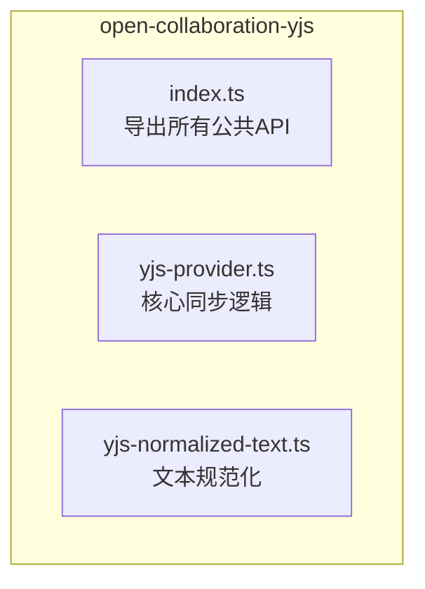
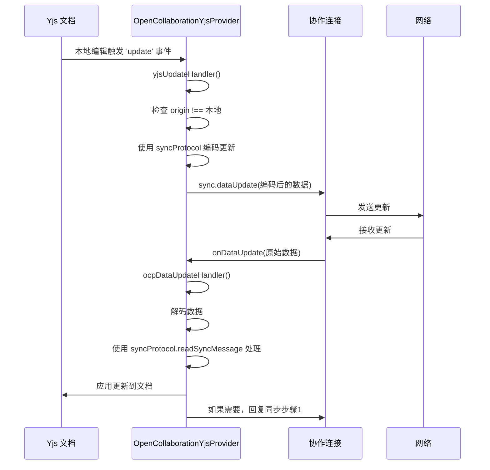
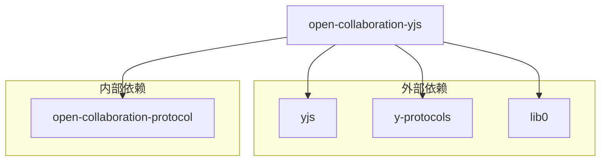

# open-collaboration-yjs 模块

## 简介
`open-collaboration-yjs` 模块是协作系统中的关键桥梁，负责将 Yjs 分布式文档与底层协作协议（open-collaboration-protocol）连接起来。它实现了 Yjs 文档（Y.Doc）与协作连接（Connection）之间的双向同步，确保了多用户编辑场景下的数据一致性。该模块通过 `yjs-provider.ts` 处理操作的编码、发送、接收和应用，并通过 `yjs-normalized-text.ts` 解决了跨平台文本换行符不一致的问题，保证了最终一致性。本文档将深入分析其核心机制、实现细节和使用方法。

## 项目结构
`open-collaboration-yjs` 是 `packages` 目录下的一个独立包，其结构简洁明了，专注于 Yjs 与协作协议的集成。



## 核心组件

该模块的核心由两个主要文件构成：`yjs-provider.ts` 和 `yjs-normalized-text.ts`。

## 详细组件分析

### OpenCollaborationYjsProvider 分析

`OpenCollaborationYjsProvider` 是模块的核心，负责双向同步。

#### 双向同步流程
该类通过监听 Yjs 事件和协议事件来实现双向同步。



### YjsNormalizedTextDocument 分析

`YjsNormalizedTextDocument` 解决了不同操作系统（Windows `\r\n` vs Unix `\n`）之间换行符不一致导致的编辑冲突问题。

#### 文本规范化流程
该类维护了两个视图：一个是 Yjs 内部的规范化文本（统一为 `\n`），另一个是外部应用期望的原始文本（可能包含 `\r\n`）。

```
flowchart TD
A[外部应用: 原始文本 \r\n] --> B[YjsNormalizedTextDocument]
B --> C{是本地变更?}
C --> |否| D[计算原始偏移]
D --> E[应用变更到内部文本]
E --> F[调用回调通知外部]
F --> G[外部应用收到变更]
H[外部应用: 发送变更事件] --> I[YjsNormalizedTextDocument.update]
I --> J[检查是否应应用]
J --> K[应用到 YjsText (规范化后)]
K --> L[Yjs 触发 'update' 事件]
L --> M[通过 Provider 同步到网络]
```

## 依赖分析
`open-collaboration-yjs` 模块依赖于多个外部库和内部包。



## 结论

`open-collaboration-yjs` 模块成功地将 Yjs 的强大 CRDT 能力与自定义的协作协议相结合。`OpenCollaborationYjsProvider` 实现了高效、可靠的双向同步，而 `YjsNormalizedTextDocument` 则巧妙地解决了跨平台文本编辑的痛点。该模块为 Monaco 和 VS Code 客户端提供了统一的集成方式，是整个协作系统稳定运行的基石。遵循文档分片和性能监控等最佳实践，可以确保其在大规模应用中的良好表现。