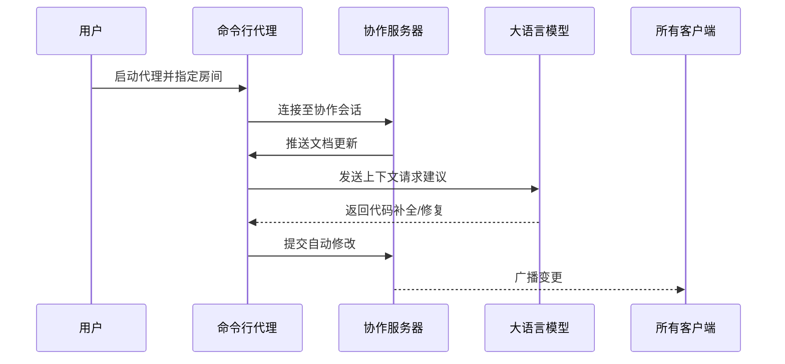
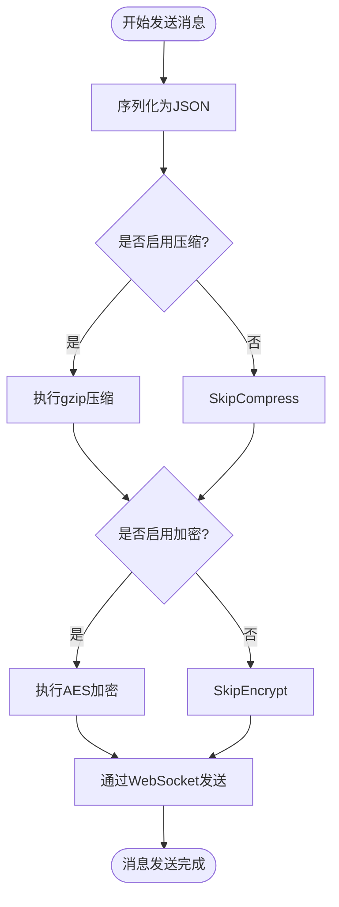
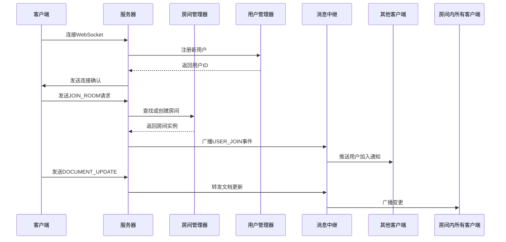
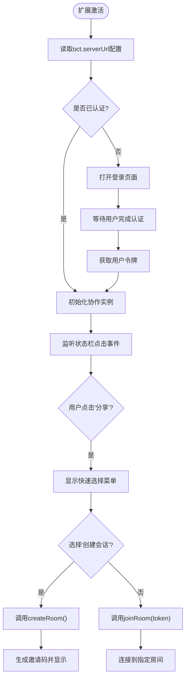

# 核心模块详解

## 简介
本技术文档旨在全面解析协作工具项目中的六大核心模块：`open-collaboration-protocol`、`open-collaboration-server`、`open-collaboration-yjs`、`open-collaboration-vscode`、`open-collaboration-monaco` 和 `open-collaboration-agent`。这些模块共同构成了一个支持实时代码共享与协同编辑的完整生态系统，适用于远程团队在IDE中进行高效协作。文档将深入探讨每个模块的设计原理、实现机制、关键类与函数职责，并结合源码实例说明其工作流程和扩展方式。

## 项目结构
项目采用基于功能的模块化组织结构，所有核心组件均位于 `packages/` 目录下，每个模块独立封装为NPM包，便于复用和维护。整体架构遵循客户端-服务器模型，支持多种编辑器集成（如VS Code、Monaco Editor），并通过Yjs实现分布式文档同步算法。

## 核心组件
本项目由六个核心模块构成，分别承担不同职责：

- `open-collaboration-protocol`：定义客户端与服务器之间的通信协议。
- `open-collaboration-server`：提供协作会话的中心化管理服务。
- `open-collaboration-yjs`：基于Yjs实现CRDT（无冲突复制数据类型）文档同步。
- `open-collaboration-vscode`：VS Code扩展，实现IDE级别的实时协作。
- `open-collaboration-monaco`：Monaco Editor集成库，支持Web端代码协作。
- `open-collaboration-agent`：命令行智能代理，支持LLM驱动的自动化协作。

## 详细组件分析

### open-collaboration-agent 模块分析（不是重点）

该模块实现了一个命令行智能代理，能够连接到协作会话并基于大语言模型（LLM）执行自动化任务。

#### 主要功能与实现
`main.ts` 是CLI入口文件，使用 `commander` 解析命令行参数，并启动代理服务：

```typescript
program
    .version(pck.version)
    .option('-s, --server <string>', '要连接的Open Collaboration Server的URL', 'https://api.open-collab.tools/')
    .option('-m, --model <string>', '使用的LLM模型（例如 claude-3-5-sonnet-latest, gpt-4o）', 'claude-3-5-sonnet-latest')
    .requiredOption('-r, --room <string>', '要加入的房间ID')
    .action(options => startCLIAgent(options).catch(console.error));
```

代理通过环境变量加载LLM API密钥（使用 `dotenv`），并监听协作房间内的文档变更，根据上下文自动生成代码建议或执行修复操作。



### open-collaboration-monaco 模块分析（不是重点）

此模块为Monaco Editor提供实时协作能力，支持多用户同时编辑、光标共享和用户跟随功能。

### open-collaboration-protocol 模块分析

该模块定义了客户端与服务器之间通信的标准化协议，包括消息格式、编码方式和传输机制。

#### 消息结构设计

协议使用JSON格式的消息体，包含类型、载荷和元数据：

```typescript
interface ProtocolMessage {
    type: MessageType;
    payload: any;
    metadata?: {
        senderId: string;
        timestamp: number;
        correlationId?: string;
    };
}
```

支持的消息类型包括：
- `USER_JOIN`：用户加入房间
- `USER_LEAVE`：用户离开房间
- `DOCUMENT_UPDATE`：文档内容更新
- `CURSOR_MOVE`：光标位置更新
- `AUTH_REQUEST`：身份验证请求

传输层基于WebSocket，使用 `websocket-transport.ts` 封装连接管理与心跳机制。



### open-collaboration-server 模块分析

服务器模块负责管理所有协作会话，处理用户认证、房间创建和消息中继。

#### 关键组件协作


`collaboration-server.ts` 是主服务入口，整合了Express服务器与WebSocket通信。`room-manager.ts` 负责房间生命周期管理，`peer-manager.ts` 维护在线用户状态，`message-relay.ts` 实现高效的消息广播机制。

### open-collaboration-vscode 模块分析
该模块是VS Code扩展，提供图形化界面让用户轻松创建或加入协作会话。

#### 扩展启动流程


`extension.ts` 是扩展的主入口，注册命令和状态栏项。`collaboration-instance.ts` 管理与服务器的连接状态，`secret-storage.ts` 安全存储用户认证信息。

### open-collaboration-yjs 模块分析

该模块将Yjs库集成到协作协议中，实现基于CRDT算法的最终一致性文档同步。

`yjs-provider.ts` 封装了Yjs文档与协作协议的桥接逻辑，`yjs-normalized-text.ts` 提供文本规范化处理，确保不同编辑器间的兼容性。

Yjs是一个用于构建实时协作应用的开源库，采用CRDT算法实现最终一致性。

## 依赖关系分析

各模块之间通过清晰的接口进行通信，形成稳定的依赖链。

```mermaid
graph LR
Agent --> Protocol
VSCode --> Protocol
Monaco --> Protocol
Protocol --> Yjs
Protocol < --> Server
Server --> Yjs
Server --> Protocol
```

- `open-collaboration-protocol` 是核心依赖，被所有客户端和服务器引用。
- `open-collaboration-yjs` 作为可选的数据同步后端，可通过插件机制替换。
- `open-collaboration-server` 依赖于协议和Yjs，但不直接依赖具体客户端实现。

## 性能考量
系统在设计时充分考虑了实时协作的性能需求：
- 使用WebSocket长连接减少延迟。
- 支持消息压缩（gzip）以降低带宽消耗。
- Yjs的增量更新机制最小化网络传输量。
- 服务器端采用消息批处理和广播优化。
- 客户端实现防抖和节流，避免频繁更新UI。

对于大规模协作场景，建议部署集群化服务器并通过Redis实现会话共享。

## 故障排查指南
常见问题及解决方案：

**无法连接服务器**
- 检查 `oct.serverUrl` 配置是否正确
- 确认服务器正在运行且端口开放
- 查看浏览器控制台或VS Code输出日志中的错误信息

**文档不同步**
- 检查Yjs文档名称是否一致
- 确认所有客户端使用相同版本的协议
- 查看网络是否丢包或延迟过高

## 结论
本文档详细解析了协作工具项目的六大核心模块，展示了其模块化、可扩展的架构设计。通过标准化协议、灵活的集成方式和强大的同步算法，该项目为构建实时协作应用提供了坚实基础。开发者可根据需求定制客户端或部署私有服务器，实现安全可控的远程协作体验。